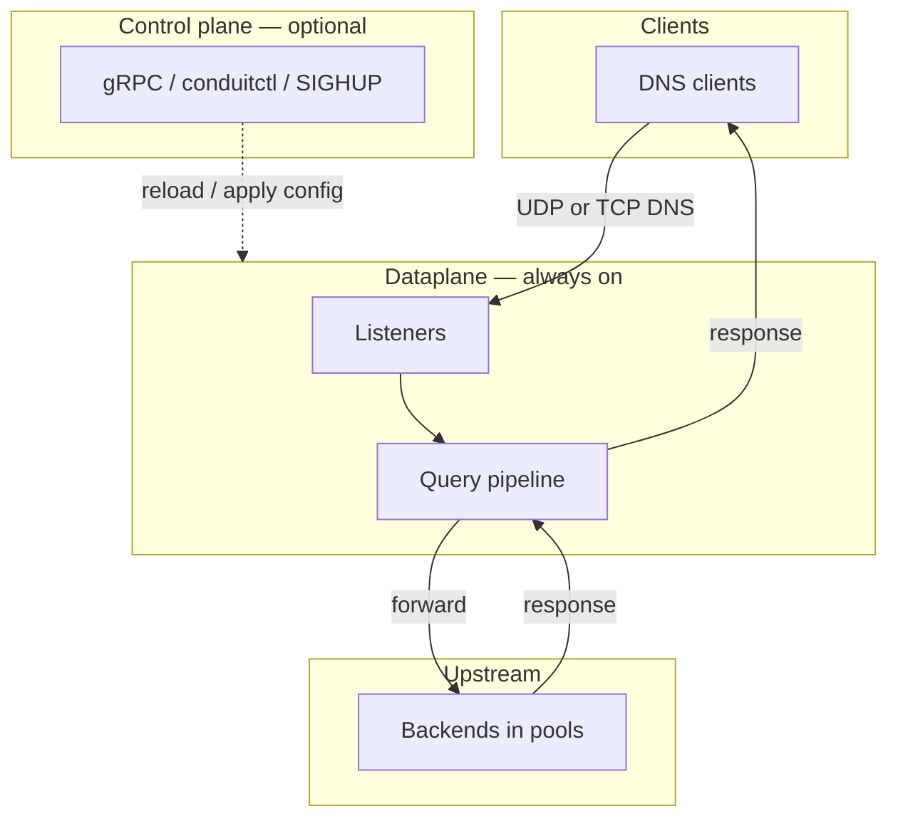
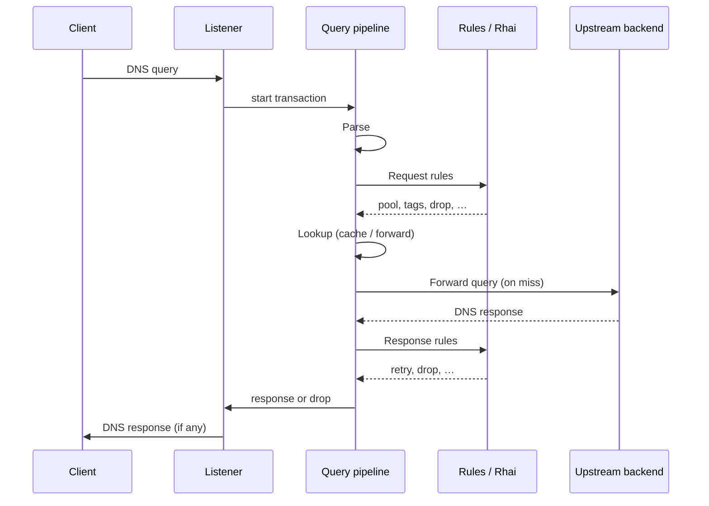
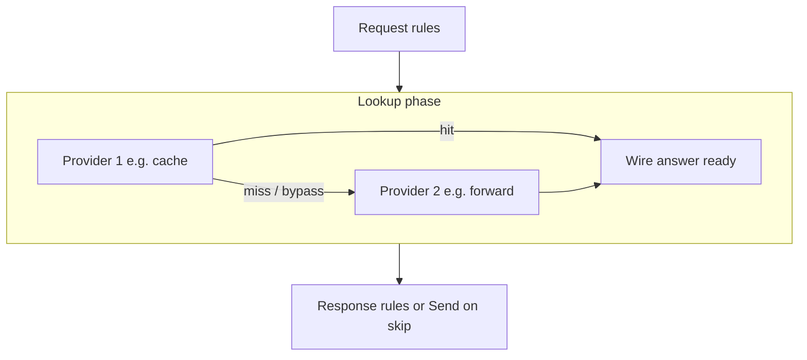
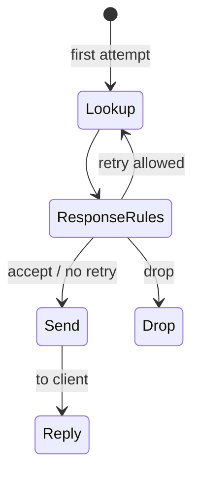

# Architecture and packet path

This page describes how DNS Conduit accepts client queries, runs each query through a defined pipeline on the [dataplane](/glossary/index.md#dataplane), and returns a response. It is the mental model for [transactions](/glossary/index.md#transaction), [pipeline phases](/concepts/architecture-and-packet-path.md#pipeline-phases), and [tags](/glossary/index.md#tags). How that pipeline is spread across OS threads and worker pools — the dataplane runtime model, the [transaction](/glossary/index.md#transaction) slot pool, and shutdown drain — is described in [Runtime and concurrency](/concepts/runtime-and-concurrency.md). Configuration YAML, rule syntax, and observability setup are described on their own pages — they are linked from this page where they touch the query path.

## Overview

Conduit is a DNS forwarder: clients send queries to configured **listeners**; Conduit evaluates policy, picks an upstream [pool](/glossary/index.md#pool) and [backend](/glossary/index.md#backend), forwards the query, and sends the upstream answer (or a generated error) back to the client.

Conduit combines two roles:

| Role {: .column-no-wrap } | What it does | Required? |
|------|--------------|-------------|
| **[Dataplane](/glossary/index.md#dataplane)** | Serves DNS — listeners, per-query pipeline, upstream forwarding | Always (the `conduit` service) |
| **[Control plane](/glossary/index.md#control-plane)** | Config apply, export, reload, gRPC, `conduitctl` | Opt-in (`control:` block) |

When the [dataplane](/glossary/index.md#dataplane) answers a query, it uses the configuration **[runtime snapshot](/glossary/index.md#runtime-snapshot)** in force at that moment — your [effective config](/glossary/index.md#effective-config), rules, and forward settings as Conduit has already loaded and validated them. When you change configuration, Conduit validates the new settings and swaps them in for later queries; queries already in progress finish on the config they started with. If the new config fails validation, Conduit keeps the [last-good snapshot](/glossary/index.md#last-good-snapshot) and DNS keeps flowing. How to reload, apply an overlay, or export: [Configuration model](/control-plane/configuration-model.md) and [Reload and export](/control-plane/reload-and-export.md).

## End-to-end path

From a client’s perspective, one DNS query through Conduit looks like this:

1. The client sends a query to a configured **listener** address (UDP or TCP).
2. Conduit opens a **[transaction](/glossary/index.md#transaction)** at [Receive](/concepts/architecture-and-packet-path.md#receive) and runs the defined pipeline — [Parse](/concepts/architecture-and-packet-path.md#parse), [Request rules](/concepts/architecture-and-packet-path.md#request-rules), [Lookup](/concepts/architecture-and-packet-path.md#lookup), [Response rules](/concepts/architecture-and-packet-path.md#response-rules), and [Send](/concepts/architecture-and-packet-path.md#send) — until the query gets a DNS reply or is **dropped** (no reply).
3. During [Lookup](/concepts/architecture-and-packet-path.md#lookup), Conduit runs the configured **lookup profile** provider chain (typically **cache** then **forward**). The **forward** provider selects a [pool](/glossary/index.md#pool) and [backend](/glossary/index.md#backend), sends upstream, and waits for an answer — see [Forward provider internals](#forward-provider-internals).
4. On a **cache hit**, Conduit may skip upstream I/O entirely; **`answer_source`** is **`cache`**. On a miss, the forward provider runs and **`answer_source`** is **`forward`** when upstream produces the answer.
5. During [Send](/concepts/architecture-and-packet-path.md#send), Conduit returns the DNS response to the client. **Drops** at [Parse](/concepts/architecture-and-packet-path.md#parse) or in [Request rules](/concepts/architecture-and-packet-path.md#request-rules) / [Response rules](/concepts/architecture-and-packet-path.md#response-rules) end the transaction with no reply.

Conduit can record activity during the query path without slowing answers:

- **[Metrics](/observability/metrics.md)** — counters and histograms at selected [pipeline phases](/concepts/architecture-and-packet-path.md#pipeline-phases); series reference in [Built-in metrics](/observability/built-in-metrics.md)
- **[Event export](/observability/event-export.md)** — [dnstap](/glossary/index.md#dnstap) and other sinks
- **[Tracing](/observability/tracing.md)** — per-query [pipeline trace](/glossary/index.md#pipeline-trace) when enabled

Observation runs separately from the steps above. Busy or full sinks must not block DNS responses — see [Runtime and concurrency](/concepts/runtime-and-concurrency.md#query-outcomes-and-worker-occupancy) and the Observability pages.

## Transactions

A **[transaction](/glossary/index.md#transaction)** is everything Conduit remembers for one client query from [Receive](/concepts/architecture-and-packet-path.md#receive) through [Send](/concepts/architecture-and-packet-path.md#send). On one worker, it carries:

- **The question** — queried name and type, plus client address, listener, and protocol (UDP or TCP)
- **Policy context** — [tags](/glossary/index.md#tags), selected [pool](/glossary/index.md#pool) and [backend](/glossary/index.md#backend), and attempt history when [retries](/glossary/index.md#retry) occur
- **Messages** — the query as received and, when available, the response Conduit returns to the client
- **Optional trace** — [pipeline trace](/glossary/index.md#pipeline-trace) when tracing is enabled for this query

For logs and traces, each transaction has a unique internal id. The DNS message id in the packet (`dns_id`) is separate; Conduit preserves it on responses to the client.

Transactions are **not** persisted across queries and are **not** exported as part of normal config — tags and per-query overrides are runtime-only.

## Pipeline phases

Every query runs through a defined [pipeline](/concepts/architecture-and-packet-path.md#pipeline-phases) of phases. Policy may **drop** the query (no DNS reply), jump ahead (for example straight to [Send](/concepts/architecture-and-packet-path.md#send) on failure or a cache hit with **`on_hit.response_rules: skip`**), or loop back to [Lookup](/concepts/architecture-and-packet-path.md#lookup) for a **[retry](/glossary/index.md#retry)** when limits allow. With the **full** metrics profile, [`conduit_phase_duration_seconds`](/observability/built-in-metrics.md#conduit_phase_duration_seconds) records time in each top-level phase — **`lookup`** for answer production (not separate route/forward/wait series).

Default happy path (single attempt, no early drop, forward-only or cache miss):

1. [Receive](/concepts/architecture-and-packet-path.md#receive)
2. [Parse](/concepts/architecture-and-packet-path.md#parse)
3. [Request rules](/concepts/architecture-and-packet-path.md#request-rules)
4. [Lookup](/concepts/architecture-and-packet-path.md#lookup)
5. [Response rules](/concepts/architecture-and-packet-path.md#response-rules)
6. [Send](/concepts/architecture-and-packet-path.md#send)

[Response rules](/concepts/architecture-and-packet-path.md#response-rules) may send the pipeline back to [Lookup](/concepts/architecture-and-packet-path.md#lookup) when a retry is requested and attempt limits allow it — the full provider chain runs again. The pipeline is **not** a strict one-pass pipe.

| Phase {: .column-no-wrap } | Operator-facing summary |
|-------|-------------------------|
| [Receive](/concepts/architecture-and-packet-path.md#receive) | Listener accepts the DNS message (UDP or TCP) and opens a [transaction](/glossary/index.md#transaction) on the worker. |
| [Parse](/concepts/architecture-and-packet-path.md#parse) | Valid single-question query only; malformed or unsupported shapes → silent **drop** (no DNS reply). |
| [Request rules](/concepts/architecture-and-packet-path.md#request-rules) | **First-match** [request rules](/policy-routing/rules-and-actions.md) and request [Rhai](/rhai/index.md) — `set_pool`, `set_source_v4` / `set_source_v6`, tags, **`txn.set_cache_lookup_eligible`**, or **drop**; no match → default path to [Lookup](/concepts/architecture-and-packet-path.md#lookup). |
| [Lookup](/concepts/architecture-and-packet-path.md#lookup) | Ordered **lookup providers** (cache, forward, …) produce the wire answer. Forward runs pool selection and upstream I/O inside this phase. Cache hit → may skip forward; sets **`answer_source`**. |
| [Response rules](/concepts/architecture-and-packet-path.md#response-rules) | **First-match** response rules and Rhai — accept, **drop**, or **retry** (`retry` / `retry_now`) → [Lookup](/concepts/architecture-and-packet-path.md#lookup) ([Retries and transactions](/policy-routing/retries-and-transactions.md)). Skipped on cache hit when **`on_hit.response_rules: skip`**. |
| [Send](/concepts/architecture-and-packet-path.md#send) | Return the stored wire answer or synthesize error (**SERVFAIL** common); UDP **TC** when truncated. |

### Receive

The listener accepts the client’s DNS message (UDP or TCP) and opens a [transaction](/glossary/index.md#transaction) for it. Processing continues at [Parse](/concepts/architecture-and-packet-path.md#parse) on the same worker that accepted the query.

### Parse

[Parse](/concepts/architecture-and-packet-path.md#parse) checks that the bytes are a valid DNS **query** with **exactly one** question, then records the query name, type, class, and (when present) the client’s EDNS UDP payload size for later replies.

Conduit **drops** (no DNS reply) when the packet is:

- Empty or not valid DNS on the wire
- A DNS message that is not a query (for example a response)
- A query with no question section
- A query with more than one question

From the client’s perspective a drop is silent — there is no answer and no synthesized error. Parse drops increment [`conduit_parse_rejected_total`](/observability/built-in-metrics.md#conduit_parse_rejected_total) with a `reason` label (`empty`, `wire_error`, `not_query`, `no_question`, `multi_question`). Successful parses increment [`conduit_queries_total`](/observability/built-in-metrics.md#conduit_queries_total) before [Request rules](/concepts/architecture-and-packet-path.md#request-rules) run.

### Request rules

[Request rules](/concepts/architecture-and-packet-path.md#request-rules) run **before** [Lookup](/concepts/architecture-and-packet-path.md#lookup). Conduit evaluates configured rules in **first-match** order: the first rule whose [selectors](/glossary/index.md#selector) match the query wins; later rules are skipped for that query.

Built-in actions on a matching rule can, among other things:

- **`set_pool`** — choose which [pool](/glossary/index.md#pool) the forward provider uses on the first attempt
- **`set_retry_pool`** — pool used on retry Lookup if retry occurs; first forward attempt ignores it (request or response hook; does not trigger retry by itself)
- **`set_tag`** — attach [tags](/glossary/index.md#tags) used by later selectors, export filters, or scripts
- **`set_source_v4`** / **`set_source_v6`** — pin upstream egress for this query on every forward (request hook only). **`set_retry_source_v4`** / **`set_retry_source_v6`** — one-shot egress for the next retry forward only (request or response hook). See [Source selection lifecycle](/policy-routing/retries-and-transactions.md#source-selection-lifecycle).
- **`drop`** / **`drop_now`** / **`clear_drop`** — soft or hard drop, or clear soft-drop intent ([Rules and actions](/policy-routing/rules-and-actions.md#action-order-on-one-rule)); a completed drop increments [`conduit_queries_dropped_total`](/observability/built-in-metrics.md#conduit_queries_dropped_total) with `reason="request_rules"`
- **`retry`** / **`retry_now`** / **`clear_retry`** / **`clear_retry_pool`** / **`set_retry_pool`** — retry family ([Rules and actions](/policy-routing/rules-and-actions.md#retry-actions))

Actions on the matched rule run in **list order** — built-in steps and optional **`rhai`** scripts interleaved as written. Each **`rhai`** step runs at its position in the list. Scripts can refine pool choice, set tags, set `retry_pool` for a future retry on the request hook, or drop the query.

When **no** rule matches, Conduit continues to [Lookup](/concepts/architecture-and-packet-path.md#lookup) with the default forward path. Rule syntax, hooks, and action reference: [Rules and actions](/policy-routing/rules-and-actions.md).

### Lookup { #lookup }

[Lookup](/concepts/architecture-and-packet-path.md#lookup) is the single top-level phase where Conduit **produces the wire-format answer** after [Request rules](/concepts/architecture-and-packet-path.md#request-rules). It runs the active **lookup profile** — an ordered list of **providers** from **`lookup.profiles.<name>.providers`**.

When **`lookup:`** is omitted from config, Conduit synthesizes profile **`default`** with one **forward** provider (same behavior as before the Lookup spine). To enable caching, add **`caches:`** and list a **cache** provider before **forward** — see [DNS answer cache](/guides/dns-answer-cache.md).

| Provider | Typical outcome |
|----------|-----------------|
| **cache** | **Hit** — prepare and serve the stored wire answer ([serve rewriting](/guides/dns-answer-cache.md#serve-rewriting)); **`answer_source`** = **`cache`**; no upstream forward. **Miss** — try next provider. **Bypass** — skip cache (ineligible query). |
| **forward** | Pool selection, upstream send, wait — see [Forward provider internals](#forward-provider-internals). Sets **`answer_source`** = **`forward`**. |

On **cache hit**, Conduit stores the answer on the transaction. Depending on **`on_hit.response_rules`** ([Reference: caches](/reference/config-schema/caches.md)), it either runs [Response rules](/concepts/architecture-and-packet-path.md#response-rules) (**`run`**, default) or goes straight to [Send](/concepts/architecture-and-packet-path.md#send) (**`skip`**).

**Fill:** after a forward-produced answer, eligible cache instances store the upstream wire answer **before** Response rules mutate it. Parallel identical queries **single-flight** — one upstream fetch, waiters resume when the fill completes.

Config reference: [Reference: lookup](/reference/config-schema/lookup.md), [Reference: caches](/reference/config-schema/caches.md).

### Forward provider internals { #forward-provider-internals }

The **forward** lookup provider runs pool selection and upstream I/O. Traces and nested events may still name **route**, **forward**, and **wait** for debugging, but metrics and the top-level pipeline expose only **`lookup`** as the answer-production phase.

#### Route { #route }

[Route](/concepts/architecture-and-packet-path.md#route) picks the [pool](/glossary/index.md#pool) and [backend](/glossary/index.md#backend) for this attempt. Pool name resolution:

1. **First attempt** (`attempt_count == 0`): `selected_pool` from [request rules](/concepts/architecture-and-packet-path.md#request-rules) or default / first configured pool. `retry_pool` is ignored.
2. **Retry re-entry** (`attempt_count > 0`): `retry_pool` if set (consumed), else `selected_pool`, else default / first pool.

After each Route, Conduit updates **`selected_pool`** to the pool that attempt used. Multi-attempt behavior and when to re-stash **`retry_pool`**: [Retries and transactions — Pool selection lifecycle](/policy-routing/retries-and-transactions.md#pool-selection-lifecycle).

On the **first** attempt, Conduit selects a [backend](/glossary/index.md#backend) using sticky weighted choice among **eligible** members of the pool (see [Pools and backends](/policy-routing/pools-and-backends.md)):

- **Health off** (default) — every configured backend is eligible; selection uses configured weights only.
- **Health on** (`pools[].health.enabled: true`) — only backends whose **[applied](/glossary/index.md#applied-health)** health is **up** are eligible. Configured weights may be scaled by each backend's latency [EWMA](/glossary/index.md#ewma)-driven **`weight_factor`** when `latency_weighting` is enabled — slower healthy backends receive a smaller share, not zero traffic. A [fail-open floor](/glossary/index.md#fail-open-floor) (`min_eligible`) can treat all backends as eligible when too few are up. See [Backend health](/policy-routing/backend-health.md).

On **retries**, Conduit picks among eligible backends in the target pool that were **not** already used for that pool on this [transaction](/glossary/index.md#transaction) — cross-pool retries only exclude backends tried in the **target** pool.

Each forward attempt increments the transaction’s attempt counter. When the pipeline continues to [Forward](/concepts/architecture-and-packet-path.md#forward), [`conduit_queries_by_pool_total`](/observability/built-in-metrics.md#conduit_queries_by_pool_total) records the selected pool.

If the pool name does not exist, the pool has no backends, every backend in the pool was already tried, or backend selection fails, Conduit sets **SERVFAIL** on the [transaction](/glossary/index.md#transaction) and skips upstream send — the query goes straight to [Send](/concepts/architecture-and-packet-path.md#send).

#### Forward { #forward }

[Forward](/concepts/architecture-and-packet-path.md#forward) sends the query to the [backend](/glossary/index.md#backend) chosen at [Route](/concepts/architecture-and-packet-path.md#route).

**Transport.** Upstream traffic follows `forward.upstream_transport` (UDP only, TCP only, or UDP with TCP fallback when the UDP response has the **TC** (truncated) bit set). TCP clients can be configured to use upstream TCP as well (`forward.client_tcp_uses_upstream_tcp`).

**Timeouts.** Each forward attempt is bounded by `forward.timeout_ms` (default **2000** ms). Socket read/write timeouts use the same value.

**Source addresses.** Conduit binds outbound packets using global `forward.sources_v4` / `forward.sources_v6`, optional per-pool `sources_v4` / `sources_v6`, and any source overrides from rules or [Rhai](/rhai/index.md). IPv4 and IPv6 backends use the matching address family. See [Dual-stack forwarding](/guides/dual-stack-forwarding.md) and [Reference: forward](/reference/config-schema/forward.md).

Immediate forward errors (for example send failure or too many outstanding queries to the same backend) set **SERVFAIL** and jump to [Send](/concepts/architecture-and-packet-path.md#send). A successful send continues to wait for the upstream reply. Under the **`split_io`** runtime, forward **submits** the query to an I/O worker and parks the [transaction](/glossary/index.md#transaction) rather than blocking — see [Runtime and concurrency](/concepts/runtime-and-concurrency.md#split-io-runtime). Each failed attempt increments [`conduit_forward_errors_total`](/observability/built-in-metrics.md#conduit_forward_errors_total). With the **full** metrics profile, each attempt also updates [`conduit_forward_attempts_total`](/observability/built-in-metrics.md#conduit_forward_attempts_total) and [`conduit_forward_duration_seconds`](/observability/built-in-metrics.md#conduit_forward_duration_seconds) — **only when forward actually runs** (not on cache hit short-circuit).

#### Wait for response { #wait-for-response }

[Wait for response](/concepts/architecture-and-packet-path.md#wait-for-response) is where the worker waits for the upstream answer after [Forward](/concepts/architecture-and-packet-path.md#forward) has sent the query.

- **Answer received** — the upstream wire answer is stored on the [transaction](/glossary/index.md#transaction) (including response code) and processing continues to [Response rules](/concepts/architecture-and-packet-path.md#response-rules).
- **Timeout** — no answer before `forward.timeout_ms`; [`conduit_forward_errors_total`](/observability/built-in-metrics.md#conduit_forward_errors_total) records `reason="timeout"` and processing still continues to [Response rules](/concepts/architecture-and-packet-path.md#response-rules) so retry policy can run another attempt.
- **Hard forward failure** — some errors skip waiting and go directly to [Send](/concepts/architecture-and-packet-path.md#send) with **SERVFAIL** (see [Forward](/concepts/architecture-and-packet-path.md#forward) above).

How the wait is carried out depends on the [dataplane runtime model](/concepts/runtime-and-concurrency.md#runtime-models): under **`sync`** the worker that ran [Forward](/concepts/architecture-and-packet-path.md#forward) blocks here until the reply or timeout; under **`split_io`** Forward submits the query and parks the [transaction](/glossary/index.md#transaction), and an **I/O worker** resumes it on reply, timeout, or error. Either way the pipeline order is the same, and the separate step keeps tracing and diagrams aligned with the full path. Retry behavior after a timeout or error: [Retries and transactions](/policy-routing/retries-and-transactions.md).

### Response rules

[Response rules](/concepts/architecture-and-packet-path.md#response-rules) run once an upstream wire answer is available **or** a forward timeout has occurred (still with no stored answer). Like [Request rules](/concepts/architecture-and-packet-path.md#request-rules), evaluation is **first-match** on the response hook, with optional [Rhai](/rhai/index.md) scripts on the matched rule.

Built-in actions can accept the upstream answer, **drop** the query ([`conduit_queries_dropped_total`](/observability/built-in-metrics.md#conduit_queries_dropped_total) with `reason="response_rules"`), request **`retry`** or **`retry_now`** (stay in or re-enter with the current [pool](/glossary/index.md#pool)), set **`set_retry_pool`** for a different pool on the next retry attempt, or adjust response metadata (for example **`set_rcode`**). **Retry intent** — from **`retry`**, **`retry_now`**, or [Rhai](/rhai/index.md) — sends the [transaction](/glossary/index.md#transaction) back to [Lookup](/concepts/architecture-and-packet-path.md#lookup) for another attempt; [`conduit_retries_total`](/observability/built-in-metrics.md#conduit_retries_total) increments for the **target** pool of that attempt.

Global caps from `orchestrator.max_attempts` (default **3**) and `orchestrator.max_txn_duration_ms` (default **5000** ms), plus **pool exhaustion** when no unused [backend](/glossary/index.md#backend) remains in the target pool, apply before each forward attempt inside Lookup. When a limit is hit, Conduit sets **SERVFAIL** and moves to [Send](/concepts/architecture-and-packet-path.md#send) instead of forwarding again. Details and examples: [Retries and transactions](/policy-routing/retries-and-transactions.md), [Rules and actions](/policy-routing/rules-and-actions.md).

### Send

[Send](/concepts/architecture-and-packet-path.md#send) delivers the final DNS message to the client.

If [Lookup](/concepts/architecture-and-packet-path.md#lookup) stored an answer on the [transaction](/glossary/index.md#transaction) (cache hit or forward success), Conduit returns that wire answer (subject to client protocol on the listener). **Cache hits** are prepared before this phase: query ID, question section (including mixed-case **0x20** QNAME encoding), EDNS, and TTL decay — see [DNS answer cache — Serve rewriting](/guides/dns-answer-cache.md#serve-rewriting). If there is **no** stored answer — routing or forward failure, or retries exhausted — Conduit **synthesizes** a minimal error response using the transaction’s response code (commonly **SERVFAIL**, or a code set by policy). Synthesized responses echo the client’s question section and preserve EDNS when the query had it.

On **UDP**, if the response would exceed the client’s EDNS payload size (or 512 bytes when EDNS is absent), Conduit fits the message on **RR boundaries** (prefer dropping optional additional/authority data; set **TC** when required answer or empty-answer authority content cannot fit in full) so standards-compliant resolvers can retry over TCP.

Successful replies and synthesized errors both complete the [transaction](/glossary/index.md#transaction) on the listener; [`conduit_responses_total`](/observability/built-in-metrics.md#conduit_responses_total) and event export run as configured (coarse `rcode` buckets on **`minimal`**, per-IANA `rcode` + `ip_family` on **`full`**). See [Observability](/observability/index.md) and [Built-in metrics](/observability/built-in-metrics.md).

## Tags

**[Tags](/glossary/index.md#tags)** are named runtime annotations on a transaction (boolean or string values). [Request rules](/concepts/architecture-and-packet-path.md#request-rules) and [Response rules](/concepts/architecture-and-packet-path.md#response-rules) — built-in actions and [Rhai](/rhai/index.md) on those hooks — set tags; [selectors](/glossary/index.md#selector) on later rules test them.

Tags persist across [retries](/glossary/index.md#retry) on the same transaction unless cleared. They are useful for:

- Branching policy ([selectors](/glossary/index.md#selector) on tag presence or value)
- Gating [event export](/observability/event-export.md) or [tracing](/observability/tracing.md) (`tag_required`, trace activation)
- Correlating logs and metrics with policy decisions

Tags are not part of the on-disk config file or normal config export. Script and API details: [Rhai](/rhai/index.md), [Rules and actions](/policy-routing/rules-and-actions.md).

## Retries and re-entry

When [Response rules](/concepts/architecture-and-packet-path.md#response-rules) request a [retry](/glossary/index.md#retry), Conduit counts the attempt and re-enters at [Lookup](/concepts/architecture-and-packet-path.md#lookup) — in the current [pool](/glossary/index.md#pool) or using `retry_pool` from **`set_retry_pool`** when set. Retries avoid [backends](/glossary/index.md#backend) already used in the target pool on this [transaction](/glossary/index.md#transaction). Further attempts stop at `orchestrator.max_attempts`, `orchestrator.max_txn_duration_ms`, or when the target pool has no unused backends — typically yielding **SERVFAIL**. Retry transitions increment [`conduit_retries_total`](/observability/built-in-metrics.md#conduit_retries_total) for the target pool.

Full retry semantics, actions, and examples: [Retries and transactions](/policy-routing/retries-and-transactions.md).

## Runtime snapshot

A configuration **[runtime snapshot](/glossary/index.md#runtime-snapshot)** is the bundle of settings Conduit uses to answer queries at a given moment: [effective config](/glossary/index.md#effective-config) (listeners, pools, forward behavior, health probe settings), loaded rules and scripts, and observability filters. All listener workers share the same snapshot until you change configuration. [Backend health](/policy-routing/backend-health.md) **runtime** state (observed/applied liveness, freeze/drain) lives **outside** the snapshot and is preserved across reload when backend identity and probe semantics are unchanged — see [Configuration model](/control-plane/configuration-model.md#runtime-snapshot).

When you reload or apply new settings, Conduit validates the change and builds a new snapshot for **later** queries. **SIGHUP** and **`conduitctl reload`** [reload from disk](/glossary/index.md#reload-from-disk); **`conduitctl apply`** updates the [overlay](/glossary/index.md#overlay) through the [control plane](/glossary/index.md#control-plane). Queries already in flight keep using the settings they started with — they do not jump mid-query to a half-applied config. [`conduit_config_generation`](/observability/built-in-metrics.md#conduit_config_generation) reflects the active generation at scrape time.

If validation fails, Conduit keeps the **[last-good snapshot](/glossary/index.md#last-good-snapshot)** (the previous working settings) and continues serving DNS.

Some changes update the snapshot immediately but still need a **process restart** to take effect on the wire — for example listener bind addresses, forward egress sockets, and the **`dataplane.runtime`** model and its worker counts (see [Runtime and concurrency](/concepts/runtime-and-concurrency.md#runtime-models)). Conduit logs when that applies; see [Configuration model](/control-plane/configuration-model.md) and [Reload and export](/control-plane/reload-and-export.md) for reload, overlays, and what requires a restart.

## Related topics

- [Getting started](/getting-started/index.md) — install, minimal config, first query
- [Runtime and concurrency](/concepts/runtime-and-concurrency.md) — runtime models, workers, slot pool, and shutdown drain
- [DNS answer cache](/guides/dns-answer-cache.md) — optional memory or LMDB caching
- [Pools and backends](/policy-routing/pools-and-backends.md) — pool selection inside the forward provider
- [Backend health](/policy-routing/backend-health.md) — eligibility, probes, and fail-open at [Route](/concepts/architecture-and-packet-path.md#route)
- [Rules and actions](/policy-routing/rules-and-actions.md) — [Request rules](/concepts/architecture-and-packet-path.md#request-rules) and [Response rules](/concepts/architecture-and-packet-path.md#response-rules) hooks
- [Retries and transactions](/policy-routing/retries-and-transactions.md) — retry loops and limits
- [Configuration model](/control-plane/configuration-model.md) — snapshots and effective config
- [Observability](/observability/index.md) — metrics, tracing, event export, logging
- [Built-in metrics](/observability/built-in-metrics.md) — Prometheus series and pipeline mapping
- [Rhai](/rhai/index.md) — scripted policy on rules
- [Glossary](/glossary/index.md) — [dataplane](/glossary/index.md#dataplane), [transaction](/glossary/index.md#transaction), [runtime snapshot](/glossary/index.md#runtime-snapshot), [tags](/glossary/index.md#tags)
