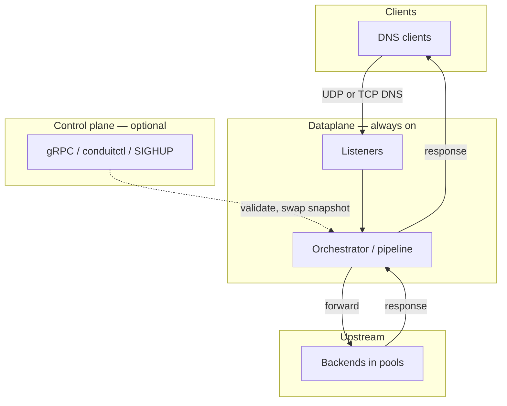
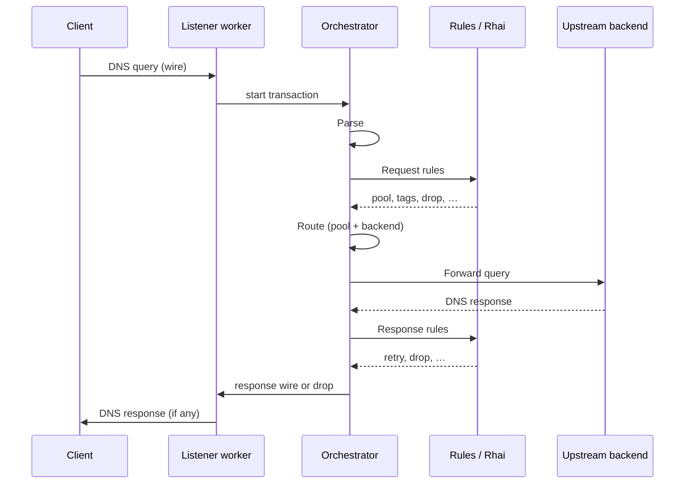
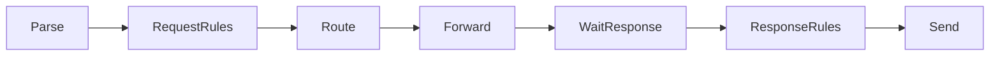
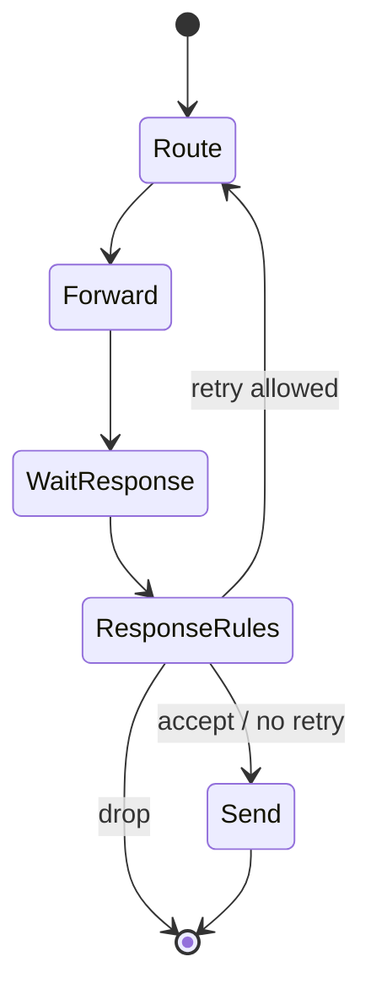

# Architecture and packet path

This page describes how DNS Conduit accepts client queries, runs each query through a fixed pipeline on the [dataplane](/glossary/index.md#dataplane), and returns a response. It is the mental model for [transactions](/glossary/index.md#transaction), pipeline **phases**, and [tags](/glossary/index.md#tags). Configuration YAML, rule syntax, and observability setup live on their own pages — linked here where they touch the query path.

## Overview

Conduit is a DNS forwarder: clients send queries to configured **listeners**; Conduit evaluates policy, picks an upstream [pool](/glossary/index.md#pool) and [backend](/glossary/index.md#backend), forwards the query, and sends the upstream answer (or a generated error) back to the client.

Conduit combines two runtime roles:

| Role{: .column-no-wrap } | What it does | Required? |
|------|--------------|-------------|
| **[Dataplane](/glossary/index.md#dataplane)** | Serves DNS — listeners, per-query pipeline, upstream forwarding | Always (the `conduit` service) |
| **[Control plane](/glossary/index.md#control-plane)** | Config apply, export, reload, gRPC, `conduitctl` | Opt-in (`control:` block) |

The dataplane reads an immutable **[runtime snapshot](/glossary/index.md#runtime-snapshot)** of effective configuration and compiled policy. The control plane updates that snapshot when operators change config; query workers keep serving during reload using defined last-good semantics (see [Configuration model](/control-plane/configuration-model.md)).

## End-to-end path

At a high level, one client query follows this path:

1. A **listener worker** receives the wire-format DNS message on a configured address (UDP or TCP).
2. The worker creates a **[transaction](/glossary/index.md#transaction)** and runs the **orchestrator** — a state machine that advances through pipeline phases until the query is answered or dropped.
3. During **Route**, Conduit selects a [pool](/glossary/index.md#pool) and [backend](/glossary/index.md#backend) (see [Pools and backends](/policy-routing/pools-and-backends.md)).
4. During **Forward** / **Wait for response**, Conduit sends the query upstream and waits for the answer on the same worker.
5. **Send** returns the response wire to the client (or the worker drops the query without a reply when policy requires it).

Observation ([metrics](/observability/metrics.md), [event export](/observability/event-export.md), [tracing](/observability/tracing.md)) hooks into selected phases but is designed not to block the query path when sinks are busy — details on the Observability pages.

## Transactions

A **[transaction](/glossary/index.md#transaction)** is the per-query state object that travels through every pipeline phase on one listener worker. It holds:

- Parsed question metadata (`qname`, `qtype`, client address, listener label, protocol)
- The original query wire and, when available, the response wire
- **[Tags](/glossary/index.md#tags)** — runtime key/value annotations set by rules or scripts
- Selected [pool](/glossary/index.md#pool) and [backend](/glossary/index.md#backend), plus an attempt history when [retries](/glossary/index.md#retry) occur
- Optional [pipeline trace](/glossary/index.md#pipeline-trace) buffer when tracing is enabled for this query

Each transaction has a unique internal id for logs and traces. The DNS message id (`dns_id`) is separate and is preserved on responses sent to the client.

Transactions are **not** persisted across queries and are **not** exported as part of normal config — tags and per-query overrides are runtime-only.

## Pipeline phases

The orchestrator runs a **fixed ordered set of phases**. Stages attached to each phase may continue to the next phase, jump ahead (for example straight to **Send** on failure), **drop** the query without responding, or loop back for a **[retry](/glossary/index.md#retry)**.

Default happy path (single attempt, no early drop):

Response rules may send the pipeline back to **Route** (and then **Forward** again) when a retry is requested and attempt limits allow it — the pipeline is **not** a strict one-pass pipe.

| Phase{: .column-no-wrap } | Operator-facing summary |
|-------|-------------------------|
| **Receive** | Listener accepts the packet and attaches wire bytes to the transaction. (Orchestrator entry starts at **Parse**.) |
| **Parse** | Decode the DNS message; reject malformed or unsupported queries (empty wire, not a query, multiple questions). Drops do not produce a DNS response. |
| **Request rules** | Evaluate configured [request rules](/policy-routing/rules-and-actions.md) and any attached [Rhai](/rhai/index.md) request scripts — for example `set_pool`, tag assignment, or drop. |
| **Route** | Resolve the target [pool](/glossary/index.md#pool) and weighted [backend](/glossary/index.md#backend). Missing pool or empty pool → **SERVFAIL** and skip to **Send**. |
| **Forward** | Send the query to the selected backend (respecting forward timeouts and source addresses). |
| **Wait for response** | Wait for the upstream answer on the worker; record attempt outcome. |
| **Response rules** | Evaluate [response rules](/policy-routing/rules-and-actions.md) and response-phase Rhai — may accept the answer, drop, or request a [retry](/policy-routing/retries-and-transactions.md). |
| **Send** | Ensure response wire exists (upstream answer or synthesized error such as **SERVFAIL**), then return to the listener for delivery to the client. |

### Parse

<!-- Expand: supported vs rejected query shapes; relationship to parse metrics / logs. -->

Parse validates wire format and extracts the single question Conduit will forward. Unsupported shapes are **dropped** silently from the client’s perspective (no DNS reply).

### Request rules

<!-- Expand: first-match semantics; built-in actions vs Rhai; link to rules-and-actions. -->

Runs before routing so policy can set the target pool, attach [tags](/glossary/index.md#tags), or stop processing. Default forward path with no matching rules still proceeds to **Route**.

### Route

<!-- Expand: default pool selection; retry_pool override; SERVFAIL cases — cross-link pools-and-backends. -->

Selects pool and backend after request-side policy. Pool selection details: [Pools and backends](/policy-routing/pools-and-backends.md).

### Forward and wait for response

<!-- Expand: UDP vs TCP; forward timeouts; source address selection (forward / pool overrides). -->

Sends the query upstream and blocks the worker until a response arrives or the forward path times out. Timeout and upstream failure behavior feed into response rules and [retries](/policy-routing/retries-and-transactions.md).

### Response rules

<!-- Expand: when retry returns to Route; max_attempts and max_txn_duration caps. -->

Runs after an upstream response (or forward failure) is available. May trigger another attempt via **Route** → **Forward** when retry policy and orchestrator limits allow.

### Send

<!-- Expand: synthesized error responses; TC bit on truncated UDP. -->

Produces the final wire returned to the client. If no upstream answer was stored, Conduit may synthesize an error response using the transaction’s response code (commonly **SERVFAIL**).

## Tags

**[Tags](/glossary/index.md#tags)** are named runtime annotations on a transaction (boolean or string values in current releases). Rules, [Rhai](/rhai/index.md) scripts, and built-in actions may set or test tags in any phase where they run.

Tags persist across [retries](/glossary/index.md#retry) on the same transaction unless cleared. They are useful for:

- Branching policy ([selectors](/glossary/index.md#selector) on tag presence or value)
- Gating [event export](/observability/event-export.md) or [tracing](/observability/tracing.md) (`tag_required`, trace activation)
- Correlating logs and metrics with policy decisions

Tags are not part of the on-disk config file or normal config export. Script and API details: [Rhai](/rhai/index.md), [Rules and actions](/policy-routing/rules-and-actions.md).

## Retries and re-entry

When response-side policy requests a [retry](/glossary/index.md#retry), the orchestrator increments the attempt count and re-enters at **Route** (possibly with a different [pool](/glossary/index.md#pool) from `retry_pool` or script). Caps from `orchestrator.max_attempts` and `orchestrator.max_txn_duration_ms` stop further attempts and typically yield **SERVFAIL**.

Full retry semantics, actions, and examples: [Retries and transactions](/policy-routing/retries-and-transactions.md).

## Runtime snapshot

Each worker reads a shared **[runtime snapshot](/glossary/index.md#runtime-snapshot)**: validated effective config plus compiled rules, scripts, forward settings, and observability filters. New snapshots are built when configuration changes; workers atomically switch to a new generation after validation succeeds.

In-flight transactions may complete on the snapshot generation they started with; failed validation keeps the [last-good snapshot](/glossary/index.md#last-good-snapshot). Overlay, export, and reload paths: [Configuration model](/control-plane/configuration-model.md), [Reload and export](/control-plane/reload-and-export.md).

## Concurrency and workers

<!-- Expand: listener addresses, worker count, SO_REUSEPORT posture; background export queues. -->

Listeners bind to configured addresses; each listener runs one or more **worker threads**. A single query’s phases run synchronously on one worker — function calls on the transaction, not message passing between phases.

Work that must not stall queries (for example [dnstap](/glossary/index.md#dnstap) export) is handed off to **background threads** through **fixed-size queues**; when a queue is full, export events are dropped and overload is recorded rather than blocking the worker.

**Configuration changes** — rereading the config file (SIGHUP or `conduitctl reload`) or applying updates over gRPC (`conduitctl apply`, export, and other control calls) — run on **background threads**, separate from listener workers, so DNS query handling does not wait for validation or snapshot builds.

## Related topics

- [Getting started](/getting-started/index.md) — install, minimal config, first query
- [Pools and backends](/policy-routing/pools-and-backends.md) — pool selection at **Route**
- [Rules and actions](/policy-routing/rules-and-actions.md) — request and response hooks
- [Retries and transactions](/policy-routing/retries-and-transactions.md) — retry loops and limits
- [Configuration model](/control-plane/configuration-model.md) — snapshots and effective config
- [Observability](/observability/index.md) — metrics, tracing, event export, logging
- [Extensibility](/concepts/extensibility.md) — Rhai and future plugin tiers
- [Glossary](/glossary/index.md) — [dataplane](/glossary/index.md#dataplane), [transaction](/glossary/index.md#transaction), [tags](/glossary/index.md#tags)
