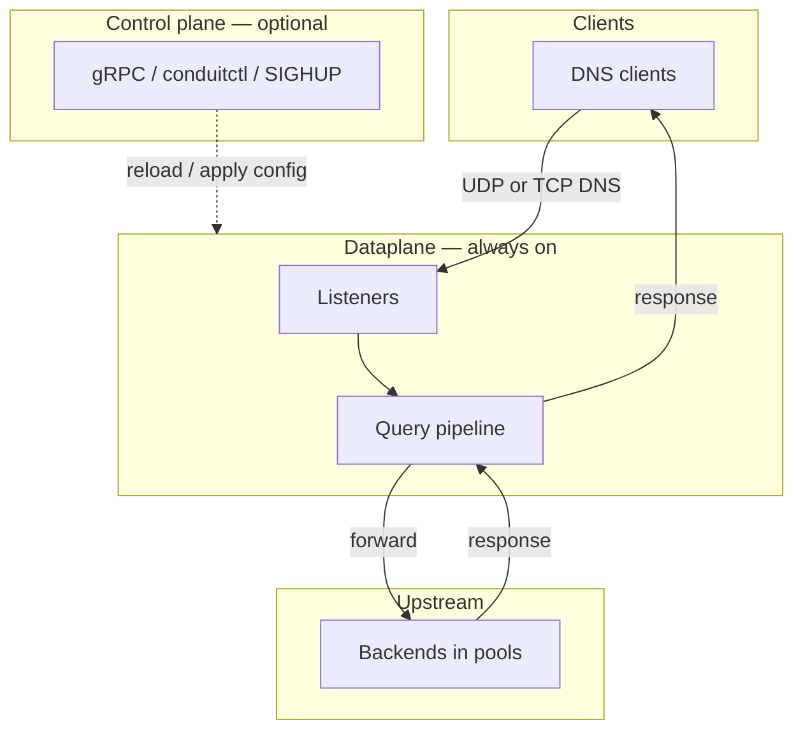
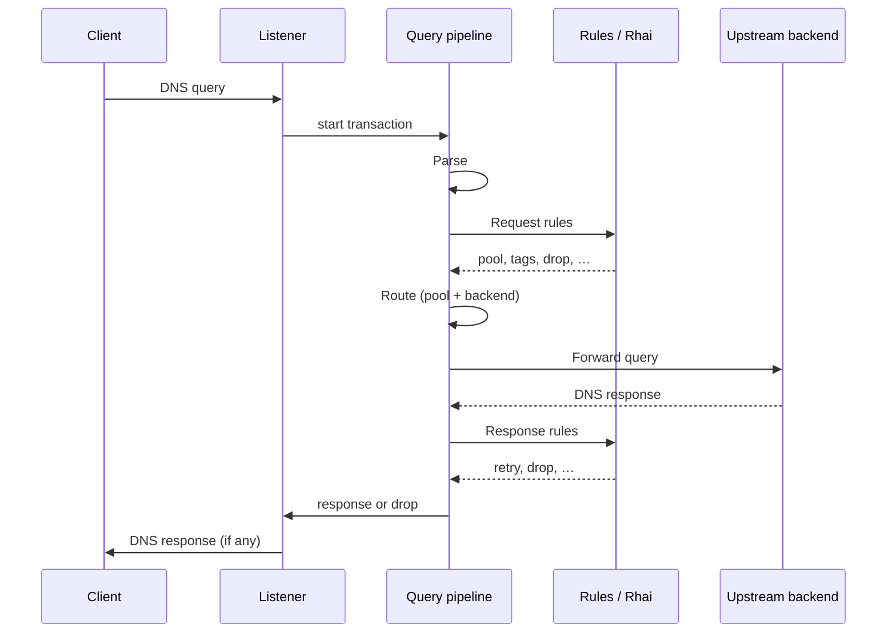
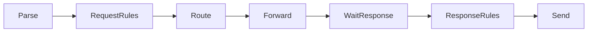
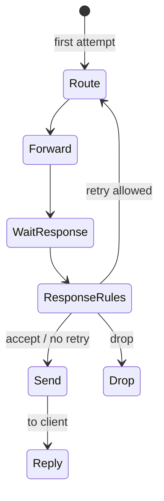

# Architecture and packet path

This page describes how DNS Conduit accepts client queries, runs each query through a fixed pipeline on the [dataplane](/glossary/index.md#dataplane), and returns a response. It is the mental model for [transactions](/glossary/index.md#transaction), [pipeline phases](/concepts/architecture-and-packet-path.md#pipeline-phases), and [tags](/glossary/index.md#tags). Configuration YAML, rule syntax, and observability setup live on their own pages — they are linked from this page where they touch the query path.

## Overview

Conduit is a DNS forwarder: clients send queries to configured **listeners**; Conduit evaluates policy, picks an upstream [pool](/glossary/index.md#pool) and [backend](/glossary/index.md#backend), forwards the query, and sends the upstream answer (or a generated error) back to the client.

Conduit combines two runtime roles:

| Role {: .column-no-wrap } | What it does | Required? |
|------|--------------|-------------|
| **[Dataplane](/glossary/index.md#dataplane)** | Serves DNS — listeners, per-query pipeline, upstream forwarding | Always (the `conduit` service) |
| **[Control plane](/glossary/index.md#control-plane)** | Config apply, export, reload, gRPC, `conduitctl` | Opt-in (`control:` block) |

When the [dataplane](/glossary/index.md#dataplane) answers a query, it uses the **[runtime snapshot](/glossary/index.md#runtime-snapshot)** in force at that moment — your effective config, rules, and forward settings as Conduit has already loaded and validated them. When you change configuration (**SIGHUP**, `conduitctl reload`, or `conduitctl apply`), the [control plane](/glossary/index.md#control-plane) checks the new settings and swaps them in for later queries; queries already in progress finish on the config they started with. If the new config fails validation, Conduit keeps the previous working snapshot and DNS keeps flowing. See [Configuration model](/control-plane/configuration-model.md).

## End-to-end path

From a client’s perspective, one DNS query through Conduit looks like this:

1. The client sends a query to a configured **listener** address (UDP or TCP).
2. Conduit opens a **[transaction](/glossary/index.md#transaction)** for that query and walks it through the pipeline — [Parse](/concepts/architecture-and-packet-path.md#parse), [Request rules](/concepts/architecture-and-packet-path.md#request-rules), [Route](/concepts/architecture-and-packet-path.md#route), [Forward](/concepts/architecture-and-packet-path.md#forward), [Response rules](/concepts/architecture-and-packet-path.md#response-rules), and [Send](/concepts/architecture-and-packet-path.md#send) — until the query is answered or dropped.
3. During [Route](/concepts/architecture-and-packet-path.md#route), Conduit selects a [pool](/glossary/index.md#pool) and [backend](/glossary/index.md#backend) (see [Pools and backends](/policy-routing/pools-and-backends.md)).
4. During [Forward](/concepts/architecture-and-packet-path.md#forward) and [Wait for response](/concepts/architecture-and-packet-path.md#wait-for-response), Conduit sends the query to the upstream and waits for the answer.
5. During [Send](/concepts/architecture-and-packet-path.md#send), Conduit returns the DNS response to the client. If policy requires a **drop**, the client receives no reply.

Conduit can record activity during the query path without slowing answers:

- **[Metrics](/observability/metrics.md)** — counters and histograms at selected [pipeline phases](/concepts/architecture-and-packet-path.md#pipeline-phases)
- **[Event export](/observability/event-export.md)** — [dnstap](/glossary/index.md#dnstap) and other sinks
- **[Tracing](/observability/tracing.md)** — per-query [pipeline trace](/glossary/index.md#pipeline-trace) when enabled

Observation runs separately from the steps above. Busy or full sinks must not block DNS responses — see [Concurrency and workers](#concurrency-and-workers) and the Observability pages.

## Transactions

A **[transaction](/glossary/index.md#transaction)** is everything Conduit remembers for one client query from [Receive](/concepts/architecture-and-packet-path.md#receive) through [Send](/concepts/architecture-and-packet-path.md#send). On one worker, it carries:

- **The question** — queried name and type, plus client address, listener, and protocol (UDP or TCP)
- **Policy context** — [tags](/glossary/index.md#tags), selected [pool](/glossary/index.md#pool) and [backend](/glossary/index.md#backend), and attempt history when [retries](/glossary/index.md#retry) occur
- **Messages** — the query as received and, when available, the response Conduit returns to the client
- **Optional trace** — [pipeline trace](/glossary/index.md#pipeline-trace) when tracing is enabled for this query

For logs and traces, each transaction has a unique internal id. The DNS message id in the packet (`dns_id`) is separate; Conduit preserves it on responses to the client.

Transactions are **not** persisted across queries and are **not** exported as part of normal config — tags and per-query overrides are runtime-only.

## Pipeline phases

Every query walks the same [pipeline phases](/concepts/architecture-and-packet-path.md#pipeline-phases) in order. Policy may **drop** the query (no DNS reply), jump ahead (for example straight to [Send](/concepts/architecture-and-packet-path.md#send) on failure), or loop back to [Route](/concepts/architecture-and-packet-path.md#route) for a **[retry](/glossary/index.md#retry)** when limits allow.

Default happy path (single attempt, no early drop):

[Response rules](/concepts/architecture-and-packet-path.md#response-rules) may send the pipeline back to [Route](/concepts/architecture-and-packet-path.md#route) (and then [Forward](/concepts/architecture-and-packet-path.md#forward) again) when a retry is requested and attempt limits allow it — the pipeline is **not** a strict one-pass pipe.

| Phase {: .column-no-wrap } | Operator-facing summary |
|-------|-------------------------|
| [Receive](/concepts/architecture-and-packet-path.md#receive) | Listener accepts the DNS message. (Pipeline processing starts at [Parse](/concepts/architecture-and-packet-path.md#parse).) |
| [Parse](/concepts/architecture-and-packet-path.md#parse) | Decode the DNS message; reject malformed or unsupported queries (empty message, not a query, multiple questions). Drops do not produce a DNS response. |
| [Request rules](/concepts/architecture-and-packet-path.md#request-rules) | Evaluate configured [request rules](/policy-routing/rules-and-actions.md) and any attached [Rhai](/rhai/index.md) request scripts — for example `set_pool`, tag assignment, or drop. |
| [Route](/concepts/architecture-and-packet-path.md#route) | Resolve the target [pool](/glossary/index.md#pool) and weighted [backend](/glossary/index.md#backend). Missing pool or empty pool → **SERVFAIL** and skip to [Send](/concepts/architecture-and-packet-path.md#send). |
| [Forward](/concepts/architecture-and-packet-path.md#forward) | Send the query to the selected backend (respecting forward timeouts and source addresses). |
| [Wait for response](/concepts/architecture-and-packet-path.md#wait-for-response) | Wait for the upstream answer on the worker; record attempt outcome. |
| [Response rules](/concepts/architecture-and-packet-path.md#response-rules) | Evaluate [response rules](/policy-routing/rules-and-actions.md) and response-phase Rhai — may accept the answer, drop, or request a [retry](/glossary/index.md#retry) ([Retries and transactions](/policy-routing/retries-and-transactions.md)). |
| [Send](/concepts/architecture-and-packet-path.md#send) | Ensure a response exists (upstream answer or synthesized error such as **SERVFAIL**), then deliver it to the client. |

### Receive

The listener accepts the client’s DNS message and hands it to the query pipeline. Orchestrator processing begins at [Parse](/concepts/architecture-and-packet-path.md#parse).

### Parse

<!-- Expand: supported vs rejected query shapes; relationship to parse metrics / logs. -->

[Parse](/concepts/architecture-and-packet-path.md#parse) validates wire format and extracts the single question Conduit will forward. Unsupported shapes are **dropped** silently from the client’s perspective (no DNS reply).

### Request rules

<!-- Expand: first-match semantics; built-in actions vs Rhai; link to rules-and-actions. -->

Runs before [Route](/concepts/architecture-and-packet-path.md#route) so policy can set the target pool, attach [tags](/glossary/index.md#tags), or stop processing. Default forward path with no matching rules still proceeds to [Route](/concepts/architecture-and-packet-path.md#route).

### Route

<!-- Expand: default pool selection; retry_pool override; SERVFAIL cases — cross-link pools-and-backends. -->

[Route](/concepts/architecture-and-packet-path.md#route) selects pool and backend after [Request rules](/concepts/architecture-and-packet-path.md#request-rules). Pool selection details: [Pools and backends](/policy-routing/pools-and-backends.md).

### Forward

<!-- Expand: UDP vs TCP; forward timeouts; source address selection (forward / pool overrides). -->

[Forward](/concepts/architecture-and-packet-path.md#forward) sends the query to the selected [backend](/glossary/index.md#backend), respecting forward timeouts and source addresses.

### Wait for response

The worker waits for the upstream answer (or forward timeout). Outcomes feed into [Response rules](/concepts/architecture-and-packet-path.md#response-rules) and [retries](/policy-routing/retries-and-transactions.md).

### Response rules

<!-- Expand: when retry returns to Route; max_attempts and max_txn_duration caps. -->

Runs after an upstream response (or [Forward](/concepts/architecture-and-packet-path.md#forward) failure) is available. May trigger another attempt via [Route](/concepts/architecture-and-packet-path.md#route) → [Forward](/concepts/architecture-and-packet-path.md#forward) when retry policy and orchestrator limits allow.

### Send

<!-- Expand: synthesized error responses; TC bit on truncated UDP. -->

[Send](/concepts/architecture-and-packet-path.md#send) produces the final response returned to the client. If no upstream answer was stored, Conduit may synthesize an error response using the transaction’s response code (commonly **SERVFAIL**).

## Tags

**[Tags](/glossary/index.md#tags)** are named runtime annotations on a transaction (boolean or string values in current releases). Rules, [Rhai](/rhai/index.md) scripts, and built-in actions may set or test tags in any [pipeline phase](/concepts/architecture-and-packet-path.md#pipeline-phases) where they run.

Tags persist across [retries](/glossary/index.md#retry) on the same transaction unless cleared. They are useful for:

- Branching policy ([selectors](/glossary/index.md#selector) on tag presence or value)
- Gating [event export](/observability/event-export.md) or [tracing](/observability/tracing.md) (`tag_required`, trace activation)
- Correlating logs and metrics with policy decisions

Tags are not part of the on-disk config file or normal config export. Script and API details: [Rhai](/rhai/index.md), [Rules and actions](/policy-routing/rules-and-actions.md).

## Retries and re-entry

When [Response rules](/concepts/architecture-and-packet-path.md#response-rules) request a [retry](/glossary/index.md#retry), Conduit counts the attempt and re-enters at [Route](/concepts/architecture-and-packet-path.md#route) (possibly with a different [pool](/glossary/index.md#pool) from `retry_pool` or script). Caps from `orchestrator.max_attempts` and `orchestrator.max_txn_duration_ms` stop further attempts and typically yield **SERVFAIL**.

Full retry semantics, actions, and examples: [Retries and transactions](/policy-routing/retries-and-transactions.md).

## Runtime snapshot

A **[runtime snapshot](/glossary/index.md#runtime-snapshot)** is the bundle of settings Conduit uses to answer queries at a given moment: effective config (listeners, pools, forward behavior), loaded rules and scripts, and observability filters. All listener workers share the same snapshot until you change configuration.

When you reload or apply new settings (**SIGHUP**, `conduitctl reload`, or `conduitctl apply`), Conduit validates the change and builds a new snapshot for **later** queries. Queries already in flight keep using the settings they started with — they do not jump mid-query to a half-applied config.

If validation fails, Conduit keeps the **[last-good snapshot](/glossary/index.md#last-good-snapshot)** (the previous working settings) and continues serving DNS. The short version of this behavior is in [Overview](#overview) above; file layers, overlays, and export are covered in [Configuration model](/control-plane/configuration-model.md) and [Reload and export](/control-plane/reload-and-export.md).

## Concurrency and workers

Listeners bind to the addresses in your config. Each listener can run multiple workers (`listeners.threads`) so Conduit can handle more concurrent queries on the same address.

One client query stays on a single worker from [Receive](/concepts/architecture-and-packet-path.md#receive) through [Send](/concepts/architecture-and-packet-path.md#send) — [pipeline phases](/concepts/architecture-and-packet-path.md#pipeline-phases) run in order on that worker before it takes the next query.

[Metrics](/observability/metrics.md), [event export](/observability/event-export.md) ([dnstap](/glossary/index.md#dnstap)), and similar observation are handled separately from the query path. If an export queue fills up, Conduit drops export events and records overload rather than delaying DNS responses.

For reload, in-flight queries, and validation failures, see [Runtime snapshot](#runtime-snapshot).

## Related topics

- [Getting started](/getting-started/index.md) — install, minimal config, first query
- [Pools and backends](/policy-routing/pools-and-backends.md) — pool selection at [Route](/concepts/architecture-and-packet-path.md#route)
- [Rules and actions](/policy-routing/rules-and-actions.md) — [Request rules](/concepts/architecture-and-packet-path.md#request-rules) and [Response rules](/concepts/architecture-and-packet-path.md#response-rules) hooks
- [Retries and transactions](/policy-routing/retries-and-transactions.md) — retry loops and limits
- [Configuration model](/control-plane/configuration-model.md) — snapshots and effective config
- [Observability](/observability/index.md) — metrics, tracing, event export, logging
- [Extensibility](/concepts/extensibility.md) — Rhai and future plugin tiers
- [Glossary](/glossary/index.md) — [dataplane](/glossary/index.md#dataplane), [transaction](/glossary/index.md#transaction), [runtime snapshot](/glossary/index.md#runtime-snapshot), [tags](/glossary/index.md#tags)
