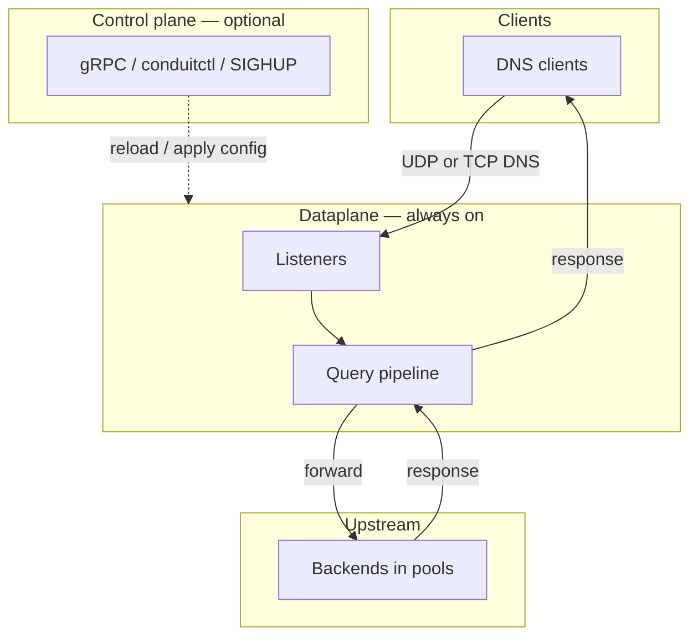
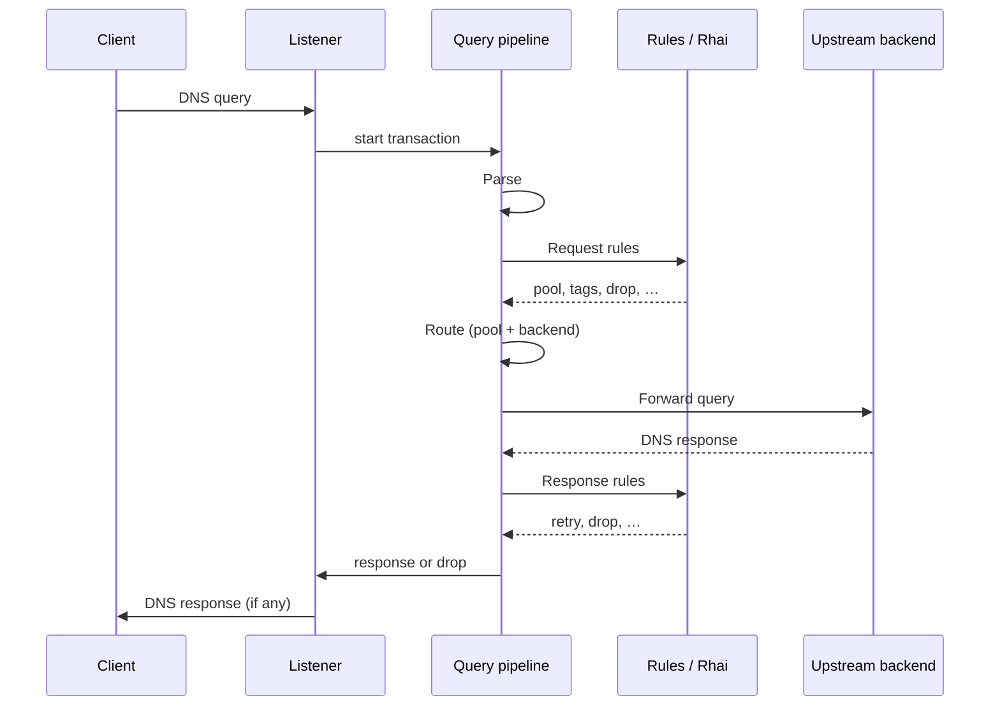
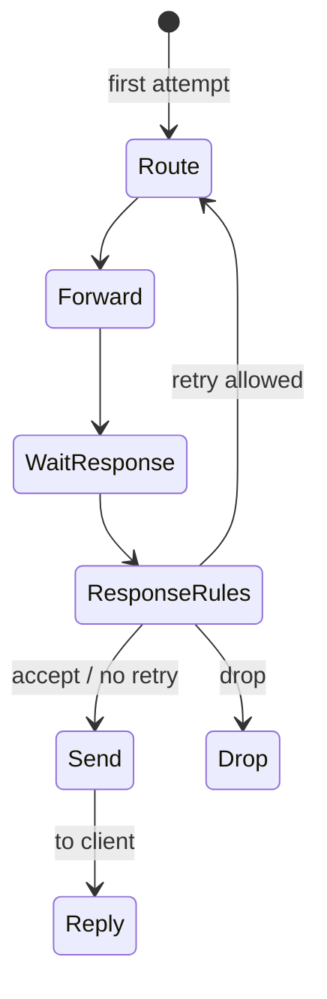
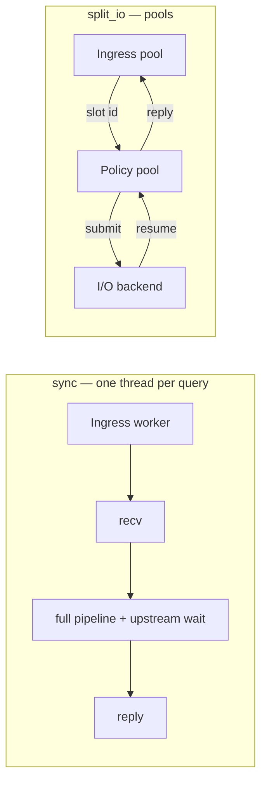

# Architecture and packet path

This page describes how DNS Conduit accepts client queries, runs each query through a fixed pipeline on the [dataplane](/glossary/index.md#dataplane), and returns a response. It is the mental model for [transactions](/glossary/index.md#transaction), [pipeline phases](/concepts/architecture-and-packet-path.md#pipeline-phases), and [tags](/glossary/index.md#tags). Configuration YAML, rule syntax, and observability setup live on their own pages — they are linked from this page where they touch the query path.

## Overview

Conduit is a DNS forwarder: clients send queries to configured **listeners**; Conduit evaluates policy, picks an upstream [pool](/glossary/index.md#pool) and [backend](/glossary/index.md#backend), forwards the query, and sends the upstream answer (or a generated error) back to the client.

Conduit combines two runtime roles:

| Role {: .column-no-wrap } | What it does | Required? |
|------|--------------|-------------|
| **[Dataplane](/glossary/index.md#dataplane)** | Serves DNS — listeners, per-query pipeline, upstream forwarding | Always (the `conduit` service) |
| **[Control plane](/glossary/index.md#control-plane)** | Config apply, export, reload, gRPC, `conduitctl` | Opt-in (`control:` block) |

When the [dataplane](/glossary/index.md#dataplane) answers a query, it uses the **[runtime snapshot](/glossary/index.md#runtime-snapshot)** in force at that moment — your effective config, rules, and forward settings as Conduit has already loaded and validated them. When you change configuration (**SIGHUP**, `conduitctl reload`, or `conduitctl apply`), the [control plane](/glossary/index.md#control-plane) checks the new settings and swaps them in for later queries; queries already in progress finish on the config they started with. If the new config fails validation, Conduit keeps the previous working snapshot and DNS keeps flowing. See [Configuration model](/control-plane/configuration-model.md).

## End-to-end path

From a client’s perspective, one DNS query through Conduit looks like this:

1. The client sends a query to a configured **listener** address (UDP or TCP).
2. Conduit opens a **[transaction](/glossary/index.md#transaction)** at [Receive](/concepts/architecture-and-packet-path.md#receive) and walks the pipeline in order — [Parse](/concepts/architecture-and-packet-path.md#parse), [Request rules](/concepts/architecture-and-packet-path.md#request-rules), [Route](/concepts/architecture-and-packet-path.md#route), [Forward](/concepts/architecture-and-packet-path.md#forward), [Wait for response](/concepts/architecture-and-packet-path.md#wait-for-response), [Response rules](/concepts/architecture-and-packet-path.md#response-rules), and [Send](/concepts/architecture-and-packet-path.md#send) — until the query gets a DNS reply or is **dropped** (no reply).
3. During [Route](/concepts/architecture-and-packet-path.md#route), Conduit selects a [pool](/glossary/index.md#pool) and [backend](/glossary/index.md#backend) (see [Pools and backends](/policy-routing/pools-and-backends.md)).
4. During [Forward](/concepts/architecture-and-packet-path.md#forward) and [Wait for response](/concepts/architecture-and-packet-path.md#wait-for-response), Conduit sends the query upstream and waits for an answer (or timeout) before [Response rules](/concepts/architecture-and-packet-path.md#response-rules) run.
5. During [Send](/concepts/architecture-and-packet-path.md#send), Conduit returns the DNS response to the client. **Drops** at [Parse](/concepts/architecture-and-packet-path.md#parse) or in [Request rules](/concepts/architecture-and-packet-path.md#request-rules) / [Response rules](/concepts/architecture-and-packet-path.md#response-rules) end the transaction with no reply.

Conduit can record activity during the query path without slowing answers:

- **[Metrics](/observability/metrics.md)** — counters and histograms at selected [pipeline phases](/concepts/architecture-and-packet-path.md#pipeline-phases); series reference in [Built-in metrics](/observability/built-in-metrics.md)
- **[Event export](/observability/event-export.md)** — [dnstap](/glossary/index.md#dnstap) and other sinks
- **[Tracing](/observability/tracing.md)** — per-query [pipeline trace](/glossary/index.md#pipeline-trace) when enabled

Observation runs separately from the steps above. Busy or full sinks must not block DNS responses — see [Concurrency and workers](#concurrency-and-workers) and the Observability pages.

## Transactions

A **[transaction](/glossary/index.md#transaction)** is everything Conduit remembers for one client query from [Receive](/concepts/architecture-and-packet-path.md#receive) through [Send](/concepts/architecture-and-packet-path.md#send). On one worker, it carries:

- **The question** — queried name and type, plus client address, listener, and protocol (UDP or TCP)
- **Policy context** — [tags](/glossary/index.md#tags), selected [pool](/glossary/index.md#pool) and [backend](/glossary/index.md#backend), and attempt history when [retries](/glossary/index.md#retry) occur
- **Messages** — the query as received and, when available, the response Conduit returns to the client
- **Optional trace** — [pipeline trace](/glossary/index.md#pipeline-trace) when tracing is enabled for this query

For logs and traces, each transaction has a unique internal id. The DNS message id in the packet (`dns_id`) is separate; Conduit preserves it on responses to the client.

Transactions are **not** persisted across queries and are **not** exported as part of normal config — tags and per-query overrides are runtime-only.

## Pipeline phases

Every query walks the same [pipeline phases](/concepts/architecture-and-packet-path.md#pipeline-phases) in order. Policy may **drop** the query (no DNS reply), jump ahead (for example straight to [Send](/concepts/architecture-and-packet-path.md#send) on failure), or loop back to [Route](/concepts/architecture-and-packet-path.md#route) for a **[retry](/glossary/index.md#retry)** when limits allow. With the **full** metrics profile, [`conduit_phase_duration_seconds`](/observability/built-in-metrics.md#conduit_phase_duration_seconds) records time in each phase.

Default happy path (single attempt, no early drop):

1. [Receive](/concepts/architecture-and-packet-path.md#receive)
2. [Parse](/concepts/architecture-and-packet-path.md#parse)
3. [Request rules](/concepts/architecture-and-packet-path.md#request-rules)
4. [Route](/concepts/architecture-and-packet-path.md#route)
5. [Forward](/concepts/architecture-and-packet-path.md#forward)
6. [Wait for response](/concepts/architecture-and-packet-path.md#wait-for-response)
7. [Response rules](/concepts/architecture-and-packet-path.md#response-rules)
8. [Send](/concepts/architecture-and-packet-path.md#send)

[Response rules](/concepts/architecture-and-packet-path.md#response-rules) may send the pipeline back to [Route](/concepts/architecture-and-packet-path.md#route) (and then [Forward](/concepts/architecture-and-packet-path.md#forward) again) when a retry is requested and attempt limits allow it — the pipeline is **not** a strict one-pass pipe.

| Phase {: .column-no-wrap } | Operator-facing summary |
|-------|-------------------------|
| [Receive](/concepts/architecture-and-packet-path.md#receive) | Listener accepts the DNS message (UDP or TCP) and opens a [transaction](/glossary/index.md#transaction) on the worker. |
| [Parse](/concepts/architecture-and-packet-path.md#parse) | Valid single-question query only; malformed or unsupported shapes → silent **drop** (no DNS reply). |
| [Request rules](/concepts/architecture-and-packet-path.md#request-rules) | **First-match** [request rules](/policy-routing/rules-and-actions.md) and request [Rhai](/rhai/index.md) — `set_pool`, `set_source_v4` / `set_source_v6`, tags, or **drop**; no match → default path to [Route](/concepts/architecture-and-packet-path.md#route). |
| [Route](/concepts/architecture-and-packet-path.md#route) | First attempt: `selected_pool` → `default` / first pool. **Retry** re-entry (`attempt_count > 0`): `retry_pool` (if set) → `selected_pool` → default. Sticky weighted [backend](/glossary/index.md#backend) on first attempt, exclude-tried on [retries](/glossary/index.md#retry). Missing pool or exhausted pool → **SERVFAIL** → [Send](/concepts/architecture-and-packet-path.md#send). |
| [Forward](/concepts/architecture-and-packet-path.md#forward) | Send upstream (UDP/TCP per `forward.upstream_transport`); `forward.timeout_ms` and source addresses apply. Hard errors → **SERVFAIL** → [Send](/concepts/architecture-and-packet-path.md#send). |
| [Wait for response](/concepts/architecture-and-packet-path.md#wait-for-response) | Wait for upstream answer or timeout; answer or timeout → [Response rules](/concepts/architecture-and-packet-path.md#response-rules) (retry policy may follow). |
| [Response rules](/concepts/architecture-and-packet-path.md#response-rules) | **First-match** response rules and Rhai — accept, **drop**, or **retry** (`retry` / `retry_now`) → [Route](/concepts/architecture-and-packet-path.md#route) ([Retries and transactions](/policy-routing/retries-and-transactions.md)). |
| [Send](/concepts/architecture-and-packet-path.md#send) | Return stored upstream wire or synthesize error (**SERVFAIL** common); UDP **TC** when truncated. |

### Receive

The listener accepts the client’s DNS message (UDP or TCP) and opens a [transaction](/glossary/index.md#transaction) for it. Processing continues at [Parse](/concepts/architecture-and-packet-path.md#parse) on the same worker that accepted the query.

### Parse

[Parse](/concepts/architecture-and-packet-path.md#parse) checks that the bytes are a valid DNS **query** with **exactly one** question, then records the query name, type, class, and (when present) the client’s EDNS UDP payload size for later replies.

Conduit **drops** (no DNS reply) when the packet is:

- Empty or not valid DNS on the wire
- A DNS message that is not a query (for example a response)
- A query with no question section
- A query with more than one question

From the client’s perspective a drop is silent — there is no answer and no synthesized error. Parse drops increment [`conduit_parse_rejected_total`](/observability/built-in-metrics.md#conduit_parse_rejected_total) with a `reason` label (`empty`, `wire_error`, `not_query`, `no_question`, `multi_question`). Successful parses increment [`conduit_queries_total`](/observability/built-in-metrics.md#conduit_queries_total) before [Request rules](/concepts/architecture-and-packet-path.md#request-rules) run.

### Request rules

[Request rules](/concepts/architecture-and-packet-path.md#request-rules) run **before** [Route](/concepts/architecture-and-packet-path.md#route). Conduit evaluates configured rules in **first-match** order: the first rule whose [selectors](/glossary/index.md#selector) match the query wins; later rules are skipped for that query.

Built-in actions on a matching rule can, among other things:

- **`set_pool`** — choose which [pool](/glossary/index.md#pool) [Route](/concepts/architecture-and-packet-path.md#route) uses on the first attempt
- **`set_retry_pool`** — pool used on retry [Route](/concepts/architecture-and-packet-path.md#route) if retry occurs; first [Route](/concepts/architecture-and-packet-path.md#route) ignores it (request or response hook; does not trigger retry by itself)
- **`set_tag`** — attach [tags](/glossary/index.md#tags) used by later selectors, export filters, or scripts
- **`set_source_v4`** / **`set_source_v6`** — pin upstream egress for this query on every forward (request hook only). **`set_retry_source_v4`** / **`set_retry_source_v6`** — one-shot egress for the next retry forward only (request or response hook). See [Source selection lifecycle](/policy-routing/retries-and-transactions.md#source-selection-lifecycle).
- **`drop`** / **`drop_now`** / **`clear_drop`** — soft or hard drop, or clear soft-drop intent ([Rules and actions](/policy-routing/rules-and-actions.md#action-order-on-one-rule))
- **`retry`** / **`retry_now`** / **`clear_retry`** / **`clear_retry_pool`** / **`set_retry_pool`** — retry family ([Rules and actions](/policy-routing/rules-and-actions.md#retry-actions))

Actions on the matched rule run in **list order** — built-in steps and optional **`rhai`** scripts interleaved as written. Each **`rhai`** step runs at its position in the list. Scripts can refine pool choice, set tags, set `retry_pool` for a future retry on the request hook, or drop the query.

When **no** rule matches, Conduit continues to [Route](/concepts/architecture-and-packet-path.md#route) with the default forward path. Rule syntax, hooks, and action reference: [Rules and actions](/policy-routing/rules-and-actions.md).

### Route

[Route](/concepts/architecture-and-packet-path.md#route) picks the [pool](/glossary/index.md#pool) and [backend](/glossary/index.md#backend) for this attempt. Pool name resolution:

1. **First attempt** (`attempt_count == 0`): `selected_pool` from [request rules](/concepts/architecture-and-packet-path.md#request-rules) or default / first configured pool. `retry_pool` is ignored.
2. **Retry re-entry** (`attempt_count > 0`): `retry_pool` if set (consumed), else `selected_pool`, else default / first pool.

After each Route, Conduit updates **`selected_pool`** to the pool that attempt used. Multi-attempt behavior and when to re-stash **`retry_pool`**: [Retries and transactions — Pool selection lifecycle](/policy-routing/retries-and-transactions.md#pool-selection-lifecycle).

On the **first** attempt, Conduit selects a [backend](/glossary/index.md#backend) using sticky weighted choice among all members of the pool (see [Pools and backends](/policy-routing/pools-and-backends.md)). On **retries**, Conduit picks among backends in the target pool that were **not** already used for that pool on this [transaction](/glossary/index.md#transaction) — cross-pool retries only exclude backends tried in the **target** pool.

Each forward attempt increments the transaction’s attempt counter. When the pipeline continues to [Forward](/concepts/architecture-and-packet-path.md#forward), [`conduit_queries_by_pool_total`](/observability/built-in-metrics.md#conduit_queries_by_pool_total) records the selected pool.

If the pool name does not exist, the pool has no backends, every backend in the pool was already tried, or backend selection fails, Conduit sets **SERVFAIL** on the [transaction](/glossary/index.md#transaction) and skips [Forward](/concepts/architecture-and-packet-path.md#forward) — the query goes straight to [Send](/concepts/architecture-and-packet-path.md#send).

### Forward

[Forward](/concepts/architecture-and-packet-path.md#forward) sends the query to the [backend](/glossary/index.md#backend) chosen at [Route](/concepts/architecture-and-packet-path.md#route).

**Transport.** Upstream traffic follows `forward.upstream_transport` (UDP only, TCP only, or UDP with TCP fallback when the UDP response has the **TC** (truncated) bit set). TCP clients can be configured to use upstream TCP as well (`forward.client_tcp_uses_upstream_tcp`).

**Timeouts.** Each forward attempt is bounded by `forward.timeout_ms` (default **2000** ms). Socket read/write timeouts use the same value.

**Source addresses.** Conduit binds outbound packets using global `forward.sources_v4` / `forward.sources_v6`, optional per-pool `sources_v4` / `sources_v6`, and any source overrides from rules or [Rhai](/rhai/index.md). IPv4 and IPv6 backends use the matching address family. See [Dual-stack forwarding](/guides/dual-stack-forwarding.md).

Immediate forward errors (for example send failure or too many outstanding queries to the same backend) set **SERVFAIL** and jump to [Send](/concepts/architecture-and-packet-path.md#send). A successful send continues to [Wait for response](/concepts/architecture-and-packet-path.md#wait-for-response). Each failed attempt increments [`conduit_forward_errors_total`](/observability/built-in-metrics.md#conduit_forward_errors_total). With the **full** metrics profile, each attempt also updates [`conduit_forward_attempts_total`](/observability/built-in-metrics.md#conduit_forward_attempts_total) and [`conduit_forward_duration_seconds`](/observability/built-in-metrics.md#conduit_forward_duration_seconds).

### Wait for response

[Wait for response](/concepts/architecture-and-packet-path.md#wait-for-response) is where the worker waits for the upstream answer after [Forward](/concepts/architecture-and-packet-path.md#forward) has sent the query.

- **Answer received** — the upstream wire is stored on the [transaction](/glossary/index.md#transaction) (including response code) and processing continues to [Response rules](/concepts/architecture-and-packet-path.md#response-rules).
- **Timeout** — no answer before `forward.timeout_ms`; [`conduit_forward_errors_total`](/observability/built-in-metrics.md#conduit_forward_errors_total) records `reason="timeout"` and processing still continues to [Response rules](/concepts/architecture-and-packet-path.md#response-rules) so retry policy can run another attempt.
- **Hard forward failure** — some errors skip waiting and go directly to [Send](/concepts/architecture-and-packet-path.md#send) with **SERVFAIL** (see [Forward](/concepts/architecture-and-packet-path.md#forward) above).

In current releases the wait runs on the same worker as [Forward](/concepts/architecture-and-packet-path.md#forward) before [Response rules](/concepts/architecture-and-packet-path.md#response-rules); the separate pipeline step keeps tracing and diagrams aligned with the full path. Retry behavior after a timeout or error: [Retries and transactions](/policy-routing/retries-and-transactions.md).

### Response rules

[Response rules](/concepts/architecture-and-packet-path.md#response-rules) run once an upstream wire is available **or** a forward timeout has occurred (still with no stored answer). Like [Request rules](/concepts/architecture-and-packet-path.md#request-rules), evaluation is **first-match** on the response hook, with optional [Rhai](/rhai/index.md) scripts on the matched rule.

Built-in actions can accept the upstream answer, **drop** the query ([no built-in counter](/observability/built-in-metrics.md#policy-drops-no-built-in-counter)), request **`retry`** or **`retry_now`** (stay in or re-enter with the current [pool](/glossary/index.md#pool)), set **`set_retry_pool`** for a different pool on the next retry attempt, or adjust response metadata (for example **`set_rcode`**). **Retry** intent — from **`retry`**, **`retry_now`**, or [Rhai](/rhai/index.md) — sends the [transaction](/glossary/index.md#transaction) back to [Route](/concepts/architecture-and-packet-path.md#route) for another [Forward](/concepts/architecture-and-packet-path.md#forward) attempt; [`conduit_retries_total`](/observability/built-in-metrics.md#conduit_retries_total) increments for the **target** pool of that attempt.

Global caps from `orchestrator.max_attempts` (default **3**) and `orchestrator.max_txn_duration_ms` (default **5000** ms), plus **pool exhaustion** when no unused [backend](/glossary/index.md#backend) remains in the target pool, apply before each [Route](/concepts/architecture-and-packet-path.md#route). When a limit is hit, Conduit sets **SERVFAIL** and moves to [Send](/concepts/architecture-and-packet-path.md#send) instead of forwarding again. Details and examples: [Retries and transactions](/policy-routing/retries-and-transactions.md), [Rules and actions](/policy-routing/rules-and-actions.md).

### Send

[Send](/concepts/architecture-and-packet-path.md#send) delivers the final DNS message to the client.

If [Forward](/concepts/architecture-and-packet-path.md#forward) stored an upstream answer on the [transaction](/glossary/index.md#transaction), Conduit returns that wire unchanged (subject to client protocol on the listener). If there is **no** stored answer — routing or forward failure, or retries exhausted — Conduit **synthesizes** a minimal error response using the transaction’s response code (commonly **SERVFAIL**, or a code set by policy). Synthesized responses echo the client’s question section and preserve EDNS when the query had it.

On **UDP**, if the response would exceed the client’s EDNS payload size (or 512 bytes when EDNS is absent), Conduit truncates the message and sets the **TC** (truncated) bit so standards-compliant resolvers can retry over TCP.

Successful replies and synthesized errors both complete the [transaction](/glossary/index.md#transaction) on the listener; [`conduit_responses_total`](/observability/built-in-metrics.md#conduit_responses_total) and event export run as configured (coarse `rcode` buckets on **`minimal`**, per-IANA `rcode` + `ip_family` on **`full`**). See [Observability](/observability/index.md) and [Built-in metrics](/observability/built-in-metrics.md).

## Tags

**[Tags](/glossary/index.md#tags)** are named runtime annotations on a transaction (boolean or string values in current releases). [Request rules](/concepts/architecture-and-packet-path.md#request-rules) and [Response rules](/concepts/architecture-and-packet-path.md#response-rules) — built-in actions and [Rhai](/rhai/index.md) on those hooks — set tags; [selectors](/glossary/index.md#selector) on later rules test them.

Tags persist across [retries](/glossary/index.md#retry) on the same transaction unless cleared. They are useful for:

- Branching policy ([selectors](/glossary/index.md#selector) on tag presence or value)
- Gating [event export](/observability/event-export.md) or [tracing](/observability/tracing.md) (`tag_required`, trace activation)
- Correlating logs and metrics with policy decisions

Tags are not part of the on-disk config file or normal config export. Script and API details: [Rhai](/rhai/index.md), [Rules and actions](/policy-routing/rules-and-actions.md).

## Retries and re-entry

When [Response rules](/concepts/architecture-and-packet-path.md#response-rules) request a [retry](/glossary/index.md#retry), Conduit counts the attempt and re-enters at [Route](/concepts/architecture-and-packet-path.md#route) — in the current [pool](/glossary/index.md#pool) or using `retry_pool` from **`set_retry_pool`** when set. Retries avoid [backends](/glossary/index.md#backend) already used in the target pool on this [transaction](/glossary/index.md#transaction). Further attempts stop at `orchestrator.max_attempts`, `orchestrator.max_txn_duration_ms`, or when the target pool has no unused backends — typically yielding **SERVFAIL**. Retry transitions increment [`conduit_retries_total`](/observability/built-in-metrics.md#conduit_retries_total) for the target pool.

Full retry semantics, actions, and examples: [Retries and transactions](/policy-routing/retries-and-transactions.md).

## Runtime snapshot

A **[runtime snapshot](/glossary/index.md#runtime-snapshot)** is the bundle of settings Conduit uses to answer queries at a given moment: effective config (listeners, pools, forward behavior), loaded rules and scripts, and observability filters. All listener workers share the same snapshot until you change configuration.

When you reload or apply new settings (**SIGHUP**, `conduitctl reload`, or `conduitctl apply`), Conduit validates the change and builds a new snapshot for **later** queries. Queries already in flight keep using the settings they started with — they do not jump mid-query to a half-applied config. [`conduit_config_generation`](/observability/built-in-metrics.md#conduit_config_generation) reflects the active generation at scrape time.

If validation fails, Conduit keeps the **[last-good snapshot](/glossary/index.md#last-good-snapshot)** (the previous working settings) and continues serving DNS.

Some changes update the snapshot immediately but still need a **process restart** to take effect on the wire — for example listener bind addresses and forward egress sockets. Conduit logs when that applies; see [Configuration model](/control-plane/configuration-model.md) and [Reload and export](/control-plane/reload-and-export.md) for reload, overlays, and what requires a restart.

## Concurrency and workers

**Current builds** use the **`sync`** runtime only. **Release v1.0** adds selectable runtimes (`dataplane.runtime`); **`split_io`** is the recommended production model when upstream latency or query volume would otherwise block ingress workers.

Conduit’s dataplane runtime is chosen at **process startup** (`dataplane.runtime`). Changing it requires a **process restart** (see [Configuration model](/control-plane/configuration-model.md)).

### Runtime models

| Model | Summary | Default? |
|-------|---------|----------|
| **`sync`** | Each ingress worker receives a query, runs the full [pipeline](/concepts/architecture-and-packet-path.md#pipeline-phases) on that thread, **including blocking upstream wait**, then replies before taking the next query | **Yes** when `dataplane.runtime` is omitted |
| **`split_io`** | Separate **ingress**, **policy**, and **upstream I/O** worker pools; ingress does not block on upstream DNS wait; transactions **park** in a slot pool between Forward and [Wait for response](/concepts/architecture-and-packet-path.md#wait-for-response) | Opt-in; **recommended for production** at release v1.0 under load or slow upstreams |
| **`tokio`** | Async task-based dataplane (post–v1.0) | Not in initial v1.0 releases |

### Worker counts

- **`listeners.threads`** — ingress workers per listener address (use **`listeners.reuse_port: true`** on UDP when `threads` > 1). Optional per-listener **`threads`** override on each `listeners.listeners[]` entry.
- **`dataplane.policy_workers`** — concurrent policy/pipeline executions (`split_io` / future `tokio`).
- **`dataplane.io_workers`** — upstream reply demux threads (`split_io`).

Concurrency is bounded by slot pool capacity (`orchestrator.txn_table_capacity`), `forward.outstanding_per_backend`, and optional per-pool `max_inflight` caps.

### Query outcomes and worker occupancy

| Outcome | Client sees | Notes |
|---------|-------------|--------|
| **Drop** | No reply (silent) | Malformed wire, policy `drop` |
| **Response** | DNS packet | Upstream answer or **synthesized error** (e.g. SERVFAIL when routing/forward/retries fail) |

Under **`sync`**, one ingress worker is busy for the entire transaction (including upstream wait). Under **`split_io`**, ingress workers stay available for new queries while other slots wait on upstreams in the I/O pool.

[Metrics](/observability/metrics.md), [event export](/observability/event-export.md) ([dnstap](/glossary/index.md#dnstap)), and similar observation are handled separately from the query path. If an export queue fills up, Conduit drops export events and increments [`conduit_events_queue_dropped_total`](/observability/built-in-metrics.md#conduit_events_queue_dropped_total) rather than delaying DNS responses.

For reload, in-flight queries, and validation failures, see [Runtime snapshot](#runtime-snapshot).

## Related topics

- [Getting started](/getting-started/index.md) — install, minimal config, first query
- [Pools and backends](/policy-routing/pools-and-backends.md) — pool selection at [Route](/concepts/architecture-and-packet-path.md#route)
- [Rules and actions](/policy-routing/rules-and-actions.md) — [Request rules](/concepts/architecture-and-packet-path.md#request-rules) and [Response rules](/concepts/architecture-and-packet-path.md#response-rules) hooks
- [Retries and transactions](/policy-routing/retries-and-transactions.md) — retry loops and limits
- [Configuration model](/control-plane/configuration-model.md) — snapshots and effective config
- [Observability](/observability/index.md) — metrics, tracing, event export, logging
- [Built-in metrics](/observability/built-in-metrics.md) — Prometheus series and pipeline mapping
- [Planned plugin models](/concepts/planned-plugin-models.md) — [WASM](/glossary/index.md#wasm), [sidecar](/glossary/index.md#sidecar), processor chains (not yet shipped)
- [Rhai](/rhai/index.md) — scripted policy on rules today
- [Glossary](/glossary/index.md) — [dataplane](/glossary/index.md#dataplane), [transaction](/glossary/index.md#transaction), [runtime snapshot](/glossary/index.md#runtime-snapshot), [tags](/glossary/index.md#tags)
