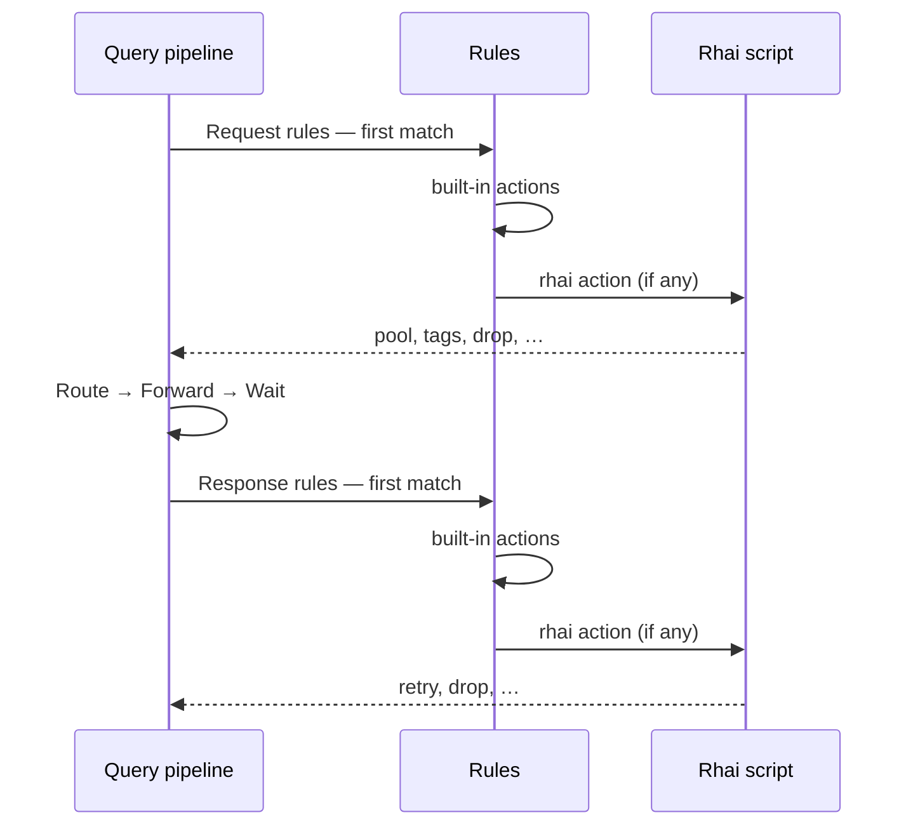

# Extensibility

This page describes how you extend Conduit beyond plain forwarding — built-in [rules](/policy-routing/rules-and-actions.md), [Rhai](/glossary/index.md#rhai) scripts, and (in later releases) other plugin models. It is the mental model for policy on the [dataplane](/glossary/index.md#dataplane). Rule syntax, script APIs, and config field lists live on their own pages — they are linked from this page where they touch extension behavior.

## Overview

On each [transaction](/glossary/index.md#transaction), Conduit walks a fixed [query pipeline](/concepts/architecture-and-packet-path.md#pipeline-phases). Extensions do **not** replace [Route](/concepts/architecture-and-packet-path.md#route), [Forward](/concepts/architecture-and-packet-path.md#forward), or the other forwarding stages; they plug into **policy hooks** at [Request rules](/concepts/architecture-and-packet-path.md#request-rules) and [Response rules](/concepts/architecture-and-packet-path.md#response-rules).

You can steer query policy in **four ways** — built-in [rules](/policy-routing/rules-and-actions.md) plus three plugin models ([Rhai](/glossary/index.md#rhai), [WASM](/glossary/index.md#wasm), [sidecar](/glossary/index.md#sidecar)). Built-in [rules](/policy-routing/rules-and-actions.md) are the default: [selectors](/glossary/index.md#selector) and [actions](/glossary/index.md#action) in config, no script files. [WASM](/glossary/index.md#wasm) and [sidecar](/glossary/index.md#sidecar) are not available in current releases. When built-in [actions](/glossary/index.md#action) are not enough, you can run custom code through one of the three plugin models on those same hooks — each model differs in how you author code, how fast it runs, and how isolated it is, not in which [pipeline phases](/concepts/architecture-and-packet-path.md#pipeline-phases) it touches:

| Mechanism {: .column-no-wrap } | In current releases? | What you do | Tradeoffs (typical) |
|------|----------------------|-------------|---------------------|
| **Built-in [rules](/policy-routing/rules-and-actions.md)** | Yes | Declare [selectors](/glossary/index.md#selector) and [actions](/glossary/index.md#action) under `rules:` | Fastest; limited to built-in action types |
| **[Rhai](/glossary/index.md#rhai)** | Yes | `.rhai` files referenced from `rhai` actions on matching rules | Flexible scripts; [sandbox limits](/rhai/sandbox-limits.md) apply |
| **[WASM](/glossary/index.md#wasm)** | No | Compiled `.wasm` plugins loaded inside `conduit` | Near-native speed, strong sandbox; compile and deploy artifacts |
| **[Sidecar](/glossary/index.md#sidecar)** | No | Separate processes Conduit calls on the same hooks | Any language or existing service; higher per-query latency and ops work |

What changes across the four mechanisms is how you **author** policy — not **where** it plugs in. All four use the same request and response **hooks** on the [transaction](/glossary/index.md#transaction) ([Request rules](/concepts/architecture-and-packet-path.md#request-rules) and [Response rules](/concepts/architecture-and-packet-path.md#response-rules)). Built-in [rules](/policy-routing/rules-and-actions.md) read that context through [selectors](/glossary/index.md#selector) and [actions](/glossary/index.md#action); the three plugin models ([Rhai](/glossary/index.md#rhai), [WASM](/glossary/index.md#wasm), [sidecar](/glossary/index.md#sidecar)) share the same transaction view and the same [lookup tables](#lookup-tables) API for `data_sources` — only the execution boundary (script, in-process plugin, or separate process) differs. **[Policy metrics](#policy-metrics)** (custom counters from extension code) are **not** the same across all four — see that section. You choose one plugin model for a given need; you do not “upgrade” a rule from [Rhai](/glossary/index.md#rhai) to [WASM](/glossary/index.md#wasm) or [sidecar](/glossary/index.md#sidecar).

When you change configuration (**SIGHUP**, `conduitctl reload`, or `conduitctl apply`), Conduit validates rules and scripts and builds a new [runtime snapshot](/glossary/index.md#runtime-snapshot) for later queries. [Transactions](/glossary/index.md#transaction) already in progress keep the scripts and rules they started with. If validation fails, Conduit keeps the previous working snapshot and DNS keeps flowing. See [Configuration model](/control-plane/configuration-model.md).

## Policy hooks on the query path

Every extension mechanism — built-in [rules](/policy-routing/rules-and-actions.md), [Rhai](/rhai/index.md), and (when shipped) [WASM](/glossary/index.md#wasm) and [sidecar](/glossary/index.md#sidecar) plugins — plugs in at the same two [pipeline phases](/concepts/architecture-and-packet-path.md#pipeline-phases):

| Hook | Phase | What policy can change |
|------|-------|------------------------|
| **Request** | [Request rules](/concepts/architecture-and-packet-path.md#request-rules) | [Pool](/glossary/index.md#pool) choice, [tags](/glossary/index.md#tags), **drop**, egress source overrides (`set_source_v4` / `set_source_v6` or [Rhai](/rhai/index.md)) — before [Route](/concepts/architecture-and-packet-path.md#route) |
| **Response** | [Response rules](/concepts/architecture-and-packet-path.md#response-rules) | Accept or **drop**, [retry](/glossary/index.md#retry) pool, response metadata — after upstream answer or timeout |

On each hook Conduit evaluates [rules](/policy-routing/rules-and-actions.md) in **first-match** order: the first rule whose [selectors](/glossary/index.md#selector) match wins. A matching rule can run built-in [actions](/glossary/index.md#action), a **`rhai`** action (path to a script file), or both — built-in [actions](/glossary/index.md#action) on that rule first, then the linked [Rhai](/rhai/index.md) script when present.

For the full path from client to upstream and back, see [Architecture and packet path](/concepts/architecture-and-packet-path.md).

## Built-in rules

Built-in [rules](/policy-routing/rules-and-actions.md) are the usual way to steer traffic without scripting. You declare [selectors](/glossary/index.md#selector) (what queries match) and [actions](/glossary/index.md#action) (what Conduit does) under `rules:` in your config file.

Typical [actions](/glossary/index.md#action) include `set_pool`, `set_tag`, `set_source_v4`, `set_source_v6`, `drop`, `retry`, `retry_pool`, and `set_rcode`. They load with the rest of your config when you **SIGHUP**, `conduitctl reload`, or `conduitctl apply` — no separate compile step beyond snapshot validation.

When a rule sets both pool and egress source, list **`set_pool` before `set_source_v4` / `set_source_v6`**. See [Rules and actions — Action order](/policy-routing/rules-and-actions.md#action-order-on-one-rule).

Syntax, hook names, and the full action list: [Rules and actions](/policy-routing/rules-and-actions.md).

## Rhai

[Rhai](/glossary/index.md#rhai) is Conduit’s scripting option in **current releases**. You keep `.rhai` files on disk (or ship them with your config tree), point `rhai` actions at those paths, and Conduit loads and checks scripts when it builds a [runtime snapshot](/glossary/index.md#runtime-snapshot).

On a matching rule at [Request rules](/concepts/architecture-and-packet-path.md#request-rules) or [Response rules](/concepts/architecture-and-packet-path.md#response-rules), the script sees a sandboxed view of the [transaction](/glossary/index.md#transaction) — query name, [tags](/glossary/index.md#tags), response code, and related fields — and can refine [pool](/glossary/index.md#pool) choice, set [tags](/glossary/index.md#tags), pin egress source (`set_source_v4` / `set_source_v6`, request hook only), **drop** the query, or request a [retry](/glossary/index.md#retry), within [sandbox limits](/rhai/sandbox-limits.md) (`max_operations`, `max_call_depth`, `hook_timeout_ms` on the `rhai:` block).

Built-in **`set_source_v4`** / **`set_source_v6`** [actions](/glossary/index.md#action) use the same override fields and forward-time allowed-set behavior as Rhai — see [Dual-stack forwarding](/guides/dual-stack-forwarding.md#choosing-an-egress-source).

Changing a script file has no effect on live queries until you reload or apply and Conduit accepts the new snapshot. Queries already running finish on the scripts they started with.

Everything beyond this overview — hooks, the `txn` API, lookup helpers, and user-defined metrics — lives under [Rhai](/rhai/index.md).

## WASM (not in current releases)

**[WASM](/glossary/index.md#wasm)** is a planned plugin model: compiled `.wasm` files loaded **inside** the `conduit` process. It uses the same request and response hooks, transaction view, [lookup tables](#lookup-tables) access, and (when shipped) the same [policy metrics](#policy-metrics) host APIs as [Rhai](/glossary/index.md#rhai).

Operators would deploy plugin artifacts, grant each plugin access only to named lookup tables (see [Lookup tables](#lookup-tables)), and rely on Conduit’s sandbox around guest code. This model targets near-native speed and stronger isolation for untrusted third-party logic.

**Not available** in current releases — configuration and workflows will be documented when the feature ships.

## Sidecar (not in current releases)

**[Sidecar](/glossary/index.md#sidecar)** is a planned plugin model: separate processes Conduit calls over gRPC or a Unix-domain socket. It uses the same hooks, transaction view, and [lookup tables](#lookup-tables) access as [Rhai](/glossary/index.md#rhai) and [WASM](/glossary/index.md#wasm). [Policy metrics](#policy-metrics) are planned with the **same semantics** as [Rhai](/glossary/index.md#rhai), applied by Conduit from the sidecar hook protocol rather than in-process script calls.

Sidecars trade per-query latency for running code in another language or an existing service (Python, Go, legacy binaries). They suit lower-QPS policy paths or teams that prefer a helper service over in-process plugins.

**Not available** in current releases.

## Lookup tables

Extension code does **not** read arbitrary paths on the host. You declare lookup tables under **`data_sources:`** in config; the host loads them when it builds a [runtime snapshot](/glossary/index.md#runtime-snapshot) and exposes **lookup** calls to [Rhai](/rhai/index.md) (and, when shipped, [WASM](/glossary/index.md#wasm) and [sidecar](/glossary/index.md#sidecar) plugins).

In **current releases**, each table with **`type: csv`** is read from disk at snapshot build and held in an **in-memory map** for **`table_lookup`** in [Rhai](/rhai/index.md). **Additional lookup backends and fresher refresh behavior** (beyond reloading the full file into memory) are planned for a near-term release; the host-owned lookup surface will stay shared across [Rhai](/glossary/index.md#rhai), [WASM](/glossary/index.md#wasm), and [sidecar](/glossary/index.md#sidecar) plugins.

That matches how the rest of config reloads today: **SIGHUP**, `conduitctl reload`, or `conduitctl apply` refreshes rules, scripts, and lookup tables together. In-flight [transactions](/glossary/index.md#transaction) keep the tables they started with.

Lookup API, examples, and grant rules: [Data sources and lookups](/rhai/data-sources-and-lookups.md). Field reference: [Config schema](/reference/config-schema/index.md) (when published for `data_sources`).

## Policy metrics

Extension mechanisms do **not** all have the same access to **custom** policy metrics (counters your policy increments from a hook). That is separate from **built-in** [metrics](/observability/metrics.md) the [dataplane](/glossary/index.md#dataplane) records on every query (`conduit_queries_total`, pool counters, and similar) and from **metric sinks** (Prometheus scrape, OTEL push) in [Beyond policy hooks](#beyond-policy-hooks).

| Mechanism | Custom metrics (write) | In-policy metrics (read) | In current releases |
|-----------|------------------------|--------------------------|---------------------|
| **Built-in [rules](/policy-routing/rules-and-actions.md)** | No `metric_inc` or equivalent on [actions](/glossary/index.md#action) | No read API from a hook; planned overload routing via declarative `window_above` [selectors](/glossary/index.md#selector) | Write: no; read: no |
| **[Rhai](/glossary/index.md#rhai)** | Yes — `metric_inc` / `metric_inc_labels`; exported as `conduit_user_*` | Planned metric **windows** (`window_rate`, `window_latched`) — post–v1 | Write: yes; read: no |
| **[WASM](/glossary/index.md#wasm)** | Planned — same host APIs as [Rhai](/glossary/index.md#rhai) | Planned — same as [Rhai](/glossary/index.md#rhai) | Not shipped |
| **[Sidecar](/glossary/index.md#sidecar)** | Planned — metric deltas in hook results; Conduit applies on the host | Planned — hook context and/or control-plane reads; same window semantics as [Rhai](/glossary/index.md#rhai) | Not shipped |

In **current releases**, only [Rhai](/rhai/index.md) can publish custom policy metrics from extension code. Built-in [rules](/policy-routing/rules-and-actions.md) still contribute to the normal query path, so built-in [metrics](/observability/metrics.md) reflect their outcomes — they just cannot define or increment named user metrics themselves.

**[WASM](/glossary/index.md#wasm)** is planned to share [Rhai](/glossary/index.md#rhai)’s in-process metric APIs when it ships. **[Sidecar](/glossary/index.md#sidecar)** is planned to target the **same host metric store** through the sidecar protocol (writes returned with hook results; reads via hook context or the control plane) — not by scraping Prometheus from inside policy code.

API detail, registration at script load, and export labels: [User metrics](/rhai/user-metrics.md). Built-in series and profiles: [Metrics](/observability/metrics.md) and [Built-in metrics](/observability/built-in-metrics.md).

## Beyond policy hooks

Some operator-facing capabilities extend Conduit **without** plugging into [Request rules](/concepts/architecture-and-packet-path.md#request-rules) or [Response rules](/concepts/architecture-and-packet-path.md#response-rules):

| Capability | Role in current releases |
|------------|--------------------------|
| **Config reload and apply** | Reread the file (**SIGHUP**, `conduitctl reload`) or merge API changes (`conduitctl apply`, export) — [Control plane](/control-plane/index.md) |
| **Observation sinks** | [dnstap](/glossary/index.md#dnstap) and related [event export](/observability/event-export.md) |
| **Metric sinks** | Prometheus scrape and OTEL push — [Metrics](/observability/metrics.md) |
| **Control API auth** | API keys and mTLS — [Security](/security/index.md) |

Dynamic auth plugins, out-of-tree observation plugins, and new client transports (DoT, DoH, …) are outside built-in [rules](/policy-routing/rules-and-actions.md) and the [Rhai](/glossary/index.md#rhai) / [WASM](/glossary/index.md#wasm) / [sidecar](/glossary/index.md#sidecar) plugin models — not part of current releases.

## Related topics

- [Architecture and packet path](/concepts/architecture-and-packet-path.md) — [pipeline phases](/concepts/architecture-and-packet-path.md#pipeline-phases), [tags](/glossary/index.md#tags), [retries](/glossary/index.md#retry)
- [Rules and actions](/policy-routing/rules-and-actions.md) — [selectors](/glossary/index.md#selector), [actions](/glossary/index.md#action), and hooks
- [Rhai](/rhai/index.md) — scripting reference for current releases
- [User metrics](/rhai/user-metrics.md) — custom policy metrics from [Rhai](/glossary/index.md#rhai)
- [Metrics](/observability/metrics.md) — built-in scrape, OTEL export, and operator profiles
- [Configuration model](/control-plane/configuration-model.md) — how rules and scripts enter the [runtime snapshot](/glossary/index.md#runtime-snapshot)
- [Glossary](/glossary/index.md) — [Rhai](/glossary/index.md#rhai), [WASM](/glossary/index.md#wasm), [sidecar](/glossary/index.md#sidecar)
