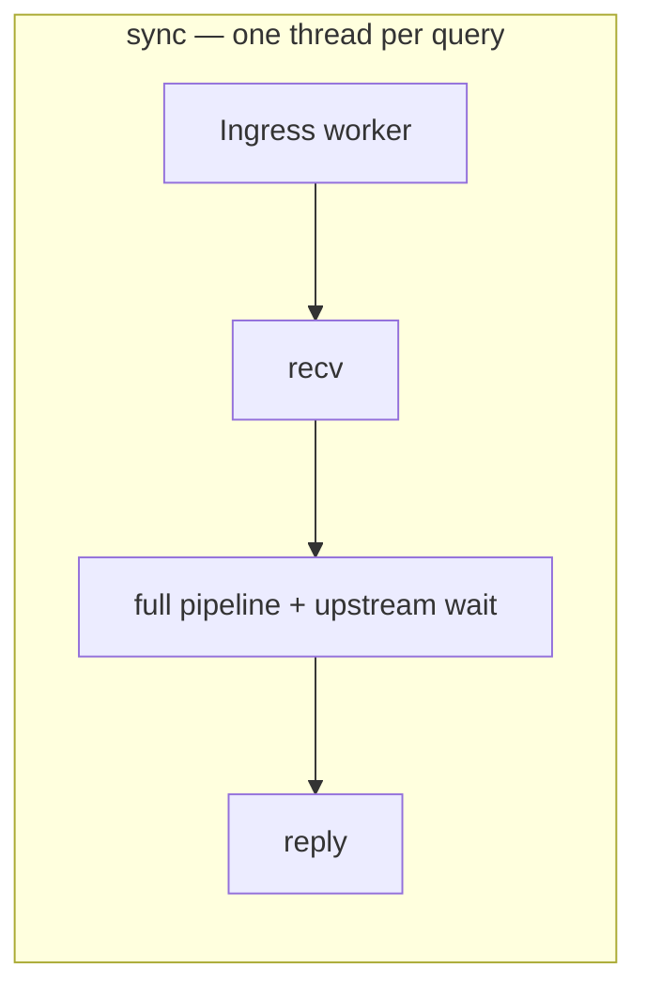
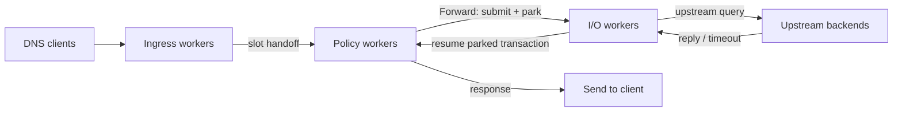
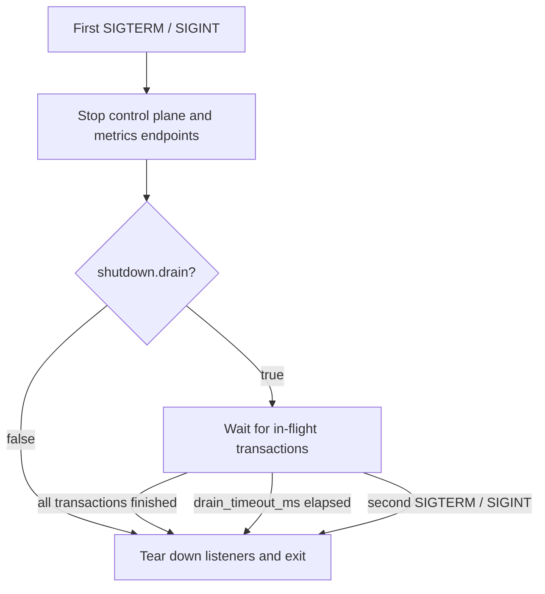

# Runtime and concurrency

This page describes how DNS Conduit spreads the per-query [defined pipeline](/concepts/architecture-and-packet-path.md#pipeline-phases) across OS threads: the **dataplane runtime model** (`sync` vs `split_io`), the worker pools and limits that bound concurrency, the shared [transaction](/glossary/index.md#transaction) slot pool, and how Conduit **drains** in-flight work on shutdown. The [pipeline phases](/concepts/architecture-and-packet-path.md#pipeline-phases) themselves — what each query does — are described in [Architecture and packet path](/concepts/architecture-and-packet-path.md).

## Runtime models

Conduit chooses a **dataplane runtime model** once at process startup with **`dataplane.runtime`**. The runtime decides *how* the work in the [defined pipeline](/concepts/architecture-and-packet-path.md#pipeline-phases) is spread across OS threads — it does **not** change the pipeline phases themselves. Every query still follows that pipeline regardless of runtime. The runtime model is fixed for the life of the process: changing `dataplane.runtime` or its worker counts takes effect only after a **restart**, not on [reload](/glossary/index.md#reload-from-disk).

Two runtime models ship today:

| Runtime {: .column-no-wrap } | How a query is executed | When to use |
|---------|-------------------------|-------------|
| **`sync`** (default) | One ingress worker runs the whole pipeline on its own thread — **including the blocking upstream wait** — then sends the reply before taking the next query. | Simple deployments, fast upstreams, labs and tests. |
| **`split_io`** | Separate **ingress**, **policy**, and **I/O** worker pools. Upstream waits are parked so ingress keeps accepting queries during slow upstreams. | Production with slower or variable upstreams, where ingress should not stall on upstream latency. |

Omitting the `dataplane:` block uses `sync`.

## Sync runtime (default)

In the **`sync`** model, each **ingress worker** accepts a client query, runs the full [pipeline](/concepts/architecture-and-packet-path.md#pipeline-phases) on that OS thread — **including the blocking upstream wait** inside [Lookup](/concepts/architecture-and-packet-path.md#lookup)'s [forward provider](/concepts/architecture-and-packet-path.md#forward-provider-internals) ([Forward](/concepts/architecture-and-packet-path.md#forward) / [Wait for response](/concepts/architecture-and-packet-path.md#wait-for-response)) — then sends the reply before taking the next query on that thread. There is no separate policy or I/O worker pool.

Under load or slow upstreams, a busy ingress worker cannot accept another client query until the current [transaction](/glossary/index.md#transaction) finishes, including the upstream wait. Add ingress threads (see [Worker counts and limits](#worker-counts-and-limits)) when you need more parallel capacity.

## Split I/O runtime

Setting **`dataplane.runtime: split_io`** splits the work into three worker roles so that waiting on a slow upstream does not tie up the thread that accepts client traffic:

- **Ingress workers** — accept the client message (UDP or TCP), do the structural [Parse](/concepts/architecture-and-packet-path.md#parse) check (valid DNS, single question), take a [transaction](/glossary/index.md#transaction) slot, and hand it off. They do **not** block on upstream replies. Count comes from **`listeners.threads`** (per listener, with optional per-listener override).
- **Policy workers** — run the orchestrator phases — [Request rules](/concepts/architecture-and-packet-path.md#request-rules), [Lookup](/concepts/architecture-and-packet-path.md#lookup) (including forward-provider submit), and finish the [transaction](/glossary/index.md#transaction) at [Response rules](/concepts/architecture-and-packet-path.md#response-rules) / [Send](/concepts/architecture-and-packet-path.md#send) once a reply is in. Count comes from **`dataplane.policy_workers`**.
- **I/O workers** — own the upstream sockets: they match incoming upstream replies to parked transactions, enforce `forward.timeout_ms`, and resume each transaction at [Wait for response](/concepts/architecture-and-packet-path.md#wait-for-response) inside the forward provider. **`dataplane.io_workers: N`** runs exactly **N** I/O poll threads (each with its own egress socket set).

The difference from `sync` is at [Forward](/concepts/architecture-and-packet-path.md#forward) → [Wait for response](/concepts/architecture-and-packet-path.md#wait-for-response) inside Lookup: instead of blocking, Forward **submits** the upstream query and **parks** the transaction; an I/O worker later resumes it on reply, timeout, or error. Ingress and policy workers stay free to handle other queries in the meantime.

A parked transaction still holds a [transaction](/glossary/index.md#transaction) slot while it waits, and it continues to count toward [`conduit_forward_outstanding`](/observability/built-in-metrics.md#conduit_forward_outstanding).

## Worker counts and limits

Concurrency is bounded by ingress thread counts, the runtime worker pools (`split_io`), the [transaction](/glossary/index.md#transaction) slot pool, and per-backend caps:

- **`listeners.threads`** — ingress worker threads **per** entry in `listeners.listeners` (use **`listeners.reuse_port: true`** on UDP when `threads` > 1). Total ingress workers = `threads` × number of listener entries; a listener entry may override the global default with its own `threads`. Under **`split_io`**, raise this when the accept path is saturated; handoff to policy is partitioned across shards so ingress producers are not serialized on one process-wide queue lock. Field reference: [Reference: listeners](/reference/config-schema/listeners.md).
- **`dataplane.policy_workers`** / **`dataplane.io_workers`** — size of the policy and I/O pools under **`split_io`** (each defaults to **1**; ignored by `sync`). Raise `policy_workers` for more concurrent policy/[Rhai](/rhai/index.md) execution; raise `io_workers` to run more I/O poll threads (and more upstream egress socket sets) when a single I/O worker is saturated.
- **`orchestrator.txn_table_capacity`** — capacity of the in-flight [transaction](/glossary/index.md#transaction) slot pool (bounds how many queries the process tracks at once, independent of per-query [retry](/glossary/index.md#retry) count). Field reference: [Reference: orchestrator](/reference/config-schema/orchestrator.md).
- **`forward.outstanding_per_backend`** — cap on concurrent upstream queries per backend address. Field reference: [Reference: forward](/reference/config-schema/forward.md).

## Transaction slot pool

Both runtime models track in-flight queries in a **transaction slot pool** — a preallocated arena of [transaction](/glossary/index.md#transaction) slots that grows in chunks up to **`orchestrator.txn_table_capacity`** (chunk size: optional **`dataplane.slot_chunk_size`**). A slot is held from [Receive](/concepts/architecture-and-packet-path.md#receive) until [Send](/concepts/architecture-and-packet-path.md#send) — including while a `split_io` transaction is parked at [Wait for response](/concepts/architecture-and-packet-path.md#wait-for-response). When every slot is in use, Conduit applies backpressure instead of growing without bound. Slot-pool gauges (in use, capacity, and exhaustion) appear in [Built-in metrics](/observability/built-in-metrics.md).

## Query outcomes and worker occupancy

| Outcome | Client sees | Notes |
|---------|-------------|--------|
| **Drop** | No reply (silent) | Malformed wire, policy `drop` |
| **Response** | DNS packet | Upstream answer or **synthesized error** (e.g. SERVFAIL when routing/forward/retries fail) |

Under **`sync`**, one ingress worker stays busy for the entire [transaction](/glossary/index.md#transaction), including the upstream wait. Under **`split_io`**, ingress hands off after the structural parse, so the upstream wait occupies a parked slot and an I/O worker rather than the ingress thread — that is what lets ingress keep accepting queries during slow upstreams.

[Metrics](/observability/metrics.md), [event export](/observability/event-export.md) ([dnstap](/glossary/index.md#dnstap)), and similar observation are handled separately from the query path. If an export queue fills up, Conduit drops export events and increments [`conduit_events_queue_dropped_total`](/observability/built-in-metrics.md#conduit_events_queue_dropped_total) rather than delaying DNS responses.

For reload, in-flight queries, and validation failures, see [Runtime snapshot](/concepts/architecture-and-packet-path.md#runtime-snapshot).

## Graceful drain on shutdown

When Conduit receives a shutdown signal (**SIGTERM** or **SIGINT** / Ctrl+C — **not** SIGHUP, which [reloads](/glossary/index.md#reload-from-disk)), it stops the [control plane](/glossary/index.md#control-plane) and metrics endpoints, then **drains** in-flight transactions before tearing down listeners: it waits for every active [transaction](/glossary/index.md#transaction) slot — including `split_io` transactions parked at [Wait for response](/concepts/architecture-and-packet-path.md#wait-for-response) — to finish. A clean drain is logged at debug.

The drain is controlled by the **`shutdown`** block:

- **`shutdown.drain`** (default **`true`**) — when set to `false`, Conduit skips the wait and tears down listeners immediately.
- **`shutdown.drain_timeout_ms`** (default **5000** ms) — upper bound on the wait. If it elapses, Conduit logs how many transactions remain and shuts down anyway. This bound is **independent** of `orchestrator.max_txn_duration_ms`, which caps a single query’s lifetime rather than the shutdown wait.

**A second shutdown signal cuts the wait short.** While Conduit is still draining, another **SIGTERM**/**SIGINT** abandons the remaining wait and proceeds straight to listener teardown — use it when you need the process to exit now instead of waiting out `shutdown.drain_timeout_ms`. (Sending the signal again is also the way to force an exit when `forward.timeout_ms` and the drain timeout are both long.)

Drain applies to all runtime models. The `shutdown` block is **dynamic**: Conduit reads `drain` and `drain_timeout_ms` from the live snapshot when shutdown begins, so an applied or reloaded change takes effect on the next shutdown with no restart. Field reference and reload behavior: [Reference: shutdown](/reference/config-schema/shutdown.md).

## Related topics

- [Architecture and packet path](/concepts/architecture-and-packet-path.md) — the per-query pipeline and phases
- [Configuration model](/control-plane/configuration-model.md) — snapshots, reload, and what needs a restart
- [Reference: orchestrator](/reference/config-schema/orchestrator.md) — `txn_table_capacity`, attempt and duration caps
- [Reference: listeners](/reference/config-schema/listeners.md) — `threads`, `reuse_port`
- [Reference: shutdown](/reference/config-schema/shutdown.md) — `drain`, `drain_timeout_ms`
- [Dataplane runtime tuning](/guides/dataplane-runtime-tuning.md)
- [Sync vs split_io](/performance/studies/sync-vs-split-io.md)
- [Tuning evidence (studies)](/performance/studies/index.md)
