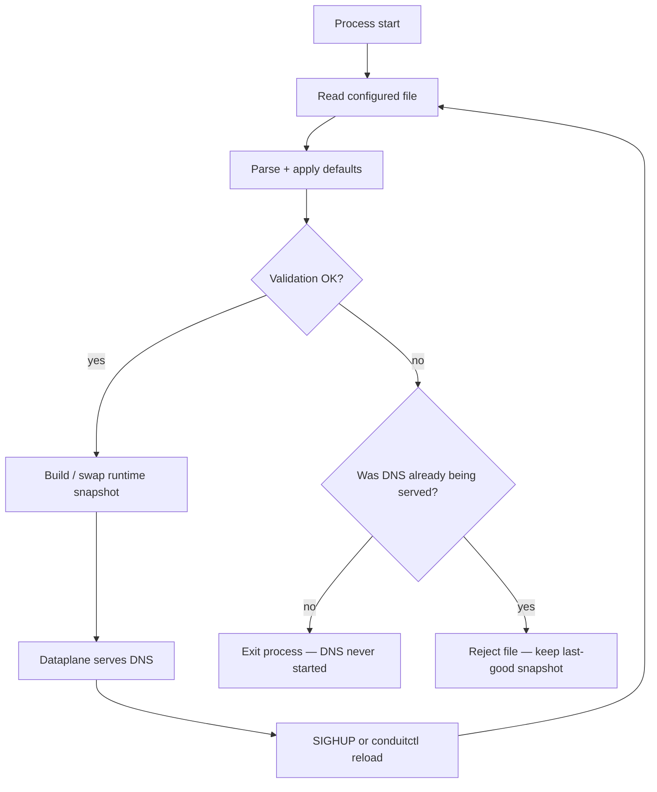

# Config file

This page covers the on-disk YAML **file layer** — format, where Conduit looks for it, how paths resolve, and how load and validation behave at startup and on reload. For overlays, effective config, and snapshots, see [Configuration model](/control-plane/configuration-model.md). For `conduitctl reload`, **SIGHUP**, and export, see [Reload and export](/control-plane/reload-and-export.md).

## Overview

Conduit reads one primary YAML file at process start. That file is the durable [file layer](/glossary/index.md#file-layer) operators edit in git or configuration management. The running process remembers that path for later reloads — **SIGHUP** and `conduitctl reload` always re-read the same file, not an arbitrary path you pass to `conduitctl validate`.



The **same** parse and validation steps run on startup and on reload. If validation fails, Conduit checks whether the [dataplane](/glossary/index.md#dataplane) was **already answering queries**: **no** means startup never succeeded (process exits); **yes** means a reload was rejected and the **[last-good snapshot](/glossary/index.md#last-good-snapshot)** stays active.

## File format

- **Encoding:** UTF-8 text.
- **Syntax:** YAML mapping at the top level.
- **Unknown keys:** Rejected at parse time (`deny_unknown_fields` on the YAML schema). Typos in block names fail before validation runs.
- **`schema_version`:** Required. Must be **`1`** — omitting it fails YAML parsing; any other value fails validation.

### Top-level blocks

Each block maps to a section in the canonical config model. Behavioral detail lives on topic pages; field lists live under [Reference: config schema](/reference/config-schema/index.md).

| Block {: .column-no-wrap } | Role | Learn more |
|-------|------|------------|
| `schema_version` | Config schema version (**`1`**) | This page |
| `listeners` | [Dataplane](/glossary/index.md#dataplane) ingress (client DNS) | [Reference: listeners](/reference/config-schema/listeners.md) |
| `pools` | Upstream [pools](/glossary/index.md#pool) and [backends](/glossary/index.md#backend); optional per-pool `health:` | [Pools and backends](/policy-routing/pools-and-backends.md), [Backend health](/policy-routing/backend-health.md), [Reference: pools](/reference/config-schema/pools.md), [Reference: health](/reference/config-schema/health.md) |
| `forward` | Upstream timeout, egress sources, transport | [Reference: forward](/reference/config-schema/forward.md), [Dual-stack forwarding](/guides/dual-stack-forwarding.md) |
| `orchestrator` | [Retry](/glossary/index.md#retry) and [transaction](/glossary/index.md#transaction) limits | [Reference: orchestrator](/reference/config-schema/orchestrator.md), [Retries and transactions](/policy-routing/retries-and-transactions.md) |
| `rules` | Declarative policy | [Rules and actions](/policy-routing/rules-and-actions.md), [Reference: rules](/reference/config-schema/rules.md) |
| `rhai` | Script sandbox limits (scripts come from `rules`) | [Rhai](/rhai/index.md) |
| `data_sources` | Lookup tables for [Rhai](/rhai/index.md) | [Data sources and lookups](/rhai/data-sources-and-lookups.md) |
| `data_source_limits` | Load-safety caps for `data_sources` tables | [Load-safety limits](/rhai/data-sources-and-lookups.md#load-safety-limits) |
| `events` | Event export queue and sinks | [Event export](/observability/event-export.md), [Reference: events](/reference/config-schema/events.md) |
| `metrics` | Built-in Prometheus / OTEL export | [Metrics](/observability/metrics.md), [Reference: metrics and tracing](/reference/config-schema/metrics-and-tracing.md) |
| `tracing` | Per-query pipeline traces | [Tracing](/observability/tracing.md), [Reference: metrics and tracing](/reference/config-schema/metrics-and-tracing.md) |
| `control` | [Control plane](/glossary/index.md#control-plane) gRPC listen address | [gRPC and conduitctl](/control-plane/grpc-and-conduitctl.md), [Reference: control](/reference/config-schema/control.md) |
| `logging` | Process log level and output | [Logging](/observability/logging.md) |

## Sparse files and defaults

You do not need every block in the file. When a block is **omitted**, Conduit applies built-in defaults during YAML parse — the same values you see after a successful `conduitctl export` on a sparse config. The smallest runnable file needs only **`schema_version`**, **`listeners`**, and **`pools`**; see [Minimal configuration](/getting-started/minimal-configuration.md).

Omitted **`control:`** means no gRPC listener — `conduitctl apply`, `export`, and `reload` against a running server are unavailable until you add `control:` and **restart** the process.

## Path resolution (base directory)

Relative **filesystem** paths in the config resolve against the **directory containing the config file**, not the process working directory. Absolute paths are used as-is. This keeps scripts, data files, TLS material, and dnstap sockets stable when systemd or a chroot changes the process working directory.

**Exception:** the config **file path** you pass when starting `conduit` is resolved relative to the process working directory (or as an absolute path). Use an absolute path inside a chroot or container (for example `/etc/conduit/conduit.yaml`) so reload always re-reads the same location.

| Field | Example |
|-------|---------|
| Rhai script path in rule actions | `type: rhai`, `value: scripts/policy.rhai` |
| `data_sources` `path` (`type: csv` today) | `data/blocklist.csv` |
| `control.tls` | `cert_path`, `key_path`, `client_ca_path` |
| `events.sinks` dnstap destinations | `unix:run/dnstap.sock` (path after `unix:`) |

Example — config at `/etc/conduit/conduit.yaml` and `value: scripts/policy.rhai` loads `/etc/conduit/scripts/policy.rhai`. The same rule applies to `cert_path: tls/server.pem` and `destinations: ["unix:run/dnstap.sock"]`.

Use absolute paths when assets live outside the config directory tree.

## What makes a config runnable

Beyond parsing and validation, a config must be **operationally** sufficient:

| Requirement | Why |
|-------------|-----|
| At least one listener under `listeners.listeners` | Clients need an address to send DNS queries |
| At least one [pool](/glossary/index.md#pool) with at least one [backend](/glossary/index.md#backend) | [Route](/concepts/architecture-and-packet-path.md#route) must forward somewhere |
| Unique pool `name` values | Duplicate names fail validation |
| Non-empty backend `address` values | Parsed as `ip:port` upstream destinations |
| Backend `weight` ≥ **1** when set | Omitted `weight` defaults to **100** |

An empty `listeners.listeners` list may pass validation but Conduit will not accept client DNS on any address.

## Validation

**`conduitctl validate`** checks a file **without** a running server:

```bash
conduitctl validate --file conduit.yaml
```

On success it prints `ok` to stdout. On failure it prints each error to stderr and exits non-zero. Use this in CI or before reload — a passing validate is a strong signal that startup or reload will succeed for compile-time dependencies.

### What validation checks

Validation has two stages:

1. **Structural and cross-field** — examples of what fails:

- Unsupported `schema_version`
- `listeners.threads` = **0**, empty listener addresses, duplicate pool names, pools with no backends
- Invalid `forward.sources_v4` / `sources_v6`, unsupported `forward.source_selection`
- [Rule](/policy-routing/rules-and-actions.md) hook/action mismatches (`retry` on request hook, `set_source_v4` without configured sources)
- Invalid `events` sink destinations, duplicate sink identities
- Invalid `control.listen_address`, `metrics` / `tracing` profile and endpoint fields
- Unsupported `rules.match_mode` (only **`first_match`** today)

2. **Runtime snapshot compile** — the same step Conduit runs after YAML validation at startup and on reload:

- Rhai scripts referenced by rules are read, compiled, and checked for metric registration
- [Data sources](/rhai/data-sources-and-lookups.md) (for example CSV lookup tables) are loaded from disk
- Forward and pool-forward settings are compiled

Compile errors use prefixed messages such as `script 'path': …`, `rule 'name': …`, and `data source 'name': …`.

Full rules evolve with the product; [Reference: config schema](/reference/config-schema/index.md) lists fields and constraints per block.

### What validation does not check

`conduitctl validate` does **not** open TLS PEM files, bind listener sockets, or open dnstap socket paths. It does not verify that upstream [backends](/glossary/index.md#backend) are reachable — Conduit only checks address format in YAML.

## Startup vs reload

| Event | Config path | On parse/validate/compile failure | On success |
|-------|-------------|-----------------------------------|------------|
| **Process start** | Path recorded at start | Exit before DNS (YAML or compile error printed to stderr) | Install snapshot, start [dataplane](/glossary/index.md#dataplane) |
| **SIGHUP** (Unix) | Same path re-read from disk | Log error; keep last-good snapshot | New snapshot for later queries; clear [overlay](/glossary/index.md#overlay) |
| **`conduitctl reload`** | Same path on server | RPC error; keep last-good snapshot | Same as SIGHUP |
| **`conduitctl apply --clear`** | Startup path unchanged (not re-read) | RPC error; keep last-good snapshot | Clear [overlay](/glossary/index.md#overlay) only; [file layer](/glossary/index.md#file-layer) stays as last loaded |

Reload does not apply edits you only made locally unless they are saved to the configured file path first. To drop an [overlay](/glossary/index.md#overlay) **without** re-reading disk, use **`conduitctl apply --clear`** — see [Reload and export — clear vs reload](/control-plane/reload-and-export.md#clear-vs-reload).

Some successful reloads still log **pending (restart required)** when `listeners` or `forward` changed — snapshot updates, but listener bind or egress sockets need a process restart. See [Configuration model](/control-plane/configuration-model.md#pending-reconcile-restart-required).

## Example configs in releases

| Location | Contents |
|----------|----------|
| Release tarball | `conduit.minimal.yaml`, `conduit.reference.yaml` |
| Debian package | `/etc/conduit/conduit.yaml` (conffile), examples under `/usr/share/doc/conduit/examples/` |

`conduit.reference.yaml` is a fuller field walkthrough; topic pages and [Reference: config schema](/reference/config-schema/index.md) are the maintained documentation for each block.

## Related topics

- [Configuration model](/control-plane/configuration-model.md) — file layer, overlay, [effective config](/glossary/index.md#effective-config), [runtime snapshot](/glossary/index.md#runtime-snapshot)
- [Minimal configuration](/getting-started/minimal-configuration.md) — smallest runnable YAML
- [Reload and export](/control-plane/reload-and-export.md) — SIGHUP, `reload`, `apply`, `export`
- [gRPC and conduitctl](/control-plane/grpc-and-conduitctl.md) — CLI flags and control-plane RPCs
- [Install and run](/getting-started/install-and-run.md) — packages, systemd, build from source
