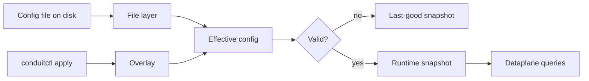
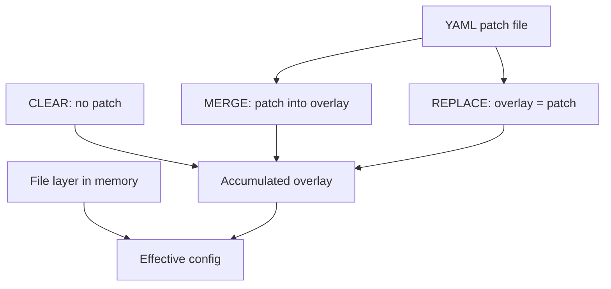

# Configuration model

This page explains how Conduit turns YAML on disk into the settings that answer DNS queries — the [file layer](/glossary/index.md#file-layer), optional [overlay](/glossary/index.md#overlay), [effective config](/glossary/index.md#effective-config), and the compiled [runtime snapshot](/glossary/index.md#runtime-snapshot). For file syntax and validation commands, see [Config file](/control-plane/config-file.md). For reload, export, and `conduitctl` workflows, see [Reload and export](/control-plane/reload-and-export.md).

## Overview

Conduit keeps configuration in **layers**:

| Layer | What it is | How it changes |
|-------|------------|----------------|
| **[File layer](/glossary/index.md#file-layer)** | YAML at the path you pass when starting `conduit` | Edit on disk; reload with **SIGHUP** (Unix) or `conduitctl reload` |
| **[Overlay](/glossary/index.md#overlay)** | In-memory patch applied through the [control plane](/glossary/index.md#control-plane) | `conduitctl apply` (default **merge** into accumulated overlay), or typed config primitives that synthesize a replace overlay |
| **[Effective config](/glossary/index.md#effective-config)** | File layer merged with overlay (if any), then validated | Result of merge + validation before compile |
| **[Runtime snapshot](/glossary/index.md#runtime-snapshot)** | Compiled configuration bundle the [dataplane](/glossary/index.md#dataplane) uses (rules, scripts, forward tables, observability filters) | Built from effective config on each successful apply or reload |



At process start, Conduit reads the **file layer** from your startup path, applies built-in defaults for omitted sections, validates, and installs the first [runtime snapshot](/glossary/index.md#runtime-snapshot). Later changes go through the same validate → compile → swap path. Queries already in flight keep the snapshot they started with; new queries use the updated snapshot. If validation fails, Conduit keeps the **[last-good snapshot](/glossary/index.md#last-good-snapshot)** and DNS keeps flowing.

## File layer

The **file layer** is the YAML file you pass as the first argument to `conduit` (for example `conduit conduit.yaml`). It is the durable baseline operators edit in version control or configuration management.

- **`schema_version`** is required. The only accepted value is **`1`**.
- You can author a **sparse** file — Conduit supplies defaults for omitted top-level blocks at load time. The smallest runnable file needs only `schema_version`, `listeners`, and `pools`; see [Minimal configuration](/getting-started/minimal-configuration.md).
- Blocks such as **`rules:`** and **`tracing:`** live only in the file layer today. Changing them requires a **file reload**, not an API overlay. **`metrics:`** may be changed via overlay ([deep merge](/control-plane/overlay-merge-strategy.md#metrics-deep-merge)).

Validate a file without a running server:

```bash
conduitctl validate --file conduit.yaml
```

Field-level reference: [Reference: config schema](/reference/config-schema/index.md).

## Defaults at load

When a top-level block is **omitted**, Conduit fills in safe defaults during YAML parse — the same values you would get after [export](/glossary/index.md#export) of a running process with defaults applied. Examples:

| Omitted block | Effective default (current release) |
|---------------|-------------------------------------|
| `forward` | Timeout **2000** ms, **100** outstanding queries per [backend](/glossary/index.md#backend) |
| `orchestrator` | **3** max attempts, **5000** ms max [transaction](/glossary/index.md#transaction) duration |
| `control` | **No** [control plane](/glossary/index.md#control-plane) — add a `control:` block with `listen_address` to enable `conduitctl` |
| `metrics` | Built-in export **off** |

A sparse on-disk file and a fully exported file can behave the same at runtime. Use `conduitctl export` (when the control plane is enabled) to see the **effective** YAML after defaults — details in [Reload and export](/control-plane/reload-and-export.md).

## Overlay

An **[overlay](/glossary/index.md#overlay)** is an accumulated in-memory config patch held after one or more **`conduitctl apply`** calls (or after typed [config primitives](/control-plane/grpc-and-conduitctl.md#document-apply-vs-typed-primitives) that synthesize a full overlay replacement). It does not rewrite your on-disk [file layer](/glossary/index.md#file-layer). Overlays are useful for short-lived or automated tweaks — for example shifting [backend](/glossary/index.md#backend) weights during an upstream maintenance window.

Each successful apply updates the overlay according to an **apply mode**, then rebuilds **[effective config](/glossary/index.md#effective-config)** as **file layer + overlay**. Flags, examples, and export workflows: [Reload and export — apply modes](/control-plane/reload-and-export.md#apply-modes).

Overlays require a running [control plane](/glossary/index.md#control-plane) (`control.listen_address` in config). **`conduitctl apply` is unavailable** when the `control:` block is omitted.

### Apply modes

| Mode | CLI | Effect on overlay |
|------|-----|-------------------|
| **Merge** (default) | `conduitctl apply --file patch.yaml` (or `--merge`) | Merge the patch **into** the current overlay using the same section rules as [file + overlay merge](#how-file-and-overlay-merge) below |
| **Replace** | `--replace` | Replace the entire overlay with the patch; a patch containing only **`schema_version`** **clears** the overlay |
| **Clear** | `--clear` (no `--file`) | Drop the overlay; **do not** re-read the config file from disk |

**SIGHUP** and **`conduitctl reload`** are unchanged: they re-read the startup file path and **clear** the overlay ([reload from disk](/glossary/index.md#reload-from-disk)).

**Clear vs reload:** **`conduitctl apply --clear`** ([clear overlay without reload](/glossary/index.md#clear-overlay-without-reload)) drops the overlay but keeps the in-memory [file layer](/glossary/index.md#file-layer) from the last successful load — use this when you want to revert API tweaks without picking up disk edits. **Reload** re-reads the file from disk **and** clears the overlay — use this when configuration management has updated the on-disk YAML.

Before **clear** or **reload** when an overlay is active, **[export](/glossary/index.md#export)** if you need a record of the running [effective config](/glossary/index.md#effective-config). See [Reload and export — export before clear or reload](/control-plane/reload-and-export.md#export-before-clear-or-reload).



### How file and overlay merge

Merge rules (current release):

| Topic | Behavior |
|-------|----------|
| **`schema_version`** | Overlay value wins when present |
| **`listeners`**, **`forward`**, **`orchestrator`**, **`events`**, **`rhai`**, **`control`**, **`logging`** | If the overlay includes the section, it **replaces** the file-layer section entirely |
| **`data_sources`** | Non-empty overlay list replaces the file-layer list |
| **`pools`** | Match pools by `name`. Within a pool, match a [backend](/glossary/index.md#backend) by `name` when the overlay entry sets one, otherwise by `address`; matched fields are updated. A new pool — or an address-matched backend not already in the pool — is **appended**; an overlay backend whose `name` is not found in the pool is **rejected** (the apply fails). See [Targeting a backend by name or address](#targeting-a-backend-by-name-or-address). Unset `weight` in the overlay does **not** clear a file-layer weight. Opt-in **`remove: true`** deletes a matched pool or backend — see [Remove marker](#remove-marker) |
| **`metrics`** | **Deep merge** — nested maps by key; `categories.include` / `exclude` list-replace when present; `user_metrics` match-by-name. See [Overlay merge strategy](/control-plane/overlay-merge-strategy.md) |
| **`rules`**, **`tracing`** | **File layer only** — not allowed in overlay patches; apply is rejected if the patch includes these keys |

Example — shift weight on one backend without editing the main file (full merge/replace/clear walkthrough with sparse patches: [Reload and export — worked example](/control-plane/reload-and-export.md#worked-example-pool-weights)):

```yaml
schema_version: 1
pools:
  - name: default
    backends:
      - address: "127.0.0.1:5300"
        weight: 10
```

Save as `overlay.yaml`, then `conduitctl apply --file overlay.yaml` (default **merge**). The file-layer pool definition stays on disk; the effective weight becomes **10** until you [clear](/glossary/index.md#clear-overlay-without-reload) or [reload from disk](/glossary/index.md#reload-from-disk).

A second apply with another weight patch **merges** into the same overlay — for example maintenance weight **10**, then restore one backend to **100** without touching the file. To discard all overlay state at once, use **`conduitctl apply --clear`**, **`conduitctl apply --replace --file empty.yaml`** where `empty.yaml` contains only `schema_version: 1`, or **reload** / **SIGHUP**.

### Targeting a backend by name or address

Within a matched [pool](/glossary/index.md#pool), how Conduit finds the [backend](/glossary/index.md#backend) to patch depends on whether the overlay entry carries a `name`:

| Overlay backend entry | Matched against | When not found |
|-----------------------|-----------------|----------------|
| Has a non-empty **`name`** | The backend with the same `name` in that pool — the `(pool, name)` key | Apply is **rejected** (`overlay pool '…' references unknown backend name '…'`) |
| Has only an **`address`** | The backend with the same `address` in that pool | **Appended** as a new backend in the pool |

Match by **`name`** to patch a backend you have given a [name](/reference/config-schema/pools.md#backend-object): the patch keeps working even when the upstream `address` changes, and a name-keyed entry can itself update the `address` (for example to repoint a resolver) without adding a second backend. Because an unknown `name` is **rejected rather than appended**, a typo fails the apply instead of silently creating an extra upstream — and the previous overlay is left untouched.

Match by **`address`** (the default when the overlay entry has no `name`) updates a backend already present at that address; an address that is not present is **appended** as a new backend.

### Remove marker { #remove-marker }

Sparse pool/backend merge **does not** delete members unless you opt in. Set **`remove: true`** on an overlay pool ( **`name` required**) or backend entry (`name` preferred when set, otherwise `address`). Unknown remove targets **fail** the apply and leave the previous overlay/snapshot unchanged. Effective **`export`** never emits `remove` markers.

Example — remove backend `secondary` from pool `edge` without a typed Delete RPC:

```yaml
schema_version: 1
pools:
  - name: edge
    backends:
      - name: secondary
        remove: true
```

```bash
conduitctl apply --file remove-secondary.yaml
```

Typed equivalent: **`conduitctl backend remove --pool edge --backend secondary`**.

Example — repoint and reweight the backend named `resolver-a` without editing the file, matching by `(pool, name)`:

```yaml
schema_version: 1
pools:
  - name: default
    backends:
      - name: resolver-a
        address: "10.0.0.5:53"   # moved from 10.0.0.1:53
        weight: 50
```

`conduitctl apply --file overlay.yaml` updates the backend identified by `(default, resolver-a)` in place: the `backend` [metric](/observability/metrics.md) label stays `resolver-a` ([Backend names](/policy-routing/pools-and-backends.md#backend-names)) while the effective address and weight change until you [clear](/glossary/index.md#clear-overlay-without-reload) or [reload from disk](/glossary/index.md#reload-from-disk). An overlay entry that names a backend the pool does not define (for example `name: resolver-z`) fails the apply, leaving the running [effective config](/glossary/index.md#effective-config) and the accumulated overlay unchanged.

## Runtime snapshot

The **[runtime snapshot](/glossary/index.md#runtime-snapshot)** is the configuration bundle the [dataplane](/glossary/index.md#dataplane) actually uses: validated [effective config](/glossary/index.md#effective-config) plus compiled artifacts — [rules](/policy-routing/rules-and-actions.md), [Rhai](/rhai/index.md) scripts, event sinks, forward source tables, and observability filters. All listener workers share one snapshot until the next successful reload or apply.

**[Backend health](/policy-routing/backend-health.md)** probe **configuration** (`pools[].health` and per-backend probe overrides) is part of the snapshot and hot-reloads with it. Health **runtime state** — observed/applied liveness, freeze/drain scope, and probe counters — lives **outside** the snapshot. On reload or overlay apply, Conduit **preserves** that state for backends whose identity and probe semantics are unchanged, and **resets** it when a backend is new, its address changes, or probe semantics change. Operator [freeze](/glossary/index.md#freeze)/[drain](/glossary/index.md#drain) therefore survives a normal reload. Details: [Backend health — Reload and health state](/policy-routing/backend-health.md#reload-and-health-state).

Each successful swap bumps a **generation** counter exposed as [`conduit_config_generation`](/observability/built-in-metrics.md#conduit_config_generation). [Transactions](/glossary/index.md#transaction) record the generation they started under (`snapshot_generation` internally) so you can correlate behavior with config changes.

If validation or compile fails (invalid YAML, bad script path, duplicate sink identity, and similar), the swap is rejected and the previous snapshot stays active.

## What takes effect when

Not every config change is immediately visible on the wire even after a successful snapshot swap.

### Hot for new queries (no restart)

These updates apply to **later** queries as soon as the new snapshot is installed:

- [Pools](/policy-routing/pools-and-backends.md) and [backend](/glossary/index.md#backend) weights (including via overlay)
- [Backend health](/policy-routing/backend-health.md) probe configuration (`pools[].health` and per-backend probe overrides); health **runtime** state is preserved separately (see [Runtime snapshot](#runtime-snapshot))
- [Rules](/policy-routing/rules-and-actions.md) and [Rhai](/rhai/index.md) scripts (file reload)
- `orchestrator` limits, `events` sinks, `data_sources` tables
- **Metrics plan** (base, categories, collect/emit, granularity, user metrics, event_export) via file reload or overlay; Prometheus listen **rebind** and OTLP **reconnect** when those export settings change ([Metrics configurability](/observability/metrics-configurability.md))

In-flight [transactions](/glossary/index.md#transaction) still finish on the snapshot they began with.

**`tracing:`** is validated and stored in the new snapshot; pipeline-trace behavior follows the tracing docs. Export listener details for metrics: [Metrics](/observability/metrics.md).

### Pending reconcile (restart required)

Some sections affect OS sockets Conduit opened at process start. When **`listeners`** or **`forward`** changes between the old and new effective config, Conduit still updates the snapshot (so export and validation reflect the new intent) but logs **pending (restart required)** — listener bind addresses, worker counts, and forward egress sockets are **not** rebound until you restart the `conduit` process.

When **`caches[].memory.shard_count`** changes for an existing instance name, Conduit logs **`cache memory.shard_count: pending (restart required)`** — the snapshot updates but the live shard layout is unchanged until restart. Cache fields such as **`max_entries`**, LMDB **`when_full`** / **`sample_size`** / **`sync`** / **`sync_interval`**, LMDB **`map_size` increases**, LMDB **`path`** warm reopen, and an explicit LMDB **`shard_count`** change (warm reopen; empties the store) take effect on the running cache immediately when **apply** or **reload** succeeds (no restart) — see [Reference: caches — Reload and apply](/reference/config-schema/caches.md#reload-and-apply).

Changing or adding the **`control:`** block also requires a **process restart** today to start or rebind the gRPC listener.

See [Pending reconcile](/glossary/index.md#pending-reconcile) and [Reload and export](/control-plane/reload-and-export.md) for operator workflows and log lines.

## Changing configuration

| Mechanism | Needs control plane? | Clears overlay? | Re-reads startup file? | Typical use |
|-----------|----------------------|-----------------|------------------------|-------------|
| **Edit file + restart** | No | Yes (fresh start) | Yes (at start) | First deploy, `control:` or `listeners` changes |
| **SIGHUP** (Unix) | No | Yes | Yes | Automate file reload from config management |
| **`conduitctl reload`** | Yes | Yes | Yes | Same as SIGHUP when gRPC is enabled |
| **`conduitctl apply`** (default merge) | Yes | No | No | Temporary pool or section overrides; successive applies accumulate |
| **`conduitctl apply --replace`** | Yes | Yes when patch is empty (`schema_version` only) | No | Replace entire overlay; empty patch clears it |
| **`conduitctl apply --clear`** | Yes | Yes | No | Drop overlay; keep in-memory file layer |

**SIGHUP** and **`conduitctl reload`** re-read the startup file path, merge validation, and install a new snapshot. They do not read arbitrary paths — only the file Conduit was started with.

Commands and RPC details: [gRPC and conduitctl](/control-plane/grpc-and-conduitctl.md), [Reference: gRPC and CLI](/reference/grpc-and-cli.md), [Reload and export](/control-plane/reload-and-export.md).

## Related topics

- [Architecture and packet path](/concepts/architecture-and-packet-path.md) — how the snapshot feeds the query [pipeline phases](/concepts/architecture-and-packet-path.md#pipeline-phases)
- [Config file](/control-plane/config-file.md) — format, paths, and validation
- [Reload and export](/control-plane/reload-and-export.md) — SIGHUP, `conduitctl reload` / `apply` / `export`
- [Backend health](/policy-routing/backend-health.md) — probe config in the snapshot; runtime health state preserved across reload
- [Rules and actions](/policy-routing/rules-and-actions.md) — when rule changes enter the snapshot
- [Glossary](/glossary/index.md) — [overlay](/glossary/index.md#overlay), [clear overlay without reload](/glossary/index.md#clear-overlay-without-reload), [effective config](/glossary/index.md#effective-config), [last-good snapshot](/glossary/index.md#last-good-snapshot)
