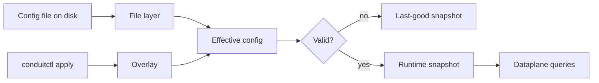

# Configuration model

This page explains how Conduit turns YAML on disk into the settings that answer DNS queries — the [file layer](/glossary/index.md#file-layer), optional [overlay](/glossary/index.md#overlay), [effective config](/glossary/index.md#effective-config), and the compiled [runtime snapshot](/glossary/index.md#runtime-snapshot). For file syntax and validation commands, see [Config file](/control-plane/config-file.md). For reload, export, and `conduitctl` workflows, see [Reload and export](/control-plane/reload-and-export.md).

## Overview

Conduit keeps configuration in **layers**:

| Layer | What it is | How it changes |
|-------|------------|----------------|
| **[File layer](/glossary/index.md#file-layer)** | YAML at the path you pass when starting `conduit` | Edit on disk; reload with **SIGHUP** (Unix) or `conduitctl reload` |
| **[Overlay](/glossary/index.md#overlay)** | In-memory patch applied through the [control plane](/glossary/index.md#control-plane) | `conduitctl apply` with a partial YAML file |
| **[Effective config](/glossary/index.md#effective-config)** | File layer merged with overlay (if any), then validated | Result of merge + validation before compile |
| **[Runtime snapshot](/glossary/index.md#runtime-snapshot)** | Compiled bundle the [dataplane](/glossary/index.md#dataplane) uses (rules, scripts, forward tables, observability filters) | Built from effective config on each successful apply or reload |



At process start, Conduit reads the **file layer** from your startup path, applies built-in defaults for omitted sections, validates, and installs the first [runtime snapshot](/glossary/index.md#runtime-snapshot). Later changes go through the same validate → compile → swap path. Queries already in flight keep the snapshot they started with; new queries use the updated snapshot. If validation fails, Conduit keeps the **[last-good snapshot](/glossary/index.md#last-good-snapshot)** and DNS keeps flowing.

## File layer

The **file layer** is the YAML file you pass as the first argument to `conduit` (for example `conduit conduit.yaml`). It is the durable baseline operators edit in version control or configuration management.

- **`schema_version`** is required. The only supported value today is **`1`**.
- You can author a **sparse** file — Conduit supplies defaults for omitted top-level blocks at load time. The smallest runnable file needs only `schema_version`, `listeners`, and `pools`; see [Minimal configuration](/getting-started/minimal-configuration.md).
- Blocks such as **`rules:`**, **`metrics:`**, and **`tracing:`** live only in the file layer today. Changing them requires a **file reload**, not an API overlay.

Validate a file without a running server:

```bash
conduitctl validate --file conduit.yaml
```

Field-level reference: [Reference: config schema](/reference/config-schema/index.md).

## Defaults at load

When a top-level block is **omitted**, Conduit fills in safe defaults during YAML parse — the same values you would get after [export](/glossary/index.md#export) of a running process with defaults applied. Examples:

| Omitted block | Effective default (current release) |
|---------------|-------------------------------------|
| `forward` | Timeout **2000** ms, **100** outstanding queries per [backend](/glossary/index.md#backend) |
| `orchestrator` | **3** max attempts, **5000** ms max [transaction](/glossary/index.md#transaction) duration |
| `control` | **No** [control plane](/glossary/index.md#control-plane) — add a `control:` block with `listen_address` to enable `conduitctl` |
| `metrics` | Built-in export **off** |

A sparse on-disk file and a fully exported file can behave the same at runtime. Use `conduitctl export` (when the control plane is enabled) to see the **effective** YAML after defaults — details in [Reload and export](/control-plane/reload-and-export.md).

## Overlay

An **overlay** is a partial config patch held in memory after **`conduitctl apply`**. It does not rewrite your on-disk file. Overlays are useful for short-lived or automated tweaks — for example shifting [backend](/glossary/index.md#backend) weights during an upstream maintenance window.

Applying an overlay **replaces** the entire previous overlay (not a deep merge of successive applies). To drop the overlay without editing the file, use **`conduitctl reload`** or **SIGHUP** — both reload the file layer and **clear** the overlay ([file-wins reload](/glossary/index.md#file-wins-reload)).

Overlays require a running [control plane](/glossary/index.md#control-plane) (`control.listen_address` in config). **`conduitctl apply` is unavailable** when the `control:` block is omitted.

### How file and overlay merge

Merge rules (current release):

| Topic | Behavior |
|-------|----------|
| **`schema_version`** | Overlay value wins when present |
| **`listeners`**, **`forward`**, **`orchestrator`**, **`events`**, **`rhai`**, **`control`**, **`logging`** | If the overlay includes the section, it **replaces** the file-layer section entirely |
| **`data_sources`** | Non-empty overlay list replaces the file-layer list |
| **`pools`** | Match pools by `name`; within a pool, match [backends](/glossary/index.md#backend) by `address` and update fields. New pools or backends in the overlay are **appended**. Unset `weight` in the overlay does **not** clear a file-layer weight |
| **`rules`**, **`metrics`**, **`tracing`** | **File layer only** — not patchable via overlay |

Example — shift weight on one backend without editing the main file:

```yaml
schema_version: 1
pools:
  - name: default
    backends:
      - address: "127.0.0.1:5300"
        weight: 10
```

Save as `overlay.yaml`, then `conduitctl apply --file overlay.yaml`. The file-layer pool definition stays on disk; the effective weight becomes **10** until reload clears the overlay.

## Runtime snapshot

The **[runtime snapshot](/glossary/index.md#runtime-snapshot)** is what the [dataplane](/glossary/index.md#dataplane) actually uses: validated effective config plus compiled artifacts — [rules](/policy-routing/rules-and-actions.md), [Rhai](/rhai/index.md) scripts, event sinks, forward source tables, and observability filters. All listener workers share one snapshot until the next successful reload or apply.

Each successful swap bumps a **generation** counter exposed as [`conduit_config_generation`](/observability/built-in-metrics.md#conduit_config_generation). [Transactions](/glossary/index.md#transaction) record the generation they started under (`snapshot_generation` internally) so you can correlate behavior with config changes.

If validation or compile fails (invalid YAML, bad script path, duplicate sink identity, and similar), the swap is rejected and the previous snapshot stays active.

## What takes effect when

Not every config change is immediately visible on the wire even after a successful snapshot swap.

### Hot for new queries (no restart)

These updates apply to **later** queries as soon as the new snapshot is installed:

- [Pools](/policy-routing/pools-and-backends.md) and [backend](/glossary/index.md#backend) weights (including via overlay)
- [Rules](/policy-routing/rules-and-actions.md) and [Rhai](/rhai/index.md) scripts (file reload)
- `orchestrator` limits, `events` sinks, `data_sources` tables

In-flight [transactions](/glossary/index.md#transaction) still finish on the snapshot they began with.

**`metrics:`** and **`tracing:`** blocks are validated and stored in the new snapshot, but Prometheus scrape and OTEL push listeners are started from the config present at **process start** today. Enabling export, changing scrape addresses, or turning built-in recording on after startup requires a **process restart**. See [Metrics](/observability/metrics.md).

### Pending reconcile (restart required)

Some sections affect OS sockets Conduit opened at process start. When **`listeners`** or **`forward`** changes between the old and new effective config, Conduit still updates the snapshot (so export and validation reflect the new intent) but logs **pending (restart required)** — listener bind addresses, worker counts, and forward egress sockets are **not** rebound until you restart the `conduit` process.

Changing or adding the **`control:`** block also requires a **process restart** today to start or rebind the gRPC listener.

See [Pending reconcile](/glossary/index.md#pending-reconcile) and [Reload and export](/control-plane/reload-and-export.md) for operator workflows and log lines.

## Changing configuration

| Mechanism | Needs control plane? | Clears overlay? | Typical use |
|-----------|----------------------|-----------------|-------------|
| **Edit file + restart** | No | Yes (fresh start) | First deploy, `control:` or `listeners` changes |
| **SIGHUP** (Unix) | No | Yes | Automate file reload from config management |
| **`conduitctl reload`** | Yes | Yes | Same as SIGHUP when gRPC is enabled |
| **`conduitctl apply`** | Yes | No (replaces overlay) | Temporary pool or section overrides |

**SIGHUP** and **`conduitctl reload`** re-read the startup file path, merge validation, and install a new snapshot. They do not read arbitrary paths — only the file Conduit was started with.

Commands and RPC details: [gRPC and conduitctl](/control-plane/grpc-and-conduitctl.md), [Reload and export](/control-plane/reload-and-export.md).

## Related topics

- [Architecture and packet path](/concepts/architecture-and-packet-path.md) — how the snapshot feeds the query [pipeline phases](/concepts/architecture-and-packet-path.md#pipeline-phases)
- [Config file](/control-plane/config-file.md) — format, paths, and validation
- [Reload and export](/control-plane/reload-and-export.md) — SIGHUP, `conduitctl reload` / `apply` / `export`
- [Rules and actions](/policy-routing/rules-and-actions.md) — when rule changes enter the snapshot
- [Glossary](/glossary/index.md) — [overlay](/glossary/index.md#overlay), [effective config](/glossary/index.md#effective-config), [last-good snapshot](/glossary/index.md#last-good-snapshot)
