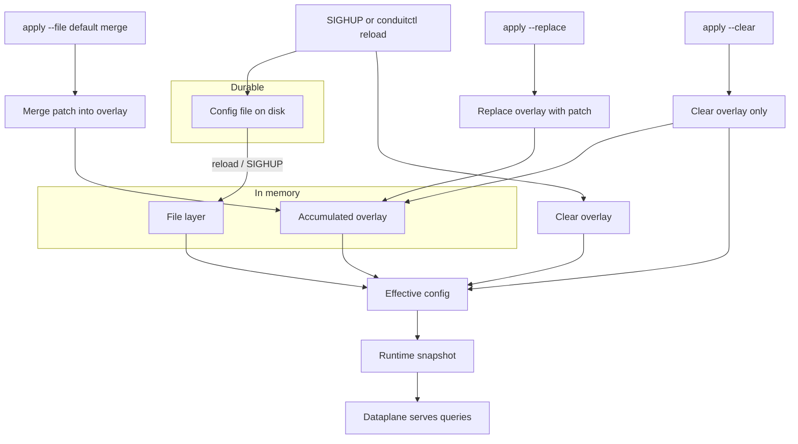

# Reload and export

This page covers **operator workflows** for changing a running Conduit: reload the [file layer](/glossary/index.md#file-layer) from disk, apply a temporary [overlay](/glossary/index.md#overlay), and [export](/glossary/index.md#export) the [effective config](/glossary/index.md#effective-config). For how layers merge and what a [runtime snapshot](/glossary/index.md#runtime-snapshot) contains, see [Configuration model](/control-plane/configuration-model.md). For YAML format, paths, and startup validation, see [Config file](/control-plane/config-file.md). For `conduitctl` flags, gRPC endpoints, and TLS, see [gRPC and conduitctl](/control-plane/grpc-and-conduitctl.md).

## Overview

Conduit separates **durable config on disk** from **in-memory tweaks**:

| Mechanism | Needs [control plane](/glossary/index.md#control-plane)? | Clears overlay? | Re-reads startup file? |
|-----------|----------------------------|-----------------|------------------------|
| **Edit file + restart** | No | Yes (fresh process) | Yes (at start) |
| **SIGHUP** (Unix) | No | Yes | Yes |
| **`conduitctl reload`** | Yes | Yes | Yes |
| **`conduitctl apply`** (default **merge**) | Yes | No | No |
| **`conduitctl apply --replace`** | Yes | Yes when patch is empty (`schema_version` only) | No |
| **`conduitctl apply --clear`** | Yes | Yes | No |
| **`conduitctl export`** | Yes | No | No (read only) |

**SIGHUP** and **`conduitctl reload`** implement the same **[file-wins reload](/glossary/index.md#file-wins-reload)** semantics: re-read the config path Conduit was started with, **clear any API overlay**, validate, and install a new [runtime snapshot](/glossary/index.md#runtime-snapshot) when successful.



Every successful reload or apply runs **validate → compile → swap**. In-flight [transactions](/glossary/index.md#transaction) finish on the snapshot they started with; new queries use the updated snapshot. On failure, Conduit keeps the **[last-good snapshot](/glossary/index.md#last-good-snapshot)** and continues serving DNS.

## Prerequisites

| Goal | Requirement |
|------|-------------|
| Reload from disk with **SIGHUP** | Unix process; config saved to the **same path** used at startup |
| **`conduitctl reload`**, **`apply`**, **`export`** | Running server with a `control:` block (`listen_address`) from **process start** — adding `control:` via reload does **not** start gRPC today; **restart** the process |
| **`conduitctl validate --file`** | None — works offline; see [Config file](/control-plane/config-file.md#validation) |

Reload and apply do **not** read arbitrary paths you pass to `conduitctl validate --file`. They always use the file path recorded when `conduit` started.

## File-wins reload (SIGHUP and `conduitctl reload`)

Use file-wins reload when configuration management or an editor has updated the on-disk YAML and you want that file to become the sole source of truth again.

**What happens:**

1. Conduit re-reads the startup config path from disk.
2. Any active **overlay is cleared** (weights, pool patches, and other apply-time changes are dropped).
3. The file layer is validated and compiled into a new snapshot.
4. On success, logs include `config applied` with `source=sighup` or `source=file` (for `conduitctl reload`), and [`conduit_config_generation`](/observability/built-in-metrics.md#conduit_config_generation) increments.

**SIGHUP (Unix):**

```bash
kill -HUP <conduit-pid>
```

Configure your init system or config-management hook to send SIGHUP after deploying an updated file (for example after `systemctl reload` copies config into place).

**`conduitctl reload`:**

```bash
conduitctl reload
```

Requires a reachable control plane. Default endpoint: `http://127.0.0.1:5199` (override with `--endpoint` or `CONDUIT_CONTROL`). On success the CLI prints `ok`; on validation failure it exits non-zero with error text.

**Before reload:** save edits to the configured path. **`conduitctl validate --file /path/to/conduit.yaml`** checks structure offline but does not prove Rhai scripts or CSV paths exist — see [Config file — validation](/control-plane/config-file.md#what-validation-does-not-check).

**On failure while DNS is already running:** the bad file is rejected; the [last-good snapshot](/glossary/index.md#last-good-snapshot) stays active. Check process logs for validation errors. **On failure at first startup:** the process exits before serving DNS (see [Config file — startup vs reload](/control-plane/config-file.md#startup-vs-reload)).

## Apply modes

**`conduitctl apply`** updates the in-memory [overlay](/glossary/index.md#overlay). The default mode is **merge**: each patch is combined with the accumulated overlay, then Conduit builds [effective config](/glossary/index.md#effective-config) as **file layer + overlay** and swaps the [runtime snapshot](/glossary/index.md#runtime-snapshot) when validation succeeds.

| Mode | Flags | `--file` | Behavior |
|------|-------|----------|----------|
| **Merge** (default) | (none) or `--merge` | Required | Merge patch into the active overlay (same section rules as [Configuration model — overlay](/control-plane/configuration-model.md#how-file-and-overlay-merge)) |
| **Replace** | `--replace` | Required | Replace the entire overlay with the patch |
| **Clear** | `--clear` | Must omit | Clear the overlay; do **not** re-read the startup file |

**Replace with an empty patch** clears the overlay: a YAML file containing only `schema_version: 1` sets no overlay-eligible fields, so **`conduitctl apply --replace --file empty.yaml`** has the same effect as **`--clear`**.

Flags **`--merge`**, **`--replace`**, and **`--clear`** are mutually exclusive. **`--clear`** conflicts with **`--file`**.

gRPC **`ApplyConfig`** accepts the same modes via **`OverlayApplyMode`** — see [gRPC and conduitctl — ApplyConfig](/control-plane/grpc-and-conduitctl.md#applyconfig-and-overlayapplymode).

### Examples

Default merge (accumulates across successive applies):

```bash
conduitctl apply --file maintenance-weight.yaml
conduitctl apply --file restore-one-backend.yaml   # merges into overlay
```

Replace entire overlay (previous overlay discarded):

```bash
conduitctl apply --replace --file new-overlay.yaml
```

Clear overlay without reading disk (file layer unchanged):

```bash
conduitctl apply --clear
```

Clear via replace with empty patch:

```bash
# empty.yaml contains only: schema_version: 1
conduitctl apply --replace --file empty.yaml
```

Explicit merge (same as default):

```bash
conduitctl apply --merge --file patch.yaml
```

### Clear vs reload

| Action | Re-reads startup file from disk? | Clears overlay? | When to use |
|--------|----------------------------------|-----------------|-------------|
| **`conduitctl apply --clear`** | No | Yes | Revert API tweaks; keep the in-memory [file layer](/glossary/index.md#file-layer) from the last load |
| **`conduitctl apply --replace`** + empty patch | No | Yes | Same as `--clear` when automation already emits a minimal YAML document |
| **SIGHUP** / **`conduitctl reload`** | Yes | Yes | Pick up on-disk edits and drop overlay ([file-wins reload](/glossary/index.md#file-wins-reload)) |

If you edited the config file on disk but have **not** reloaded yet, **`--clear`** returns effective config to the **old** file layer still in memory — not the edited file on disk. Use **reload** when the file on disk is the new source of truth.

## Temporary changes with `conduitctl apply`

**`conduitctl apply`** patches the running server through an [overlay](/glossary/index.md#overlay) — useful for short-lived changes (for example lowering a [backend](/glossary/index.md#backend) weight during maintenance) without editing the file on disk.

```bash
conduitctl apply --file overlay.yaml
```

The file is a **full YAML document** parsed as config; only fields you include participate in merge rules described in [Configuration model — overlay](/control-plane/configuration-model.md#overlay). By default each apply **merges** into the accumulated overlay; use **`--replace`** or **`--clear`** when you need to reset overlay state — see [Apply modes](#apply-modes) above.

**Examples of overlay-friendly changes today:**

- [Pool](/policy-routing/pools-and-backends.md) and backend weights
- Top-level sections such as `forward`, `orchestrator`, `events`, `rhai`, `control`, `logging` (whole-section replace when the section is present)
- `data_sources` list (non-empty overlay list replaces the file list)

**File layer only** (require edit + reload, not overlay): **`rules:`**, **`metrics:`**, **`tracing:`**.

On success the CLI prints `ok`. Logs include `config applied` with `source=grpc` and a **generation** counter. Failed apply leaves the prior snapshot unchanged (including any earlier overlay).

**Drop overlay without reload:** **`conduitctl apply --clear`**, **`conduitctl apply --replace --file`** with a `schema_version`-only patch, or [file-wins reload](#file-wins-reload-sighup-and-conduitctl-reload) when you also need disk edits.

## Export before clear or reload

When an [overlay](/glossary/index.md#overlay) is active, [effective config](/glossary/index.md#effective-config) differs from the on-disk [file layer](/glossary/index.md#file-layer). Before you **clear** the overlay or run a **file-wins reload**, capture the running state if you might need it later:

```bash
conduitctl export --output /tmp/conduit-effective-before-clear.yaml
conduitctl apply --clear
# or: conduitctl reload
```

Use this when:

- You want to **promote** overlay tweaks to disk — export, review the diff, save as your baseline, then reload.
- Automation applied patches and you need an audit trail before reverting.
- You are unsure whether **clear** (file layer unchanged) vs **reload** (re-read disk) is the right next step — export shows what Conduit is actually running.

Export is read-only; it does not change overlay or file state. Normalization rules: [Export effective configuration](#export-effective-configuration) below.

## Export effective configuration

**`conduitctl export`** returns the **[effective config](/glossary/index.md#effective-config)** — file layer merged with the active overlay (if any), with defaults normalized for readability.

```bash
# stdout
conduitctl export

# write to a path
conduitctl export --output /tmp/conduit-effective.yaml
```

Use export to:

- Inspect what the server is **actually running** after applies and defaults.
- Capture overlay changes before a file-wins reload clears them.
- Produce a fuller YAML starting point than a sparse on-disk file (export omits many default sections and default field values).

**Normalization:** export may **omit** fields equal to built-in defaults (for example default backend `weight: 100` or entire default blocks). A sparse export round-trips to the same behavior — see [Configuration model — defaults](/control-plane/configuration-model.md#defaults-at-load). Export reflects **effective** values, not necessarily a byte-for-byte copy of your on-disk file plus overlay.

Export does **not** write back to the startup config path automatically. To persist changes, save export output yourself, review, and deploy through your normal file + reload workflow.

## When changes take effect

Most snapshot updates apply to **new queries** immediately. Exceptions:

| Change | After successful reload/apply | May need process restart |
|--------|------------------------------|---------------------------|
| Pool weights, rules, Rhai, `data_sources`, events sinks | Yes | No |
| **`listeners`** or **`forward`** (bind / egress sockets) | Snapshot updates; log **pending (restart required)** | Yes — restart `conduit` to rebind |
| Add or change **`control:`** | Snapshot may update | Yes — gRPC listener starts at process start only |
| Enable or rebind **`metrics:`** / **`tracing:`** export listeners | Snapshot stores intent | Yes — scrape/push listeners start at process start today |

When `listeners` or `forward` changes between old and new effective config, Conduit logs:

- `listeners: pending (restart required) — snapshot updated, sockets not rebound`
- `forward egress: pending (restart required) — snapshot updated, sockets not rebound`

DNS can keep answering on the **existing** UDP/TCP sockets until you restart. See [Configuration model — pending reconcile](/control-plane/configuration-model.md#pending-reconcile-restart-required).

## Common workflows

### Config management: edit file, reload

1. Edit the startup YAML (version control, Ansible, etc.).
2. **`conduitctl validate --file conduit.yaml`** in CI or before reload (optional but recommended).
3. Deploy the file to the path Conduit uses at startup.
4. **`kill -HUP`** or **`conduitctl reload`**.

Overlay is cleared; effective config matches the new file layer.

### Temporary pool weight, then return to file

1. **`conduitctl apply --file maintenance-overlay.yaml`** (pool weight patch only).
2. Operate during the window; confirm with **`conduitctl export`** if needed.
3. **`conduitctl apply --clear`** to drop the overlay and restore file-layer weights **without** re-reading disk, **or** **`conduitctl reload`** (or SIGHUP) when the on-disk file also changed.

### Export, clear or reload, promote to disk

1. **`conduitctl export --output conduit-effective.yaml`** while overlay is active.
2. Review diff against your repo baseline (export normalization may differ cosmetically from hand-authored YAML).
3. Either **`conduitctl apply --clear`** to revert to the in-memory file layer, or edit the deployed file and **`conduitctl reload`** to pick up disk changes.
4. To persist overlay state: save export output as the new file, deploy, reload, and verify generation / metrics.

### Rule or metrics change

Edit **`rules:`**, **`metrics:`**, or **`tracing:`** on disk — not supported via overlay — then reload or restart as needed for listener/export behavior.

## Logs and verification

After a successful reload or apply, look for:

| Log / signal | Meaning |
|--------------|---------|
| `config applied` with `generation=N` | Snapshot swap succeeded |
| `source=sighup` / `source=file` / `source=grpc` | Reload vs apply |
| `pool: backends changed` (and similar) | Subsystem diff hints |
| [`conduit_config_generation`](/observability/built-in-metrics.md#conduit_config_generation) | Monotonic generation on Prometheus scrape (when enabled) |

Control RPCs are logged at `info` as `control rpc` (method, peer, latency) without request bodies. Details: [gRPC and conduitctl](/control-plane/grpc-and-conduitctl.md).

To confirm effective pool weights or other fields without export, use **`conduitctl export`** or gRPC **`GetConfig`** — see [gRPC and conduitctl](/control-plane/grpc-and-conduitctl.md).

## Related topics

- [Configuration model](/control-plane/configuration-model.md) — merge rules, overlay scope, hot vs restart-required
- [Config file](/control-plane/config-file.md) — format, path resolution, validation limits
- [gRPC and conduitctl](/control-plane/grpc-and-conduitctl.md) — endpoint, API keys, TLS, CLI reference
- [Pools and backends](/policy-routing/pools-and-backends.md) — weights and routing after reload
- [Glossary](/glossary/index.md) — [overlay](/glossary/index.md#overlay), [clear overlay without reload](/glossary/index.md#clear-overlay-without-reload), [export](/glossary/index.md#export), [file-wins reload](/glossary/index.md#file-wins-reload), [pending reconcile](/glossary/index.md#pending-reconcile)
