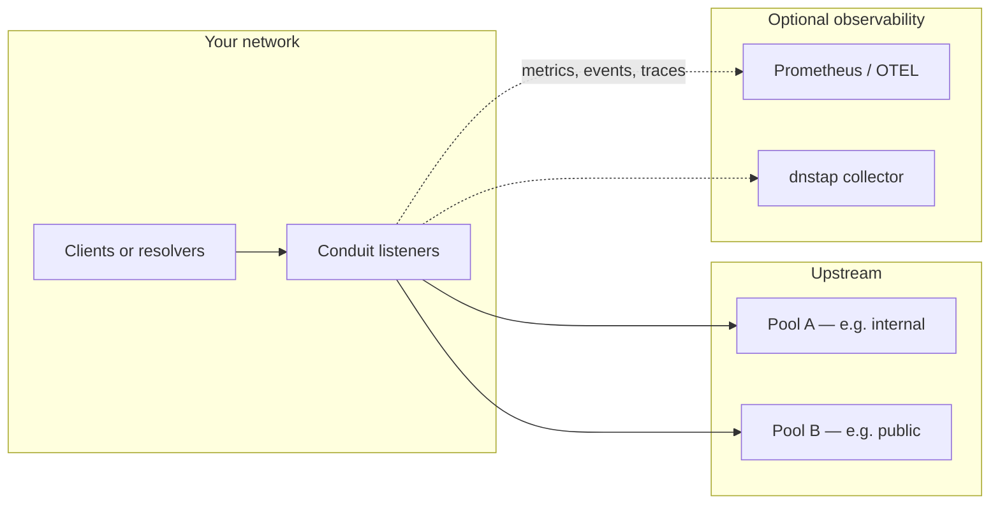

# What Conduit is for

DNS Conduit sits **in the DNS query path** between clients and upstream resolvers. Clients send queries to Conduit’s [listeners](/glossary/index.md#listener); Conduit applies policy, picks an upstream [pool](/glossary/index.md#pool) and [backend](/glossary/index.md#backend), forwards the query, and returns the answer (or a policy-driven outcome). Observation — metrics, logs, traces, and dnstap export — runs **off** the hot path so export backlog does not delay client responses.

Conduit is a **forwarder**, not an authoritative nameserver and not a recursive resolver on its own. You configure upstream destinations in `pools:`; Conduit does not maintain zone data or walk the public DNS tree by itself.

## What you get

| Capability | Where to learn more |
|------------|---------------------|
| UDP/TCP DNS ingress and upstream forwarding | [Architecture and packet path](/concepts/architecture-and-packet-path.md) |
| Declarative policy and optional [Rhai](/rhai/index.md) scripts on request/response hooks | [Policy & routing](/policy-routing/index.md) |
| Pool load balancing, retries, and failover | [Pools and backends](/policy-routing/pools-and-backends.md), [Retries and transactions](/policy-routing/retries-and-transactions.md) |
| Optional per-pool [backend health](/policy-routing/backend-health.md) (active probes and passive fast-trip) | [Backend health](/policy-routing/backend-health.md), [Reference: health](/reference/config-schema/health.md) |
| Optional in-memory [DNS answer cache](/guides/dns-answer-cache.md) on the [Lookup](/concepts/architecture-and-packet-path.md#lookup) spine | [DNS answer cache](/guides/dns-answer-cache.md), [Reference: lookup](/reference/config-schema/lookup.md), [Reference: caches](/reference/config-schema/caches.md) |
| Per-query tags, filters, and export to collectors | [Event export](/observability/event-export.md), [Built-in metrics](/observability/built-in-metrics.md) |
| Hot config reload and optional `conduitctl` overlays | [Control plane](/control-plane/index.md) |

The [dataplane](/glossary/index.md#dataplane) (`conduit` service) always handles DNS. The [control plane](/glossary/index.md#control-plane) (`control:` block, gRPC, **`conduitctl`**) is optional — you can reload from disk with **SIGHUP** without it.

## Typical deployment patterns

Most deployments use one or more of these roles. They are not mutually exclusive on a single instance.

### Edge forwarder

Clients (hosts, containers, or downstream resolvers) use Conduit as their **first hop** for DNS. Conduit listens on well-known or internal addresses and forwards to one or more upstream resolver pools.

**Fit when:** you want a single place to enforce routing (internal vs external resolvers), cap concurrency to upstreams, or bind specific egress addresses on multi-homed hosts. See [Dual-stack forwarding](/guides/dual-stack-forwarding.md) and [Reference: forward](/reference/config-schema/forward.md).

### Policy and routing layer

Conduit evaluates [rules](/policy-routing/rules-and-actions.md) on each query — match on qname, qtype, client subnet, tags, and more — then sets pool, tags, egress source, drop, or retry behavior. [Rhai for rules](/rhai/rule-rhai.md) extends the same hooks when declarative actions are not enough.

**Fit when:** you need pool selection by query name, blocklists, VIP routing, cross-pool failover on **SERVFAIL**, or response-hook retries without changing client resolver configuration.

### Observability hub

Conduit exposes Prometheus scrape and optional OTLP metrics, pipeline [tracing](/observability/tracing.md), structured [logging](/observability/logging.md), and dnstap [event export](/observability/event-export.md) with sink filters (pool, backend, tags, sampling).

**Fit when:** you need visibility into **who queried what**, which pool answered, forward latency, and retry volume — especially when upstream resolvers are shared or opaque. Observation is designed not to block DNS when collectors lag; queues drop under overload rather than stalling clients. See [Observability](/observability/index.md).

### Lab and staging

A minimal file — `schema_version`, `listeners`, and one `pools` entry — is enough to prove forwarding on loopback before you add policy or export. That path is documented in [Minimal configuration](/getting-started/minimal-configuration.md) and [First query](/getting-started/first-query.md).

## What Conduit is not

| Expectation | Reality |
|-------------|---------|
| Authoritative DNS for your zones | Out of scope — configure upstream resolvers in `pools:` |
| A recursive resolver on its own | Conduit forwards to the [backends](/glossary/index.md#backend) you configure |
| Required gRPC or `conduitctl` for every change | Optional — file edit + **SIGHUP** or reload works without `control:` |
| A bundled dashboard or TUI | Operate Conduit via the [config file](/control-plane/config-file.md), **`conduitctl`**, and the [gRPC API](/reference/grpc-and-cli.md); no built-in TUI or web console |

## Where to go next

1. [Install and run](/getting-started/install-and-run.md) — packages, systemd, first start
2. [Minimal configuration](/getting-started/minimal-configuration.md) — smallest runnable YAML
3. [First query](/getting-started/first-query.md) — `dig` through Conduit to an upstream
4. [Architecture and packet path](/concepts/architecture-and-packet-path.md) — how one query moves through the pipeline

## Related topics

- [Getting started](/getting-started/index.md) — ordered path through install and first query
- [Control plane workflows](/guides/control-plane-workflows.md) — reload, apply, export, restart
- [Troubleshooting](/troubleshooting/index.md) — symptom tables when behavior diverges from expectations
