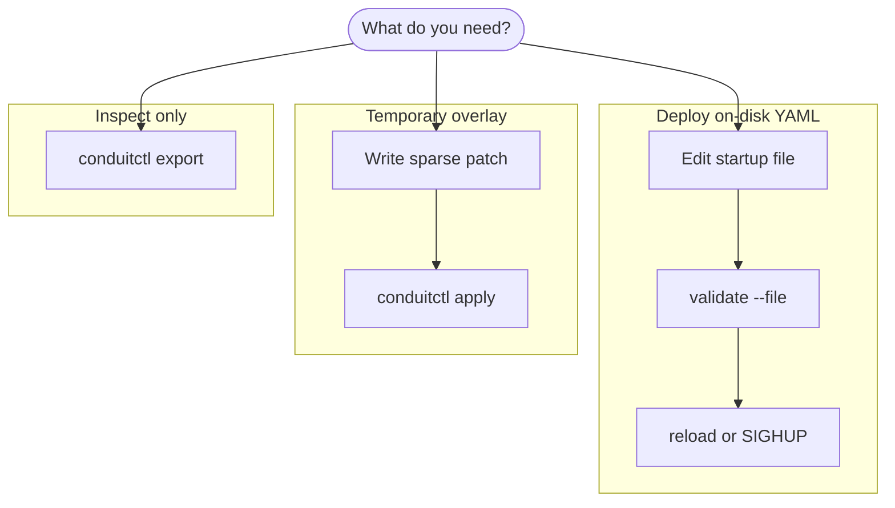
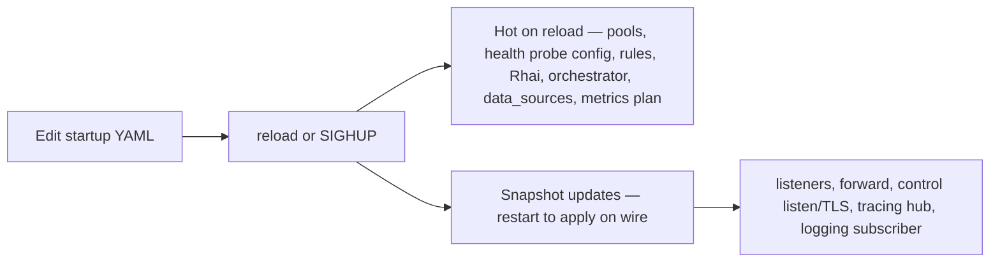

# Control plane workflows

Use these workflows when you need to change a running Conduit: deploy updated YAML, shift traffic with a temporary patch, inspect effective config, or restart after bind or observability changes. Each section lists commands and what to check afterward.

**Prerequisites:** Conduit already serving DNS; **`conduitctl`** on your `PATH`; the process **started** with a `control:` block (for example `listen_address: "127.0.0.1:5199"`). Set **`--endpoint`** or **`CONDUIT_CONTROL`** if the listener is not on the default. Without `control:` at startup, use **SIGHUP** or a process restart only — **`conduitctl`** cannot connect until you add `control:` and **restart** once.

## Choose the right mechanism

### What are you trying to do?



**Reload** and **SIGHUP** clear any active [overlay](/glossary/index.md#overlay) and [reload from disk](/glossary/index.md#reload-from-disk): Conduit re-reads the startup YAML and drops in-memory patches. **`conduitctl apply`** does the opposite — it updates the overlay only and does not rewrite the file on disk; effective config stays "file plus overlay" until you reload or clear.

**Backend maintenance** ([drain](/glossary/index.md#drain), [freeze](/glossary/index.md#freeze), resume) is **not** a config reload or overlay — use **`conduitctl health`**. Health **runtime** state (observed/applied liveness and freeze scope) survives reload when backend identity and probe semantics are unchanged. See [Backend health](/policy-routing/backend-health.md), [gRPC and conduitctl — health](/control-plane/grpc-and-conduitctl.md#health), and [Guide: Backend health](/guides/backend-health.md).

### After a disk edit — reload enough, or restart?

Most sections take effect on **reload** for new queries. A few update the snapshot but need a **process restart** to rebind sockets or export listeners:



The table summarizes commands and overlay behavior. [Workflow 5 — Hot reload vs process restart](#workflow-5-hot-reload-vs-process-restart) lists every section that needs a restart after reload.

| Goal | Use | Clears overlay? | Re-reads startup file? |
|------|-----|-----------------|------------------------|
| Deploy updated YAML from configuration management | **SIGHUP** or **`conduitctl reload`** | Yes | Yes |
| Temporary pool weight or section override | **`conduitctl apply`** (default **merge**) or typed primitives (`backend set-weight`, …) | No | No |
| Drop overlay without picking up new disk edits | **`conduitctl apply --clear`** | Yes | No |
| See effective config (file + overlay) | **`conduitctl export`** | No | No |
| First enable gRPC or change listener bind | Edit file + **restart** | Yes (fresh process) | Yes (at start) |

**Overlay limits:** patches must **not** include **`rules:`** or **`tracing:`** — apply is rejected. **`metrics:`** may be applied (deep merge). Edit **`rules:`** / **`tracing:`** on disk and **reload**. See [Configuration model — overlay](/control-plane/configuration-model.md#overlay).

On validation failure while DNS is already running, Conduit keeps the **[last-good snapshot](/glossary/index.md#last-good-snapshot)** and continues answering queries.

## Workflow 1 — Edit file, validate, reload

Use this when configuration management or version control owns the canonical YAML.

1. Edit the file Conduit was **started with** (for example `/etc/conduit/conduit.yaml`). Reload does not read arbitrary paths — only the startup path recorded at process start.
2. Validate offline (recommended in CI or before reload):

   ```bash
   conduitctl validate --file /etc/conduit/conduit.yaml
   ```

   On success the command prints `ok`. This checks YAML, Rhai compile, and snapshot build — it does **not** load the file into a running server unless you reload that same path.

3. Deploy the file to the host (if not edited in place).
4. Reload:

   ```bash
   conduitctl reload
   ```

   Or on Unix without gRPC: **`kill -HUP <conduit-pid>`** (same semantics — clears overlay, re-reads disk).

5. Verify:
   - CLI prints `ok` (for `conduitctl reload`).
   - Logs show `config applied` with `source=file` or `source=sighup` and a new `generation`.
   - When [metrics](/observability/metrics.md) are enabled, [`conduit_config_generation`](/observability/built-in-metrics.md#conduit_config_generation) increments on scrape.

**What you verified:** [reload from disk](/glossary/index.md#reload-from-disk) replaced the in-memory file layer, cleared any overlay, and installed a new [runtime snapshot](/glossary/index.md#runtime-snapshot) for later queries.

## Workflow 2 — Maintenance window with overlay weights

Use this when the on-disk file should stay unchanged but you want to shift traffic during upstream maintenance. Pool weight changes apply to **new queries** immediately after a successful apply — no restart.

**Baseline file layer** (on disk, unchanged throughout):

```yaml
schema_version: 1
listeners:
  listeners:
    - address: "127.0.0.1:15353"
      protocol: udp
pools:
  - name: default
    backends:
      - address: "10.0.0.1:53"
        weight: 100
      - address: "10.0.0.2:53"
        weight: 100
control:
  listen_address: "127.0.0.1:5199"
```

Start Conduit with that file, then:

**Step 1 — drain primary (merge into overlay):**

`maint-primary.yaml`:

```yaml
schema_version: 1
pools:
  - name: default
    backends:
      - address: "10.0.0.1:53"
        weight: 10
```

```bash
conduitctl apply --file maint-primary.yaml
conduitctl export | grep -A2 'address: "10.0.0.1:53"'
```

Effective weight on **`10.0.0.1:53`** is **10**; **`10.0.0.2:53`** stays **100**.

**Step 2 — end maintenance (clear overlay):**

```bash
conduitctl apply --clear
```

Effective weights return to the file layer (**100** / **100**) without re-reading disk. Alternatively, **`conduitctl reload`** if the on-disk file also changed during the window.

**Optional — shift secondary without editing disk:** apply a second merge patch (see [Reload and export — worked example: pool weights](/control-plane/reload-and-export.md#worked-example-pool-weights)) before you clear.

**What you verified:** overlay merge by backend `address`, **`--clear`** as [clear overlay without reload](/glossary/index.md#clear-overlay-without-reload), and **`export`** as the source of truth for effective weights.

## Workflow 3 — Export before clear or reload

When an overlay is active, **reload** and **`--clear`** both drop overlay state. Export first if you need an audit trail or might promote the running config to disk.

```bash
conduitctl export --output conduit-effective-$(date +%Y%m%d).yaml
conduitctl apply --clear
# or: conduitctl reload   # also clears overlay and re-reads disk
```

Review the export against your repository baseline. Export **normalizes** defaults — it may omit fields equal to built-in defaults even when your hand-authored file lists them explicitly. See [Reload and export — export effective configuration](/control-plane/reload-and-export.md#export-effective-configuration).

## Workflow 4 — Promote overlay to disk

Use this when the running effective config (file + overlay) is the version you want to keep in git.

1. **`conduitctl export --output conduit-promoted.yaml`** while the desired overlay is active.
2. Review and edit the export (paths, comments, sections you want explicit).
3. Replace the deployed startup file with the reviewed YAML.
4. **`conduitctl reload`** (or SIGHUP) so the file layer, overlay state, and disk are aligned — reload **clears** the overlay; effective config should match the new file.
5. Confirm **`conduitctl export`** matches expectations and `generation` incremented.

If you only wanted to revert overlay tweaks, skip promotion — use **Workflow 2** step 2 or **Workflow 3** instead.

## Workflow 5 — Hot reload vs process restart { #workflow-5-hot-reload-vs-process-restart }

After a successful reload or apply, most policy and pool changes affect **later** queries immediately. Some sections update the snapshot but need a **process restart** to take effect on the wire:

| Change | Reload/apply updates snapshot? | Restart needed for wire effect? |
|--------|-------------------------------|----------------------------------|
| Pool weights, rules, Rhai, `data_sources`, `orchestrator` limits, metrics plan / scrape rebind | Yes | No |
| **`listeners`** (bind, `threads`, `reuse_port`) | Yes — logs **pending (restart required)** | Yes |
| **`forward`** (egress sockets, timeout, transport) | Yes — logs **pending (restart required)** | Yes |
| Add or move **`control:`** listener / TLS | Yes | Yes — gRPC starts at process start |
| Enable or rebind **`tracing:`** | Yes | Yes — tracing hub starts at process start |
| **`logging:`** level or output | Yes | Yes — subscriber binds at process start |

Pattern for listener or forward edits:

1. Edit on-disk YAML → **`conduitctl validate --file …`** → **`conduitctl reload`**.
2. Read logs for `pending (restart required)`.
3. **`systemctl restart conduit`** (or your supervisor) in a maintenance window.
4. Confirm bind addresses and **`dataplane startup summary`** in logs.

Details: [Configuration model — What takes effect when](/control-plane/configuration-model.md#what-takes-effect-when), [Observability — Changing observability config](/observability/index.md#changing-observability-config).

## Workflow 6 — Rules or tracing on disk

**`rules:`** and **`tracing:`** are **file-layer only** — not allowed in overlay patches. **`metrics:`** may use overlay or **`conduitctl metrics patch`**.

1. Edit the startup YAML (for example add a rule or change tracing activation).
2. **`conduitctl validate --file …`**
3. **`conduitctl reload`**
4. If you changed **tracing** or **logging**, **restart** the process so hubs and subscribers rebind. Metrics plan and Prometheus/OTLP export settings hot-apply / rebind without process restart when the apply succeeds.

Rule changes enter the snapshot on reload; see [Rules and actions — when changes take effect](/policy-routing/rules-and-actions.md#when-changes-to-rules-take-effect).

## Workflow 7 — Typed config primitives

Use primitives when you want a surgical change without authoring YAML:

```bash
conduitctl backend set-weight --pool default --backend resolver-a --weight 10
conduitctl export | grep -A2 'name: resolver-a'
```

Mix with document apply as needed — both share the Configurator. Prefer primitives for overlay-hot knobs; use file reload for **`rules:`** / **`tracing:`**, and restart for bind topology. Do not use **`health set down`** as a substitute for lowering a config weight.

## Quick verification checklist

| Check | Command or signal |
|-------|-------------------|
| Offline YAML OK | `conduitctl validate --file PATH` → `ok` |
| Mutating RPC OK | `conduitctl reload` / `apply` → `ok`; non-zero exit on failure |
| Generation bumped | Log `config applied` with `generation=N`; metric [`conduit_config_generation`](/observability/built-in-metrics.md#conduit_config_generation) |
| Effective weights or pools | `conduitctl export` |
| Backend health / drain | `conduitctl health show` — [Backend health](/policy-routing/backend-health.md) |
| Restart pending | Log `listeners: pending (restart required)` or `forward egress: pending (restart required)` |

## Related topics

- [Reload and export](/control-plane/reload-and-export.md) — apply modes, full pool-weight example, export normalization
- [Configuration model](/control-plane/configuration-model.md) — file layer, overlay merge, last-good snapshot, health state outside the snapshot
- [gRPC and conduitctl](/control-plane/grpc-and-conduitctl.md) — endpoint, API keys, TLS, **`health`**
- [Guide: Backend health](/guides/backend-health.md) — probes, drain, and resume lab
- [Reference: gRPC and CLI](/reference/grpc-and-cli.md) — RPC and `OverlayApplyMode` for automation
- [Troubleshooting](/troubleshooting/index.md) — observability and config symptom tables
- [Guides](/guides/index.md) — other walkthroughs
