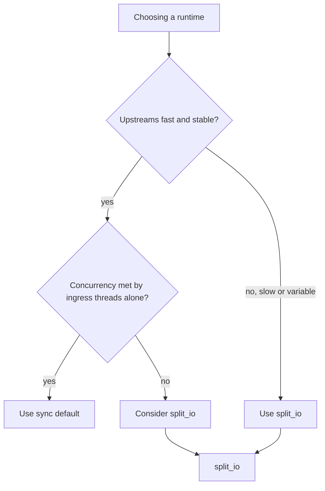

# Dataplane runtime tuning

Practical guidance for choosing a [dataplane runtime model](/concepts/runtime-and-concurrency.md#runtime-models) and sizing its worker pools for production. This guide is task-oriented: when to stay on **`sync`**, when to move to **`split_io`**, how to size ingress/policy/I/O workers and the slot pool, and how to confirm the result with metrics. For *how* each runtime executes a query, see [Runtime and concurrency](/concepts/runtime-and-concurrency.md); for field defaults and validation, see [Reference: dataplane](/reference/config-schema/dataplane.md), [Reference: listeners](/reference/config-schema/listeners.md), and [Reference: forward](/reference/config-schema/forward.md).

!!! note "Every setting on this page needs a restart"
    `dataplane:`, `listeners:`, and `forward:` are **start-time** settings. A [reload](/glossary/index.md#reload-from-disk) or `conduitctl apply` updates the stored [snapshot](/glossary/index.md#runtime-snapshot) so [export](/control-plane/reload-and-export.md) reflects your intent, but the running runtime model, worker counts, sockets, and `max_inflight` do **not** change until you **restart** `conduit`. See [Configuration model — Pending reconcile](/control-plane/configuration-model.md#pending-reconcile-restart-required).

## When to use `sync` vs `split_io`

The deciding factor is **upstream latency under load**. Under [`sync`](/concepts/runtime-and-concurrency.md#sync-runtime-default), each ingress worker runs the whole pipeline on its own thread *including the blocking upstream wait*, so a busy worker cannot accept another client query until its current [transaction](/glossary/index.md#transaction) finishes. Under [`split_io`](/concepts/runtime-and-concurrency.md#split-io-runtime), the upstream wait is **parked** on an I/O worker, so ingress and policy workers keep serving other queries during slow upstreams.



| Choose **`sync`** when… | Choose **`split_io`** when… |
|-------------------------|------------------------------|
| Upstreams are fast and on a low-latency network | Upstreams are remote, variable, or occasionally slow |
| Deployment is small, a lab, or test | You serve production load where ingress must not stall on upstream latency |
| You want the simplest model with the fewest threads | You need many concurrent in-flight upstream waits without one-thread-per-wait cost |

`sync` is the default — omitting the `dataplane:` block runs it. Moving to `split_io` changes no pipeline behavior or policy semantics; it only changes how the wait is scheduled.

## Baseline `split_io` configuration

A production starting point: dedicated ingress threads with `reuse_port` on UDP, a small policy pool, and a single I/O worker.

```yaml
schema_version: 1
dataplane:
  runtime: split_io
  policy_workers: 4      # concurrent policy/Rhai execution
  io_workers: 1          # one I/O worker handles many parked waits
listeners:
  threads: 4             # ingress workers per listener entry
  reuse_port: true       # required on Unix when threads > 1 on UDP
  listeners:
    - address: "0.0.0.0:53"
      protocol: udp
      name: public-udp
    - address: "0.0.0.0:53"
      protocol: tcp
      name: public-tcp
pools:
  - name: default
    backends:
      - address: "10.0.0.1:53"
        name: resolver-a
```

```bash
conduitctl validate --file conduit.yaml
conduit /path/to/conduit.yaml
```

Start from this and adjust one dimension at a time, re-checking metrics (below) after each change.

## Sizing the worker pools

`split_io` has three independent pools. Size them to the resource each one spends time on.

| Pool | Setting | Default | Raise when… |
|------|---------|---------|-------------|
| **Ingress** | [`listeners.threads`](/reference/config-schema/listeners.md#block-fields) (per listener entry) | **1** | Inbound packet rate saturates the accept path; high-volume addresses can use a [per-listener `threads` override](/reference/config-schema/listeners.md#per-listener-overrides-and-inheritance) |
| **Policy** | [`dataplane.policy_workers`](/reference/config-schema/dataplane.md#worker-pools-split_io) | **1** | CPU-bound policy or [Rhai](/rhai/index.md) work is the bottleneck (high `request_rules` / `response_rules` [phase time](/observability/built-in-metrics.md#conduit_phase_duration_seconds)) |
| **I/O** | [`dataplane.io_workers`](/reference/config-schema/dataplane.md#worker-pools-split_io) | **1** | A single I/O worker cannot keep up with upstream socket fan-out at very high concurrency |

Guidelines:

- **Start with `io_workers: 1`.** One I/O worker parks and resumes many concurrent waits via the event loop; it is rarely the first bottleneck. Increase only if I/O is demonstrably saturated.
- **Set `policy_workers` to your available policy CPU budget** (commonly a small multiple of cores, e.g. 2–8), especially with non-trivial Rhai. This pool runs the orchestrator phases and scripts.
- **Use `reuse_port: true` on UDP whenever `listeners.threads` > 1.** On Unix, a second UDP worker binding the same address fails at startup without it. It is ignored for TCP. See [`reuse_port` and `threads`](/reference/config-schema/listeners.md#reuse_port-and-threads).
- **Give busy listeners their own `threads`** with a per-listener override and leave low-traffic listeners on the block default.

## Sizing the slot pool and concurrency caps

Every in-flight query holds one [transaction slot](/concepts/runtime-and-concurrency.md#transaction-slot-pool) for its whole lifetime — including while a `split_io` query is parked waiting upstream. The pool grows in chunks up to a ceiling:

| Setting | Default | Role |
|---------|---------|------|
| [`orchestrator.txn_table_capacity`](/reference/config-schema/orchestrator.md) | **1024** | Hard ceiling on concurrent in-flight transactions. When full, Conduit applies backpressure and increments [`conduit_slot_pool_exhausted_total`](/observability/built-in-metrics.md#conduit_slot_pool_exhausted_total). |
| [`dataplane.slot_chunk_size`](/reference/config-schema/dataplane.md#slot-chunk-size) | **256** | Slots allocated per growth step — trades steady-state memory against allocation frequency. Does not change the ceiling. |
| [`forward.outstanding_per_backend`](/reference/config-schema/forward.md) | **100** | Cap on concurrent upstream queries to a single backend address; excess fails with `table_full`. |
| [`pools[].max_inflight`](/reference/config-schema/pools.md#per-pool-in-flight-limit) | (unset) | Optional per-pool concurrent-forward cap; over the cap returns **SERVFAIL** immediately. Enforced under `split_io` only. |

Size `txn_table_capacity` to roughly **peak query rate × average transaction duration** (including upstream wait), with headroom. With slow upstreams and high concurrency, the default 1024 can be too low — slot exhaustion shows up well before CPU or upstream limits. Raising the ceiling needs a **restart**.

## Socket buffers for high-volume UDP

For high-volume UDP ingress, a larger receive buffer reduces kernel drops during bursts:

```yaml
listeners:
  threads: 4
  reuse_port: true
  rcvbuf: 4194304        # 4 MiB; only applied when > 0
  listeners:
    - address: "10.0.0.5:53"
      protocol: udp
```

`rcvbuf` applies to UDP only and can be overridden per listener. There is no per-listener `sndbuf` today (the block-level `sndbuf` is reserved and not applied). See [Reference: listeners — Block fields](/reference/config-schema/listeners.md#block-fields).

## Verify with metrics

Run the **`full`** [metrics profile](/observability/built-in-metrics.md#profiles) while tuning so the slot gauges and phase histograms are available, and scrape with `curl` (a Prometheus server is not required):

```bash
curl -sS "http://127.0.0.1:9090/metrics" \
  | grep -E '^conduit_(forward_outstanding|slots_in_use|slots_capacity|slot_pool_exhausted_total)'
```

What to look for:

- [`conduit_forward_outstanding`](/observability/built-in-metrics.md#conduit_forward_outstanding) — concurrent upstream waits per backend. Under `split_io`, a sustained high value against a slow upstream is the **expected** concurrency signal (parked waits), not busy-worker backlog.
- [`conduit_slots_in_use`](/observability/built-in-metrics.md#conduit_slots_in_use) vs [`conduit_slots_capacity`](/observability/built-in-metrics.md#conduit_slots_capacity) — slot-pool utilization. Sustained `in_use` near `capacity` precedes exhaustion; raise `orchestrator.txn_table_capacity`.
- [`conduit_slot_pool_exhausted_total`](/observability/built-in-metrics.md#conduit_slot_pool_exhausted_total) — any non-zero rate means the slot pool is the bottleneck (shed queries).
- [`conduit_phase_duration_seconds`](/observability/built-in-metrics.md#conduit_phase_duration_seconds) — high `request_rules` / `response_rules` time points at policy CPU (raise `policy_workers`); high `wait_response` time is upstream latency (a forwarding/upstream problem, not a worker-count one).

Useful PromQL:

```promql
sum(conduit_forward_outstanding) by (pool, backend)
conduit_slots_in_use / conduit_slots_capacity
sum(rate(conduit_slot_pool_exhausted_total[5m]))
histogram_quantile(0.99, sum(rate(conduit_phase_duration_seconds_bucket{phase="wait_response"}[5m])) by (le))
```

## Symptom → knob

| Symptom | Likely cause | Knob (restart) |
|---------|--------------|----------------|
| Ingress stalls during slow upstreams under `sync` | Blocking upstream wait ties up ingress threads | Switch to `dataplane.runtime: split_io` |
| `conduit_slot_pool_exhausted_total` rising | Slot pool ceiling too low for concurrency | Raise `orchestrator.txn_table_capacity` |
| High `request_rules` / `response_rules` phase time | Policy/Rhai CPU-bound | Raise `dataplane.policy_workers` |
| `forward_errors_total{reason="table_full"}` | Per-backend upstream cap hit | Raise `forward.outstanding_per_backend` (or add backends) |
| Startup bind error with `threads > 1` on UDP | Missing `SO_REUSEPORT` | Set `listeners.reuse_port: true` |
| Kernel UDP drops during bursts | Receive buffer too small | Set `listeners.rcvbuf` (UDP) |
| SERVFAIL spikes only on one pool under load | `pools[].max_inflight` cap reached | Raise or remove the pool `max_inflight` |

## Related topics

- [Runtime and concurrency](/concepts/runtime-and-concurrency.md) — runtime models, worker roles, slot pool, drain
- [Reference: dataplane](/reference/config-schema/dataplane.md) — `runtime`, `policy_workers`, `io_workers`, `slot_chunk_size`
- [Reference: listeners](/reference/config-schema/listeners.md) — ingress `threads`, `reuse_port`, `rcvbuf`, per-listener overrides
- [Reference: forward](/reference/config-schema/forward.md) — `timeout_ms`, `outstanding_per_backend`
- [Reference: pools](/reference/config-schema/pools.md#per-pool-in-flight-limit) — `max_inflight`
- [Built-in metrics](/observability/built-in-metrics.md) — slot gauges, `forward_outstanding`, phase histograms
- [Operator metrics profiles](/guides/operator-metrics-profiles.md) — `minimal` vs `full` on the same traffic
