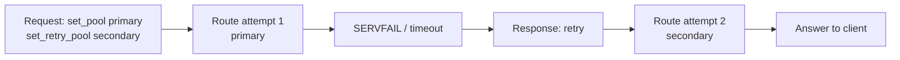

# Declarative failover

When a primary [pool](/glossary/index.md#pool) returns **SERVFAIL** (including many forward timeouts), response rules can [retry](/glossary/index.md#retry) — either another [backend](/glossary/index.md#backend) in the same pool, or a different pool via **`set_retry_pool`**. No [Rhai](/rhai/index.md) is required for that pattern. Mental model and limits: [Retries and transactions](/policy-routing/retries-and-transactions.md).

**Prerequisites:** Conduit installed ([Install and run](/getting-started/install-and-run.md)); a working baseline ([Minimal configuration](/getting-started/minimal-configuration.md)); a live upstream on **`127.0.0.1:5300`**. Leave **`127.0.0.1:5399`** with nothing listening (dead primary).

## What you will verify

1. First attempt uses the primary pool; a stashed **`retry_pool`** is ignored until retry
2. After **SERVFAIL** / timeout, **`retry`** re-enters [Lookup](/concepts/architecture-and-packet-path.md#lookup) on the secondary pool
3. Same-pool **`retry`** (optional) tries another backend without changing pools

## Lab layout

| Role | Address |
|------|---------|
| Conduit DNS | `127.0.0.1:15353` |
| Dead primary | `127.0.0.1:5399` (nothing listening) |
| Live secondary | `127.0.0.1:5300` |
| Prometheus scrape (optional) | `http://127.0.0.1:9090/metrics` |

Short **`forward.timeout_ms`** keeps the failed primary attempt from dominating wall-clock time in the lab.

## Cross-pool failover

Save as `conduit-failover.yaml`:

```yaml
schema_version: 1
listeners:
  listeners:
    - address: "127.0.0.1:15353"
      protocol: udp
forward:
  timeout_ms: 500
orchestrator:
  max_attempts: 3
  max_txn_duration_ms: 5000
pools:
  - name: primary
    backends:
      - address: "127.0.0.1:5399"
        name: dead
  - name: secondary
    backends:
      - address: "127.0.0.1:5300"
        name: live
rules:
  match_mode: first_match
  rules:
    - name: prefer-primary
      hook: request
      selectors: []
      actions:
        - type: set_pool
          value: primary
        - type: set_retry_pool
          value: secondary
    - name: servfail-failover
      hook: response
      selectors:
        - type: rcode
          value: SERVFAIL
      actions:
        - type: retry
metrics:
  enabled: true
  base: minimal
  prometheus:
    listen_address: "127.0.0.1:9090"
```

| Piece | Role |
|-------|------|
| Request **`set_pool: primary`** | First [Route](/concepts/architecture-and-packet-path.md#route) targets the dead backend |
| Request **`set_retry_pool: secondary`** | Stash for the **next** retry Route only — ignored on attempt 0 |
| Response **`rcode: SERVFAIL`** + **`retry`** | After timeout / SERVFAIL, re-enter Lookup; consume the stash |

You can set **`set_retry_pool`** on the response rule instead (with **`retry`**) — same outcome. Request stash is useful when every failing name should fail over the same way.



Validate and start:

```bash
conduitctl validate --file conduit-failover.yaml
conduit conduit-failover.yaml
```

Send a query (allow ~1 s for the primary timeout plus secondary forward):

```bash
dig @127.0.0.1 -p 15353 +time=3 +tries=1 example.com A
```

**Expect:** a successful answer from the live secondary after a brief delay (primary timed out first).

Optional scrape — retries and pool attempts:

```bash
curl -sS "http://127.0.0.1:9090/metrics" | grep -E 'conduit_queries_by_pool|conduit_.*retry'
```

You should see activity for both **`primary`** and **`secondary`** on [`conduit_queries_by_pool_total`](/observability/built-in-metrics.md#conduit_queries_by_pool_total) when that series is in your active metrics set.

## Same-pool retry (optional)

When several backends share one pool, response **`retry`** alone (no **`set_retry_pool`**) stays in that pool and picks another eligible backend:

```yaml
pools:
  - name: primary
    backends:
      - address: "127.0.0.1:5399"
        name: dead
        weight: 100
      - address: "127.0.0.1:5300"
        name: live
        weight: 100
rules:
  match_mode: first_match
  rules:
    - name: servfail-retry-same-pool
      hook: response
      selectors:
        - type: rcode
          value: SERVFAIL
      actions:
        - type: retry
```

First attempt may hit **`dead`**; after **SERVFAIL**, the next attempt can land on **`live`**. Enable [backend health](/guides/backend-health.md) in production so Route prefers live backends before you need retries.

## Limits and footguns

| Topic | Behavior |
|-------|----------|
| **`orchestrator.max_attempts`** | Caps how many Lookup/forward cycles one transaction may run |
| **`max_txn_duration_ms`** | Wall-clock budget across attempts |
| Soft drop vs retry | Soft **`drop`** wins over soft **`retry`** on the same rule — [Action order](/policy-routing/rules-and-actions.md#outcome-at-end-of-rule) |
| Request rules on retry | Do **not** re-run; tags and request pool choice persist unless response policy changes them |
| Cache | After a forward, eligibility is usually cleared — retry does not re-hit cache the same way; see [DNS answer cache — Retry](/guides/dns-answer-cache.md#retry-interaction) |

## What to verify

| Check | Expected |
|-------|----------|
| `dig` with dead primary + live secondary | Success after ~`timeout_ms` |
| Without the response **`retry`** rule | Client **SERVFAIL** (or timeout) — no failover |
| Metrics (optional) | Pool series show both pools when failover runs |

## Related topics

- [Retries and transactions](/policy-routing/retries-and-transactions.md) — pool/source lifecycle and Rhai equivalents
- [Rule action order](/guides/rule-action-order.md) — soft vs hard drop/retry; first-forward ignore of **`set_retry_pool`**
- [Backend health](/guides/backend-health.md) — keep unhealthy backends out of Route before retry
- [Rules and actions](/policy-routing/rules-and-actions.md) — response selectors and retry actions
- [Rhai policy](/guides/rhai-policy.md) — when tables or latency gates need scripts instead of YAML
