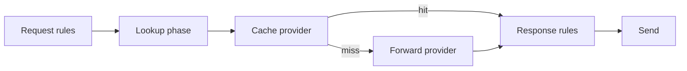

# DNS answer cache

Optional in-memory DNS answer caching stores upstream response wire bytes and serves repeat queries without a forward attempt. This guide covers when to enable caching, how hits and misses flow through the pipeline, and policy interactions with [Response rules](/concepts/architecture-and-packet-path.md#response-rules) and [Rhai](/rhai/index.md).

Field reference: [Reference: caches](/reference/config-schema/caches.md), [Reference: lookup](/reference/config-schema/lookup.md). Pipeline placement: [Architecture and packet path — Lookup](/concepts/architecture-and-packet-path.md#lookup).

## When to enable caching

| Goal | Approach |
|------|----------|
| Reduce upstream load for hot names | Add **`caches:`** and a **cache** provider before **forward** in **`lookup.profiles.default`** |
| Forward-only (default today) | Omit **`lookup:`** — Conduit uses an implicit **`default`** profile with one **forward** provider |
| Per-query opt-out | Request-hook **`txn.set_cache_lookup_eligible(false)`** — see [Cache eligibility](#cache-eligibility) |

Caching is **in-memory only**. Entries are lost on process restart. **`max_entries`** updates take effect on the live cache immediately when **apply** or **reload** succeeds (no restart; lowering the cap evicts entries). Other cache policy and **`memory.shard_count`** require a process restart — see [Reference: caches — Reload and apply](/reference/config-schema/caches.md#reload-and-apply).

## Minimal cache-enabled config

```yaml
caches:
  - name: global
    type: memory
    max_entries: 100000
lookup:
  profiles:
    default:
      providers:
        - type: cache
          cache: global
        - type: forward
```

Validate before reload:

```bash
conduitctl validate --file /path/to/config.yaml
```

## Hit and miss path



| Outcome | What happens |
|---------|----------------|
| **Cache hit** | Stored wire answer is prepared for this client (see [Serve rewriting](#serve-rewriting)); **`answer_source`** is **`cache`**; **no upstream forward** for that attempt |
| **Cache miss** | Next provider runs (typically **forward**) |
| **Bypass** | Cache skipped (ineligible transaction or provider bypass); forward runs if listed |
| **Parallel identical queries** | **Single-flight** — one upstream fetch; waiters resume when the fill completes |

**Fill timing:** Conduit stores the upstream wire answer at **`on_answer`** — **before** [Response rules](/concepts/architecture-and-packet-path.md#response-rules) mutate it. Authority and additional sections are preserved. The stored slab is not mutated on later hits.

## Serve rewriting { #serve-rewriting }

On every cache **hit**, Conduit prepares a per-client copy of the stored wire before [Response rules](/concepts/architecture-and-packet-path.md#response-rules) or [Send](/concepts/architecture-and-packet-path.md#send):

| Adjustment | Why |
|------------|-----|
| **Query ID** | Match this transaction’s DNS message ID |
| **Question section** | Echo the client’s QNAME encoding, including mixed-case **0x20** bits many recursive clients validate |
| **EDNS (OPT)** | Carry the client’s EDNS options onto the served answer |
| **TTL decay** | Subtract elapsed time since fill from each RR TTL |

Exact hits, truncated-UDP hits, single-flight waiters, and ancestor NXDOMAIN hits all get the same preparation. Answer RRset owner-name case in the answer section is left as stored; classic **0x20** checks compare the **Question** echo.

## Cache key dimensions

Entries are distinct when any of these differ:

- Query name, type, and class
- **CD** and **DO** (DNSSEC) bits
- **ECS** option on the query (when present)
- Answer shape: **complete** vs **truncated UDP** (when **`truncated_udp`** is enabled)

**UDP and TCP clients share the same complete-answer key.** A complete answer filled from a UDP query can satisfy a later TCP query for the same dimensions (and vice versa). Client IP and DNS message ID are not key dimensions.

When a complete cached answer is larger than a **UDP** client's EDNS payload size (or 512 bytes without EDNS), [Send](/concepts/architecture-and-packet-path.md#send) fits the response on RR boundaries (and sets **TC** when required data cannot fit) — the full entry remains in cache for clients that can accept it.

**`truncated_udp`** stores TC=1 stubs under a separate key and serves them only to **UDP** clients. TCP clients never receive a truncated stub from cache; they miss and continue the provider chain (typically forward). When a later **complete** answer is filled for the same query dimensions (for example after a TCP forward), Conduit **removes** any truncated-UDP sibling so only the complete entry remains — subsequent UDP clients use that complete answer, with [Send](/concepts/architecture-and-packet-path.md#send) fitting on RR boundaries and setting **TC** when the client's payload cannot hold the full response.

## Negative cache

With **`negative_cache.enabled: true`** (default when the block is omitted):

- **NXDOMAIN** and **NODATA** answers cache with TTL from the response
- **`nxdomain_covers_descendants: true`** (default) — a cached NXDOMAIN for `a.example.` also satisfies `b.a.example.`
- **`servfail_ttl_secs`** (default **10**) — TTL for cached SERVFAIL; set **0** to disable SERVFAIL caching

## Cache eligibility { #cache-eligibility }

Each transaction carries **`cache_lookup_eligible`**, default **`true`**.

| Event | Eligibility |
|-------|-------------|
| Request hook | **`txn.set_cache_lookup_eligible(false)`** bypasses cache for this query |
| Forward provider entry | Conduit sets eligibility **`false`** before upstream I/O |
| Retry from Response rules | Re-enters **Lookup** with eligibility still **`false`** (Request rules do not run again; the response hook cannot restore eligibility) |

Use **`txn.answer_source()`** on the response hook to distinguish cache from forward — not **`txn.last_forward_ms()`**, which is **0** on cache hits.

## Retry interaction

[Response rules](/concepts/architecture-and-packet-path.md#response-rules) retry re-enters **Lookup** (the full provider chain), not a standalone Route phase. Because forward clears eligibility and nothing restores it on the same transaction, a retry after an upstream attempt **does not** re-check cache.

## `on_hit.response_rules` { #on_hit-response_rules }

When the cache serves a hit, Conduit already has a complete wire answer. **`on_hit.response_rules`** controls whether [Response rules](/concepts/architecture-and-packet-path.md#response-rules) still run:

| Value | Cache hit path |
|-------|----------------|
| **`run`** (default when `on_hit` omitted) | Run Response rules on the cached answer, then [Send](/concepts/architecture-and-packet-path.md#send) — same hooks as a forward-produced answer |
| **`skip`** | Skip Response rules; go straight to Send (lower latency when response rules are miss-only) |

### Tradeoff with response-hook metrics

If response-hook **`metrics.inc`** counts only upstream outcomes, cache hits will **not** increment those counters when **`skip`** is set — the response hook does not run. Options:

- Keep default **`run`** so response rules and metrics run on hits too
- Use built-in metrics ([`conduit_responses_total`](/observability/built-in-metrics.md#conduit_responses_total) with **`answer_source`**) for cache vs forward volume
- Record metrics on the **request** hook when classification is enough

See also [User metrics — Cache hits and on_hit skip](/rhai/user-metrics.md#cache-hits-and-on_hit-skip).

## `rotate_rrset_on_serve`

When **`true`**, each cache **hit** may reorder records **within** each answer RRset (for example multiple **A** records) using a random cyclic offset. Default **`false`** — served answer RR order matches the stored wire aside from the [serve rewriting](#serve-rewriting) steps (query ID, question/EDNS echo, TTL decay).

## Observability

| Signal | Where |
|--------|-------|
| Cache vs forward volume | [`conduit_responses_total{answer_source=...}`](/observability/built-in-metrics.md#conduit_responses_total) |
| Cache read path | [`conduit_cache_lookups_total`](/observability/built-in-metrics.md#conduit_cache_lookups_total) |
| Provider outcomes | [`conduit_lookup_provider_outcomes_total`](/observability/built-in-metrics.md#conduit_lookup_provider_outcomes_total) |
| Traces | Top-level **`lookup`** phase; nested events for cache and forward internals |
| Event export | Selectors **`answer_source`**, **`cache_instance`** — [Event export](/observability/event-export.md) |

Example PromQL:

```promql
sum(rate(conduit_responses_total[5m])) by (listener, answer_source)
```

## Related topics

- [Architecture and packet path](/concepts/architecture-and-packet-path.md) — Lookup phase and forward provider internals
- [Built-in metrics](/observability/built-in-metrics.md) — lookup and cache catalog
- [Transaction API — Answer provenance](/rhai/txn-api.md#answer-provenance)
- [Data sources and lookups](/rhai/data-sources-and-lookups.md) — **`lookup(table, key)`** vs Lookup phase
