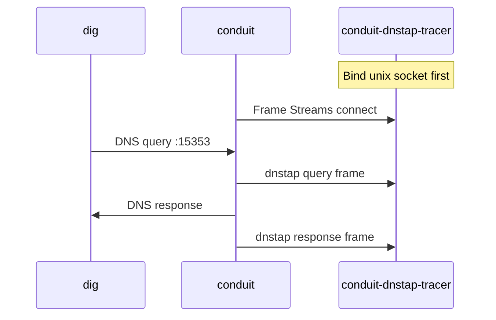

# Event export and dnstap

End-to-end lab setup: export per-query DNS observation as [dnstap](/glossary/index.md#dnstap) frames using **`conduit-dnstap-tracer`** as a local collector. This verifies [event export](/observability/event-export.md) wiring in development — production deployments use your own framestream-compatible collector instead of the tracer.

**Prerequisites:** `conduit` and **`conduit-dnstap-tracer`** built or installed ([Install and run](/getting-started/install-and-run.md)); an upstream DNS listener on **`127.0.0.1:5300`** (or adjust the pool backend below).

## What you will verify

1. Conduit connects to a Unix socket collector as a dnstap **client**
2. Client **query** and **response** frames appear on the tracer stdout after `dig`
3. Optional **`extra_fields`** (`pool`, `backend`) show up in decoded output



## 1. Write the config

Save as `conduit-dnstap-lab.yaml`:

```yaml
schema_version: 1
listeners:
  listeners:
    - address: "127.0.0.1:15353"
      protocol: udp
pools:
  - name: default
    backends:
      - address: "127.0.0.1:5300"
events:
  queue_depth: 8192
  drop_policy: drop_oldest
  sinks:
    - type: dnstap
      name: lab-tap
      destinations:
        - "unix:/tmp/conduit-dnstap.sock"
      emit:
        - query
        - response
      extra_fields:
        - pool
        - backend
```

| Field | Role in this lab |
|-------|------------------|
| `events.sinks[].destinations` | Must match the tracer’s Unix socket path |
| `emit` | **`query`** after request rules (including policy drop); **`response`** at send |
| `extra_fields` | Attach pool/backend JSON in the dnstap **`extra`** blob |

Validate:

```bash
conduitctl validate --file conduit-dnstap-lab.yaml
```

## 2. Start the tracer (terminal A)

Start the collector **before** Conduit — Conduit connects as a client and retries if the socket is missing.

```bash
rm -f /tmp/conduit-dnstap.sock
conduit-dnstap-tracer -u /tmp/conduit-dnstap.sock -f yaml
```

Use **`-f json`** if you prefer one JSON object per line. The tracer binds the socket and waits for Conduit.

!!! note "Development tool only"
    **`conduit-dnstap-tracer`** decodes frames to stdout for labs. It is **not** a production tap service — see [Install and run](/getting-started/install-and-run.md).

## 3. Start Conduit (terminal B)

```bash
conduit /path/to/conduit-dnstap-lab.yaml
```

Confirm **`dataplane startup summary`** shows **`event_sinks=1`** (or `events_enabled=true` depending on log format). Warnings about unreachable destinations mean the tracer is not up or the socket path differs.

!!! note "Restart after sink changes"
    Adding or removing sinks or changing **destinations** requires a **process restart**. Filter changes on existing sinks can reload — see [Event export — Changing events config](/observability/event-export.md#changing-events-config).

## 4. Send traffic

Use a distinctive QNAME so frames are easy to spot:

```bash
dig @127.0.0.1 -p 15353 +time=3 dnstap-lab.example.com A
```

In **terminal A**, expect **two** frames (query + response) with message types **CLIENT_QUERY** and **CLIENT_RESPONSE**. With **`extra_fields`**, look for **`pool: default`** and **`backend: 127.0.0.1:5300`** (or your configured backend) in the decoded **`extra`** section.

## 5. Optional checks

| Check | Action |
|-------|--------|
| Export metrics | Add `metrics:` with Prometheus scrape; watch [`conduit_events_delivered_total`](/observability/built-in-metrics.md#conduit_events_delivered_total) |
| Tag-gated export | Add request rule `set_tag` + sink `filters.tag_required` — [Event export — Filters](/observability/event-export.md#filters) |
| TCP collector | `conduit-dnstap-tracer -a 127.0.0.1:6000` and `destinations: ["tcp:127.0.0.1:6000"]` |

## What to do next

- [Metrics and tracing](/guides/metrics-and-tracing.md) — aggregate metrics and pipeline traces
- [Operator metrics profiles](/guides/operator-metrics-profiles.md) — **`minimal`** vs **`full`** scrape comparison
- Symptom help — [Troubleshooting — Event export](/troubleshooting/index.md#observability)

## Related topics

- [Event export](/observability/event-export.md) — sinks, filters, emit kinds, overload behavior
- [Observability](/observability/index.md) — signal choice and reload matrix
- [Reference: events](/reference/config-schema/events.md) — field reference
