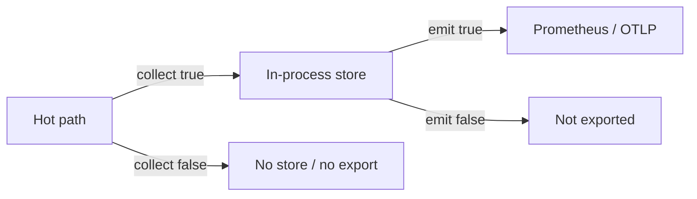

# Metrics beyond bases

After you pick **`metrics.base`** (`minimal` or **`standard`**), you can trim which categories are active, separate **collect** from **emit**, shrink label sets with **granularity**, and apply those changes live (including a Prometheus listen rebind). Concept detail: [Metrics configurability](/observability/metrics-configurability.md). For **`minimal`** vs **`standard`** side by side, see [Operator metrics bases](/guides/operator-metrics-bases.md) first.

**Prerequisites:** Conduit installed; an upstream on **`127.0.0.1:5300`**; **`control:`** enabled if you practice overlay apply. Follow [Metrics and tracing](/guides/metrics-and-tracing.md) if you have not scraped Prometheus yet.

## What you will practice

1. Exclude a category from **`standard`** (drop timing series from scrape)
2. Keep a category collected but **`emit: false`** (series absent from scrape)
3. Override **granularity** so timing labels are pool-only
4. Apply a metrics plan overlay without restart; optionally rebind the scrape port

## Baseline config

Save as `conduit-metrics-tune.yaml`:

```yaml
schema_version: 1
listeners:
  listeners:
    - address: "127.0.0.1:15353"
      protocol: udp
pools:
  - name: default
    backends:
      - address: "127.0.0.1:5300"
control:
  listen_address: "127.0.0.1:5199"
metrics:
  enabled: true
  base: standard
  prometheus:
    listen_address: "127.0.0.1:9090"
    path: /metrics
```

```bash
conduitctl validate --file conduit-metrics-tune.yaml
conduit conduit-metrics-tune.yaml
```

Send traffic, then confirm **`standard`** timing series appear:

```bash
dig @127.0.0.1 -p 15353 +time=2 example.com A
curl -sS "http://127.0.0.1:9090/metrics" | grep conduit_forward_duration
```

**Expect:** forward timing series present (exact names in [Built-in metrics](/observability/built-in-metrics.md)).

## 1. Exclude a category

Stop Conduit and add:

```yaml
metrics:
  enabled: true
  base: standard
  categories:
    exclude: [timing]
  prometheus:
    listen_address: "127.0.0.1:9090"
```

Restart, send traffic, scrape again:

```bash
curl -sS "http://127.0.0.1:9090/metrics" | grep conduit_forward_duration || echo "timing omitted"
```

**Expect:** no forward timing series. Query volume counters from **`volume`** still increment. Use **`categories.include`** with **`base: none`** when you want an allow-list instead of carve-outs — [Metrics configurability — Categories](/observability/metrics-configurability.md#categories).

## 2. Collect vs emit

Restore **`base: standard`** without the exclude, then record timing in-process but omit it from scrape and OTLP:

```yaml
metrics:
  enabled: true
  base: standard
  collection:
    timing:
      collect: true
      emit: false
  prometheus:
    listen_address: "127.0.0.1:9090"
```

After traffic:

```bash
curl -sS "http://127.0.0.1:9090/metrics" | grep conduit_forward_duration || echo "emit off — absent from scrape"
```

**Expect:** scrape omits timing series. Hot-path cost of **collect** remains — turn **`collect: false`** (or exclude the category) when you want to stop paying that cost. **`collect: false`** with **`emit: true`** fails validate.



## 3. Granularity — fewer labels

Keep timing in the scrape, but drop the **`backend`** label on timing families:

```yaml
metrics:
  enabled: true
  base: standard
  granularity:
    timing: [pool]
  prometheus:
    listen_address: "127.0.0.1:9090"
```

After traffic:

```bash
curl -sS "http://127.0.0.1:9090/metrics" | grep conduit_forward_duration
```

**Expect:** timing series labeled by **`pool`** (and other still-allowed dimensions), **not** per-**`backend`**. Changing a family's dimension list creates a **new series identity** — counters for that schema start over. Allowed keys: [Built-in metric registry](/observability/built-in-metric-registry.md).

Coarse response codes (class buckets instead of every IANA name):

```yaml
  granularity:
    default: fine
    responses:
      rcode: coarse
```

## 4. Live overlay — plan change and rebind

With the **baseline** config running (**`control:`** on **`5199`**), apply a sparse overlay that only excludes timing:

Save as `overlay-exclude-timing.yaml`:

```yaml
schema_version: 1
metrics:
  categories:
    exclude: [timing]
```

```bash
conduitctl --endpoint http://127.0.0.1:5199 apply --file overlay-exclude-timing.yaml
dig @127.0.0.1 -p 15353 +time=2 example.com A
curl -sS "http://127.0.0.1:9090/metrics" | grep conduit_forward_duration || echo "plan applied — timing gone"
```

**Expect:** timing disappears from scrape; the listen socket on **`9090`** stays up (plan-only change). Overlay merge for **`metrics`** is **deep** — [Overlay merge strategy](/control-plane/overlay-merge-strategy.md).

Rebind scrape to another port — save as `overlay-rebind.yaml`:

```yaml
schema_version: 1
metrics:
  prometheus:
    listen_address: "127.0.0.1:9091"
```

```bash
conduitctl --endpoint http://127.0.0.1:5199 apply --file overlay-rebind.yaml
curl -sS "http://127.0.0.1:9091/metrics" | head
curl -sS "http://127.0.0.1:9090/metrics" && echo "old port still up?" || echo "old port closed"
```

**Expect:** new address serves metrics; old listener is closed after a successful bind. If the new bind fails, apply is **rejected** and the previous scrape address keeps working.

## What to verify

| Check | Expected |
|-------|----------|
| `categories.exclude: [timing]` | No timing series; volume still present |
| `collection.timing.emit: false` | Timing absent from scrape; validate rejects emit without collect |
| `granularity.timing: [pool]` | Timing labels lack **`backend`** |
| Plan overlay | Timing toggles without restart; port unchanged |
| Rebind overlay | Scrape moves to the new listen address |

## Related topics

- [Metrics configurability](/observability/metrics-configurability.md) — bases, collect/emit, granularity, overlay matrix
- [Operator metrics bases](/guides/operator-metrics-bases.md) — **`minimal`** vs **`standard`** lab
- [Metrics and tracing](/guides/metrics-and-tracing.md) — first Prometheus scrape and `conduitctl trace`
- [Control plane workflows](/guides/control-plane-workflows.md) — apply / export / reload
- [Built-in metric registry](/observability/built-in-metric-registry.md) — category membership and dimensions
- [Config schema: metrics and tracing](/reference/config-schema/metrics-and-tracing.md)
