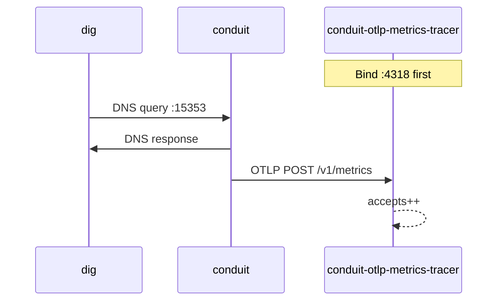

# OTLP metrics push smoke

This guide is an end-to-end lab: push built-in [metrics](/observability/metrics.md) over **OTLP HTTP** to **`conduit-otlp-metrics-tracer`**, then confirm the lab receiver accepts exports. Production deployments use your own OTLP-compatible collector — the tracer is a local smoke tool only.

**Prerequisites:** `conduit` and **`conduit-otlp-metrics-tracer`** built or installed ([Install and run](/getting-started/install-and-run.md)); an upstream DNS listener on **`127.0.0.1:5300`** (or adjust the pool backend below).

## What you will verify

1. The tracer binds **`127.0.0.1:4318`** and serves **`POST /v1/metrics`**
2. Conduit pushes OTLP metrics on the configured interval
3. The tracer stdout (and **`GET /stats`**) show at least one accept after DNS traffic



## 1. Write the config

Save as `conduit-otlp-metrics-lab.yaml`:

```yaml
schema_version: 1
listeners:
  listeners:
    - address: "127.0.0.1:15353"
      protocol: udp
pools:
  - name: default
    backends:
      - address: "127.0.0.1:5300"
metrics:
  enabled: true
  base: standard
  otel:
    endpoint: "http://127.0.0.1:4318/v1/metrics"
    push_interval_ms: 2000
    resource_attributes:
      service.name: conduit-otlp-lab
logging:
  level: info
  output: stderr
```

| Field | Role in this lab |
|-------|------------------|
| `metrics.otel.endpoint` | Must match the tracer listen address and path |
| `push_interval_ms` | **2000** keeps the lab snappy; production often uses the default **15000** |
| `base: standard` | Enough built-ins to produce a non-empty push payload |

Validate:

```bash
conduitctl validate --file conduit-otlp-metrics-lab.yaml
```

## 2. Start the tracer (terminal A)

Start the receiver **before** Conduit so the first push finds a listener:

```bash
conduit-otlp-metrics-tracer -a 127.0.0.1:4318 -p /v1/metrics -f log
```

Expect a listening line on stderr and quiet stdout until the first push. Optional: **`--delay-ms N`** adds artificial response latency for pressure labs; **`GET http://127.0.0.1:4318/stats`** returns `{"accepts":N,"failures":N}`.

!!! note "Development tool only"
    **`conduit-otlp-metrics-tracer`** is a lab/debug receiver — not a production OTel Collector. See [Install and run](/getting-started/install-and-run.md).

## 3. Start Conduit (terminal B)

```bash
conduit /path/to/conduit-otlp-metrics-lab.yaml
```

Confirm **`dataplane startup summary`** with metrics enabled and no OTLP exporter build errors in the log.

## 4. Send traffic and watch accepts

```bash
dig @127.0.0.1 -p 15353 +time=3 otlp-lab.example.com A
```

Within a few seconds (one or two push intervals), terminal A should print an **`otlp-metrics accept`** line with a non-zero **`body_bytes`**. Confirm counters:

```bash
curl -sS http://127.0.0.1:4318/stats
```

Expect **`accepts`** ≥ **1** and **`failures`** typically **0**.

## 5. Optional checks

| Check | Action |
|-------|--------|
| Wrong path | Point `endpoint` at `/v1/wrong` — tracer **`failures`** increase; Conduit logs push warnings |
| Scrape + push | Add `metrics.prometheus.listen_address` — both export paths share the same registry ([Metrics](/observability/metrics.md)) |
| HTTPS lab collector | Use `https://…` with **`allow_invalid_certs: true`** only for self-signed lab sinks |

## What to do next

- [Metrics and tracing](/guides/metrics-and-tracing.md) — Prometheus scrape and pipeline traces
- [Metrics beyond bases](/guides/metrics-beyond-bases.md) — collect vs emit and live overlay
- [Event export and dnstap](/guides/event-export-dnstap.md) — per-query wire export

## Related topics

- [Metrics](/observability/metrics.md) — OTLP HTTP push fields and semantics
- [Reference: metrics and tracing](/reference/config-schema/metrics-and-tracing.md) — `metrics.otel` schema
- [Install and run](/getting-started/install-and-run.md) — companion binaries in release assets
- [Performance findings](/performance/index.md#findings) — directional takeaways (OTLP vs scrape)
- [OTLP tax under load](/performance/studies/otlp-tax-under-load.md) — same-host cost vs obs-off / scrape
- [Metrics scrape tax](/performance/studies/metrics-scrape-ladder.md)