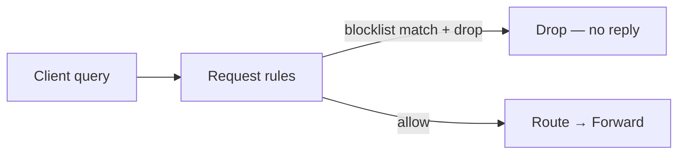
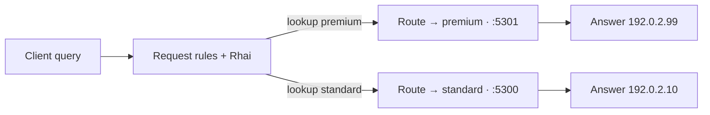

# Rhai policy

End-to-end lab for **Rhai for rules** — two request-hook patterns where scripts add value over built-in actions alone. Each example uses self-contained YAML, a `.rhai` script, and `dig` checks. API detail lives on [Rhai for rules](/rhai/rule-rhai.md), [Hooks and phases](/rhai/hooks-and-phases.md), and [Transaction API](/rhai/transaction-api.md).

**Prerequisites:** Conduit on your `PATH` ([Install and run](/getting-started/install-and-run.md)); **`dig`**; optional **`dnsmasq`** as a loopback upstream mock ([First query](/getting-started/first-query.md)). Read [Rules and actions](/policy-routing/rules-and-actions.md) for selectors and built-in actions first.

## What you will verify

| Example | Hook | Outcome |
|---------|------|---------|
| [Blocklist drop](#example-1-blocklist-drop-request-hook) | Request | CSV **`block`** → query **drops** (no DNS reply); **`conduit_user_block_hits`** increments; other names in scope **forward** |
| [CSV pool routing](#example-2-csv-pool-routing-request-hook) | Request | Lookup table maps qname → pool; **`dig`** shows different answers per row |

Use a working directory per example (for example `~/conduit-lab/blocklist/` and `~/conduit-lab/routing/`). Paths in config resolve relative to the **config file directory** — see [Config file — path resolution](/control-plane/config-file.md#path-resolution-base-directory).

---

## Example 1 — Blocklist drop (request hook)

Lookup table on the **request hook**: match qname against a CSV, increment a **custom user metric** on blocks, then **drop** before [Forward](/concepts/architecture-and-packet-path.md#forward). The client gets no DNS reply. [Event export](/observability/event-export.md) still emits a **`query`** dnstap frame after request rules when sinks match — use **`tag_required`** or filters to scope blocked traffic, or rely on a [user metric](/rhai/user-metrics.md) for block counters.



### 1. Layout

Create three files beside each other:

| File | Role |
|------|------|
| `conduit.yaml` | Listeners, pool, `data_sources`, `metrics`, `rules`, `rhai:` |
| `data/blocklist.csv` | qname → action |
| `scripts/blocklist.rhai` | `table_lookup`, custom metric, drop |

**`data/blocklist.csv`:**

```csv
qname,action
evil.bad.example.,block
good.bad.example.,allow
```

**`scripts/blocklist.rhai`:**

```rhai
if table_lookup("blocklist", question_qname(txn)) == "block" {
    txn.metric_inc("block_hits", 1);
    txn.drop_query();
}
```

**Custom user metric:** **`txn.metric_inc("block_hits", 1)`** registers a script-defined counter at snapshot compile and exports it as **`conduit_user_block_hits`** when [metrics](/observability/metrics.md) are enabled. Increments flush **before** drop intent is resolved, so blocked queries still count even though the client gets **no** DNS reply. See [User metrics](/rhai/user-metrics.md) and [Transaction API — `metric_inc`](/rhai/transaction-api.md#txnmetric_incname-delta).

Soft **`drop_query()`** sets drop intent at the end of the rule pass. See [Transaction API — Outcomes](/rhai/transaction-api.md#outcomes).

### 2. Config

**`conduit.yaml`:**

```yaml
schema_version: 1
listeners:
  listeners:
    - address: "127.0.0.1:15353"
      protocol: udp
pools:
  - name: default
    backends:
      - address: "127.0.0.1:5300"
rhai:
  max_operations: 10000
  max_call_depth: 32
  hook_timeout_ms: 50
data_sources:
  - name: blocklist
    type: csv
    path: data/blocklist.csv
    key_column: qname
    value_column: action
metrics:
  enabled: true
  profile: full
  prometheus:
    listen_address: "127.0.0.1:9090"
    path: /metrics
rules:
  match_mode: first_match
  rules:
    - name: blocklist-check
      hook: request
      selectors:
        - type: qname_suffix
          value: "bad.example."
      actions:
        - type: rhai
          value: scripts/blocklist.rhai
```

**Metrics (minimum for scrape):** **`metrics.enabled: true`** turns on recording; **`profile: full`** includes script-discovered user metrics (default export tier). **`prometheus.listen_address`** exposes **`GET /metrics`** for local scrape — no OTLP block required for this lab.

Validate:

```bash
conduitctl validate --file conduit.yaml
```

### 3. Run upstream and Conduit

**Terminal A** — upstream on **`127.0.0.1:5300`** (replace **`8.8.8.8`** with a resolver you can reach):

```bash
export UPSTREAM_DNS="8.8.8.8"
dnsmasq --keep-in-foreground \
  --port=5300 \
  --bind-interfaces \
  --listen-address=127.0.0.1 \
  --server="$UPSTREAM_DNS" \
  --no-hosts --no-resolv
```

**Terminal B:**

```bash
conduit /path/to/conduit-lab/blocklist/conduit.yaml
```

### 4. Query and verify

Blocked name (CSV **`block`**) — expect **`dig` timeout** (no reply):

```bash
dig @127.0.0.1 -p 15353 +time=3 +tries=1 evil.bad.example. A
```

Custom block counter — after at least one blocked query, scrape Prometheus format and look for **`conduit_user_block_hits`**:

```bash
curl -sS http://127.0.0.1:9090/metrics | grep '^conduit_user_block_hits'
```

**Expect:** a line with value **`1`** or higher (one increment per blocked query). Allowed and out-of-scope queries do not increment this counter.

Allowed name in the same suffix (CSV **`allow`**) — expect **`NOERROR`** and an answer:

```bash
dig @127.0.0.1 -p 15353 +time=3 +tries=1 good.bad.example. A
```

Name **outside** the rule’s **`qname_suffix`** selector never runs the script — Conduit forwards normally:

```bash
dig @127.0.0.1 -p 15353 +time=3 +tries=1 example.com A
```

**What you verified:** [Data sources](/rhai/data-sources-and-lookups.md) grant model, request-hook Rhai, policy **drop** vs forward, and a **custom user metric** on blocks (`conduit_user_block_hits`). Deeper behavior: [Architecture — Query outcomes](/concepts/architecture-and-packet-path.md#query-outcomes-and-worker-occupancy), [User metrics](/rhai/user-metrics.md), [Troubleshooting — no client response](/troubleshooting/index.md#client-gets-no-response-timeout-or-silence).

---

## Example 2 — CSV pool routing (request hook)

A routing table maps many qnames to [pool](/glossary/index.md#pool) names. **`table_lookup`** + **`txn.set_pool`** scales better than one declarative rule per name — the pool for each qname lives in the CSV, not in repeated YAML selectors.

Built-in **`set_pool`** on a rule is enough when pool choice is fixed (one suffix → one pool). Rhai earns its place when the mapping is **data-driven** and changes often (reload the CSV, not a wall of rules).



### 1. Layout

| File | Role |
|------|------|
| `conduit.yaml` | Two pools, `data_sources`, request rule |
| `data/routing.csv` | qname → pool name |
| `scripts/route-by-table.rhai` | `table_lookup` + `set_pool` |

**`data/routing.csv`:**

```csv
qname,pool
app-a.customer.example.,premium
app-b.customer.example.,standard
```

**`scripts/route-by-table.rhai`:**

```rhai
let pool = table_lookup("routing", question_qname(txn));
if pool != "" {
    txn.set_pool(pool);
}
```

On a CSV **miss**, the script leaves pool choice unchanged — Conduit uses the [default pool](/policy-routing/pools-and-backends.md) for that query.

### 2. Config

**`conduit.yaml`:**

```yaml
schema_version: 1
listeners:
  listeners:
    - address: "127.0.0.1:15353"
      protocol: udp
pools:
  - name: standard
    backends:
      - address: "127.0.0.1:5300"
  - name: premium
    backends:
      - address: "127.0.0.1:5301"
rhai:
  max_operations: 10000
  max_call_depth: 32
  hook_timeout_ms: 50
data_sources:
  - name: routing
    type: csv
    path: data/routing.csv
    key_column: qname
    value_column: pool
rules:
  match_mode: first_match
  rules:
    - name: route-by-table
      hook: request
      selectors:
        - type: qname_suffix
          value: "customer.example."
      actions:
        - type: rhai
          value: scripts/route-by-table.rhai
```

Pool names in the CSV (**`premium`**, **`standard`**) must match **`pools:`** entries exactly. Validate:

```bash
conduitctl validate --file conduit.yaml
```

### 3. Run upstreams and Conduit

Run **two** loopback upstream mocks — one per pool — with **different** answers for the same qnames so routing is obvious:

**Terminal A** — **`standard`** pool on **`127.0.0.1:5300`**:

```bash
dnsmasq --keep-in-foreground \
  --port=5300 \
  --bind-interfaces \
  --listen-address=127.0.0.1 \
  --no-resolv \
  --address=/app-b.customer.example/192.0.2.10
```

**Terminal B** — **`premium`** pool on **`127.0.0.1:5301`**:

```bash
dnsmasq --keep-in-foreground \
  --port=5301 \
  --bind-interfaces \
  --listen-address=127.0.0.1 \
  --no-resolv \
  --address=/app-a.customer.example/192.0.2.99
```

**Terminal C:**

```bash
conduit /path/to/conduit-lab/routing/conduit.yaml
```

### 4. Query and verify

Premium row in the CSV — expect **`192.0.2.99`** (backend **`127.0.0.1:5301`**):

```bash
dig @127.0.0.1 -p 15353 +short app-a.customer.example A
```

Standard row — expect **`192.0.2.10`** (backend **`127.0.0.1:5300`**):

```bash
dig @127.0.0.1 -p 15353 +short app-b.customer.example A
```

Name under the suffix but **missing** from the CSV — expect the **default** pool (**`standard`**, first in **`pools:`**). Add rows to the CSV and reload to extend routing without new YAML rules.

Name **outside** **`customer.example.`** — the script never runs; routing follows default pool behavior only.

**What you verified:** data-driven pool choice on the request hook — the pattern in [Data sources — Pool or egress map](/rhai/data-sources-and-lookups.md#pool-or-egress-map). For fixed **SERVFAIL** failover to one backup pool, use declarative **`set_retry_pool`** + **`retry`** instead — [Retries and transactions — Declarative examples](/policy-routing/retries-and-transactions.md#declarative-examples). Method reference: [Transaction API — Routing](/rhai/transaction-api.md#routing).

---

## Reload and script edits

Rule and Rhai changes load into the [runtime snapshot](/glossary/index.md#runtime-snapshot) on **`conduitctl reload`** or **SIGHUP** for **new** queries — no process restart required. In-flight [transactions](/glossary/index.md#transaction) keep the policy they started with.

After editing **`conduit.yaml`**, a script, or a CSV under **`data/`**:

```bash
conduitctl validate --file conduit.yaml
# edit the file Conduit was started with, then:
conduitctl reload
```

Without **`control:`** at process start, use **SIGHUP** instead — see [Control plane workflows](/guides/control-plane-workflows.md).

Compile-time checks (unknown **`table_lookup`** table name, Rhai syntax, **`data_sources`** read errors) fail **`validate`** and block reload. [Sandbox limits](/rhai/sandbox-limits.md) cap script cost per hook.

## Related topics

- [Rhai for rules](/rhai/rule-rhai.md) — when to use scripts vs built-in actions
- [Data sources and lookups](/rhai/data-sources-and-lookups.md) — CSV schema and grant model
- [Retries and transactions](/policy-routing/retries-and-transactions.md) — limits and pool lifecycle
- [Rules and actions](/policy-routing/rules-and-actions.md) — selectors, action order, validation
- [Control plane workflows](/guides/control-plane-workflows.md) — reload, apply, export
- [Event export and dnstap](/guides/event-export-dnstap.md#5-optional-checks) — tag-gated export (`set_tag` + `tag_required`)
- [Guides](/guides/index.md) — other walkthroughs
