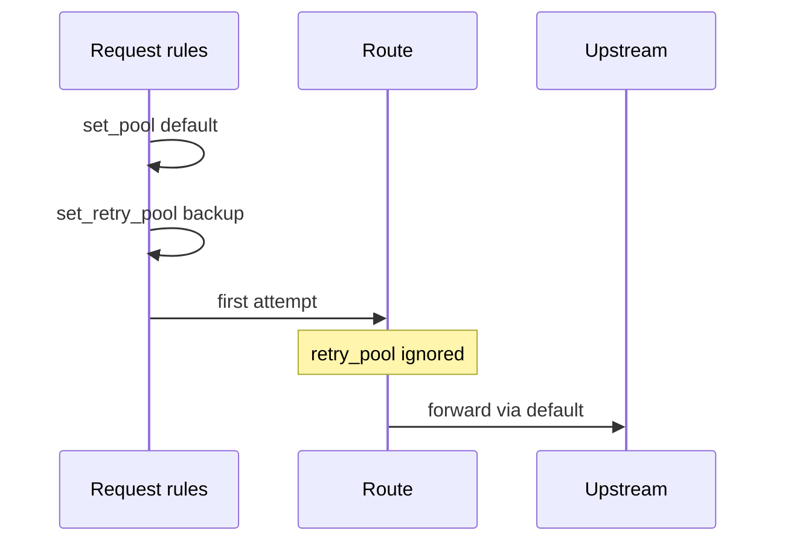

# Rule action order

When a [rule](/glossary/index.md#rule) matches, Conduit runs its **`actions:`** list **top to bottom**. Soft **`drop`** waits until the end of the rule; **`drop_now`** stops immediately. Later actions can override earlier ones (including a **`rhai`** step). Full tables live in [Rules and actions — Action order](/policy-routing/rules-and-actions.md#action-order-on-one-rule).

**Prerequisites:** Conduit installed ([Install and run](/getting-started/install-and-run.md)); a working baseline ([Minimal configuration](/getting-started/minimal-configuration.md)); an upstream that answers on **`127.0.0.1:5300`** (or adjust the pool below).

## What you will verify

1. Soft **`drop`** still runs later actions on the same rule
2. **`drop_now`** short-circuits — later actions do not run
3. **`clear_drop`** cancels a soft drop before the rule ends
4. Action list order decides the final pool when **`rhai`** and **`set_pool`** both run
5. Request **`set_retry_pool`** does **not** change the first forward

## Lab layout

| Role | Address |
|------|---------|
| Conduit DNS | `127.0.0.1:15353` |
| Default / vip / backup upstream | `127.0.0.1:5300` (one live resolver is enough for this lab) |

## Write the config

Save as `conduit-action-order.yaml`:

```yaml
schema_version: 1
listeners:
  listeners:
    - address: "127.0.0.1:15353"
      protocol: udp
pools:
  - name: default
    backends:
      - address: "127.0.0.1:5300"
  - name: vip
    backends:
      - address: "127.0.0.1:5300"
  - name: backup
    backends:
      - address: "127.0.0.1:5300"
rules:
  match_mode: first_match
  rules:
    - name: soft-drop-then-tag
      hook: request
      selectors:
        - type: qname_suffix
          value: ".soft-drop.example."
      actions:
        - type: drop
        - type: set_tag
          value: audited=true
    - name: hard-drop
      hook: request
      selectors:
        - type: qname_suffix
          value: ".hard-drop.example."
      actions:
        - type: drop_now
        - type: set_tag
          value: skipped=true
    - name: clear-soft-drop
      hook: request
      selectors:
        - type: qname_suffix
          value: ".clear-drop.example."
      actions:
        - type: drop
        - type: clear_drop
    - name: stash-retry-pool
      hook: request
      selectors:
        - type: qname_suffix
          value: ".retry-stash.example."
      actions:
        - type: set_pool
          value: default
        - type: set_retry_pool
          value: backup
    - name: rhai-then-set-pool
      hook: request
      selectors:
        - type: qname_suffix
          value: ".order-demo.example."
      actions:
        - type: rhai
          value: set-vip-pool.rhai
        - type: set_pool
          value: default
```

Save beside the YAML as `set-vip-pool.rhai`:

```rhai
txn.set_pool("vip");
```

Validate and start:

```bash
conduitctl validate --file conduit-action-order.yaml
conduit conduit-action-order.yaml
```

## Soft drop — later actions still run

```bash
dig @127.0.0.1 -p 15353 +time=2 +tries=1 lab.soft-drop.example A
```

**Expect:** no DNS reply (timeout / silence). Soft **`drop`** lets **`set_tag`** run; the query is dropped only when the rule finishes with soft drop still set. You cannot see the tag from `dig`, but the important client outcome is silence — not a normal answer.

## Hard drop — short-circuit

```bash
dig @127.0.0.1 -p 15353 +time=2 +tries=1 lab.hard-drop.example A
```

**Expect:** no DNS reply. **`drop_now`** stops the action list, so **`set_tag: skipped=true`** never runs.

## clear_drop — cancel soft drop

```bash
dig @127.0.0.1 -p 15353 +time=2 +tries=1 lab.clear-drop.example A
```

**Expect:** a normal answer from the upstream. Soft drop was cleared before the rule ended, so the query continues to [Lookup](/concepts/architecture-and-packet-path.md#lookup).

## set_retry_pool — first forward ignores the stash

```bash
dig @127.0.0.1 -p 15353 +time=2 +tries=1 lab.retry-stash.example A
```

**Expect:** a normal answer on the first attempt. Request policy stashed **`backup`** for a **later** retry [Route](/concepts/architecture-and-packet-path.md#route); the first forward still uses **`default`**. To see the stash consumed, pair a response **`retry`** with a failing primary — [Declarative failover](/guides/declarative-failover.md).



## Action list order — rhai then set_pool

```bash
dig @127.0.0.1 -p 15353 +time=2 +tries=1 lab.order-demo.example A
```

**Expect:** answer via **`default`**. The script selects **`vip`**, then the following **`set_pool: default`** overrides it. Swap the two actions (or remove the trailing **`set_pool`**) to route through **`vip`** instead — proof that list order is the contract.

## What to verify

| Check | Expected |
|-------|----------|
| `*.soft-drop.example` | Silent drop; later soft-drop actions still ran |
| `*.hard-drop.example` | Silent drop; later actions skipped |
| `*.clear-drop.example` | Forward succeeds |
| `*.retry-stash.example` | First forward uses **`default`**, not **`backup`** |
| `*.order-demo.example` | Final pool is **`default`** (last write wins) |

## Related topics

- [Rules and actions](/policy-routing/rules-and-actions.md) — selectors, drop/retry tables, outcome precedence
- [Declarative failover](/guides/declarative-failover.md) — consume **`set_retry_pool`** with response **`retry`**
- [Retries and transactions](/policy-routing/retries-and-transactions.md) — pool and source stash lifecycle
- [Rhai policy](/guides/rhai-policy.md) — scripted blocklist and CSV routing
- [Troubleshooting — no client response](/troubleshooting/index.md#client-gets-no-response-timeout-or-silence)
