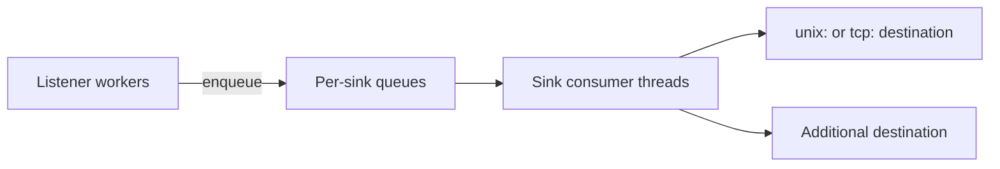

# Event export

Per-query DNS observation for the [dataplane](/glossary/index.md#dataplane): client queries, responses, and optional retry markers exported as [dnstap](/glossary/index.md#dnstap) frames to one or more collectors. Export runs **off** the DNS hot path — a full export queue drops events rather than delaying client replies.

Use event export when you need qname-level detail, client addresses, or policy [tags](/glossary/index.md#tags) in a log analytics pipeline or tap collector. For aggregate volume and latency, use [Metrics](/observability/metrics.md). For in-process pipeline timing on selected queries, use [Tracing](/observability/tracing.md).

## Enabling dnstap

When the **`events:`** block is **omitted**, Conduit does not configure any [event sinks](/glossary/index.md#event-sink) — no dnstap connections and no export queue cost.

To export dnstap, add at least one sink under `events.sinks`. Each sink needs `type: dnstap`, a stable **`name`** (or legacy **`export_id`**), and at least one **`destinations`** entry:

```yaml
events:
  queue_depth: 8192
  drop_policy: drop_oldest
  sinks:
    - type: dnstap
      name: lab-tap
      destinations:
        - "unix:/tmp/conduit-dnstap.sock"
      emit:
        - query
        - response
      extra_fields:
        - pool
        - backend
        - attempt_count
```

| Setting {: .column-no-wrap } | Meaning |
|---------|---------|
| `events.queue_depth` | Per-sink queue capacity (default **4096** when the `events:` block is present). Must be **≥ 1** |
| `events.drop_policy` | **`drop_oldest`** (default) or **`drop_newest`** when a queue is full |
| `events.sinks[]` | One or more sink definitions; only **`type: dnstap`** is supported today |

Field reference: [Config schema: events](/reference/config-schema/events.md).

## Export architecture



Listener workers evaluate each sink’s **filters** and **emit** list, then enqueue matching frames. A dedicated thread per sink drains its queue, encodes dnstap protobuf, and writes framestream data to every connected **destination** for that sink.

If the collector is down, the sink thread reconnects with exponential backoff (configurable under `connect_retry`). DNS responses are unaffected; [`conduit_events_queue_dropped_total`](/observability/built-in-metrics.md#conduit_events_queue_dropped_total) increments when a queue overflows.

## Sink identity

Each sink has two related identifiers:

| Field | Role |
|-------|------|
| **`name`** | Canonical operator id — used in [metrics](/observability/built-in-metrics.md#event-export) labels (`sink=…`), logs, and optional `extra_fields: sink_name` |
| **`export_id`** | dnstap wire **identity** in the protobuf (defaults to **`name`** when omitted) |

Legacy configs may set **`export_id`** only; Conduit treats it as both wire identity and **`name`**. You may set **`name`** and **`export_id`** differently when the tap identity on the wire must differ from the name you use in config and metrics. **`name`** and **`export_id`** must each be unique among sinks.

## Destinations

Destinations are strings with a required prefix:

| Form | Example | Notes |
|------|---------|--------|
| **`unix:`** *path* | `unix:/var/run/dnstap.sock` | Conduit connects as a **client** to an existing Unix socket. Relative paths resolve against the directory of the startup config file |
| **`tcp:`** *host*:*port* | `tcp:127.0.0.1:6000` | TCP framestream to a remote collector |

A sink may list **multiple** destinations; each delivered frame is written to every connected destination for that sink.

Start the collector **before** Conduit (or ensure the socket exists). Conduit logs a warning and retries when destinations are unreachable.

## What to emit

The **`emit`** list selects which observation points produce frames for a sink:

| Value | When it fires | dnstap message type |
|-------|---------------|---------------------|
| **`query`** | After [Request rules](/concepts/architecture-and-packet-path.md#request-rules) (qname known) | Client query |
| **`response`** | When the [transaction](/glossary/index.md#transaction) completes at [Send](/concepts/architecture-and-packet-path.md#send) | Client response |
| **`retry`** | On each additional attempt after the first (before re-entering [Route](/concepts/architecture-and-packet-path.md#route)) | Client query (same wire as the original query) |

If **`emit`** is omitted or empty, Conduit exports **`query`** and **`response`** (not **`retry`**).

**`query`** events carry the client query wire and client socket metadata. **`response`** events carry the answer wire (upstream copy or synthesized error). **`retry`** helps correlate [retries](/policy-routing/retries-and-transactions.md) in the tap without enabling full query+response on every attempt.

## Filters

Per-sink **`filters`** limit which transactions reach that sink. All configured filter clauses must pass (logical **AND**).

```yaml
      filters:
        tag_required: audit
        sample_percent: 10
        pool: default
        backend: "127.0.0.1:5300"
        selectors:
          - type: qname_suffix
            value: "example."
          - type: qtype
            value: "A"
          - type: tag
            value: vip
```

| Filter {: .column-no-wrap } | Applies to | Meaning |
|--------|------------|---------|
| **`tag_required`** | All emit kinds | Transaction must have the named [tag](/glossary/index.md#tags) (key presence; set via `set_tag` / Rhai) |
| **`selectors`** | All emit kinds | Same [selector](/glossary/index.md#selector) types as [rules](/policy-routing/rules-and-actions.md): `qname_suffix`, `qname_exact`, `qtype`, `rcode`, `tag`. **All** selectors must match |
| **`sample_percent`** | All emit kinds | Float in **[0, 100]**; deterministic sampling (default **100** = no sampling) |
| **`sample_key`** | All emit kinds | Optional static salt for top-level `sample_percent` |
| **`sample_key_from`** | All emit kinds | Optional `qname` or `sink_name` — dynamic salt for top-level `sample_percent` |
| **`pool`** | **`response`** and **`retry`** only | Selected pool name must match |
| **`backend`** | **`response`** and **`retry`** only | Selected backend address must match (`ip:port` string) |

**`pool`** and **`backend`** filters do not apply to **`query`** frames (pool/backend are not chosen until [Route](/concepts/architecture-and-packet-path.md#route)).

Example: tag queries for audit, then export only matching responses:

```yaml
rules:
  match_mode: first_match
  rules:
    - name: tag-audit
      hook: request
      selectors:
        - type: qname_suffix
          value: "example."
      actions:
        - type: set_tag
          value: audit=1
events:
  sinks:
    - type: dnstap
      name: audit-tap
      destinations:
        - "unix:/tmp/audit.sock"
      emit:
        - query
        - response
      filters:
        tag_required: audit
```

## Extra metadata

Optional **`extra_fields`** attach a JSON object to the dnstap **`extra`** field (UTF-8 JSON bytes). Allowed names:

| Field | Content |
|-------|---------|
| **`pool`** | Selected pool name |
| **`backend`** | Selected backend `ip:port` |
| **`attempt_count`** | Current attempt number on the transaction |
| **`txn_id`** | Internal transaction id |
| **`qname`** | Query name |
| **`rcode`** | Response code label (for example `NOERROR`, `SERVFAIL`) |
| **`client`** | Client socket `ip:port` |
| **`tags`** | JSON object of transaction tags (see **`extra_tags`**) |
| **`sink_name`** | This sink’s configured **`name`** |

When **`tags`** is listed, **`extra_tags`** controls which tag keys are included:

- Omitted or empty → all tags on the transaction
- **`"*"`** → all tags (must not be mixed with other keys)
- Named keys → only those tags (for example `tenant`, `vip`)

**`extra_tags`** requires **`tags`** in **`extra_fields`**.

## Connect retry

When a collector is unreachable, each sink reconnects with exponential backoff. Defaults apply when **`connect_retry`** is omitted:

| Field | Default |
|-------|---------|
| `initial_ms` | **1000** |
| `max_ms` | **30000** |
| `multiplier` | **2.0** |
| `max_elapsed_ms` | **0** (unlimited) |
| `jitter` | **true** |

Conduit logs a warning on disconnect and throttled warnings while retries continue.

## Overload and metrics

Export never blocks the query path. When a per-sink queue is full, Conduit applies **`drop_policy`** and increments drop counters rather than waiting on the collector.

With [metrics](/observability/metrics.md) enabled, scrape or OTEL push includes per-sink [event-export counters](/observability/built-in-metrics.md#event-export) (`conduit_events_enqueued_*`, `conduit_events_delivered_total`, `conduit_events_queue_dropped_total`). Use them to detect collector lag or chronic overload.

Details: [Concurrency and workers](/concepts/architecture-and-packet-path.md#concurrency-and-workers).

## Changing events config

The **`events:`** section may appear in the [file layer](/glossary/index.md#file-layer) or in an [overlay](/glossary/index.md#overlay) patch (whole-section replace when the overlay includes `events`).

After a successful [reload](/control-plane/reload-and-export.md) or **`conduitctl apply`**, **filter**, **emit**, and **extra_fields** changes on **existing** sinks apply to **later** queries.

**Adding or removing sinks**, changing **destinations**, or changing **`queue_depth`** requires a **process restart** today — dnstap consumer threads and queues are created at process start. See [Configuration model — What takes effect when](/control-plane/configuration-model.md#what-takes-effect-when).

## Lab smoke test

Short checklist — full walkthrough with **`conduit-dnstap-tracer`**: [Event export and dnstap](/guides/event-export-dnstap.md).

1. Build Conduit and **`conduit-dnstap-tracer`** ([Install and run](/getting-started/install-and-run.md)).
2. Start the tracer on a Unix socket, for example `conduit-dnstap-tracer -u /tmp/conduit-dnstap.sock -f yaml`.
3. Start Conduit with an `events.sinks` dnstap block pointing at that socket (see [Enabling dnstap](#enabling-dnstap)).
4. Send a query: `dig @127.0.0.1 -p 15353 +time=3 example.com A` (adjust listener port to your config).
5. Confirm the tracer receives client query and response frames; if **`extra_fields`** includes **`pool`** / **`backend`**, confirm they appear in **`extra`**.

## Related topics

- [Event export and dnstap](/guides/event-export-dnstap.md) — end-to-end lab with `conduit-dnstap-tracer`
- [Config schema: events](/reference/config-schema/events.md) — field-level reference
- [Architecture and packet path — Tags](/concepts/architecture-and-packet-path.md#tags) — why tags matter for export and tracing
- [Built-in metrics — Event export](/observability/built-in-metrics.md#event-export) — sink counters at scrape time
- [Metrics](/observability/metrics.md) — aggregate observability (orthogonal to dnstap)
- [Tracing](/observability/tracing.md) — per-query pipeline traces
- [Rules and actions](/policy-routing/rules-and-actions.md) — `set_tag` and selectors used in filters
