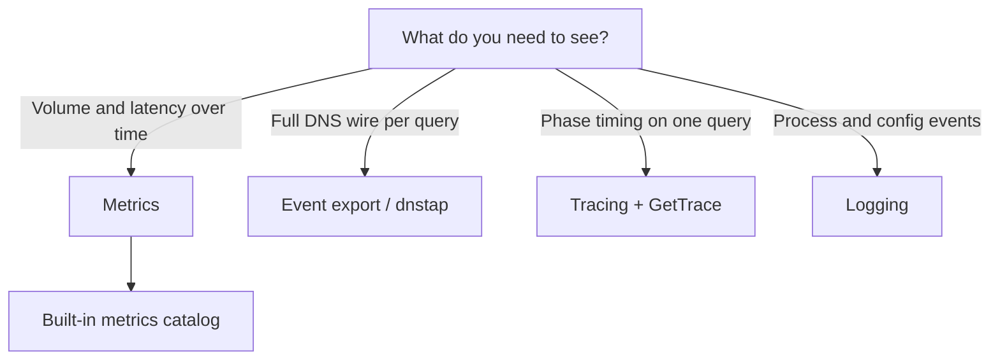

# Observability

Metrics, tracing, event export, and logging for Conduit — how you observe the [dataplane](/glossary/index.md#dataplane) without changing query behavior. Observation runs off the DNS query path: export backlog or full queues drop data rather than delaying client responses.

## Which signal to use

| You need… | Use | Config block |
|-----------|-----|--------------|
| Aggregate QPS, pool mix, forward errors, [backend health](/observability/built-in-metrics.md#backend-health) gauges, SLO dashboards | [Metrics](/observability/metrics.md) | `metrics:` |
| Every built-in series name, label, and PromQL examples | [Built-in metrics](/observability/built-in-metrics.md) | (same `metrics:`) |
| Per-query wire copies to a log analytics or tap collector | [Event export](/observability/event-export.md) | `events:` |
| Per-query pipeline phases (route, forward, retries) on selected queries | [Tracing](/observability/tracing.md) | `tracing:` |
| Startup, reload, control RPC access, optional query summaries | [Logging](/observability/logging.md) | `logging:` |

For a lab walkthrough that enables metrics and tracing together, see [Metrics and tracing](/guides/metrics-and-tracing.md). For dnstap export with **`conduit-dnstap-tracer`**, see [Event export and dnstap](/guides/event-export-dnstap.md). Config fields: [Reference: metrics and tracing](/reference/config-schema/metrics-and-tracing.md), [Reference: events](/reference/config-schema/events.md).

## OTEL and tracing names

Conduit uses several words that sound similar but mean different things:

| Term | What it is | Config |
|------|------------|--------|
| **OTLP metrics** | Periodic push of built-in counters/gauges/histograms to a collector | `metrics.otel` |
| **Pipeline trace** | In-memory per-query phase timeline (`GetTrace`, `conduitctl trace`) | `tracing:` |
| **Process logging** | Rust `tracing` subscriber to stderr/stdout | `logging:` |
| **`logging.level: trace`** | Maximum **log** verbosity — not pipeline tracing | `logging.level` |

**Not implemented today:** OTLP distributed **traces** (`/v1/traces`) and OTLP **logs** (`/v1/logs`) export. See [Metrics](/observability/metrics.md), [Tracing](/observability/tracing.md), and [Logging](/observability/logging.md) for what ships now.

## Correlating per-query signals

When you debug a single query across tracing, logs, and dnstap, use the internal **transaction id** (`txn_id`):

| Signal | Where `txn_id` appears |
|--------|------------------------|
| **Logging** | `query complete` / `query dropped` lines at **`debug`** (`txn_id=…`) |
| **Tracing** | Argument to `conduitctl trace` and gRPC `GetTrace` |
| **Event export** | Optional `extra_fields: txn_id` on dnstap frames |

Enable **`logging.level: debug`** briefly to read `txn_id` from a completed query, then fetch the pipeline trace for that id. Traces expire after **5 minutes** or when the store exceeds **1000** entries — see [Tracing](/observability/tracing.md).

Built-in [metrics](/observability/metrics.md) never label series with `qname`, client IP, or `txn_id`. Use event export or tracing for per-name or per-transaction detail.

## Changing observability config

Reload and restart rules differ by block. After editing the file, **reload** (SIGHUP or `conduitctl reload`) updates the stored config and snapshot where supported; some changes still need a **process restart** to take effect on running listeners or export tasks.

| Block | Overlay allowed? | Reload updates snapshot? | Restart required for… |
|-------|------------------|--------------------------|------------------------|
| **`metrics:`** | No | Yes (stored config) | Enabling/disabling export, profile change, Prometheus/OTEL bind addresses, hot-path recording |
| **`tracing:`** | No | Yes (stored config) | Enabling tracing, activation rules, `log_json` |
| **`events:`** | Yes | Yes | Adding/removing sinks, destinations, `queue_depth` (filter/emit/extra_fields on existing sinks reload) |
| **`logging:`** | Yes | Yes (stored config) | `level` or `output` (subscriber binds at process start) |

Details: [Configuration model — What takes effect when](/control-plane/configuration-model.md#what-takes-effect-when), [Reload and export](/control-plane/reload-and-export.md).

## Topic pages

1. [Metrics](/observability/metrics.md) — enable export, **`minimal`** vs **`full`** profiles, Prometheus scrape and OTEL push
2. [Built-in metrics](/observability/built-in-metrics.md) — series catalog, profiles comparison, PromQL examples
3. [Tracing](/observability/tracing.md) — per-query pipeline traces
4. [Event export](/observability/event-export.md) — [dnstap](/glossary/index.md#dnstap) sinks
5. [Logging](/observability/logging.md) — process log level, stderr/stdout, [lab smoke test](/observability/logging.md#lab-smoke-test)

**Lab guides:** [Metrics and tracing](/guides/metrics-and-tracing.md) · [Event export and dnstap](/guides/event-export-dnstap.md) · [Operator metrics profiles](/guides/operator-metrics-profiles.md)

Symptom-oriented help: [Troubleshooting](/troubleshooting/index.md#observability).
