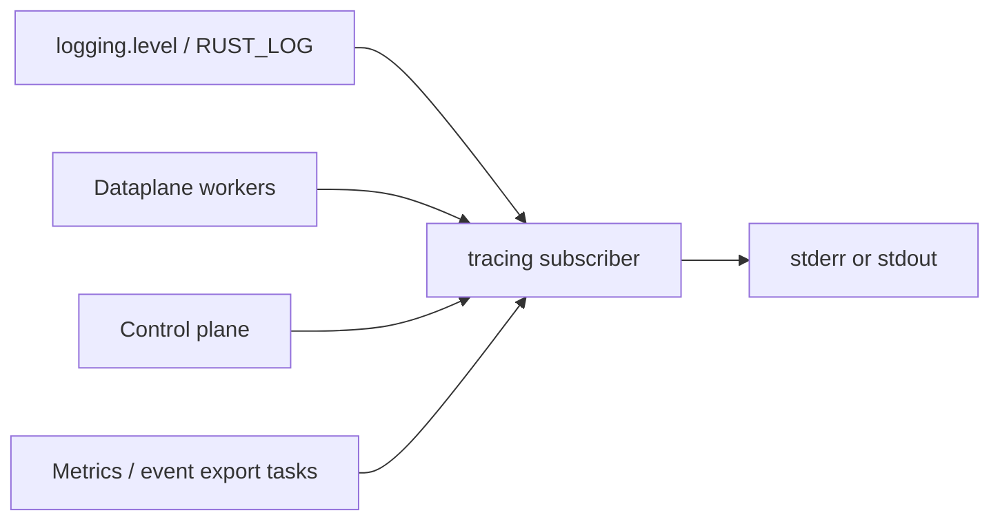

# Logging

Process logs for Conduit — startup, configuration changes, control-plane RPCs, export health, and (at **`debug`**) per-query summaries. Logs are plain text on **stderr** or **stdout**, suitable for journald, Docker log drivers, or a sidecar tail.

Configure **`logging:`** to set process log severity and whether lines go to **stderr** or **stdout**. The subscriber is always active — omitting **`logging:`** still yields **`info`** on stderr for lifecycle events (startup, reload, control RPC access). Per-query **`query complete`** and **`query dropped`** lines are emitted at **`debug`**, so default **`info`** stays quiet under load. For traffic volume and latency, use [Metrics](/observability/metrics.md). For full wire copies or phase-by-phase detail on selected queries, see [Event export](/observability/event-export.md) and [Tracing](/observability/tracing.md).

!!! note "Process logging is not OTLP logs"
    **`logging:`** controls the Rust **`tracing`** subscriber (severity and sink). It is **not** OpenTelemetry log export over OTLP (planned for a future release). OTLP **metrics** use **`metrics.otel`** — see [Metrics](/observability/metrics.md).

!!! note "`logging.level: trace` is not pipeline tracing"
    The config value **`trace`** is maximum **log verbosity**. Per-query **[pipeline traces](/glossary/index.md#pipeline-trace)** are configured under the separate **`tracing:`** block — see [Tracing](/observability/tracing.md).

## Configuration

When the **`logging:`** block is **omitted**, Conduit uses **`info`** level and writes to **stderr**.

```yaml
logging:
  level: info       # error | warn | info | debug | trace
  output: stderr    # stderr | stdout
```

| Setting {: .column-no-wrap } | Meaning |
|---------|---------|
| `logging.level` | Minimum severity emitted. Valid values: **`error`**, **`warn`**, **`info`**, **`debug`**, **`trace`** |
| `logging.output` | **`stderr`** (default) or **`stdout`** |

Validate with `conduitctl validate --file …`. Invalid levels or outputs fail validation before Conduit starts.

### `RUST_LOG` override { #rust_log-override }

If the environment variable **`RUST_LOG`** is set when Conduit starts, it **replaces** `logging.level` for filter construction. This follows common Rust tooling conventions — useful in labs:

```bash
RUST_LOG=conduit=debug,conduit_events=trace conduit /path/to/conduit.yaml
```

Unset **`RUST_LOG`** in production unless you intend to override the config file.

## Log format

Conduit uses structured **`tracing`** output:

- Each line includes a **target** (module path, for example `conduit_core::configurator`).
- Dynamic string fields (qname, pool names, addresses) pass through **`log_text`** — ASCII control characters are stripped so terminals and log shippers see plain text.

ANSI color is **disabled** so logs stay consistent in files and containers.



## Representative log lines

These are the lines operators most often search for. Default **`info`** covers lifecycle and control-plane access; per-query lines require **`debug`** or higher.

### Startup and listeners

After a snapshot is active and listeners bind:

```text
INFO … dataplane startup summary generation=1 listeners=1 pools=1 rules=0 forward_timeout_ms=2000 egress_sources_v4=- egress_sources_v6=- event_sinks=0 events_enabled=false
INFO … configured listener address=127.0.0.1:15353 protocol=udp worker_threads=1
INFO … Starting listening on 127.0.0.1:15353 udp
```

Use **`dataplane startup summary`** to confirm generation, pool/rule counts, forward timeout, egress source lists, and whether event sinks compiled.

### Per-query summaries { #per-query-summaries }

At **`debug`**, each completed [transaction](/glossary/index.md#transaction) emits a structured **`query complete`** line (not shown at default **`info`**):

```text
DEBUG … query complete txn_id=1 dns_id=… qname=example.com. rcode=NOERROR pool=default backend=127.0.0.1:5300 attempts=1
```

Policy **drops** (no reply sent) log at **`debug`** as **`query dropped`**:

```text
DEBUG … query dropped txn_id=2 dns_id=… qname=blocked.example.
```

Enable per-query lines for lab debugging:

```yaml
logging:
  level: debug
  output: stderr
```

The **`txn_id`** field is the internal id used by **`conduitctl trace`** and **`GetTrace`** — see [Tracing](/observability/tracing.md).

### Configuration reload and apply

Successful snapshot swaps:

```text
INFO … config applied generation=2 source=sighup
```

When sections change, Conduit may log concise diffs (pool counts, rule counts, observation sink counts). Listener or forward changes that need a restart log **`pending (restart required)`** — see [Pending reconcile](/glossary/index.md#pending-reconcile).

### Control plane access

When **`control:`** is enabled, each gRPC RPC logs at **`info`** as **`control rpc`**: method path, peer address, requestor identity (**`anonymous`**, **`api_key`**, **`mtls`**, etc. — never the secret value), gRPC status (**`grpc_code`**), and latency. Config RPCs (`ApplyConfig`, `ValidateConfig`, `ReloadFromFile`) also emit a **separate** **`control rpc outcome`** line carrying the application **`outcome`** (**`ok`**/**`rejected`**), **`error_count`**, and **`errors`**. Request and response bodies are **not** logged. A config rejected by validation logs **`grpc_code=Ok`** on the transport line **and** **`outcome=rejected`** on the outcome line, because the verdict is returned in-band, not as a transport error.

Details: [gRPC and conduitctl — Access logs](/control-plane/grpc-and-conduitctl.md#access-logs).

### Optional pipeline trace JSON

When **`tracing.output.log_json: true`**, completed pipeline traces also appear at **`info`** with target **`conduit::trace`**. See [Tracing — JSON log output](/observability/tracing.md#json-log-output).

### Export and observability tasks

At **`debug`** or **`warn`**, you may see per-query summaries, OTEL push results, dnstap reconnect warnings, or Rhai sandbox messages. Enable **`debug`** temporarily when diagnosing queries, export, or scripting.

## Choosing a log level

| Level | Typical use |
|-------|-------------|
| **`error`** | Failures only — startup errors, unrecoverable export failures |
| **`warn`** | Auth rejections, collector outages, other subsystem warnings |
| **`info`** | **Default** — startup summary, config apply, **`control rpc`** |
| **`debug`** | Per-query **`query complete`** / **`query dropped`**, OTEL push detail, internal lifecycle |
| **`trace`** | Maximum verbosity — very noisy; lab use only |

Production deployments usually stay at **`info`**. Use **`debug`** briefly when troubleshooting individual queries, or rely on [Metrics](/observability/metrics.md) for steady-state volume.

## Lab smoke test { #lab-smoke-test }

1. Start Conduit with a minimal config (for example [Minimal configuration](/getting-started/minimal-configuration.md)) — omit **`logging:`** to use defaults.
2. In the process log, confirm at **`info`**:
   - **`dataplane startup summary`** with generation, listener, and pool counts
   - **`configured listener`** and **`Starting listening on`** for your DNS address
3. Send a query: `dig @127.0.0.1 -p 15353 +time=3 smoke.example.com A` (adjust port).
4. At default **`info`**, the log stays **quiet** for per-query traffic — no **`query complete`** line (by design).
5. Stop Conduit. Add or change:

   ```yaml
   logging:
     level: debug
     output: stderr
   ```

   Restart Conduit and send another query.
6. Expect a **`DEBUG`** line **`query complete`** with **`qname`**, **`rcode`**, **`pool`**, **`backend`**, and **`txn_id`** — use **`txn_id`** with [Tracing](/observability/tracing.md) when needed.

Unset **`debug`** after the lab — production should remain at **`info`** unless you are actively investigating.

## Changing logging config

The **`logging:`** block may appear in the [file layer](/glossary/index.md#file-layer) or in an [overlay](/glossary/index.md#overlay) patch (whole-section replace when the overlay includes `logging`).

The log subscriber is initialized **once at process start**. Changing **`level`** or **`output`** requires a **process restart** after updating config — reload updates the stored config document but does not rebind the active subscriber.

## Related topics

- [Config file — `logging`](/control-plane/config-file.md) — top-level block overview
- [Tracing](/observability/tracing.md) — pipeline traces and optional JSON trace logs
- [Metrics](/observability/metrics.md) — Prometheus scrape and OTEL metrics push
- [Event export](/observability/event-export.md) — dnstap sinks
- [gRPC and conduitctl](/control-plane/grpc-and-conduitctl.md) — control RPC access logs
- [Troubleshooting — Observability](/troubleshooting/index.md#observability) — symptom hub
