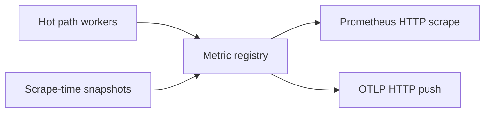

# Metrics

Built-in Prometheus-format metrics for the [dataplane](/glossary/index.md#dataplane): query volume, pool mix, forward health, pipeline timing, and process gauges. Recording and export run off the DNS query path — export backlog does not delay client responses.

## Enabling export

When the **`metrics:`** section is **omitted** from your [config file](/control-plane/config-file.md), built-ins are **off** — no hot-path recording and no scrape or push listener.

To enable built-ins, add a block with **`enabled: true`**, choose a **`profile`**, and configure at least one way to read them out (Prometheus HTTP scrape and/or OTLP HTTP push):

```yaml
metrics:
  enabled: true
  profile: full          # minimal | full | off
  prometheus:
    listen_address: "127.0.0.1:9090"
    path: /metrics
  otel:
    endpoint: "http://127.0.0.1:4318/v1/metrics"
    push_interval_ms: 15000
    allow_invalid_certs: false   # https only: accept invalid server certs when true
    resource_attributes:
      service.name: conduit
      deployment.environment: lab
```

| Setting {: .column-no-wrap } | Meaning |
|---------|---------|
| `metrics.enabled` | Must be `true` for hot-path recording and export |
| `metrics.profile` | **`minimal`** or **`full`** (default **`full`** when enabled and profile is empty or omitted). **`off`** turns recording off even if `enabled` is true |
| `metrics.prometheus` | Optional HTTP scrape listener (`listen_address`, `path`; default path **`/metrics`**) |
| `metrics.otel` | Optional OTLP **metrics** push (`endpoint`, `push_interval_ms`, `allow_invalid_certs`, `resource_attributes`; default interval **15000** ms, minimum **1000**) |

Conduit does not require an export path at validation time — you can set `enabled: true` with no `prometheus` or `otel` block and pay hot-path cost without anywhere to scrape. In practice, configure at least one export path.

Field reference: [Config schema: metrics and tracing](/reference/config-schema/metrics-and-tracing.md).

## Export architecture



Hot-path counters and histograms are updated on listener workers while queries run. Scrape-time gauges (config generation, pool layout, optional process stats) are refreshed when export runs. The same registry backs both Prometheus scrape and OTEL push.

**Prometheus** — bind `listen_address` (for example loopback in production). The endpoint has **no built-in authentication** today (authorization for scrape is planned for a future release); restrict reachability with firewall or bind address. Smoke test after start:

```bash
curl -sS "http://127.0.0.1:9090/metrics" | head
```

**OTEL** — `endpoint` must be an `http://` or `https://` URL for OTLP HTTP (typically ending in `/v1/metrics`). Conduit pushes built-in metrics on `push_interval_ms` over plain HTTP or HTTPS. **`https://`** endpoints validate server certificates against public roots by default; set **`allow_invalid_certs: true`** only for lab collectors with self-signed or otherwise invalid certificates. Optional `resource_attributes` attach resource labels to pushed metrics. Authentication headers for the collector are **not** supported yet (planned for a future release). This is **OTLP metrics only** — not distributed trace or log export (those are planned separately; see [Tracing](/observability/tracing.md) for pipeline traces).

## Profiles

**`minimal`** keeps hot-path cardinality low: query and per-pool counters, plus [`conduit_responses_total`](/observability/built-in-metrics.md#conduit_responses_total) with coarse response-code buckets. **`full`** adds per-qtype labels, parse-failure breakdown, fine response codes, forward latency, phase histograms, retries, and Linux process gauges at scrape time.

Both profiles expose the same scrape-time series except process memory/FD gauges (`full` only). Profile chooses **what** is recorded on the hot path, not **how** you export. Full comparison: [Built-in metrics — Profiles](/observability/built-in-metrics.md#profiles). Lab walkthrough: [Operator metrics profiles](/guides/operator-metrics-profiles.md).

## Changing metrics config

The **`metrics:`** block lives in the [file layer](/glossary/index.md#file-layer) only — [overlay](/glossary/index.md#overlay) patches that include `metrics` are rejected. Edit the file on disk, then **reload** or send **SIGHUP** so validation and the snapshot reflect the change.

Prometheus and OTEL listeners, and which profile is active for hot-path recording, are established at **process start**. Turning built-ins on or off, switching `minimal` ↔ `full`, or changing scrape/push addresses requires a **process restart** after updating the file (reload updates stored config but does not rebind export today). See [Configuration model — What takes effect when](/control-plane/configuration-model.md#what-takes-effect-when) and [Reload and export](/control-plane/reload-and-export.md).

## Where metrics fit the query path

Counters and histograms attach to [pipeline phases](/concepts/architecture-and-packet-path.md#pipeline-phases) ([Parse](/concepts/architecture-and-packet-path.md#parse) through [Send](/concepts/architecture-and-packet-path.md#send)). The architecture page links each phase to the relevant series.

Exhaustive list — every built-in name, label, and **when** it increments: **[Built-in metrics](/observability/built-in-metrics.md)**. The same scrape or push payload also includes [event-export counters](/observability/built-in-metrics.md#event-export) when `events:` is configured. [Rhai](/rhai/index.md) scripts can register **`conduit_user_*`** series via [User metrics](/rhai/user-metrics.md).

Built-in labels never include `qname`, client IP, or transaction id. Use [Event export](/observability/event-export.md) or [Tracing](/observability/tracing.md) for per-query detail.

!!! note "Pipeline tracing is not OTEL traces"
    The separate **`tracing:`** config block enables optional per-query **pipeline traces** (`GetTrace`, JSON log output). That is not OpenTelemetry distributed trace export over OTLP (planned for a future release).

## Related topics

- [Built-in metrics](/observability/built-in-metrics.md) — series reference and PromQL examples
- [Architecture and packet path](/concepts/architecture-and-packet-path.md) — phase-by-phase metric hooks
- [Metrics and tracing](/guides/metrics-and-tracing.md) — end-to-end lab (metrics scrape + pipeline tracing)
- [Event export and dnstap](/guides/event-export-dnstap.md) — wire-level tap lab
