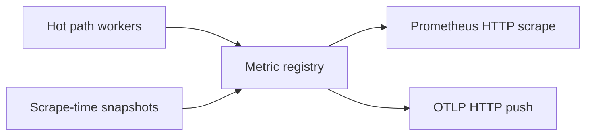

# Metrics

Conduit exposes built-in Prometheus-format metrics for the [dataplane](/glossary/index.md#dataplane) — query volume, pool mix, forward health, pipeline timing, and process gauges. Recording and export run off the DNS query path, so export backlog does not delay client responses.

## Enabling export

When the **`metrics:`** section is **omitted** from your [config file](/control-plane/config-file.md), built-ins are **off** — no hot-path recording and no scrape or push listener.

To enable built-ins, add a block with **`enabled: true`**, choose a **`base`** (or legacy **`profile`** alias), and configure at least one way to read them out (Prometheus HTTP scrape and/or OTLP HTTP push):

```yaml
metrics:
  enabled: true
  base: standard          # none | minimal | standard
  prometheus:
    listen_address: "127.0.0.1:9090"
    path: /metrics
  otel:
    endpoint: "http://127.0.0.1:4318/v1/metrics"
    push_interval_ms: 15000
    allow_invalid_certs: false   # https only: accept invalid server certs when true
    resource_attributes:
      service.name: conduit
      deployment.environment: lab
```

| Setting {: .column-no-wrap } | Meaning |
|---------|---------|
| `metrics.enabled` | Must be `true` for hot-path recording and export |
| `metrics.base` | **`minimal`**, **`standard`** (default when enabled and unset), or **`none`** (requires `categories.include`). Legacy **`profile`**: `minimal` / `full`→`standard` / `off` |
| `metrics.prometheus` | Optional HTTP scrape listener (`listen_address`, `path`; default path **`/metrics`**) |
| `metrics.otel` | Optional OTLP **metrics** push (`endpoint`, `push_interval_ms`, `allow_invalid_certs`, `resource_attributes`; default interval **15000** ms, minimum **1000**) |

Conduit does not require an export path at validation time — you can set `enabled: true` with no `prometheus` or `otel` block and pay hot-path cost without anywhere to scrape. In practice, configure at least one export path.

Configure categories, collect/emit, and granularity in [Metrics configurability](/observability/metrics-configurability.md). Exact keys are in [Config schema: metrics and tracing](/reference/config-schema/metrics-and-tracing.md).

## Export architecture



Hot-path counters and histograms are updated on listener workers while queries run. Scrape-time gauges (config generation, pool layout, optional process stats) are refreshed when export runs. The same registry backs both Prometheus scrape and OTEL push.

For Prometheus scrape, set `listen_address` to where the HTTP `/metrics` listener should bind — typically loopback in production so only local scrapers can reach it. The endpoint has **no built-in authentication**; restrict reachability with a firewall or a tight bind address. After start, confirm the scrape path responds:

```bash
curl -sS "http://127.0.0.1:9090/metrics" | head
```

For OTLP push, `endpoint` must be an `http://` or `https://` URL for OTLP HTTP (typically ending in `/v1/metrics`). Conduit pushes built-in metrics on `push_interval_ms` over plain HTTP or HTTPS. **`https://`** endpoints validate server certificates against public roots by default; set **`allow_invalid_certs: true`** only for lab collectors with self-signed or otherwise invalid certificates. Optional `resource_attributes` attach resource labels to pushed metrics. Optional **`metrics.otel.headers`** (map of string keys to values) are sent as HTTP headers on each OTLP push — use for collector bearer tokens or API keys. This is **OTLP metrics only** — not distributed trace or log export (see [Tracing](/observability/tracing.md) for in-process pipeline traces). For a local smoke lab with **`conduit-otlp-metrics-tracer`**, see [OTLP metrics push smoke](/guides/otlp-metrics-push.md).

For a lab collector that expects a bearer token:

```yaml
metrics:
  enabled: true
  otel:
    endpoint: "https://collector.example:4318/v1/metrics"
    headers:
      Authorization: "Bearer <token>"
```

## Bases (what to record)

**`minimal`** keeps hot-path cardinality low: query and per-pool counters, coarse response-code buckets, essential failure counters, lookup, topology, meta, and **health** (when probes are configured). **`standard`** adds timing histograms, cache/forward detail, runtime gauges, and process gauges — a curated bundle, not every registry family. Tune further in [Metrics configurability](/observability/metrics-configurability.md); see [Built-in metric registry](/observability/built-in-metric-registry.md) for membership tables and [Operator metrics bases](/guides/operator-metrics-bases.md) for a lab walkthrough.

## Changing metrics config

The **`metrics:`** block may appear in [overlay](/glossary/index.md#overlay) patches and uses **deep merge** ([Overlay merge strategy](/control-plane/overlay-merge-strategy.md)). Plan knobs (base, categories, collect/emit, granularity) apply on snapshot apply without restart. Prometheus listen address/path **hot-rebinds**; OTLP endpoint/TLS **reconnects**. Bind or reconnect failure rejects the apply and keeps last-good export. See [Metrics configurability — Overlay and live apply](/observability/metrics-configurability.md#overlay-and-live-apply) and [Configuration model — What takes effect when](/control-plane/configuration-model.md#what-takes-effect-when).

## Where metrics fit the query path

Counters and histograms attach to [pipeline phases](/concepts/architecture-and-packet-path.md#pipeline-phases) ([Parse](/concepts/architecture-and-packet-path.md#parse) through [Send](/concepts/architecture-and-packet-path.md#send)). The architecture page links each phase to the relevant series.

Every built-in name, label, and **when** it increments is listed in **[Built-in metrics](/observability/built-in-metrics.md)**. The same scrape or push payload also includes [event-export counters](/observability/built-in-metrics.md#event-export) when `events:` is configured. [Rhai](/rhai/index.md) scripts can register **`conduit_user_*`** series via [User metrics](/rhai/user-metrics.md); per-metric **collect** / **emit** (and legacy **`export`**) control recording and export — on **`base: minimal`**, unlisted script metrics stay off (increments no-op with a warning) until you opt them in.

Built-in labels never include `qname`, client IP, or transaction id. Use [Event export](/observability/event-export.md) or [Tracing](/observability/tracing.md) for per-query detail.

!!! note "Pipeline tracing is not OTEL traces"
    The separate **`tracing:`** config block enables optional per-query **pipeline traces** (`GetTrace`, JSON log output). That is not OpenTelemetry distributed trace export over OTLP (not implemented).

## Related topics

- [Metrics configurability](/observability/metrics-configurability.md) — base, categories, collect/emit, granularity, overlay
- [Built-in metric registry](/observability/built-in-metric-registry.md) — membership and dimensions
- [Built-in metrics](/observability/built-in-metrics.md) — series reference and PromQL examples
- [Architecture and packet path](/concepts/architecture-and-packet-path.md) — phase-by-phase metric hooks
- [Metrics and tracing](/guides/metrics-and-tracing.md) — end-to-end lab (metrics scrape + pipeline tracing)
- [Operator metrics bases](/guides/operator-metrics-bases.md) — **`minimal`** vs **`standard`** on the same traffic
- [Metrics beyond bases](/guides/metrics-beyond-bases.md) — categories, collect/emit, granularity, overlay rebind
- [Event export and dnstap](/guides/event-export-dnstap.md) — wire-level tap lab
