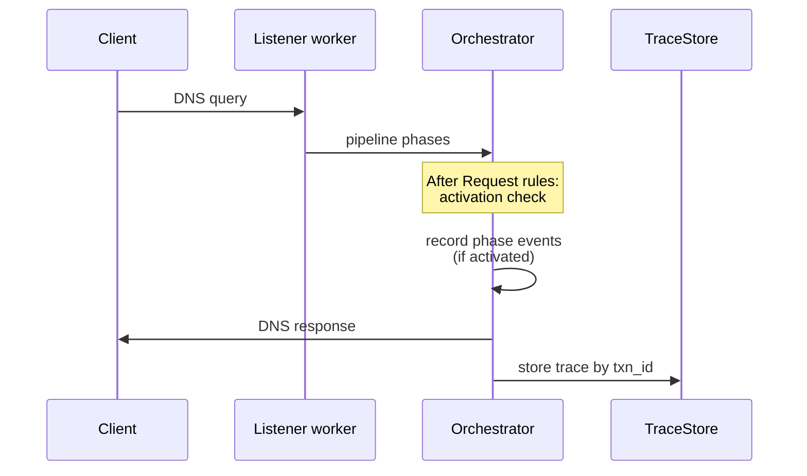

# Tracing

Optional per-query **[pipeline traces](/glossary/index.md#pipeline-trace)** for the [dataplane](/glossary/index.md#dataplane): which [phases](/concepts/architecture-and-packet-path.md#pipeline-phases) ran, cumulative elapsed time, and selected pool/backend at each step. Tracing is **off by default** — when disabled, Conduit does not allocate trace buffers on the query path.

Use tracing when you need to debug routing, forwarding, or retries on **specific** queries. For aggregate volume and latency, use [Metrics](/observability/metrics.md). For wire-level query/response export to a collector, use [Event export](/observability/event-export.md).

!!! note "Pipeline tracing is not OTEL traces"
    The **`tracing:`** config block controls **in-process pipeline traces** stored for `GetTrace` / `conduitctl trace` and optional JSON log output. It is **not** OpenTelemetry distributed trace export over OTLP (planned for a future release). OTLP **metrics** live under **`metrics.otel`** — see [Metrics](/observability/metrics.md).

## Enabling tracing

Add a **`tracing:`** block with **`enabled: true`**. The [control plane](/glossary/index.md#control-plane) must be running if you want to fetch traces with **`conduitctl trace`** or gRPC **`GetTrace`**.

```yaml
control:
  listen_address: "127.0.0.1:5199"
tracing:
  enabled: true
  activation:
    tag: trace
    selectors:
      - type: qtype
        value: A
    sample_percent: 100
  output:
    log_json: false
```

| Setting {: .column-no-wrap } | Meaning |
|---------|---------|
| `tracing.enabled` | Must be **`true`** for activation and recording |
| `tracing.activation` | Optional filters — which transactions get a trace (see [Activation](#activation)) |
| `tracing.output.log_json` | When **`true`**, emit completed traces as JSON on the process log at **`info`** (`target: conduit::trace`) |

Field reference: [Config schema: metrics and tracing](/reference/config-schema/metrics-and-tracing.md).

## How tracing fits the query path



1. The query walks the normal pipeline ([Parse](/concepts/architecture-and-packet-path.md#parse) through [Send](/concepts/architecture-and-packet-path.md#send)).
2. After **[Request rules](/concepts/architecture-and-packet-path.md#request-rules)** complete, Conduit evaluates **activation** once per [transaction](/glossary/index.md#transaction). Matching queries allocate an in-memory trace buffer.
3. Each completed pipeline phase appends a **trace event** (phase name, elapsed microseconds since transaction start, optional pool/backend).
4. At transaction completion, the trace is inserted into a bounded in-memory **TraceStore** (1000 entries, 5 minute TTL). Optionally, **`log_json`** writes the same events to stderr/stdout.

Non-matching queries pay **no** trace allocation cost.

## Activation

**Activation** decides which transactions receive a pipeline trace. All configured clauses must pass (logical **AND**). Evaluated **after Request rules**, so [tags](/glossary/index.md#tags) set in request policy are visible to activation.

| Field {: .column-no-wrap } | Meaning |
|-------|---------|
| **`activation.tag`** | Transaction must have the named tag key (same semantics as `tag_required` on [event export](/observability/event-export.md) sinks) |
| **`activation.selectors`** | [Selector](/glossary/index.md#selector) list — same types as [rules](/policy-routing/rules-and-actions.md): `qname_suffix`, `qname_exact`, `qtype`, `rcode`, `tag`. **All** must match |
| **`activation.sample_percent`** | Float in **[0, 100]**; deterministic per-transaction sampling (default **100**). Uses the same algorithm as event-export `sample_percent` |

When **`activation`** is omitted, every transaction matches (subject to **`sample_percent`** default **100**).

Example — trace only `A` queries that carry a `debug` tag:

```yaml
tracing:
  enabled: true
  activation:
    tag: debug
    selectors:
      - type: qtype
        value: A
    sample_percent: 25
```

Tag the transaction in [Request rules](/policy-routing/rules-and-actions.md) (or [Rhai](/rhai/index.md)) before activation runs:

```yaml
rules:
  match_mode: first_match
  rules:
    - name: tag-debug
      hook: request
      selectors:
        - type: qname_suffix
          value: "lab.example."
      actions:
        - type: set_tag
          value: debug=1
```

!!! tip "Selectors at activation time"
    Activation runs after Request rules, before [Route](/concepts/architecture-and-packet-path.md#route). Selectors that depend on **`rcode`** or final pool/backend usually will not match at activation — prefer **`qname`**, **`qtype`**, and **tags** for trace gating.

## Trace events

Each event in a stored trace has:

| Field {: .column-no-wrap } | Meaning |
|-------|---------|
| **`phase`** | Pipeline phase name — for example `parse`, `request_rules`, `route`, `forward`, `wait_response`, `response_rules`, `send` |
| **`elapsed_us`** | Microseconds since the transaction **started** (cumulative, not per-phase delta) |
| **`pool`** | Selected pool at that phase, when applicable |
| **`backend`** | Selected backend at that phase, when applicable |
| **`message`** | Optional detail string (reserved for future use) |

Retries re-enter the pipeline; you will see additional **`route`** / **`forward`** / **`response_rules`** events on the same transaction trace.

## Fetching traces

Traces are keyed by internal **transaction id** (`txn_id`). In lab setups the first query is often **`1`** (incrementing per worker). With **`logging.level: debug`**, Conduit also logs **`txn_id`** on each **`query complete`** line — use that value with the CLI or gRPC.

### `conduitctl trace`

Requires a running control plane and matching **`control.listen_address`** (or **`CONDUIT_CONTROL`**):

```bash
conduitctl trace 1
```

Prints one line per event: phase, elapsed microseconds, pool, backend, message. Exits non-zero if no trace was found (wrong id, TTL expired, or activation did not match).

Details: [gRPC and conduitctl — trace](/control-plane/grpc-and-conduitctl.md#trace).

### gRPC `GetTrace`

```bash
grpcurl -plaintext \
  -d '{"txn_id":"1"}' \
  127.0.0.1:5199 \
  conduit.v1.ConduitControl/GetTrace
```

Returns **`found`** and an **`events`** array with the same fields as above. Traces expire after **5 minutes** or when the store exceeds **1000** entries (oldest evicted).

## JSON log output

When **`output.log_json: true`**, Conduit logs the completed trace as JSON at **`info`** with log target **`conduit::trace`**:

```text
INFO conduit::trace: pipeline trace txn_id=42 events=[{"phase":"parse","elapsed_us":12,...}, ...]
```

Use this for ad hoc debugging or shipping traces to a log aggregator. It is separate from **`logging.level`** and from planned OTLP log export.

## Cost and when to enable

| State | Hot-path cost |
|-------|----------------|
| **`tracing:` omitted** or **`enabled: false`** | None — no trace buffer |
| **Enabled, activation does not match** | Activation check only |
| **Enabled, trace captured** | Per-phase append + store insert at completion |

Keep tracing **disabled** in production unless you need it. Use **activation** (`tag`, selectors, **`sample_percent`**) to limit volume — same spirit as [event export](/observability/event-export.md) filters.

Built-in [phase histograms](/observability/built-in-metrics.md) (`conduit_phase_duration_seconds`, **`full`** profile) provide aggregate timing without per-query storage.

## Changing tracing config

The **`tracing:`** block lives in the [file layer](/glossary/index.md#file-layer) only — [overlay](/glossary/index.md#overlay) patches that include `tracing` are rejected. Edit the file on disk, then **reload** or send **SIGHUP** so validation and the snapshot reflect the change.

Tracing activation rules and **`log_json`** are compiled into the process at **startup** from the initial config. Turning tracing on or off, changing activation, or toggling **`log_json`** requires a **process restart** after updating the file (same limitation as [metrics export listeners](/observability/metrics.md#changing-metrics-config)). See [Configuration model — What takes effect when](/control-plane/configuration-model.md#what-takes-effect-when).

## Lab smoke test

1. Start an upstream resolver on **`127.0.0.1:5300`** (or adjust pool backend in your config).
2. Start Conduit with **`control:`** and **`tracing.enabled: true`** (minimal example in [Enabling tracing](#enabling-tracing)).
3. Send a matching query: `dig @127.0.0.1 -p 15353 +time=3 test.example.com A`.
4. Run **`conduitctl trace 1`** (or **`GetTrace`** via grpcurl). If unsure of the id, set **`logging.level: debug`** and read **`txn_id`** from a **`query complete`** line.

Expect phases such as **`route`**, **`forward`**, and **`send`**.

## Related topics

- [Config schema: metrics and tracing](/reference/config-schema/metrics-and-tracing.md) — field reference
- [Architecture and packet path](/concepts/architecture-and-packet-path.md) — pipeline phases traced
- [Event export](/observability/event-export.md) — dnstap and tag-gated export
- [Metrics](/observability/metrics.md) — aggregate observability
- [gRPC and conduitctl](/control-plane/grpc-and-conduitctl.md) — `trace` subcommand and control plane setup
- [Logging](/observability/logging.md) — process log levels and query summary lines
