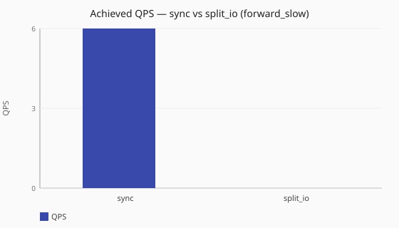
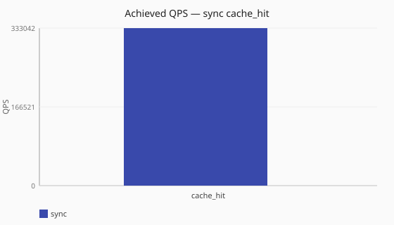
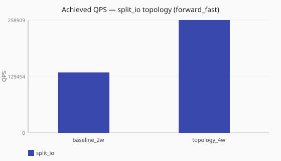
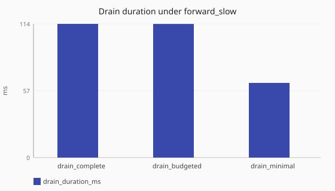
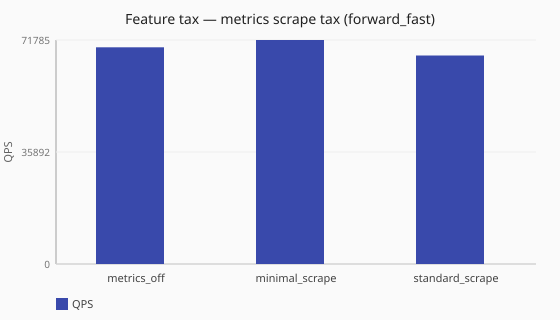
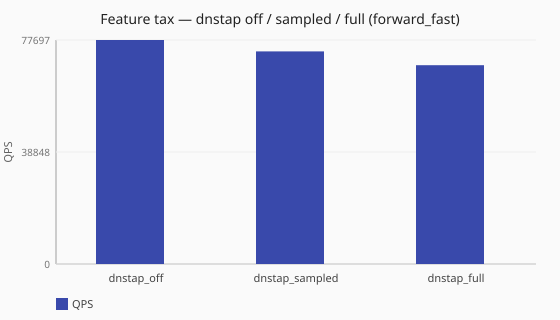
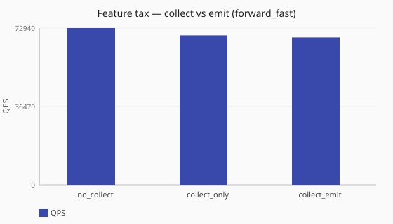
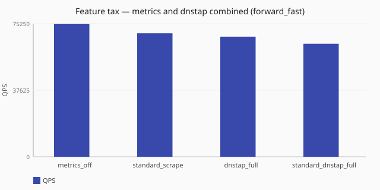
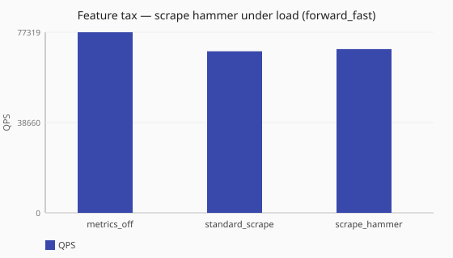
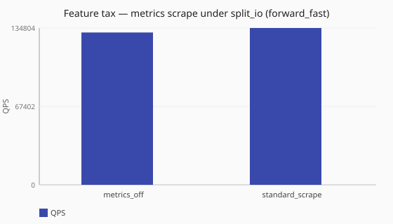

# Performance reference results

Same-host comparisons from the named maintainer workstation lab profile
(`maintainer-ws-1`). Prefer reading each chart relative to its baseline cells
on that host. These are **not** service-level objectives. Reproduce on your
hardware with the
[harness instructions](/performance/reproduce.md) before making capacity decisions.
Absolute QPS is not a portable cross-host capacity claim.

<!-- perf-ann:ann-forward-slow-lossy-context:start -->
!!! warning "forward_slow scale/ladder cells — stressed / inconclusive for ranking"
    Several promoted [`forward_slow`](/performance/methodology.md#load-shapes) scale and
    worker-ladder cells show very low achieved QPS with high dnsperf query loss. Under
    the published load model (timed window, no offered-QPS cap, dnsperf default max
    outstanding ≈ 100), an artificially delayed upstream fills the outstanding window
    quickly, so these charts are poor for ranking
    [`sync`](/concepts/runtime-and-concurrency.md#sync-runtime-default) vs
    [`split_io`](/concepts/runtime-and-concurrency.md#split-io-runtime) or worker counts.
    Prefer [`forward_fast`](/performance/methodology.md#load-shapes) cells for clean
    same-host deltas; treat `forward_slow` here as a stress recipe until a
    publish-quality remeasure replaces the cells. See
    [How load is applied](/performance/methodology.md#how-load-is-applied-not-a-fixed-offered-qps).
<!-- perf-ann:ann-forward-slow-lossy-context:end -->

<!-- perf-reference-body:start -->
_Generated 2026-08-01T03:04:34Z from committed reference JSON (no live load suite in docs CI)._

## Lab profile

| Field | Value |
| --- | --- |
| Profile id | `maintainer-ws-1` |
| Display name | Maintainer workstation (maintainer-ws-1) |
| CPU | Intel(R) Core(TM) i9-14900K |
| Cores (physical / logical) | 32 / 32 |
| OS | Linux 6.8.0-136-generic |
| Conduit | `target/release/conduit` (unknown) |
| Loadgen | dnsperf mode=`docker` |
| Run generated_at | `2026-08-01T02:58:53Z` |

Underlying JSON: [`perf/results/references/`](https://github.com/egon1024/DNSConduit/tree/main/perf/results/references) (see `latest-reference.json` pointer in a checkout).

Scenario intents: [Performance scenarios](/performance/scenarios.md). Decision-shaped comparisons: [Tuning evidence (studies)](/performance/studies/index.md).

## Scale

### Achieved QPS — sync vs split_io (forward_fast)

[Download CSV](generated/scale-sync-vs-split-io-forward-fast.csv)

| Scenario | Runtime | Achieved QPS | Avg latency (ms) | Sent | Completed | Lost | Workers |
| --- | --- | --- | --- | --- | --- | --- | --- |
| [scale-sync-forward-fast](/performance/scenarios.md#scale-sync-forward-fast) | sync | 211448.9 | 1.3 | 2118239 | 2114785 | 3662 | ingress=2 |
| [scale-split-io-forward-fast](/performance/scenarios.md#scale-split-io-forward-fast) | split_io | 364056.4 | 2.2 | 3644026 | 3642237 | 2395 | ingress=2, policy=2, io=2 |

### Achieved QPS — sync vs split_io (forward_slow)

[Download CSV](generated/scale-sync-vs-split-io-forward-slow.csv)

| Scenario | Runtime | Achieved QPS | Avg latency (ms) | Sent | Completed | Lost | Workers |
| --- | --- | --- | --- | --- | --- | --- | --- |
| [scale-sync-forward-slow](/performance/scenarios.md#scale-sync-forward-slow) | sync | 10.2 | 1651.1 | 340 | 153 | 187 | ingress=2 |
| [scale-split-io-forward-slow](/performance/scenarios.md#scale-split-io-forward-slow) | split_io | 10.9 | 3320.2 | 298 | 161 | 137 | ingress=2, policy=2, io=2 |

### Achieved QPS — sync cache_hit

[Download CSV](generated/scale-cache-hit.csv)

| Scenario | Runtime | Achieved QPS | Avg latency (ms) | Sent | Completed | Lost | Workers |
| --- | --- | --- | --- | --- | --- | --- | --- |
| [scale-sync-cache-hit](/performance/scenarios.md#scale-sync-cache-hit) | sync | 348813.4 | 0.9 | 3491802 | 3488443 | 3366 | ingress=2 |

### Achieved QPS — split_io topology (forward_fast)

[Download CSV](generated/scale-topology-heavy.csv)

| Scenario | Runtime | Achieved QPS | Avg latency (ms) | Sent | Completed | Lost | Workers |
| --- | --- | --- | --- | --- | --- | --- | --- |
| [scale-split-io-forward-fast](/performance/scenarios.md#scale-split-io-forward-fast) | split_io | 364056.4 | 2.2 | 3644026 | 3642237 | 2395 | ingress=2, policy=2, io=2 |
| [scale-split-io-topology-heavy](/performance/scenarios.md#scale-split-io-topology-heavy) | split_io | 601897.6 | 2.7 | 6021233 | 6020309 | 611 | ingress=4, policy=4, io=4 |

## Shutdown drain

### Drain duration under forward_slow

[Download CSV](generated/shutdown-drain-forward-slow.csv)

| Drain policy | Drain duration (ms) | Client failures during stop | QPS | Avg latency (ms) | Sent | Completed |
| --- | --- | --- | --- | --- | --- | --- |
| [drain_complete](/performance/scenarios.md#shutdown-drain-complete-forward-slow) | 113.9 | 300 | 3.2 | 949.9 | 339 | 39 |
| [drain_budgeted](/performance/scenarios.md#shutdown-drain-budgeted-forward-slow) | 163.6 | 200 | 5.0 | 1022.3 | 240 | 40 |
| [drain_minimal](/performance/scenarios.md#shutdown-drain-minimal-forward-slow) | 63.8 | 200 | 4.9 | 996.3 | 239 | 39 |

## Feature tax

### Feature tax — metrics scrape ladder (forward_fast)

[Download CSV](generated/feature-tax-metrics-scrape.csv)

| Posture | Achieved QPS | Avg latency (ms) | Sent | Completed | Lost |
| --- | --- | --- | --- | --- | --- |
| [metrics_off](/performance/scenarios.md#feature-tax-metrics-off-scrape-ladder-forward-fast) | 138672.0 | 2.2 | 1390396 | 1387024 | 3377 |
| [minimal_scrape](/performance/scenarios.md#feature-tax-metrics-minimal-scrape-ladder-forward-fast) | 131434.7 | 2.1 | 1318106 | 1314639 | 3467 |
| [standard_scrape](/performance/scenarios.md#feature-tax-metrics-standard-scrape-ladder-forward-fast) | 121094.1 | 1.5 | 1214666 | 1211244 | 3508 |

### Feature tax — dnstap off / sampled / full (forward_fast)

[Download CSV](generated/feature-tax-dnstap.csv)

| Posture | Achieved QPS | Avg latency (ms) | Sent | Completed | Lost |
| --- | --- | --- | --- | --- | --- |
| [dnstap_off](/performance/scenarios.md#feature-tax-dnstap-off-forward-fast) | 135510.5 | 2.2 | 1358795 | 1355390 | 3405 |
| [dnstap_sampled](/performance/scenarios.md#feature-tax-dnstap-sampled-forward-fast) | 126869.3 | 2.1 | 1272698 | 1269237 | 3461 |
| [dnstap_full](/performance/scenarios.md#feature-tax-dnstap-full-forward-fast) | 113838.8 | 2.6 | 1142096 | 1138671 | 3425 |

### Feature tax — collect vs emit (forward_fast)

[Download CSV](generated/feature-tax-collect-emit.csv)

| Posture | Achieved QPS | Avg latency (ms) | Sent | Completed | Lost |
| --- | --- | --- | --- | --- | --- |
| [no_collect](/performance/scenarios.md#feature-tax-metrics-no-collect-forward-fast) | 128663.3 | 2.1 | 1290379 | 1286917 | 3462 |
| [collect_only](/performance/scenarios.md#feature-tax-metrics-collect-only-forward-fast) | 121086.6 | 1.6 | 1214611 | 1211152 | 3484 |
| [collect_emit](/performance/scenarios.md#feature-tax-metrics-collect-emit-forward-fast) | 117515.8 | 2.6 | 1178865 | 1175436 | 3429 |

### Feature tax — metrics and dnstap combined (forward_fast)

[Download CSV](generated/feature-tax-combined.csv)

| Posture | Achieved QPS | Avg latency (ms) | Sent | Completed | Lost |
| --- | --- | --- | --- | --- | --- |
| [metrics_off](/performance/scenarios.md#feature-tax-metrics-off-forward-fast) | 138760.8 | 2.0 | 1391423 | 1387890 | 3449 |
| [standard_scrape](/performance/scenarios.md#feature-tax-metrics-standard-scrape-forward-fast) | 121399.7 | 2.3 | 1217696 | 1214291 | 3449 |
| [dnstap_full](/performance/scenarios.md#feature-tax-dnstap-full-forward-fast) | 113838.8 | 2.6 | 1142096 | 1138671 | 3425 |
| [standard_dnstap_full](/performance/scenarios.md#feature-tax-metrics-standard-dnstap-full-forward-fast) | 106763.8 | 1.7 | 1071331 | 1067929 | 3553 |

### Feature tax — scrape hammer under load (forward_fast)

[Download CSV](generated/feature-tax-scrape-hammer.csv)

| Posture | Achieved QPS | Avg latency (ms) | Sent | Completed | Lost |
| --- | --- | --- | --- | --- | --- |
| [metrics_off](/performance/scenarios.md#feature-tax-metrics-off-forward-fast) | 138760.8 | 2.0 | 1391423 | 1387890 | 3449 |
| [standard_scrape](/performance/scenarios.md#feature-tax-metrics-standard-scrape-forward-fast) | 121399.7 | 2.3 | 1217696 | 1214291 | 3449 |
| [scrape_hammer](/performance/scenarios.md#feature-tax-metrics-standard-scrape-hammer-forward-fast) | 117989.8 | 2.4 | 1183610 | 1180188 | 3441 |

### Feature tax — metrics scrape under split_io (forward_fast)

[Download CSV](generated/feature-tax-scrape-split-io.csv)

| Posture | Achieved QPS | Avg latency (ms) | Sent | Completed | Lost |
| --- | --- | --- | --- | --- | --- |
| [metrics_off](/performance/scenarios.md#feature-tax-metrics-off-split-io-forward-fast) | 373534.0 | 2.6 | 3738747 | 3736729 | 2018 |
| [standard_scrape](/performance/scenarios.md#feature-tax-metrics-standard-scrape-split-io-forward-fast) | 284907.8 | 3.7 | 2852838 | 2850456 | 1822 |

<!-- perf-reference-body:end -->

## Related

- [Methodology](/performance/methodology.md)
- [Reproduce against a binary](/performance/reproduce.md)
- [Tuning evidence (studies)](/performance/studies/index.md)
- [Scenario descriptions](/performance/scenarios.md)
- [Runtime and concurrency](/concepts/runtime-and-concurrency.md)
- [Dataplane runtime tuning](/guides/dataplane-runtime-tuning.md)
