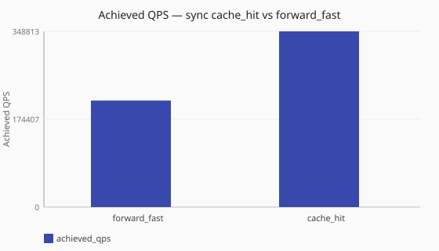

# Cache hit vs forward_fast

How much does a warm lookup cache change throughput versus [`forward_fast`](/performance/methodology.md#load-shapes) under
[`sync`](/concepts/runtime-and-concurrency.md#sync-runtime-default)?

Numbers are same-host comparisons on a single reference host and are **not**
service-level objectives. See the
[performance hub disclaimer](/performance/index.md).

## When this matters

[Cache-hit](/guides/dns-answer-cache.md) traffic is a different performance regime
than forwarding. Use this pair to bound expectations when the
[lookup cache](/concepts/architecture-and-packet-path.md#lookup) is effective, not
as a claim that production traffic is mostly hits. Configure instances under
[`caches:`](/reference/config-schema/caches.md) and wire them through
[`lookup` profiles](/reference/config-schema/lookup.md).

## What we varied

- **Varied:** load shape
  ([`forward_fast`](/performance/scenarios.md#scale-sync-forward-fast) vs warmed
  [`cache_hit`](/performance/scenarios.md#scale-sync-cache-hit))
- **Held constant:** [`sync`](/concepts/runtime-and-concurrency.md#sync-runtime-default) runtime,
  ingress workers, observability off

<!-- perf-study-evidence:start -->
## Evidence

### Achieved QPS — sync cache_hit vs forward_fast

[Download CSV](../generated/cache-hit-vs-forward-fast.csv)

| Load shape | Runtime | Achieved QPS | Avg latency (ms) | Sent | Completed | Lost | Workers |
| --- | --- | --- | --- | --- | --- | --- | --- |
| [forward_fast](/performance/scenarios.md#scale-sync-forward-fast) | sync | 76269.9 | 26.1 | 765379 | 765379 | 0 | ingress=2 |
| [cache_hit](/performance/scenarios.md#scale-sync-cache-hit) | sync | 331636.6 | 6.0 | 3318431 | 3318431 | 0 | ingress=2 |

<!-- perf-study-evidence:end -->

<!-- perf-study-deltas:start -->
## At a glance

- **sync cache_hit vs forward_fast:** `cache_hit` is about **4.3×** `forward_fast` (~332k vs ~76k).
<!-- perf-study-deltas:end -->

## Takeaway

**A warm cache is much faster than forwarding on this lab.** Under
[`cache_hit`](/performance/methodology.md#load-shapes), sync reaches about
**4.3×** the QPS of [`forward_fast`](/performance/methodology.md#load-shapes)
(~332k vs ~76k) with lower latency.

Treat that multiplier as an upper bound for “almost everything hits,” not as a
capacity target or a claim about *your* hit rate.

## Related guides

- [DNS answer cache](/guides/dns-answer-cache.md)
- [Architecture and packet path — Lookup](/concepts/architecture-and-packet-path.md#lookup)
- [Reference: caches](/reference/config-schema/caches.md)
- [Reference: lookup](/reference/config-schema/lookup.md)

## Member scenarios

- [scale-sync-forward-fast](/performance/scenarios.md#scale-sync-forward-fast)
- [scale-sync-cache-hit](/performance/scenarios.md#scale-sync-cache-hit)

## Related

- [Studies hub](/performance/studies/index.md)
- [Reference results](/performance/reference.md)
- [Methodology](/performance/methodology.md)
