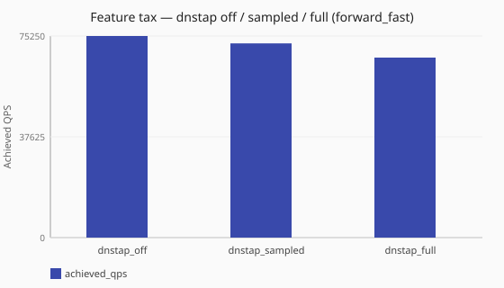

# Dnstap emit tax

What does sampled vs fuller dnstap emission cost versus dnstap off?

Numbers are same-host comparisons on a single reference host and are **not**
service-level objectives. See the
[performance hub disclaimer](/performance/index.md).

## When this matters

[Event export](/observability/event-export.md) (dnstap / events) is powerful for
traffic forensics and can tax the datapath when emitting query/response
surfaces. Export is designed to stay off the DNS hot path — a full queue
[drops events](/observability/event-export.md#overload-and-metrics) rather than
delaying client replies — but producers still pay to build and enqueue frames.
Compare sinks off, sampled (~10% responses), and fuller emit under the same
[`forward_fast`](/performance/methodology.md#load-shapes) load before enabling broad production capture. Lab walkthrough:
[Event export and dnstap](/guides/event-export-dnstap.md).

## What we varied

- **Varied:** dnstap/events posture
  ([`dnstap_off`](/performance/scenarios.md#feature-tax-dnstap-off-forward-fast) →
  [`dnstap_sampled`](/performance/scenarios.md#feature-tax-dnstap-sampled-forward-fast) →
  [`dnstap_full`](/performance/scenarios.md#feature-tax-dnstap-full-forward-fast))
- **Held constant:** [`sync`](/concepts/runtime-and-concurrency.md#sync-runtime-default) runtime,
  [`forward_fast`](/performance/methodology.md#load-shapes), ingress workers, dnsperf recipe

<!-- perf-study-evidence:start -->
## Evidence

### Feature tax — dnstap off / sampled / full (forward_fast)

[Download CSV](../generated/dnstap-off-sampled-full-forward-fast.csv)

| Posture | Runtime | Achieved QPS | Avg latency (ms) | Sent | Completed | Lost | Workers |
| --- | --- | --- | --- | --- | --- | --- | --- |
| [dnstap_off](/performance/scenarios.md#feature-tax-dnstap-off-forward-fast) | sync | 75505.8 | 26.4 | 757062 | 757062 | 0 | ingress=2 |
| [dnstap_sampled](/performance/scenarios.md#feature-tax-dnstap-sampled-forward-fast) | sync | 71108.5 | 28.0 | 714045 | 714045 | 0 | ingress=2 |
| [dnstap_full](/performance/scenarios.md#feature-tax-dnstap-full-forward-fast) | sync | 67911.4 | 29.4 | 681855 | 681855 | 0 | ingress=2 |

<!-- perf-study-evidence:end -->

<!-- perf-study-deltas:start -->
## At a glance

- **dnstap off / sampled / full (forward_fast):** `dnstap_sampled` costs about **6%** QPS versus `dnstap_off` (~71k vs ~76k); `dnstap_full` costs about **10%** QPS versus `dnstap_off` (~68k vs ~76k).
<!-- perf-study-deltas:end -->

## Takeaway

**Dnstap costs scale with how much you emit.** Versus dnstap off on this lab
(~75k), sampled emit costs about **4%** QPS (~72k), and full emit about
**11%** (~67k).

**What to do:** leave dnstap off until you have a consumer. Prefer **sampled**
for standing capture; turn on fuller emit only for surfaces you will store and
query. Configure emit under
[What to emit](/observability/event-export.md#what-to-emit) /
[`events`](/reference/config-schema/events.md). If scrape is also on, see
[Combined metrics + dnstap](/performance/studies/metrics-dnstap-combined-tax.md).

## Related guides

- [Event export](/observability/event-export.md)
- [Event export and dnstap](/guides/event-export-dnstap.md)
- [Reference: events](/reference/config-schema/events.md)
- [Combined metrics + dnstap](/performance/studies/metrics-dnstap-combined-tax.md)
- [Metrics scrape tax](/performance/studies/metrics-scrape-ladder.md)

## Member scenarios

- [feature-tax-dnstap-off-forward-fast](/performance/scenarios.md#feature-tax-dnstap-off-forward-fast)
- [feature-tax-dnstap-sampled-forward-fast](/performance/scenarios.md#feature-tax-dnstap-sampled-forward-fast)
- [feature-tax-dnstap-full-forward-fast](/performance/scenarios.md#feature-tax-dnstap-full-forward-fast)

## Related

- [Studies hub](/performance/studies/index.md)
- [Reference results](/performance/reference.md)
- [Methodology](/performance/methodology.md)
