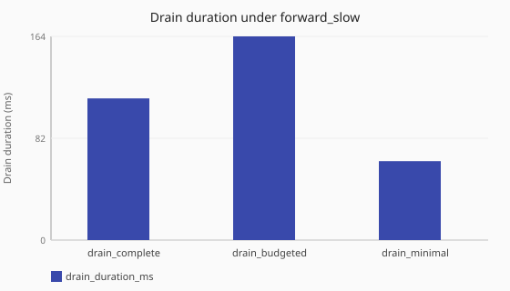

# Drain policy under slow upstream

How do complete, budgeted, and minimal drain policies behave under [`forward_slow`](/performance/methodology.md#load-shapes)
load at stop?

Numbers are same-host comparisons (relative to baselines measured on one named
lab profile) and are **not** service-level objectives. See the
[performance hub disclaimer](/performance/index.md).

## When this matters

Shutdown and restart windows trade how long Conduit waits for in-flight work
against client failures during stop. See
[graceful drain on shutdown](/concepts/runtime-and-concurrency.md#graceful-drain-on-shutdown).
Slow upstreams keep transactions outstanding longer, so
[`shutdown.drain` policy](/reference/config-schema/shutdown.md) choice shows up
clearly.

## What we varied

- **Varied:** drain policy
  ([`drain_complete`](/performance/scenarios.md#shutdown-drain-complete-forward-slow),
  [`drain_budgeted`](/performance/scenarios.md#shutdown-drain-budgeted-forward-slow),
  [`drain_minimal`](/performance/scenarios.md#shutdown-drain-minimal-forward-slow))
- **Held constant:** [`forward_slow`](/performance/methodology.md#load-shapes)
  load overlapping SIGTERM, same lab recipe
- **Read the timing columns, not the throughput columns:** these cells keep the
  thin load recipe on purpose, because the subject is what happens across the
  stop window. Their QPS and latency are incidental and are not a throughput
  ranking.

<!-- perf-study-evidence:start -->
## Evidence

### Drain duration under forward_slow

[Download CSV](../generated/drain-duration-forward-slow.csv)

| Drain policy | Drain duration (ms) | Client failures during stop | QPS | Avg latency (ms) |
| --- | --- | --- | --- | --- |
| [drain_complete](/performance/scenarios.md#shutdown-drain-complete-forward-slow) | 113.5 | 298 | 6.7 | 1020.8 |
| [drain_budgeted](/performance/scenarios.md#shutdown-drain-budgeted-forward-slow) | 113.5 | 200 | 9.7 | 913.0 |
| [drain_minimal](/performance/scenarios.md#shutdown-drain-minimal-forward-slow) | 63.4 | 200 | 9.7 | 896.6 |

<!-- perf-study-evidence:end -->

<!-- perf-study-deltas:start -->
## At a glance

- **Drain duration under forward_slow:** `drain_complete` ≈ **114 ms**, `drain_budgeted` ≈ **113 ms**, `drain_minimal` ≈ **63 ms**
<!-- perf-study-deltas:end -->

## Takeaway

**Minimal drain stops fastest; complete leaves the most in-flight clients to
fail.** On this lab (median of three rounds), minimal finishes in ~**63 ms**;
complete and budgeted both take ~**114 ms**. Complete records the most client
failures during stop (298 vs 200 for the others) — a longer wait gives doomed
slow-upstream requests more time to time out.

**What to do:** choose complete, budgeted, or minimal for your upgrade/restart
window from *your* failure budget — pick a policy on purpose. Vocabulary:
[Performance methodology — Drain policy](/performance/methodology.md#drain-policy-vocabulary).

## Related guides

- [Runtime and concurrency — Graceful drain](/concepts/runtime-and-concurrency.md#graceful-drain-on-shutdown)
- [Shutdown config](/reference/config-schema/shutdown.md)
- [Dataplane runtime tuning](/guides/dataplane-runtime-tuning.md)

## Member scenarios

- [shutdown-drain-complete-forward-slow](/performance/scenarios.md#shutdown-drain-complete-forward-slow)
- [shutdown-drain-budgeted-forward-slow](/performance/scenarios.md#shutdown-drain-budgeted-forward-slow)
- [shutdown-drain-minimal-forward-slow](/performance/scenarios.md#shutdown-drain-minimal-forward-slow)

## Related

- [Studies hub](/performance/studies/index.md)
- [Reference results](/performance/reference.md)
- [Methodology](/performance/methodology.md)
