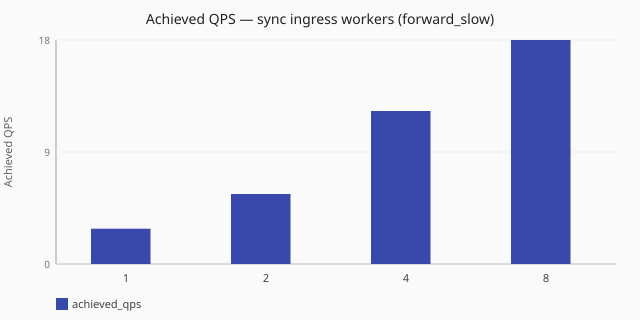

# Ingress concurrency (sync)

How does achieved QPS change as UDP ingress thread count rises under
`dataplane.runtime:` [`sync`](/concepts/runtime-and-concurrency.md#sync-runtime-default)
and [`forward_slow`](/performance/methodology.md#load-shapes)?

Numbers are same-host comparisons (relative to baselines measured on one named
lab profile) and are **not** service-level objectives. See the
[performance hub disclaimer](/performance/index.md).

## When this matters

On **[sync](/concepts/runtime-and-concurrency.md#sync-runtime-default)**,
listener [ingress `threads`](/reference/config-schema/listeners.md) are the
main concurrency setting: the same workers receive and wait on upstreams. This
study asks whether raising ingress under
[`forward_slow`](/performance/methodology.md#load-shapes) recovers throughput, or
whether another limit already binds
([slot pool](/concepts/runtime-and-concurrency.md#transaction-slot-pool),
upstream delay, CPU, or kernel buffering). Pair with
[`listeners.reuse_port`](/reference/config-schema/listeners.md) when
`threads > 1`. See
[worker counts](/concepts/runtime-and-concurrency.md#worker-counts-and-limits)
and [dataplane runtime tuning](/guides/dataplane-runtime-tuning.md).

## What we varied

- **Varied:** UDP listener `threads`
  ([`1`](/performance/scenarios.md#scale-sync-ingress-1-forward-slow),
  [`2`](/performance/scenarios.md#scale-sync-forward-slow),
  [`4`](/performance/scenarios.md#scale-sync-ingress-4-forward-slow),
  [`8`](/performance/scenarios.md#scale-sync-ingress-8-forward-slow)) with
  `dataplane.runtime:` [`sync`](/concepts/runtime-and-concurrency.md#sync-runtime-default)
- **Held fixed:** [`forward_slow`](/performance/methodology.md#load-shapes) load
  shape, observability off fixtures, same dnsperf recipe on the named lab profile
- **Note:** `ingress=2` reuses the existing sync `forward_slow` scale cell

!!! warning "Stressed / inconclusive ladder in this reference"
    These `forward_slow` cells are **lossy** and mostly flat after ingress `1`→`2`.
    Do not treat them as proof that more sync threads never help — remeasure under
    your load. Background:
    [How load is applied](/performance/methodology.md#how-load-is-applied-not-a-fixed-offered-qps).

<!-- perf-study-evidence:start -->
## Evidence

### Achieved QPS — sync ingress ladder (forward_slow)

[Download CSV](../generated/ingress-concurrency-sync-forward-slow.csv)

| Ingress workers | Runtime | Achieved QPS | Avg latency (ms) | Sent | Completed | Lost | Workers |
| --- | --- | --- | --- | --- | --- | --- | --- |
| [1](/performance/scenarios.md#scale-sync-ingress-1-forward-slow) | sync | 6.7 | 2521.0 | 299 | 100 | 199 | ingress=1 |
| [2](/performance/scenarios.md#scale-sync-forward-slow) | sync | 10.2 | 1651.1 | 340 | 153 | 187 | ingress=2 |
| [4](/performance/scenarios.md#scale-sync-ingress-4-forward-slow) | sync | 6.7 | 2518.5 | 299 | 100 | 199 | ingress=4 |
| [8](/performance/scenarios.md#scale-sync-ingress-8-forward-slow) | sync | 6.7 | 2518.6 | 299 | 100 | 199 | ingress=8 |

<!-- perf-study-evidence:end -->

## Takeaway

On this published reference, there is **no clean relative gain from adding sync
ingress threads** under stressed [`forward_slow`](/performance/methodology.md#load-shapes):
`1`, `4`, and `8` land at essentially the same low, lossy throughput (lab
absolute ~6.7 QPS each), while `2` sits somewhat higher (~10 QPS) — a gap that
is more consistent with single-shot variation on a recipe-stressed, low-volume
cell than a real relationship between ingress thread count and throughput here.
Do not read either the flat 1/4/8 poles or the `2` outlier as “more threads keep
helping” or “more threads keep hurting.” **Operator posture:**
if your slow-upstream ladder is also flat or lossy, stop raising sync ingress —
try [`split_io`](/concepts/runtime-and-concurrency.md#split-io-runtime), check
upstream delay and
[slot / inflight caps](/concepts/runtime-and-concurrency.md#transaction-slot-pool),
and compare
[I/O vs ingress (split_io)](/performance/studies/io-vs-ingress-split.md) and
[sync vs split_io](/performance/studies/sync-vs-split-io.md)
([`forward_fast`](/performance/methodology.md#load-shapes) for a clean runtime
delta).

## Related guides

- [Runtime and concurrency](/concepts/runtime-and-concurrency.md) — sync model and worker roles
- [Dataplane runtime tuning](/guides/dataplane-runtime-tuning.md)
- [Reference: listeners](/reference/config-schema/listeners.md) — `threads`, `reuse_port`, `rcvbuf`
- [Reference: dataplane](/reference/config-schema/dataplane.md)
- [I/O vs ingress (split_io)](/performance/studies/io-vs-ingress-split.md)
- [Sync vs split_io](/performance/studies/sync-vs-split-io.md)

## Member scenarios

- [scale-sync-ingress-1-forward-slow](/performance/scenarios.md#scale-sync-ingress-1-forward-slow)
- [scale-sync-forward-slow](/performance/scenarios.md#scale-sync-forward-slow)
- [scale-sync-ingress-4-forward-slow](/performance/scenarios.md#scale-sync-ingress-4-forward-slow)
- [scale-sync-ingress-8-forward-slow](/performance/scenarios.md#scale-sync-ingress-8-forward-slow)
