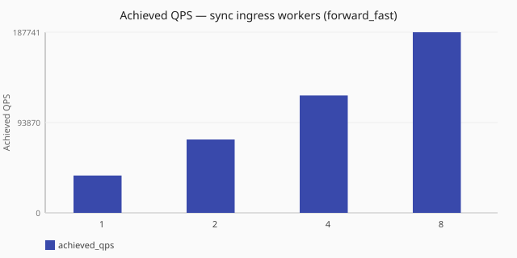

# Ingress concurrency (sync)

How much throughput do you buy by raising UDP ingress thread count under
`dataplane.runtime:` [`sync`](/concepts/runtime-and-concurrency.md#sync-runtime-default),
and does that answer change when the upstream is slow?

Numbers are same-host comparisons on a single reference host and are **not**
service-level objectives. See the
[performance hub disclaimer](/performance/index.md).

## When this matters

On **[sync](/concepts/runtime-and-concurrency.md#sync-runtime-default)**,
listener [ingress `threads`](/reference/config-schema/listeners.md) are the
main concurrency setting: the same workers receive the query and wait on the
upstream. Two questions follow from that, and this study runs the same worker series
twice to answer them separately. Against a fast upstream, where each worker's
wait is short, that series is a **sizing curve** — add workers until achieved QPS
flattens, then stop. Against a slow upstream, where each worker is parked for
the whole round trip, the series shows whether thread count is the binding limit
at all. Pair with [`listeners.reuse_port`](/reference/config-schema/listeners.md)
when `threads > 1`. See
[worker counts](/concepts/runtime-and-concurrency.md#worker-counts-and-limits)
and [dataplane runtime tuning](/guides/dataplane-runtime-tuning.md).

## What we varied

- **Varied:** UDP listener `threads` (`1`, `2`, `4`, `8`) with
  `dataplane.runtime:` [`sync`](/concepts/runtime-and-concurrency.md#sync-runtime-default)
- **Varied:** load shape —
  [`forward_fast`](/performance/methodology.md#load-shapes) for the sizing curve,
  [`forward_slow`](/performance/methodology.md#load-shapes) for the
  slow-backend illustration
- **Held fixed:** observability off fixtures, one dnsperf recipe per shape on the
  single reference host
- **Note:** the `ingress=2` cell at each shape reuses that shape's sync scale cell

<!-- perf-study-evidence:start -->
## Evidence

### Achieved QPS — sync ingress workers (forward_fast)

[Download CSV](../generated/ingress-concurrency-sync-forward-fast.csv)

| Ingress workers | Runtime | Achieved QPS | Avg latency (ms) | Sent | Completed | Lost | Workers |
| --- | --- | --- | --- | --- | --- | --- | --- |
| [1](/performance/scenarios.md#scale-sync-ingress-1-forward-fast) | sync | 38612.6 | 4.3 | 389959 | 386295 | 3664 | ingress=1 |
| [2](/performance/scenarios.md#scale-sync-forward-fast) | sync | 75601.1 | 3.8 | 759747 | 756344 | 3443 | ingress=2 |
| [4](/performance/scenarios.md#scale-sync-ingress-4-forward-fast) | sync | 134945.7 | 2.8 | 1353302 | 1350035 | 3267 | ingress=4 |
| [8](/performance/scenarios.md#scale-sync-ingress-8-forward-fast) | sync | 205558.9 | 3.4 | 2059455 | 2056472 | 2862 | ingress=8 |

### Achieved QPS — sync ingress workers (forward_slow)

[Download CSV](../generated/ingress-concurrency-sync-forward-slow.csv)

| Ingress workers | Runtime | Achieved QPS | Avg latency (ms) | Sent | Completed | Lost | Workers |
| --- | --- | --- | --- | --- | --- | --- | --- |
| [1](/performance/scenarios.md#scale-sync-ingress-1-forward-slow) | sync | 2.9 | 2514.4 | 12093 | 99 | 11994 | ingress=1 |
| [2](/performance/scenarios.md#scale-sync-forward-slow) | sync | 5.7 | 2507.6 | 12188 | 198 | 11990 | ingress=2 |
| [4](/performance/scenarios.md#scale-sync-ingress-4-forward-slow) | sync | 11.4 | 2513.0 | 12377 | 398 | 11979 | ingress=4 |
| [8](/performance/scenarios.md#scale-sync-ingress-8-forward-slow) | sync | 22.5 | 2640.7 | 12699 | 786 | 11929 | ingress=8 |

<!-- perf-study-evidence:end -->

<!-- perf-study-deltas:start -->
## At a glance

- **sync ingress workers (forward_fast):** `2` is about **2.0×** `1` (~76k vs ~39k); `4` is about **3.5×** `1` (~135k vs ~39k); `8` is about **5.3×** `1` (~206k vs ~39k).
- **sync ingress workers (forward_slow):** `2` is about **2.0×** `1` (~6 QPS vs ~3 QPS); `4` is about **4.0×** `1` (~11 QPS vs ~3 QPS); `8` is about **7.9×** `1` (~22 QPS vs ~3 QPS).
<!-- perf-study-deltas:end -->

## Takeaway

**More sync ingress threads raise throughput against a fast upstream.** On this
lab, under [`forward_fast`](/performance/methodology.md#load-shapes), achieved
QPS climbs about **39k → 76k → 135k → 206k** as you go from 1 to 2 to 4 to 8
workers. Gains stay large across that range on this median. Eight workers is
still climbing here — keep adding threads only while *your* remeasure still
buys QPS.

**Against a slow upstream, more threads help a little and do not fix the
model.** Under [`forward_slow`](/performance/methodology.md#load-shapes),
completed QPS scales with thread count (~3 → ~6 → ~11 → ~22) but stays tiny and
lossy. Prefer [`split_io`](/concepts/runtime-and-concurrency.md#split-io-runtime)
when upstream wait owns the path rather than stacking sync threads alone.

**What to do:** size sync ingress from the fast curve on your hardware
(`--study ingress-concurrency-sync`); pair `reuse_port` when `threads > 1`.

## Related guides

- [Runtime and concurrency](/concepts/runtime-and-concurrency.md) — sync model and worker roles
- [Dataplane runtime tuning](/guides/dataplane-runtime-tuning.md)
- [Reference: listeners](/reference/config-schema/listeners.md) — `threads`, `reuse_port`, `rcvbuf`
- [Reference: dataplane](/reference/config-schema/dataplane.md)
- [I/O vs ingress (split_io)](/performance/studies/io-vs-ingress-split.md)
- [Sync vs split_io](/performance/studies/sync-vs-split-io.md)

## Member scenarios

- [scale-sync-ingress-1-forward-fast](/performance/scenarios.md#scale-sync-ingress-1-forward-fast)
- [scale-sync-forward-fast](/performance/scenarios.md#scale-sync-forward-fast)
- [scale-sync-ingress-4-forward-fast](/performance/scenarios.md#scale-sync-ingress-4-forward-fast)
- [scale-sync-ingress-8-forward-fast](/performance/scenarios.md#scale-sync-ingress-8-forward-fast)
- [scale-sync-ingress-1-forward-slow](/performance/scenarios.md#scale-sync-ingress-1-forward-slow)
- [scale-sync-forward-slow](/performance/scenarios.md#scale-sync-forward-slow)
- [scale-sync-ingress-4-forward-slow](/performance/scenarios.md#scale-sync-ingress-4-forward-slow)
- [scale-sync-ingress-8-forward-slow](/performance/scenarios.md#scale-sync-ingress-8-forward-slow)
