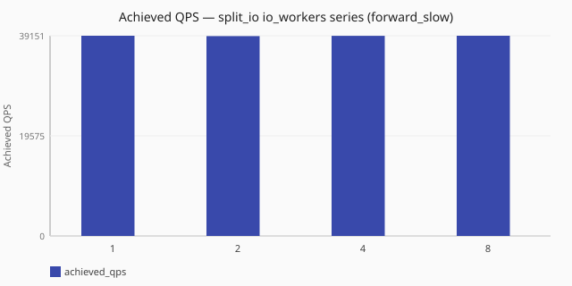

# I/O vs ingress (split_io)

With receive and policy threads held fixed on
[`split_io`](/concepts/runtime-and-concurrency.md#split-io-runtime), does adding
more I/O workers improve throughput when the upstream is slow
([`forward_slow`](/performance/methodology.md#load-shapes))?

Numbers are same-host comparisons on a single reference host and are **not**
service-level objectives. See the
[performance hub disclaimer](/performance/index.md).

## When this matters

On **[`split_io`](/concepts/runtime-and-concurrency.md#split-io-runtime)**,
ingress and async I/O are separate roles.
[`dataplane.io_workers`](/reference/config-schema/dataplane.md) sizes the I/O
pool that owns upstream wait; listener
[`threads`](/reference/config-schema/listeners.md) stay the receive path.
This study asks whether adding I/O workers under
[`forward_slow`](/performance/methodology.md#load-shapes) moves QPS when
ingress/policy are fixed. See
[worker counts](/concepts/runtime-and-concurrency.md#worker-counts-and-limits)
and [dataplane runtime tuning](/guides/dataplane-runtime-tuning.md).

## What we varied

- **Varied:** `dataplane.io_workers`
  ([`1`](/performance/scenarios.md#scale-split-io-io-1-forward-slow),
  [`2`](/performance/scenarios.md#scale-split-io-forward-slow),
  [`4`](/performance/scenarios.md#scale-split-io-io-4-forward-slow),
  [`8`](/performance/scenarios.md#scale-split-io-io-8-forward-slow)) with
  `dataplane.runtime:` [`split_io`](/concepts/runtime-and-concurrency.md#split-io-runtime)
  and fixed ingress (`threads: 2`)
- **Held fixed:** [`forward_slow`](/performance/methodology.md#load-shapes) load
  shape, observability off fixtures, same dnsperf recipe on a single reference host
- **Note:** `io=2` reuses the existing split_io `forward_slow` scale cell

<!-- perf-study-evidence:start -->
## Evidence

### Achieved QPS — split_io io_workers series (forward_slow)

[Download CSV](../generated/io-vs-ingress-split-forward-slow.csv)

| I/O workers | Runtime | Achieved QPS | Avg latency (ms) | Sent | Completed | Lost | Workers |
| --- | --- | --- | --- | --- | --- | --- | --- |
| [1](/performance/scenarios.md#scale-split-io-io-1-forward-slow) | split_io | 39149.7 | 51.0 | 1176305 | 1176305 | 0 | ingress=2, policy=2, io=1 |
| [2](/performance/scenarios.md#scale-split-io-forward-slow) | split_io | 39080.2 | 51.1 | 1174342 | 1174342 | 0 | ingress=2, policy=2, io=2 |
| [4](/performance/scenarios.md#scale-split-io-io-4-forward-slow) | split_io | 39132.2 | 51.0 | 1175628 | 1175628 | 0 | ingress=2, policy=2, io=4 |
| [8](/performance/scenarios.md#scale-split-io-io-8-forward-slow) | split_io | 39150.6 | 51.0 | 1176530 | 1176530 | 0 | ingress=2, policy=2, io=8 |

<!-- perf-study-evidence:end -->

<!-- perf-study-deltas:start -->
## At a glance

- **split_io io_workers series (forward_slow):** `2` costs about **0%** QPS versus `1` (~39k vs ~39k); `4` costs about **0%** QPS versus `1` (~39k vs ~39k); `8` is about **1.0×** `1` (~39k vs ~39k).
<!-- perf-study-deltas:end -->

## Takeaway

**Adding I/O workers did not raise QPS under this slow-upstream recipe.** With
ingress and policy fixed on
[`split_io`](/concepts/runtime-and-concurrency.md#split-io-runtime), the
[`forward_slow`](/performance/methodology.md#load-shapes) series stays flat at
about **~39k** QPS from `io_workers` 1 through 8 on this median — consistent
with the loadgen outstanding window and the slow-upstream recipe delay, not
with I/O thread starvation.

**What to do:** size `io_workers` for concurrency headroom and loss behavior on
*your* hardware (`--study io-vs-ingress-split`), not from this shape’s QPS
ceiling. For runtime choice and ingress sizing, see
[sync vs split_io](/performance/studies/sync-vs-split-io.md) and
[ingress concurrency (sync)](/performance/studies/ingress-concurrency-sync.md).

## Related guides

- [Runtime and concurrency](/concepts/runtime-and-concurrency.md) — split_io model and worker roles
- [Dataplane runtime tuning](/guides/dataplane-runtime-tuning.md)
- [Reference: dataplane](/reference/config-schema/dataplane.md) — `runtime`, `io_workers`, `policy_workers`
- [Reference: listeners](/reference/config-schema/listeners.md) — ingress `threads`
- [Ingress concurrency (sync)](/performance/studies/ingress-concurrency-sync.md)
- [Sync vs split_io](/performance/studies/sync-vs-split-io.md)

## Member scenarios

- [scale-split-io-io-1-forward-slow](/performance/scenarios.md#scale-split-io-io-1-forward-slow)
- [scale-split-io-forward-slow](/performance/scenarios.md#scale-split-io-forward-slow)
- [scale-split-io-io-4-forward-slow](/performance/scenarios.md#scale-split-io-io-4-forward-slow)
- [scale-split-io-io-8-forward-slow](/performance/scenarios.md#scale-split-io-io-8-forward-slow)
