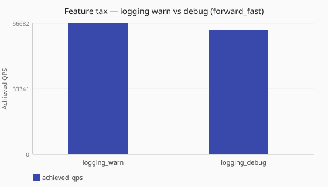

# Logging verbosity tax

What does raising process log level from warn to debug cost under [`forward_fast`](/performance/methodology.md#load-shapes)?

Numbers are same-host comparisons on a single reference host and are **not**
service-level objectives. See the
[performance hub disclaimer](/performance/index.md).

## When this matters

Other feature_tax cells run with [`logging.level: warn`](/reference/config-schema/logging.md).
Operators sometimes raise verbosity while diagnosing production issues. This
study pairs a dedicated **warn** pole with the same fixture at **debug** under
[`forward_fast`](/performance/methodology.md#load-shapes) (metrics disabled in
both). Pipeline traces use the separate
[`tracing:`](/observability/tracing.md) block — see
[Pipeline tracing tax](/performance/studies/tracing-tax-under-load.md).

## What we varied

- **Varied:** logging level
  ([`logging_warn`](/performance/scenarios.md#feature-tax-logging-warn-forward-fast) vs
  [`logging_debug`](/performance/scenarios.md#feature-tax-logging-debug-forward-fast))
- **Held fixed:** metrics disabled, no dnstap sinks,
  [`sync`](/concepts/runtime-and-concurrency.md#sync-runtime-default),
  [`forward_fast`](/performance/methodology.md#load-shapes)

<!-- perf-study-evidence:start -->
## Evidence

### Feature tax — logging warn vs debug (forward_fast)

[Download CSV](../generated/logging-warn-vs-debug-forward-fast.csv)

| Posture | Runtime | Achieved QPS | Avg latency (ms) | Sent | Completed | Lost | Workers |
| --- | --- | --- | --- | --- | --- | --- | --- |
| [logging_warn](/performance/scenarios.md#feature-tax-logging-warn-forward-fast) | sync | 72516.1 | 2.4 | 729137 | 725473 | 3664 | ingress=2 |
| [logging_debug](/performance/scenarios.md#feature-tax-logging-debug-forward-fast) | sync | 75279.4 | 4.2 | 756471 | 753111 | 3364 | ingress=2 |

<!-- perf-study-evidence:end -->

<!-- perf-study-deltas:start -->
## At a glance

- **logging warn vs debug (forward_fast):** `logging_debug` is about **1.0×** `logging_warn` (~75k vs ~73k).
<!-- perf-study-deltas:end -->

## Takeaway

**Debug logging was not a large standing tax on this median.** Warn and debug
land within about **4%** QPS of each other (~73k / ~75k). That is much smaller
than older single-shot refreshes suggested — treat debug under load as
remeasure-required, not as a fixed mid-teens penalty.

**What to do:** keep production at warn (or quieter). Use debug for diagnosis
windows and remeasure on your hardware if you need a standing debug posture.

## Related guides

- [Logging](/observability/logging.md)
- [Reference: logging](/reference/config-schema/logging.md)
- [Pipeline tracing tax](/performance/studies/tracing-tax-under-load.md)

## Member scenarios

- [feature-tax-logging-warn-forward-fast](/performance/scenarios.md#feature-tax-logging-warn-forward-fast)
- [feature-tax-logging-debug-forward-fast](/performance/scenarios.md#feature-tax-logging-debug-forward-fast)

## Related

- [Studies hub](/performance/studies/index.md)
- [Reference results](/performance/reference.md)
- [Methodology](/performance/methodology.md)
