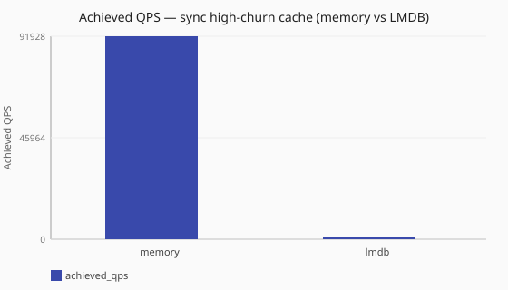
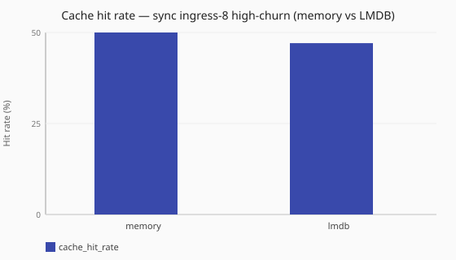

# Memory vs LMDB high-churn cache

Under a matched high-churn recipe, how do memory and LMDB answer caches differ
in achieved QPS and cache hit/miss ratios?

Numbers are same-host comparisons on a single reference host and are **not**
service-level objectives. See the
[performance hub disclaimer](/performance/index.md).

## When this matters

Use this pair when you care about **turnover under pressure** — a query set
larger than `max_entries`, stub TTLs long enough that entry-cap eviction (not
TTL expiry alone) drives misses, and continuous fill/evict — not a warm,
hit-dominated path. Both cells use the same elevated dnsperf window, the same
4096-name query file, a 60 s stub TTL, and `max_entries: 2048`. LMDB uses
`when_full: evict_one` on a real-disk path with a map size sized so the **entry
cap** binds first.

This study does **not** describe warm read-mostly `cache_hit` cost — see
[Memory vs LMDB warm cache_hit](/performance/studies/memory-vs-lmdb-cache-hit.md).

**Expiry vs eviction:** lazy TTL expiry is wall-clock deterministic on read.
What is arbitrary under LMDB capacity pressure is `when_full` victim selection
(`evict_one` / `sample`), not the expiry clock.

Configure backends under [`caches:`](/reference/config-schema/caches.md) and
[`lookup` profiles](/reference/config-schema/lookup.md). See
[DNS answer cache](/guides/dns-answer-cache.md) and
[Performance methodology — LMDB cache cells](/performance/methodology.md#lmdb-cache-cells)
(real disk for publish; fixed safe sync default).

## What we varied

- **Varied:** cache backend (memory vs LMDB) under
  [`cache_churn`](/performance/methodology.md#load-shapes)
- **Held constant:** [`sync`](/concepts/runtime-and-concurrency.md#sync-runtime-default)
  runtime, ingress workers, elevated dnsperf recipe, query file, stub TTL,
  `max_entries`, metrics scrape for hit/miss evidence

<!-- perf-study-evidence:start -->
## Evidence

### Achieved QPS — sync high-churn cache (memory vs LMDB)

[Download CSV](../generated/memory-vs-lmdb-cache-churn-qps.csv)

| Cache Backend | Runtime | Achieved QPS | Avg latency (ms) | Sent | Completed | Lost | Workers | Hit rate (%) | Cache hits | Cache misses |
| --- | --- | --- | --- | --- | --- | --- | --- | --- | --- | --- |
| [memory](/performance/scenarios.md#scale-sync-memory-cache-churn) | sync | 91928.1 | 21.7 | 921564 | 921564 | 0 | ingress=2 | 49.3 | 454670 | 466895 |
| [lmdb](/performance/scenarios.md#scale-sync-lmdb-cache-churn) | sync | 959.3 | 1937.8 | 11135 | 11135 | 0 | ingress=2 | 26.4 | 2941 | 8195 |

### Cache hit rate — sync high-churn (memory vs LMDB)

[Download CSV](../generated/memory-vs-lmdb-cache-churn-hit-rate.csv)

| Cache Backend | Hit rate (%) | Cache hits | Cache misses | Achieved QPS |
| --- | --- | --- | --- | --- |
| [memory](/performance/scenarios.md#scale-sync-memory-cache-churn) | 49.3 | 454670 | 466895 | 91928.1 |
| [lmdb](/performance/scenarios.md#scale-sync-lmdb-cache-churn) | 26.4 | 2941 | 8195 | 959.3 |

<!-- perf-study-evidence:end -->

<!-- perf-study-deltas:start -->
## At a glance

- **sync high-churn cache (memory vs LMDB):** `lmdb` costs about **99%** QPS versus `memory` (~1k vs ~92k).
- **Cache hit rate — sync high-churn (memory vs LMDB):** `lmdb` costs about **46%** QPS versus `memory` (~26 QPS vs ~49 QPS).
<!-- perf-study-deltas:end -->

## Takeaway

**Under high churn, LMDB is about 95.8× slower than memory on this lab** (~1k vs
~92k QPS) — roughly **99%** QPS cost versus memory when entry-cap turnover
forces durable writes under the fixed safe sync default (single-writer commits).
That is a different story from warm
[`cache_hit`](/performance/methodology.md#load-shapes), where LMDB cost only
about [6%](/performance/studies/memory-vs-lmdb-cache-hit.md).

**Hit/miss:** memory steadies near **half** hits for this recipe (`max_entries`
half the query-file size). LMDB’s measured hit rate is lower in the same 10 s
window because it only completes a few passes over the query file at ~1k QPS,
not because lazy TTL expiry is random. Lazy expiry is wall-clock deterministic
on read; what is arbitrary under LMDB capacity pressure is `when_full` victim
selection (`evict_one` / `sample`). Absolute LMDB churn QPS is disk- and
sync-mode sensitive; prefer the relative claim. See
[Performance methodology — LMDB cache cells](/performance/methodology.md#lmdb-cache-cells).

## Related guides

- [DNS answer cache](/guides/dns-answer-cache.md)
- [Reference: caches](/reference/config-schema/caches.md)
- [Reference: lookup](/reference/config-schema/lookup.md)

## Member scenarios

- [scale-sync-memory-cache-churn](/performance/scenarios.md#scale-sync-memory-cache-churn)
- [scale-sync-lmdb-cache-churn](/performance/scenarios.md#scale-sync-lmdb-cache-churn)

## Related

- [Memory vs LMDB warm cache_hit](/performance/studies/memory-vs-lmdb-cache-hit.md)
- [Cache hit vs forward](/performance/studies/cache-hit-vs-forward.md)
- [Studies hub](/performance/studies/index.md)
- [Reference results](/performance/reference.md)
- [Methodology](/performance/methodology.md)
