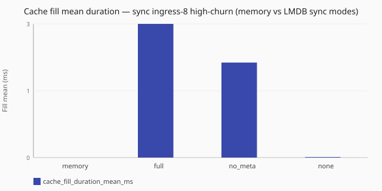

# Memory vs LMDB high-churn cache

Under a matched high-churn recipe with enough sync ingress concurrency for both
backends to do useful parallel work, how do memory and LMDB answer caches differ
in achieved QPS and cache hit/miss ratios — and how do the three LMDB sync
durability modes (`full`, `no_meta`, `none`) compare under that same recipe?

Numbers are same-host comparisons on a single reference host and are **not**
service-level objectives. See the
[performance hub disclaimer](/performance/index.md).

## When this matters

Use this study when you care about **turnover under pressure** — a query set
larger than `max_entries`, stub TTLs long enough that entry-cap eviction (not
TTL expiry alone) drives misses, and continuous fill/evict — not a warm,
hit-dominated path. Members use **eight sync ingress workers**, the same
elevated dnsperf window, the same 4096-name query file, a 60 s stub TTL, and
`max_entries: 2048`. LMDB cells use `when_full: evict_one`, explicit
`shard_count: 16` (2× ingress), distinct real-disk paths, and first-class
`lmdb.sync` values (`full`, `no_meta`, `none`) with a map size sized so the
**entry cap** binds first.

This shape is intentional: a two-worker sync path under the same elevated
outstanding window mainly shows Little's Law queueing (avg latency ≈
outstanding ÷ QPS) and starves multi-env LMDB parallelism. Thin-ingress
companion scenarios remain in the catalog but are **not** this study’s
primary compare.

This study does **not** describe warm read-mostly `cache_hit` cost — see
[Memory vs LMDB warm cache_hit](/performance/studies/memory-vs-lmdb-cache-hit.md).

**Expiry vs eviction:** lazy TTL expiry is wall-clock deterministic on read.
What is arbitrary under LMDB capacity pressure is `when_full` victim selection
(`evict_one` / `sample`), not the expiry clock.

Configure backends under [`caches:`](/reference/config-schema/caches.md) and
[`lookup` profiles](/reference/config-schema/lookup.md). See
[DNS answer cache](/guides/dns-answer-cache.md) and
[Performance methodology — LMDB cache cells](/performance/methodology.md#lmdb-cache-cells)
(real disk for publish; each LMDB cell annotates its `lmdb.sync` value).

## What we varied

- **Varied:** cache backend (memory vs LMDB) and LMDB **`lmdb.sync`** mode under
  [`cache_churn`](/performance/methodology.md#load-shapes)
- **Held constant:** [`sync`](/concepts/runtime-and-concurrency.md#sync-runtime-default)
  runtime with **eight** ingress workers, elevated dnsperf recipe, query file,
  stub TTL, `max_entries`, LMDB shard count on LMDB cells, metrics scrape
  for hit/miss and fill/eviction path-duration evidence

<!-- perf-study-evidence:start -->
## Evidence

### Achieved QPS — sync ingress-8 high-churn (memory vs LMDB sync modes)

[Download CSV](../generated/memory-vs-lmdb-cache-churn-qps.csv)

| Lmdb Sync | Runtime | Achieved QPS | Avg latency (ms) | Sent | Completed | Lost | Workers | Hit rate (%) | Cache hits | Cache misses | Fill mean (ms) | Eviction mean (ms) |
| --- | --- | --- | --- | --- | --- | --- | --- | --- | --- | --- | --- | --- |
| [memory](/performance/scenarios.md#scale-sync-ingress-8-memory-cache-churn) | sync | 268340.7 | 7.4 | 2686723 | 2686723 | 0 | ingress=8 | 49.7 | 1336029 | 1350695 | 0.0005 | 0.0003 |
| [full](/performance/scenarios.md#scale-sync-ingress-8-lmdb-full-cache-churn) | sync | 2957.0 | 653.1 | 31589 | 31589 | 0 | ingress=8 | 42.8 | 13528 | 16630 | 2.6745 | 1.4613 |
| [no_meta](/performance/scenarios.md#scale-sync-ingress-8-lmdb-no_meta-cache-churn) | sync | 4576.2 | 420.9 | 49347 | 49347 | 0 | ingress=8 | 46.5 | 23183 | 25600 | 1.9003 | 1.0559 |
| [none](/performance/scenarios.md#scale-sync-ingress-8-lmdb-none-cache-churn) | sync | 160198.1 | 12.5 | 1605354 | 1605354 | 0 | ingress=8 | 50.1 | 803375 | 801980 | 0.0112 | 0.0059 |

### Cache hit rate — sync ingress-8 high-churn (memory vs LMDB sync modes)

[Download CSV](../generated/memory-vs-lmdb-cache-churn-hit-rate.csv)

| Lmdb Sync | Hit rate (%) | Cache hits | Cache misses | Achieved QPS |
| --- | --- | --- | --- | --- |
| [memory](/performance/scenarios.md#scale-sync-ingress-8-memory-cache-churn) | 49.7 | 1336029 | 1350695 | 268340.7 |
| [full](/performance/scenarios.md#scale-sync-ingress-8-lmdb-full-cache-churn) | 42.8 | 13528 | 16630 | 2957.0 |
| [no_meta](/performance/scenarios.md#scale-sync-ingress-8-lmdb-no_meta-cache-churn) | 46.5 | 23183 | 25600 | 4576.2 |
| [none](/performance/scenarios.md#scale-sync-ingress-8-lmdb-none-cache-churn) | 50.1 | 803375 | 801980 | 160198.1 |

### Cache fill mean duration — sync ingress-8 high-churn (memory vs LMDB sync modes)

[Download CSV](../generated/memory-vs-lmdb-cache-churn-fill-duration.csv)

| Lmdb Sync | Fill mean (ms) | Fill samples | Eviction mean (ms) | Eviction samples | Achieved QPS |
| --- | --- | --- | --- | --- | --- |
| [memory](/performance/scenarios.md#scale-sync-ingress-8-memory-cache-churn) | 0.0005 | 1350695 | 0.0003 | 1342166 | 268340.7 |
| [full](/performance/scenarios.md#scale-sync-ingress-8-lmdb-full-cache-churn) | 2.6745 | 16630 | 1.4613 | 15995 | 2957.0 |
| [no_meta](/performance/scenarios.md#scale-sync-ingress-8-lmdb-no_meta-cache-churn) | 1.9003 | 25600 | 1.0559 | 24576 | 4576.2 |
| [none](/performance/scenarios.md#scale-sync-ingress-8-lmdb-none-cache-churn) | 0.0112 | 801980 | 0.0059 | 799902 | 160198.1 |

<!-- perf-study-evidence:end -->

<!-- perf-study-deltas:start -->
## At a glance

- **sync ingress-8 high-churn (memory vs LMDB sync modes):** `full` costs about **99%** QPS versus `memory` (~3k vs ~268k); `no_meta` costs about **98%** QPS versus `memory` (~5k vs ~268k); `none` costs about **40%** QPS versus `memory` (~160k vs ~268k).
- **Cache hit rate — sync ingress-8 high-churn (memory vs LMDB sync modes):** `full` is about **14%** lower hit rate than `memory` (~42.8% vs ~49.7%); `no_meta` is about **6%** lower hit rate than `memory` (~46.5% vs ~49.7%); `none` is about **1%** higher hit rate than `memory` (~50.1% vs ~49.7%).
- **Cache fill mean duration — sync ingress-8 high-churn (memory vs LMDB sync modes):** `full` ≈ ~2.7 ms vs `memory` ~0.0005 ms; `no_meta` ≈ ~1.9 ms vs `memory` ~0.0005 ms; `none` is about **22.4×** `memory` (~0.011 ms vs ~0.0005 ms).
<!-- perf-study-deltas:end -->

## Takeaway

**Under high churn, LMDB write durability dominates QPS on this lab.** With eight
sync ingress workers and LMDB `shard_count` 16, **`sync: full`** costs about
**99%** QPS versus memory (~3k vs ~268k; roughly **90.7×** slower). Moving to
**`no_meta`** is only about **1.5×** `full` (~5k) — a modest write-path gain.
Skipping durability with **`none`** is about **35×** `no_meta` (~160k) and costs
about **40%** QPS versus memory. Hit rates stay in the same band (`full` about
**14%** relative lower than memory). Mean fill is about **3.0 ms** for `full`,
about **2.0 ms** for `no_meta`, and about **0.0112 ms** for `none`, versus about
**0.0005 ms** for memory. Average latency under the elevated outstanding window
tracks roughly outstanding/QPS and is **not** raw disk service time. Lazy TTL
expiry is deterministic; LMDB `when_full` victim selection is arbitrary under
entry pressure. Absolute LMDB churn QPS is disk- and sync-mode-sensitive; prefer
relative claims. That contrasts with warm
[`cache_hit`](/performance/methodology.md#load-shapes), where LMDB costs only
about **6%** versus memory — see
[Memory vs LMDB warm cache_hit](/performance/studies/memory-vs-lmdb-cache-hit.md).

**Before choosing a faster LMDB sync mode for production, you must understand
durability and integrity tradeoffs.** Start from the
[`lmdb.sync` decision tree](/reference/config-schema/caches.md#lmdb-sync) and the
[DNS answer cache](/guides/dns-answer-cache.md) guide — do not pick a mode from
the QPS chart alone. See also
[Performance methodology — LMDB cache cells](/performance/methodology.md#lmdb-cache-cells).

## Related guides

- [DNS answer cache](/guides/dns-answer-cache.md)
- [Reference: caches](/reference/config-schema/caches.md)
- [Reference: lookup](/reference/config-schema/lookup.md)

## Member scenarios

- [scale-sync-ingress-8-memory-cache-churn](/performance/scenarios.md#scale-sync-ingress-8-memory-cache-churn)
- [scale-sync-ingress-8-lmdb-full-cache-churn](/performance/scenarios.md#scale-sync-ingress-8-lmdb-full-cache-churn)
- [scale-sync-ingress-8-lmdb-no_meta-cache-churn](/performance/scenarios.md#scale-sync-ingress-8-lmdb-no_meta-cache-churn)
- [scale-sync-ingress-8-lmdb-none-cache-churn](/performance/scenarios.md#scale-sync-ingress-8-lmdb-none-cache-churn)

## Related

- [Memory vs LMDB warm cache_hit](/performance/studies/memory-vs-lmdb-cache-hit.md)
- [Cache hit vs forward](/performance/studies/cache-hit-vs-forward.md)
- [Studies hub](/performance/studies/index.md)
- [Reference results](/performance/reference.md)
- [Methodology](/performance/methodology.md)
