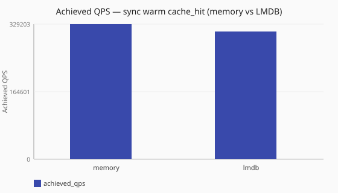

# Memory vs LMDB warm cache_hit

How does a warm LMDB answer cache compare to a warm memory cache under
[`sync`](/concepts/runtime-and-concurrency.md#sync-runtime-default)
[`cache_hit`](/performance/methodology.md#load-shapes) (read-mostly after warm)?

Numbers are same-host comparisons on a single reference host and are **not**
service-level objectives. See the
[performance hub disclaimer](/performance/index.md).

## When this matters

Use this pair when choosing between an in-process memory cache and a durable
LMDB store for a **warm, hit-dominated** path. Both cells use the same elevated
dnsperf window and warm probes before load. This study does **not** describe
fill/evict churn, capacity pressure, or hit-rate under turnover — see
[Memory vs LMDB high-churn cache](/performance/studies/memory-vs-lmdb-cache-churn.md).

Configure backends under [`caches:`](/reference/config-schema/caches.md) and
[`lookup` profiles](/reference/config-schema/lookup.md). See
[DNS answer cache](/guides/dns-answer-cache.md) and
[Performance methodology — LMDB cache cells](/performance/methodology.md#lmdb-cache-cells)
(real disk for publish; fixed safe sync default).

## What we varied

- **Varied:** cache backend (memory vs LMDB) under warmed
  [`cache_hit`](/performance/methodology.md#load-shapes)
- **Held constant:** [`sync`](/concepts/runtime-and-concurrency.md#sync-runtime-default)
  runtime, ingress workers, observability off, elevated dnsperf recipe

<!-- perf-study-evidence:start -->
## Evidence

### Achieved QPS — sync warm cache_hit (memory vs LMDB)

[Download CSV](../generated/memory-vs-lmdb-cache-hit-qps.csv)

| Cache Backend | Runtime | Achieved QPS | Avg latency (ms) | Sent | Completed | Lost | Workers |
| --- | --- | --- | --- | --- | --- | --- | --- |
| [memory](/performance/scenarios.md#scale-sync-cache-hit) | sync | 329202.8 | 6.1 | 3294253 | 3294253 | 0 | ingress=2 |
| [lmdb](/performance/scenarios.md#scale-sync-lmdb-cache-hit) | sync | 311061.7 | 6.4 | 3113021 | 3113021 | 0 | ingress=2 |

<!-- perf-study-evidence:end -->

<!-- perf-study-deltas:start -->
## At a glance

- **sync warm cache_hit (memory vs LMDB):** `lmdb` costs about **6%** QPS versus `memory` (~311k vs ~329k).
<!-- perf-study-deltas:end -->

## Takeaway

**Warm LMDB is close to warm memory on this lab.** Under the same sync
[`cache_hit`](/performance/methodology.md#load-shapes) recipe, LMDB costs about
**6%** QPS versus memory (~311k vs ~329k). Treat that as a same-host upper-bound
comparison for a **read-mostly** path after warm — not a capacity target, not a
churn or hit-rate claim, and sensitive to disk / page cache. For turnover under
pressure, see
[Memory vs LMDB high-churn cache](/performance/studies/memory-vs-lmdb-cache-churn.md).
See
[Performance methodology — LMDB cache cells](/performance/methodology.md#lmdb-cache-cells).

## Related guides

- [DNS answer cache](/guides/dns-answer-cache.md)
- [Reference: caches](/reference/config-schema/caches.md)
- [Reference: lookup](/reference/config-schema/lookup.md)

## Member scenarios

- [scale-sync-cache-hit](/performance/scenarios.md#scale-sync-cache-hit)
- [scale-sync-lmdb-cache-hit](/performance/scenarios.md#scale-sync-lmdb-cache-hit)

## Related

- [Memory vs LMDB high-churn cache](/performance/studies/memory-vs-lmdb-cache-churn.md)
- [Cache hit vs forward](/performance/studies/cache-hit-vs-forward.md)
- [Studies hub](/performance/studies/index.md)
- [Reference results](/performance/reference.md)
- [Methodology](/performance/methodology.md)
