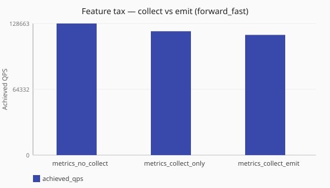

# Metrics collect vs emit

Is metrics cost dominated by hot-path collect, or by scrape emit?

Numbers are same-host comparisons on a single reference host and are **not**
service-level objectives. See the
[performance hub disclaimer](/performance/index.md).

## When this matters

[`metrics.collection`](/observability/metrics-configurability.md) can record
hot-path series without exporting them (`collect: true`, `emit: false`), or skip
recording entirely. Operators often ask whether the tax is **recording** or
**scrape export**. This study keeps `metrics.base: standard` and varies
collect/emit on the volume/failures/lookup/timing categories under [`forward_fast`](/performance/methodology.md#load-shapes).
See also the [metrics scrape tax](/performance/studies/metrics-scrape-ladder.md)
(base off / minimal / standard with normal scrape).

## What we varied

- **Varied:** collect/emit posture
  ([`metrics_no_collect`](/performance/scenarios.md#feature-tax-metrics-no-collect-forward-fast) →
  [`metrics_collect_only`](/performance/scenarios.md#feature-tax-metrics-collect-only-forward-fast) →
  [`metrics_collect_emit`](/performance/scenarios.md#feature-tax-metrics-collect-emit-forward-fast))
- **Held fixed:** [`sync`](/concepts/runtime-and-concurrency.md#sync-runtime-default) runtime,
  [`forward_fast`](/performance/methodology.md#load-shapes), standard base, scrape listener present

<!-- perf-study-evidence:start -->
## Evidence

### Feature tax — collect vs emit (forward_fast)

[Download CSV](../generated/metrics-collect-vs-emit-forward-fast.csv)

| Posture | Runtime | Achieved QPS | Avg latency (ms) | Sent | Completed | Lost | Workers |
| --- | --- | --- | --- | --- | --- | --- | --- |
| [metrics_no_collect](/performance/scenarios.md#feature-tax-metrics-no-collect-forward-fast) | sync | 73196.2 | 3.8 | 735710 | 732262 | 3448 | ingress=2 |
| [metrics_collect_only](/performance/scenarios.md#feature-tax-metrics-collect-only-forward-fast) | sync | 69667.4 | 4.0 | 700420 | 696976 | 3448 | ingress=2 |
| [metrics_collect_emit](/performance/scenarios.md#feature-tax-metrics-collect-emit-forward-fast) | sync | 70134.9 | 4.0 | 705169 | 701692 | 3439 | ingress=2 |

<!-- perf-study-evidence:end -->

<!-- perf-study-deltas:start -->
## At a glance

- **collect vs emit (forward_fast):** `metrics_collect_only` costs about **5%** QPS versus `metrics_no_collect` (~70k vs ~73k); `metrics_collect_emit` costs about **4%** QPS versus `metrics_no_collect` (~70k vs ~73k).
<!-- perf-study-deltas:end -->

## Takeaway

**Most of the metrics cost is recording, not exporting.** Versus no-collect on
this lab, collect-only costs about **5%** QPS; collect+emit lands in the same
~4–5% band (~73k / ~70k / ~70k). The extra export step is not cleanly separable
from round noise here.

**What to do:** turn off collect for categories you do not need. Choose minimal
vs standard with [operator metrics bases](/guides/operator-metrics-bases.md);
see the [metrics scrape tax](/performance/studies/metrics-scrape-ladder.md)
for export-facing scrape cost.

## Related guides

- [Metrics configurability](/observability/metrics-configurability.md)
- [Operator metrics bases](/guides/operator-metrics-bases.md)
- [Metrics scrape tax](/performance/studies/metrics-scrape-ladder.md)

## Member scenarios

- [feature-tax-metrics-no-collect-forward-fast](/performance/scenarios.md#feature-tax-metrics-no-collect-forward-fast)
- [feature-tax-metrics-collect-only-forward-fast](/performance/scenarios.md#feature-tax-metrics-collect-only-forward-fast)
- [feature-tax-metrics-collect-emit-forward-fast](/performance/scenarios.md#feature-tax-metrics-collect-emit-forward-fast)

## Related

- [Studies hub](/performance/studies/index.md)
- [Reference results](/performance/reference.md)
- [Methodology](/performance/methodology.md)
