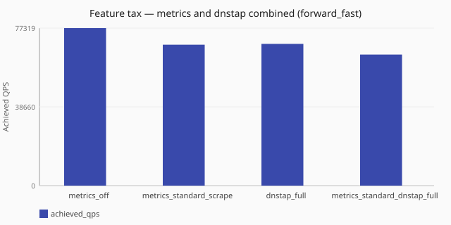

# Combined metrics + dnstap tax

What does turning on standard scrape and fuller dnstap together cost?

Numbers are same-host comparisons (relative to baselines measured on one named
lab profile) and are **not** service-level objectives. See the
[performance hub disclaimer](/performance/index.md).

## When this matters

Production postures often enable **more than one** observability surface.
Studies that turn on only metrics scrape or only dnstap
([metrics scrape](/performance/studies/metrics-scrape-ladder.md),
[dnstap emit](/performance/studies/dnstap-emit-tax.md)) miss interaction cost.
This study places observability off, standard scrape alone, fuller dnstap alone,
and **both** under the same [`forward_fast`](/performance/methodology.md#load-shapes) recipe.

## What we varied

- **Varied:** observability posture
  ([`metrics_off`](/performance/scenarios.md#feature-tax-metrics-off-forward-fast),
  [`metrics_standard_scrape`](/performance/scenarios.md#feature-tax-metrics-standard-scrape-forward-fast),
  [`dnstap_full`](/performance/scenarios.md#feature-tax-dnstap-full-forward-fast),
  [`metrics_standard_dnstap_full`](/performance/scenarios.md#feature-tax-metrics-standard-dnstap-full-forward-fast))
- **Held fixed:** [`sync`](/concepts/runtime-and-concurrency.md#sync-runtime-default) runtime,
  [`forward_fast`](/performance/methodology.md#load-shapes), ingress workers, dnsperf recipe

<!-- perf-study-evidence:start -->
## Evidence

### Feature tax — metrics and dnstap combined (forward_fast)

[Download CSV](../generated/metrics-dnstap-combined-forward-fast.csv)

| Posture | Runtime | Achieved QPS | Avg latency (ms) | Sent | Completed | Lost | Workers |
| --- | --- | --- | --- | --- | --- | --- | --- |
| [metrics_off](/performance/scenarios.md#feature-tax-metrics-off-forward-fast) | sync | 77319.5 | 3.8 | 776925 | 773506 | 3419 | ingress=2 |
| [metrics_standard_scrape](/performance/scenarios.md#feature-tax-metrics-standard-scrape-forward-fast) | sync | 69173.3 | 2.6 | 695725 | 692061 | 3664 | ingress=2 |
| [dnstap_full](/performance/scenarios.md#feature-tax-dnstap-full-forward-fast) | sync | 69573.8 | 4.1 | 699739 | 696075 | 3429 | ingress=2 |
| [metrics_standard_dnstap_full](/performance/scenarios.md#feature-tax-metrics-standard-dnstap-full-forward-fast) | sync | 64335.1 | 4.4 | 647080 | 643702 | 3428 | ingress=2 |

<!-- perf-study-evidence:end -->

<!-- perf-study-deltas:start -->
## At a glance

- **metrics and dnstap combined (forward_fast):** `metrics_standard_scrape` costs about **11%** QPS versus `metrics_off` (~69k vs ~77k); `dnstap_full` costs about **10%** QPS versus `metrics_off` (~70k vs ~77k); `metrics_standard_dnstap_full` costs about **17%** QPS versus `metrics_off` (~64k vs ~77k).
<!-- perf-study-deltas:end -->

## Takeaway

**Scrape and dnstap each cost roughly 10%, and together about 17%.** Versus
observability off on this lab: standard scrape alone ~**11%**, fuller dnstap
alone ~**10%**, both on ~**17%** (~77k / ~69k / ~70k / ~64k). Combined cost is
higher than either alone, without a large super-linear spike.

**What to do:** enable each surface only if you need it. Size them separately
with the [metrics scrape ladder](/performance/studies/metrics-scrape-ladder.md)
and [dnstap emit tax](/performance/studies/dnstap-emit-tax.md), then remeasure
the pair on your hardware before production.

## Related guides

- [Metrics configurability](/observability/metrics-configurability.md)
- [Event export](/observability/event-export.md)
- [Operator metrics bases](/guides/operator-metrics-bases.md)
- [Dnstap emit tax](/performance/studies/dnstap-emit-tax.md)
- [Metrics scrape ladder](/performance/studies/metrics-scrape-ladder.md)

## Member scenarios

- [feature-tax-metrics-off-forward-fast](/performance/scenarios.md#feature-tax-metrics-off-forward-fast)
- [feature-tax-metrics-standard-scrape-forward-fast](/performance/scenarios.md#feature-tax-metrics-standard-scrape-forward-fast)
- [feature-tax-dnstap-full-forward-fast](/performance/scenarios.md#feature-tax-dnstap-full-forward-fast)
- [feature-tax-metrics-standard-dnstap-full-forward-fast](/performance/scenarios.md#feature-tax-metrics-standard-dnstap-full-forward-fast)

## Related

- [Studies hub](/performance/studies/index.md)
- [Reference results](/performance/reference.md)
- [Methodology](/performance/methodology.md)
