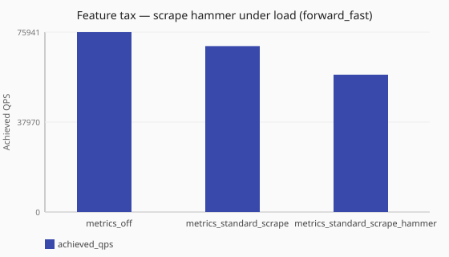

# Aggressive scrape cadence under load

What does frequent Prometheus scraping during load cost versus listener-only scrape?

Numbers are same-host comparisons on a single reference host and are **not**
service-level objectives. See the
[performance hub disclaimer](/performance/index.md).

## When this matters

Opening a Prometheus listen address without concurrent scrapes underestimates
export-path cost. This study adds a lab **scrape hammer** (HTTP GET to
`/metrics` about every 100 ms) while dnsperf runs, compared to observability off
and standard scrape with the listener idle. Use it when your Prometheus (or other
scraper) hits Conduit aggressively under peak traffic.

## What we varied

- **Varied:** scrape cadence posture
  ([`metrics_off`](/performance/scenarios.md#feature-tax-metrics-off-forward-fast),
  [`metrics_standard_scrape`](/performance/scenarios.md#feature-tax-metrics-standard-scrape-forward-fast),
  [`metrics_standard_scrape_hammer`](/performance/scenarios.md#feature-tax-metrics-standard-scrape-hammer-forward-fast))
- **Held fixed:** [`sync`](/concepts/runtime-and-concurrency.md#sync-runtime-default), [`forward_fast`](/performance/methodology.md#load-shapes), standard base on the scrape configurations

<!-- perf-study-evidence:start -->
## Evidence

### Feature tax — scrape hammer under load (forward_fast)

[Download CSV](../generated/metrics-scrape-hammer-forward-fast.csv)

| Posture | Runtime | Achieved QPS | Avg latency (ms) | Sent | Completed | Lost | Workers |
| --- | --- | --- | --- | --- | --- | --- | --- |
| [metrics_off](/performance/scenarios.md#feature-tax-metrics-off-forward-fast) | sync | 75940.7 | 26.3 | 761386 | 761386 | 0 | ingress=2 |
| [metrics_standard_scrape](/performance/scenarios.md#feature-tax-metrics-standard-scrape-forward-fast) | sync | 70029.9 | 28.5 | 703153 | 703153 | 0 | ingress=2 |
| [metrics_standard_scrape_hammer](/performance/scenarios.md#feature-tax-metrics-standard-scrape-hammer-forward-fast) | sync | 57968.8 | 34.4 | 582917 | 582917 | 0 | ingress=2 |

<!-- perf-study-evidence:end -->

<!-- perf-study-deltas:start -->
## At a glance

- **scrape hammer under load (forward_fast):** `metrics_standard_scrape` costs about **8%** QPS versus `metrics_off` (~70k vs ~76k); `metrics_standard_scrape_hammer` costs about **24%** QPS versus `metrics_off` (~58k vs ~76k).
<!-- perf-study-deltas:end -->

## Takeaway

**A much hotter scraper adds a clear extra tax beyond standard scrape on this
median.** Versus observability off (~76k), standard scrape costs about **8%**
(~70k); aggressive external scrape (~10/s) about **24%** (~58k).

**What to do:** size standing scrape cost from the
[metrics scrape tax](/performance/studies/metrics-scrape-ladder.md) and
[collect vs emit](/performance/studies/metrics-collect-vs-emit.md). Choose your
scrape interval for ops needs; remeasure if your scraper is as hot as this lab
hammer.

## Related guides

- [Metrics](/observability/metrics.md)
- [Operator metrics bases](/guides/operator-metrics-bases.md)
- [Metrics scrape tax](/performance/studies/metrics-scrape-ladder.md)
- [Metrics scrape (split_io)](/performance/studies/metrics-scrape-split-io.md)

## Member scenarios

- [feature-tax-metrics-off-forward-fast](/performance/scenarios.md#feature-tax-metrics-off-forward-fast)
- [feature-tax-metrics-standard-scrape-forward-fast](/performance/scenarios.md#feature-tax-metrics-standard-scrape-forward-fast)
- [feature-tax-metrics-standard-scrape-hammer-forward-fast](/performance/scenarios.md#feature-tax-metrics-standard-scrape-hammer-forward-fast)

## Related

- [Studies hub](/performance/studies/index.md)
- [Reference results](/performance/reference.md)
- [Methodology](/performance/methodology.md)
