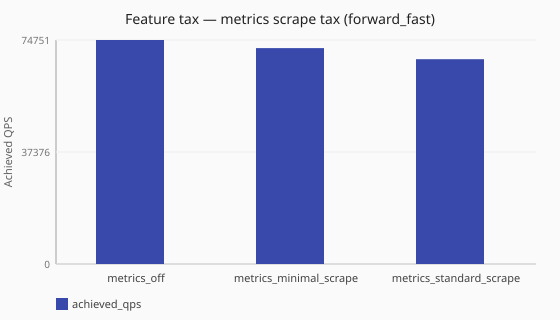

# Metrics scrape ladder

What does enabling richer Prometheus scrape metrics cost under [`forward_fast`](/performance/methodology.md#load-shapes)?

Numbers are same-host comparisons (relative to baselines measured on one named
lab profile) and are **not** service-level objectives. See the
[performance hub disclaimer](/performance/index.md).

## When this matters

Operators choose [`metrics.base`](/observability/metrics-configurability.md)
(`minimal` vs `standard`) for dashboard richness versus cardinality and hot-path
cost. See [Operator metrics bases](/guides/operator-metrics-bases.md). This study
puts an observability-off baseline next to minimal and standard scrape postures
under the same [`forward_fast`](/performance/methodology.md#load-shapes) load. For OTLP push cost under the same recipe, see
[OTLP tax under load](/performance/studies/otlp-tax-under-load.md).

## What we varied

- **Varied:** observability posture
  ([`metrics_off`](/performance/scenarios.md#feature-tax-metrics-off-scrape-ladder-forward-fast) →
  [`metrics_minimal_scrape`](/performance/scenarios.md#feature-tax-metrics-minimal-scrape-ladder-forward-fast) →
  [`metrics_standard_scrape`](/performance/scenarios.md#feature-tax-metrics-standard-scrape-ladder-forward-fast))
- **Held constant:** [`sync`](/concepts/runtime-and-concurrency.md#sync-runtime-default) runtime,
  [`forward_fast`](/performance/methodology.md#load-shapes) stub, ingress workers
- **Loadgen:** published [`forward_fast`](/performance/methodology.md#load-shapes)
  dnsperf recipe — `-c 16` / `-T 8` / `-q 2000` (shared with other
  `forward_fast` / `cache_hit` scale and feature-tax cells; see
  [How load is applied](/performance/methodology.md#how-load-is-applied-not-a-fixed-offered-qps))
  — each pole is also the **median of 3 independent rounds**

<!-- perf-ann:ann-feature-tax-scrape-ladder-noise:start -->
!!! note "Metrics scrape ladder — published forward_fast recipe"
    These scrape-ladder cells use the same published [`forward_fast`](/performance/methodology.md#load-shapes)
    dnsperf recipe as other scale / feature-tax fast cells (clients 16, threads 8,
    max outstanding 2000) and are the **median of 3 independent rounds**. That is
    the shared publish recipe so achieved QPS reflects Conduit capacity rather than
    a thin outstanding window — not a scrape-ladder-only workaround. See
    [How load is applied](/performance/methodology.md#how-load-is-applied-not-a-fixed-offered-qps).
    Remeasure locally with the same recipe before sizing.
<!-- perf-ann:ann-feature-tax-scrape-ladder-noise:end -->

<!-- perf-study-evidence:start -->
## Evidence

### Feature tax — metrics scrape ladder (forward_fast)

[Download CSV](../generated/metrics-scrape-ladder-forward-fast.csv)

| Posture | Runtime | Achieved QPS | Avg latency (ms) | Sent | Completed | Lost | Workers |
| --- | --- | --- | --- | --- | --- | --- | --- |
| [metrics_off](/performance/scenarios.md#feature-tax-metrics-off-scrape-ladder-forward-fast) | sync | 138672.0 | 2.2 | 1390396 | 1387024 | 3377 | ingress=2 |
| [metrics_minimal_scrape](/performance/scenarios.md#feature-tax-metrics-minimal-scrape-ladder-forward-fast) | sync | 131434.7 | 2.1 | 1318106 | 1314639 | 3467 | ingress=2 |
| [metrics_standard_scrape](/performance/scenarios.md#feature-tax-metrics-standard-scrape-ladder-forward-fast) | sync | 121094.1 | 1.5 | 1214666 | 1211244 | 3508 | ingress=2 |

<!-- perf-study-evidence:end -->

## Takeaway

On this published reference, richer scrape costs about **5%** (minimal) to
**13%** (standard) achieved QPS versus observability off (lab absolute ~139k /
~131k / ~121k). That is a same-host tax signal — still not an SLO.
**Operator posture:** pick minimal vs standard from the cardinality you
need ([operator metrics bases](/guides/operator-metrics-bases.md)); remeasure on
your hardware with the published `forward_fast` recipe (`--study
metrics-scrape-ladder` picks these cells). For collect vs export, see
[Metrics collect vs emit](/performance/studies/metrics-collect-vs-emit.md);
for [`split_io`](/concepts/runtime-and-concurrency.md#split-io-runtime), see
[Metrics scrape (split_io)](/performance/studies/metrics-scrape-split-io.md).

## Related guides

- [Operator metrics bases](/guides/operator-metrics-bases.md)
- [Metrics configurability](/observability/metrics-configurability.md)
- [Reference: metrics and tracing](/reference/config-schema/metrics-and-tracing.md)
- [How load is applied](/performance/methodology.md#how-load-is-applied-not-a-fixed-offered-qps)
- [OTLP tax under load](/performance/studies/otlp-tax-under-load.md)
- [Metrics collect vs emit](/performance/studies/metrics-collect-vs-emit.md)
- [Aggressive scrape cadence](/performance/studies/metrics-scrape-hammer.md)

## Member scenarios

- [feature-tax-metrics-off-scrape-ladder-forward-fast](/performance/scenarios.md#feature-tax-metrics-off-scrape-ladder-forward-fast)
- [feature-tax-metrics-minimal-scrape-ladder-forward-fast](/performance/scenarios.md#feature-tax-metrics-minimal-scrape-ladder-forward-fast)
- [feature-tax-metrics-standard-scrape-ladder-forward-fast](/performance/scenarios.md#feature-tax-metrics-standard-scrape-ladder-forward-fast)

## Related

- [Studies hub](/performance/studies/index.md)
- [Reference results](/performance/reference.md)
- [Methodology](/performance/methodology.md)
