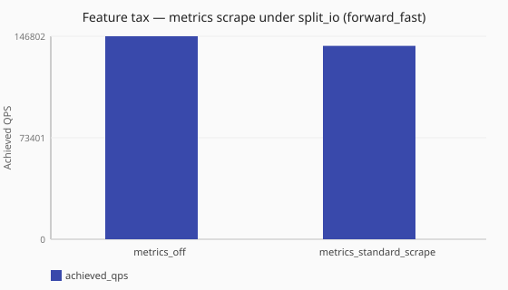

# Metrics scrape tax under split_io

What does standard scrape cost versus observability off when the runtime is [`split_io`](/concepts/runtime-and-concurrency.md#split-io-runtime)?

Numbers are same-host comparisons (relative to baselines measured on one named
lab profile) and are **not** service-level objectives. See the
[performance hub disclaimer](/performance/index.md).

## When this matters

The [metrics scrape ladder](/performance/studies/metrics-scrape-ladder.md) uses
**[`sync`](/concepts/runtime-and-concurrency.md#sync-runtime-default)**. If production already runs
[`split_io`](/concepts/runtime-and-concurrency.md#split-io-runtime)
(`dataplane.runtime: split_io`), scrape tax on that model is the more relevant
comparison. This study pairs observability off and standard scrape under
`split_io` + [`forward_fast`](/performance/methodology.md#load-shapes) (2 ingress /
2 policy / 2 I/O workers).

## What we varied

- **Varied:** observability posture
  ([`metrics_off`](/performance/scenarios.md#feature-tax-metrics-off-split-io-forward-fast) vs
  [`metrics_standard_scrape`](/performance/scenarios.md#feature-tax-metrics-standard-scrape-split-io-forward-fast))
- **Held fixed:** `split_io`, ingress/policy/io = 2,
  [`forward_fast`](/performance/methodology.md#load-shapes), dnsperf recipe

<!-- perf-study-evidence:start -->
## Evidence

### Feature tax — metrics scrape under split_io (forward_fast)

[Download CSV](../generated/metrics-scrape-split-io-forward-fast.csv)

| Posture | Runtime | Achieved QPS | Avg latency (ms) | Sent | Completed | Lost | Workers |
| --- | --- | --- | --- | --- | --- | --- | --- |
| [metrics_off](/performance/scenarios.md#feature-tax-metrics-off-split-io-forward-fast) | split_io | 373534.0 | 2.6 | 3738747 | 3736729 | 2018 | ingress=2, policy=2, io=2 |
| [metrics_standard_scrape](/performance/scenarios.md#feature-tax-metrics-standard-scrape-split-io-forward-fast) | split_io | 284907.8 | 3.7 | 2852838 | 2850456 | 1822 | ingress=2, policy=2, io=2 |

<!-- perf-study-evidence:end -->

## Takeaway

On this published reference, **standard scrape under split_io costs about 24%**
achieved QPS versus observability off (lab absolute ~285k vs ~374k) with a
latency rise. That tax is notably larger than the ~13% standard-scrape tax seen
under `sync` (see [Metrics scrape ladder](/performance/studies/metrics-scrape-ladder.md)) — `split_io`'s
higher absolute throughput gives scrape more query volume to instrument per
second, so the same per-query recording cost shows up as a larger relative
share. **Operator posture:** prefer this pair over the sync scrape comparison
when sizing scrape on a `split_io` deployment; still pick minimal vs standard
from [cardinality need](/guides/operator-metrics-bases.md).

## Related guides

- [Operator metrics bases](/guides/operator-metrics-bases.md)
- [Runtime and concurrency](/concepts/runtime-and-concurrency.md)
- [Metrics scrape ladder](/performance/studies/metrics-scrape-ladder.md) (sync)
- [Aggressive scrape cadence](/performance/studies/metrics-scrape-hammer.md)

## Member scenarios

- [feature-tax-metrics-off-split-io-forward-fast](/performance/scenarios.md#feature-tax-metrics-off-split-io-forward-fast)
- [feature-tax-metrics-standard-scrape-split-io-forward-fast](/performance/scenarios.md#feature-tax-metrics-standard-scrape-split-io-forward-fast)

## Related

- [Studies hub](/performance/studies/index.md)
- [Reference results](/performance/reference.md)
- [Methodology](/performance/methodology.md)
