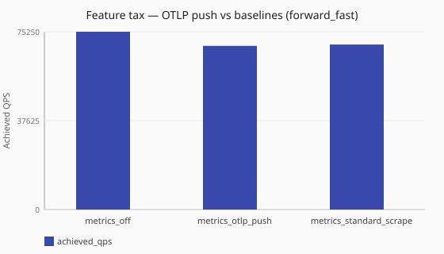

# OTLP tax under load

What does OTLP metrics push cost versus observability off under [`forward_fast`](/performance/methodology.md#load-shapes)?

Numbers are same-host comparisons on a single reference host and are **not**
service-level objectives. See the
[performance hub disclaimer](/performance/index.md).

## When this matters

Operators enabling [OTLP metrics push](/guides/otlp-metrics-push.md) need a
directional sense of hot-path cost versus leaving metrics off, and how that
compares to a Prometheus scrape posture. Configure push under
[`metrics.otel`](/reference/config-schema/metrics-and-tracing.md). This study
reuses existing `feature_tax` cells; the OTLP member requires the
`conduit-otlp-metrics-tracer` companion and is skip-tolerant in the harness.
Compare also the [metrics scrape tax](/performance/studies/metrics-scrape-ladder.md).

## What we varied

- **Varied:** observability posture
  ([`metrics_off`](/performance/scenarios.md#feature-tax-metrics-off-forward-fast),
  [`metrics_otlp_push`](/performance/scenarios.md#feature-tax-metrics-otlp-push-forward-fast),
  [`metrics_standard_scrape`](/performance/scenarios.md#feature-tax-metrics-standard-scrape-forward-fast))
- **Held fixed:** [`sync`](/concepts/runtime-and-concurrency.md#sync-runtime-default) runtime,
  [`forward_fast`](/performance/methodology.md#load-shapes), same dnsperf recipe on the
  single reference host
- **Skip rule:** if the OTLP companion is unavailable, the OTLP pole is omitted
  or marked unavailable — figures never invent series

<!-- perf-study-evidence:start -->
## Evidence

### Feature tax — OTLP push vs baselines (forward_fast)

[Download CSV](../generated/otlp-tax-under-load-forward-fast.csv)

| Posture | Runtime | Achieved QPS | Avg latency (ms) | Sent | Completed | Lost | Workers |
| --- | --- | --- | --- | --- | --- | --- | --- |
| [metrics_off](/performance/scenarios.md#feature-tax-metrics-off-forward-fast) | sync | 75940.7 | 26.3 | 761386 | 761386 | 0 | ingress=2 |
| [metrics_otlp_push](/performance/scenarios.md#feature-tax-metrics-otlp-push-forward-fast) | sync | 70315.7 | 28.4 | 705512 | 705512 | 0 | ingress=2 |
| [metrics_standard_scrape](/performance/scenarios.md#feature-tax-metrics-standard-scrape-forward-fast) | sync | 70029.9 | 28.5 | 703153 | 703153 | 0 | ingress=2 |

<!-- perf-study-evidence:end -->

<!-- perf-study-deltas:start -->
## At a glance

- **OTLP push vs baselines (forward_fast):** `metrics_otlp_push` costs about **7%** QPS versus `metrics_off` (~70k vs ~76k); `metrics_standard_scrape` costs about **8%** QPS versus `metrics_off` (~70k vs ~76k).
<!-- perf-study-deltas:end -->

## Takeaway

**OTLP push costs about as much as standard scrape on this median.** Versus
observability off (~76k): OTLP about **8%** (~70k), standard scrape about
**8%** (~70k).

**What to do:** enable OTLP only when you have a collector path. Otherwise
prefer scrape and size from the
[metrics scrape tax](/performance/studies/metrics-scrape-ladder.md).

## Related guides

- [OTLP metrics push smoke](/guides/otlp-metrics-push.md)
- [Operator metrics bases](/guides/operator-metrics-bases.md)
- [Metrics configurability](/observability/metrics-configurability.md)
- [Reference: metrics and tracing](/reference/config-schema/metrics-and-tracing.md)
- [Metrics scrape tax](/performance/studies/metrics-scrape-ladder.md)
- [Aggressive scrape cadence](/performance/studies/metrics-scrape-hammer.md)

## Member scenarios

- [feature-tax-metrics-off-forward-fast](/performance/scenarios.md#feature-tax-metrics-off-forward-fast)
- [feature-tax-metrics-otlp-push-forward-fast](/performance/scenarios.md#feature-tax-metrics-otlp-push-forward-fast)
- [feature-tax-metrics-standard-scrape-forward-fast](/performance/scenarios.md#feature-tax-metrics-standard-scrape-forward-fast)

## Related

- [Studies hub](/performance/studies/index.md)
- [Reference results](/performance/reference.md)
- [Methodology](/performance/methodology.md)
