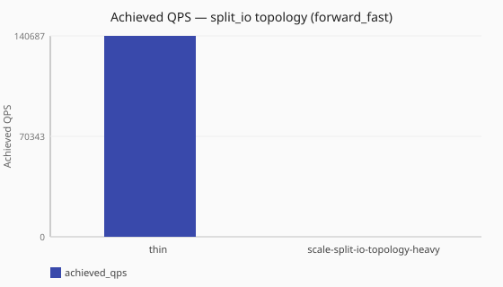

# Split_io bulk thread topology

Does raising ingress, policy, and I/O worker counts together always help under
[`forward_fast`](/performance/methodology.md#load-shapes)?

Numbers are same-host comparisons on a single reference host and are **not**
service-level objectives. See the
[performance hub disclaimer](/performance/index.md).

## When this matters

It is tempting to raise all [`split_io`](/concepts/runtime-and-concurrency.md#split-io-runtime)
worker counts at once (`listeners.threads`, `dataplane.policy_workers`,
`dataplane.io_workers` — see
[worker counts](/concepts/runtime-and-concurrency.md#worker-counts-and-limits)).
This study compares a modest baseline (2 of each) with doubling all three
together (4 of each) under [`forward_fast`](/performance/methodology.md#load-shapes).
To see which setting actually helps, change **one** count at a time:
[I/O vs ingress (split_io)](/performance/studies/io-vs-ingress-split.md) and
[ingress concurrency (sync)](/performance/studies/ingress-concurrency-sync.md).

## What we varied

- **Varied:** all three worker counts together
  ([2/2/2 baseline](/performance/scenarios.md#scale-split-io-forward-fast) vs
  [4/4/4 doubled](/performance/scenarios.md#scale-split-io-topology-heavy))
- **Held constant:** [`split_io`](/concepts/runtime-and-concurrency.md#split-io-runtime),
  [`forward_fast`](/performance/methodology.md#load-shapes), observability off

<!-- perf-study-evidence:start -->
## Evidence

### Achieved QPS — split_io topology (forward_fast)

[Download CSV](../generated/split-io-topology-bulk-forward-fast.csv)

| Topology | Runtime | Achieved QPS | Avg latency (ms) | Sent | Completed | Lost | Workers |
| --- | --- | --- | --- | --- | --- | --- | --- |
| [thin](/performance/scenarios.md#scale-split-io-forward-fast) | split_io | 141401.1 | 14.0 | 1430029 | 1430029 | 0 | ingress=2, policy=2, io=2 |
| [heavy](/performance/scenarios.md#scale-split-io-topology-heavy) | split_io | 210005.8 | 9.5 | 2102918 | 2102918 | 0 | ingress=4, policy=4, io=4 |

<!-- perf-study-evidence:end -->

<!-- perf-study-deltas:start -->
## At a glance

- **split_io topology (forward_fast):** `heavy` is about **1.5×** `thin` (~210k vs ~141k).
<!-- perf-study-deltas:end -->

## Takeaway

**Raising ingress, policy, and I/O together helps on this median — and is still
not a substitute for single-axis sizing.** Topology-heavy (4/4/4) reaches about
**1.5×** the thin baseline (2/2/2) under
[`forward_fast`](/performance/methodology.md#load-shapes) (~210k vs ~141k).

**What to do:** treat the bulk pair as a ceiling check, not a tuning recipe.
Size **one** setting at a time with
[Dataplane runtime tuning](/guides/dataplane-runtime-tuning.md) and the
single-axis studies; remeasure the bulk pair on your hardware.

## Related guides

- [Runtime and concurrency](/concepts/runtime-and-concurrency.md)
- [Dataplane runtime tuning](/guides/dataplane-runtime-tuning.md)
- [Reference: dataplane](/reference/config-schema/dataplane.md)
- [I/O vs ingress (split_io)](/performance/studies/io-vs-ingress-split.md)
- [Sync vs split_io](/performance/studies/sync-vs-split-io.md)

## Member scenarios

- [scale-split-io-forward-fast](/performance/scenarios.md#scale-split-io-forward-fast)
- [scale-split-io-topology-heavy](/performance/scenarios.md#scale-split-io-topology-heavy)

## Related

- [Studies hub](/performance/studies/index.md)
- [Reference results](/performance/reference.md)
- [Methodology](/performance/methodology.md)
