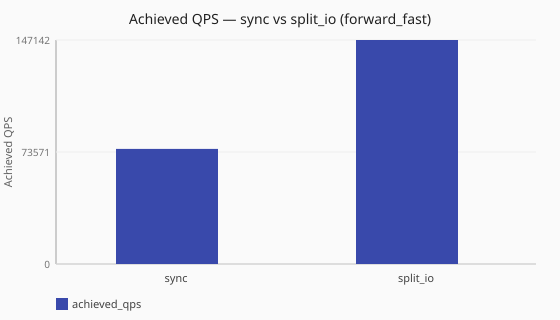
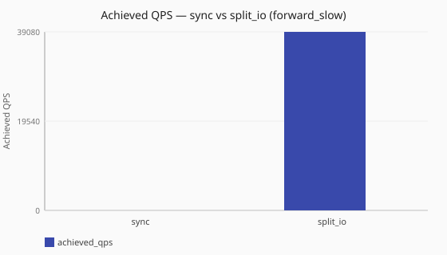

# Sync vs split_io

How does `dataplane.runtime:` [`sync`](/concepts/runtime-and-concurrency.md#sync-runtime-default)
compare to [`split_io`](/concepts/runtime-and-concurrency.md#split-io-runtime) under
[`forward_fast`](/performance/methodology.md#load-shapes) and
[`forward_slow`](/performance/methodology.md#load-shapes)?

Numbers are same-host comparisons on a single reference host and are **not**
service-level objectives. See the
[performance hub disclaimer](/performance/index.md).

## When this matters

Choosing a [runtime model](/concepts/runtime-and-concurrency.md) changes how
ingress and upstream I/O share threads.
[**`sync`**](/concepts/runtime-and-concurrency.md#sync-runtime-default) keeps
receive and forward on the same workers;
[`split_io`](/concepts/runtime-and-concurrency.md#split-io-runtime) separates
ingress from async I/O workers. Architecture suggests slow upstreams can stall
[`sync`](/concepts/runtime-and-concurrency.md#sync-runtime-default) ingress harder than
[`split_io`](/concepts/runtime-and-concurrency.md#split-io-runtime); this study checks
that claim under paired load shapes on one lab. See also
[worker counts](/concepts/runtime-and-concurrency.md#worker-counts-and-limits)
and the [dataplane runtime tuning](/guides/dataplane-runtime-tuning.md) guide.

## What we varied

- **Varied:** `dataplane.runtime`
  ([`sync`](/performance/scenarios.md#scale-sync-forward-fast) vs
  [`split_io`](/performance/scenarios.md#scale-split-io-forward-fast); paired
  slow runs under [Member scenarios](#member-scenarios))
- **Held fixed:** same dnsperf recipe, a single reference host, observability off
  fixtures
- **Two load shapes:** [`forward_fast`](/performance/methodology.md#load-shapes) and
  [`forward_slow`](/performance/methodology.md#load-shapes)

<!-- perf-study-evidence:start -->
## Evidence

### Achieved QPS — sync vs split_io (forward_fast)

[Download CSV](../generated/sync-vs-split-io-forward-fast.csv)

| Runtime | Achieved QPS | Avg latency (ms) | Sent | Completed | Lost | Workers |
| --- | --- | --- | --- | --- | --- | --- |
| [sync](/performance/scenarios.md#scale-sync-forward-fast) | 76269.9 | 26.1 | 765379 | 765379 | 0 | ingress=2 |
| [split_io](/performance/scenarios.md#scale-split-io-forward-fast) | 138744.2 | 14.4 | 1389252 | 1389252 | 0 | ingress=2, policy=2, io=2 |

### Achieved QPS — sync vs split_io (forward_slow)

[Download CSV](../generated/sync-vs-split-io-forward-slow.csv)

| Runtime | Achieved QPS | Avg latency (ms) | Sent | Completed | Lost | Workers |
| --- | --- | --- | --- | --- | --- | --- |
| [sync](/performance/scenarios.md#scale-sync-forward-slow) | 5.7 | 2508.7 | 12188 | 198 | 11990 | ingress=2 |
| [split_io](/performance/scenarios.md#scale-split-io-forward-slow) | 39080.2 | 51.1 | 1174342 | 1174342 | 0 | ingress=2, policy=2, io=2 |

<!-- perf-study-evidence:end -->

<!-- perf-study-deltas:start -->
## At a glance

- **sync vs split_io (forward_fast):** `split_io` is about **1.8×** `sync` (~139k vs ~76k).
- **sync vs split_io (forward_slow):** `split_io` is about **6889.8×** `sync` (~39k vs ~6 QPS).
<!-- perf-study-deltas:end -->

## Takeaway

**Against a fast upstream, `split_io` outperforms `sync` on this lab.** Under
[`forward_fast`](/performance/methodology.md#load-shapes),
[`split_io`](/concepts/runtime-and-concurrency.md#split-io-runtime) reaches about
**1.8×** the QPS of
[`sync`](/concepts/runtime-and-concurrency.md#sync-runtime-default) (~139k vs
~76k) with lower average latency and little query loss.

**Against a slow upstream, `split_io` still wins completion by a wide margin.**
Under [`forward_slow`](/performance/methodology.md#load-shapes), sync stays near
~6 QPS and lossy; `split_io` reaches about ~39k completed QPS with little loss
on this median. Prefer `split_io` when upstream wait owns the path.

**What to do:** prefer `split_io` when upstream wait matters; confirm on your
hardware with `--study sync-vs-split-io`.

## Related guides

- [Runtime and concurrency](/concepts/runtime-and-concurrency.md) — sync vs split_io models
- [Dataplane runtime tuning](/guides/dataplane-runtime-tuning.md)
- [Reference: dataplane](/reference/config-schema/dataplane.md) — `runtime`, `io_workers`, `policy_workers`
- [Ingress concurrency (sync)](/performance/studies/ingress-concurrency-sync.md)
- [I/O vs ingress (split_io)](/performance/studies/io-vs-ingress-split.md)

## Member scenarios

- [scale-sync-forward-fast](/performance/scenarios.md#scale-sync-forward-fast)
- [scale-split-io-forward-fast](/performance/scenarios.md#scale-split-io-forward-fast)
- [scale-sync-forward-slow](/performance/scenarios.md#scale-sync-forward-slow)
- [scale-split-io-forward-slow](/performance/scenarios.md#scale-split-io-forward-slow)
