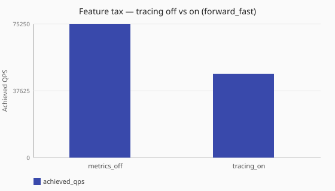

# Pipeline tracing tax

What does enabling full pipeline tracing cost under [`forward_fast`](/performance/methodology.md#load-shapes)?

Numbers are same-host comparisons on a single reference host and are **not**
service-level objectives. See the
[performance hub disclaimer](/performance/index.md).

## When this matters

[Pipeline tracing](/observability/tracing.md) records per-query phase detail for
diagnosis. Unlike process [logging](/observability/logging.md) levels, tracing
is a dedicated [`tracing:`](/reference/config-schema/metrics-and-tracing.md)
block with selectors and sampling. This study compares observability off against
tracing enabled for **qtype A at 100% sample** under
[`forward_fast`](/performance/methodology.md#load-shapes) (dnsperf query file is
A-heavy).

## What we varied

- **Varied:** tracing posture
  ([off via `metrics_off`](/performance/scenarios.md#feature-tax-metrics-off-forward-fast) vs
  [`tracing_on`](/performance/scenarios.md#feature-tax-tracing-on-forward-fast))
- **Held fixed:** metrics disabled, no dnstap,
  [`sync`](/concepts/runtime-and-concurrency.md#sync-runtime-default),
  [`forward_fast`](/performance/methodology.md#load-shapes)

<!-- perf-study-evidence:start -->
## Evidence

### Feature tax — tracing off vs on (forward_fast)

[Download CSV](../generated/tracing-off-vs-on-forward-fast.csv)

| Posture | Runtime | Achieved QPS | Avg latency (ms) | Sent | Completed | Lost | Workers |
| --- | --- | --- | --- | --- | --- | --- | --- |
| [metrics_off](/performance/scenarios.md#feature-tax-metrics-off-forward-fast) | sync | 75940.7 | 26.3 | 761386 | 761386 | 0 | ingress=2 |
| [tracing_on](/performance/scenarios.md#feature-tax-tracing-on-forward-fast) | sync | 48719.5 | 40.9 | 489630 | 489630 | 0 | ingress=2 |

<!-- perf-study-evidence:end -->

<!-- perf-study-deltas:start -->
## At a glance

- **tracing off vs on (forward_fast):** `tracing_on` costs about **36%** QPS versus `metrics_off` (~49k vs ~76k).
<!-- perf-study-deltas:end -->

## Takeaway

**Full pipeline tracing is expensive.** On this lab it costs about **36%** QPS
versus observability off (~49k vs ~76k) and raises average latency.

**What to do:** enable tracing for diagnosis windows; do not leave 100%
sampling on in production. Narrow selectors and `sample_percent`, then
remeasure.

## Related guides

- [Tracing](/observability/tracing.md)
- [Reference: metrics and tracing](/reference/config-schema/metrics-and-tracing.md)
- [Logging verbosity tax](/performance/studies/logging-verbosity-tax.md)

## Member scenarios

- [feature-tax-metrics-off-forward-fast](/performance/scenarios.md#feature-tax-metrics-off-forward-fast)
- [feature-tax-tracing-on-forward-fast](/performance/scenarios.md#feature-tax-tracing-on-forward-fast)

## Related

- [Studies hub](/performance/studies/index.md)
- [Reference results](/performance/reference.md)
- [Methodology](/performance/methodology.md)
