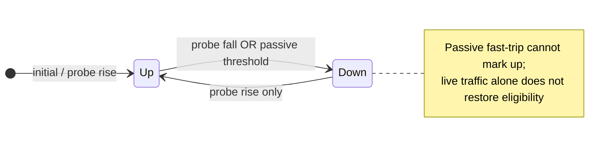

# Backend health

This page explains how Conduit probes upstream [backends](/glossary/index.md#backend), detects sudden failures on live traffic, and uses **applied** health at [Route](/concepts/architecture-and-packet-path.md#route) to decide eligibility and effective load-balancing weight.

For YAML fields and validation, see [Reference: health](/reference/config-schema/health.md). For `conduitctl` and gRPC, see [gRPC and conduitctl — health](/control-plane/grpc-and-conduitctl.md#health). For Prometheus series, see [Built-in metrics — Backend health](/observability/built-in-metrics.md#backend-health).

## When to enable health

Enable pool-level health when you want Conduit to **stop sending new queries** to backends that probes or live forwards mark down — rather than keeping every backend eligible at [Route](/concepts/architecture-and-packet-path.md#route) and leaving failure handling to per-forward [timeouts](/policy-routing/retries-and-transactions.md) plus any [retry](/glossary/index.md#retry) policy you configure in [response rules](/policy-routing/rules-and-actions.md).

Health is **opt-in**: without a pool `health:` block (or with `enabled: false`), all configured backends stay eligible and selection is weight-based only.

Minimal example:

```yaml
pools:
  - name: default
    health:
      enabled: true
    backends:
      - address: "10.0.0.1:53"
        weight: 100
      - address: "10.0.0.2:53"
        weight: 100
```

## Active probes and passive fast-trip

Conduit checks each backend with **active probes** (periodic synthetic DNS queries off the client hot path) and **passive fast-trip** (timeouts and hard errors on client forwards routed to that backend):

| | What it detects | How fast | Can mark **up** again? |
|--|-----------------|----------|------------------------|
| **Active probes** | Periodic DNS queries Conduit sends to each backend on a dedicated probe loop | About `fall × interval_ms` to mark down at default settings | **Yes** — after `rise` consecutive successful probes |
| **Passive fast-trip** | Timeouts and hard forward errors on **client** traffic routed to that backend | Often sub-second under load | **No** — only probe `rise` can mark it **up** after passive fast-trip marks it down |

**Probes or passive fast-trip may mark a backend down** for routing. **Only probe success** (`rise` consecutive good probes) marks it **up** again. That split lets Conduit catch sudden death faster than the probe interval while still requiring proof of recovery before returning traffic.

Turn passive off with `passive_fast_trip: false` when you want down detection to follow probes only.



## Observed vs applied health

Each backend carries two liveness views:

| Field | Meaning | Route uses |
|-------|---------|------------|
| **Observed** | What probes and passive fast-trip report (always updated) | No — visibility and metrics only |
| **Applied** | What [Route](/concepts/architecture-and-packet-path.md#route) reads for eligibility | **Yes** |

Normally `applied` tracks `observed`. When you [freeze](#operator-controls-freeze-drain-resume) or [drain](#operator-controls-freeze-drain-resume) a backend, `applied` holds its value while `observed` keeps updating — so you can pull traffic off a still-healthy upstream for maintenance without lying to probes.

**Resume automatic** (unfreeze + snap) sets the scope back to automatic and immediately sets `applied := observed`, so a drained backend returns to rotation without waiting for probe rise.

Scripts only **read** health here through **`runtime.routing()`** — see [Runtime API — routing](/rhai/runtime-api.md#routingruntime). [Freeze](#operator-controls-freeze-drain-resume), [drain](#operator-controls-freeze-drain-resume), and resume are operator control-plane actions (`conduitctl health`), not Rhai calls.

## Route: eligibility, weight, and fail-open

At [Route](/concepts/architecture-and-packet-path.md#route), Conduit:

1. Filters to backends whose **applied** health is **up** (eligible).
2. Applies the configured **fail-open floor** (`min_eligible`) when too few backends are eligible — treats all backends as eligible at configured weight rather than failing the pool for lack of healthy targets.
3. Computes **effective weight** = configured `weight` × latency factor (when `latency_weighting: true`), then weighted-picks among eligible backends.

**Liveness** (up/down) gates eligibility. **Latency** only scales share among eligible backends — it never zeroes a backend; only down state removes it from rotation. The latency factor is relative to the fastest EWMA in the pool, clamped with a floor (default **0.25**), and damped step-to-step to avoid oscillation.

**Single-backend pools always fail open** — the lone backend stays selected even when marked down, so clients still get forward timeouts/retries instead of an immediate pool-level failure.

A **new backend added while its scope is frozen** is not auto-eligible until you manually set it up or resume automatic.

For weight-only selection without health, see [Pools and backends — Backend weights](/policy-routing/pools-and-backends.md#backend-weights).

## Operator controls: freeze, drain, resume

Use **`conduitctl health`** (or the `BackendHealth` gRPC service) to override probe-driven routing without editing the config file.

| Goal | Typical command |
|------|-----------------|
| Inspect state | `conduitctl health show` |
| Maintenance [drain](/glossary/index.md#drain) (stop traffic, probes keep running) | `conduitctl health set down --pool POOL --backend NAME` |
| Hold applied while observing probes ([freeze](/glossary/index.md#freeze)) | `conduitctl health freeze --pool POOL` |
| Return to probe-driven routing | `conduitctl health resume --pool POOL --backend NAME` |

**Manual set up/down implies [freeze](/glossary/index.md#freeze)** for that scope — otherwise the next probe would overwrite your choice.

### Scope precedence (most-specific wins)

Freeze/automatic is a tri-state at **backend**, **pool**, and **global** scope: `inherit`, `frozen`, or `automatic`. Resolution is **most-specific wins**: backend → pool → global → default (`automatic`).

Examples:

- **Global freeze** during an incident stops probe-driven transitions everywhere that inherits global — but a backend you already drained (`frozen` at backend scope) **stays drained** when you later resume global.
- **Carve-out:** freeze globally, set one pool or backend to `automatic` so only that scope follows probes.

### Clear-while-frozen footgun

Clearing or tweaking health state while a scope is still **frozen** can leave **stale `applied`** values that no longer match probes. The safe recovery path is the atomic **`health resume`** (resume automatic), which unfreezes and snaps `applied` to `observed` in one step — not a sequence of separate clear/freeze/unfreeze commands.

## Reload and health state

Health **runtime state** lives outside the [runtime snapshot](/glossary/index.md#runtime-snapshot) (probe **configuration** is in the snapshot; observed/applied liveness and freeze/drain are not). On reload or overlay apply, Conduit **preserves** health for backends whose identity and probe semantics are unchanged.

Health **resets** when a backend is **new**, its **address** changes, or **probe semantics** change (`probe_qname`, `probe_qtype`, `probe_source`, or transport binding). Weight-only overlay applies do not wipe known-down backends.

Probe **configuration** is part of the snapshot and hot-reloads; probe **state** is reconciled across swaps.

## Probe behavior (operator view)

- **Default interval** 1 s (floor **100 ms**), with jitter and at most **one outstanding probe per backend** (skip-if-outstanding).
- **Multiplexed loop** — one dead backend timing out does not delay probes to others.
- **Transport** matches [`forward.upstream_transport`](/reference/config-schema/forward.md) — Conduit probes the same UDP/TCP path it uses for forwards.
- **Probe load:** each enabled backend receives periodic synthetic queries. At very low `interval_ms`, aggregate probe QPS scales with backend count — size intervals for your upstream tolerance.
- **Logging:** active-probe transitions log at INFO as `backend health transition` (`pool`, `backend`, `observed`, `applied`). Passive fast-trip logs each counting failure at WARN (`passive health: forward failure`) and the trip itself as `passive fast-trip: backend marked down`, including the query (`qname`, `qtype`), client, failure reason, and passive failure count.
- **Metrics (`health` category):** [`conduit_probe_results_total`](/observability/built-in-metrics.md#conduit_probe_results_total) counts each active probe outcome (`success`, `failure`, `timeout`, `send_error`) per backend when **`health`** is in the metrics plan (`base: minimal` and **`standard`** include it). Live forward timeouts and hard errors are counted on [`conduit_forward_errors_total`](/observability/built-in-metrics.md#conduit_forward_errors_total) with `pool`, `backend`, and `reason`. Health state gauges are under [Built-in metrics — Backend health](/observability/built-in-metrics.md#backend-health).

## Related topics

- [Pools and backends](/policy-routing/pools-and-backends.md) — pools, weights, backend names
- [Guide: Backend health](/guides/backend-health.md) — lab walkthrough (probes, drain, resume)
- [Reference: health](/reference/config-schema/health.md) — config fields and defaults
- [Built-in metrics — Backend health](/observability/built-in-metrics.md#backend-health) — Prometheus gauges and probe counters
- [gRPC and conduitctl — health](/control-plane/grpc-and-conduitctl.md#health) — commands and RPCs
- [Runtime API — routing](/rhai/runtime-api.md#routingruntime) — script access to health at hook entry
- [Glossary](/glossary/index.md) — [applied health](/glossary/index.md#applied-health), [observed health](/glossary/index.md#observed-health), [freeze](/glossary/index.md#freeze), [drain](/glossary/index.md#drain), [passive fast-trip](/glossary/index.md#passive-fast-trip), [fail-open floor](/glossary/index.md#fail-open-floor)
