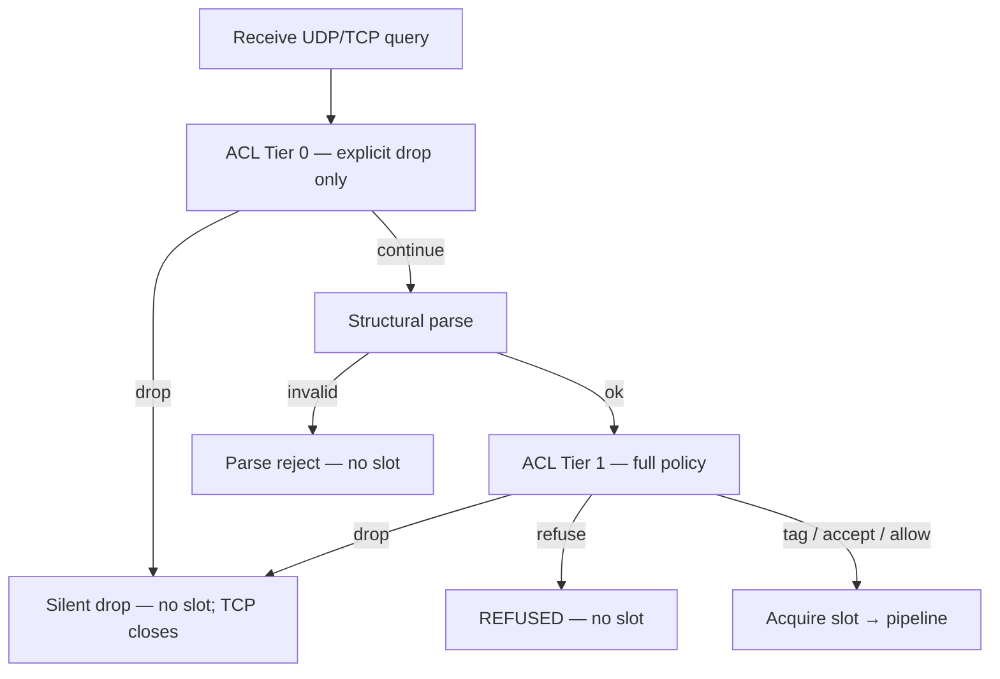

# Client ACLs

Host-managed allow/deny (and tag) for client socket IPs using named **`type: cidr`** data sources. Use this when you want different policy on public vs internal listeners without scripting exact-key CSV lookups on every query.

Omit top-level **`acls:`** and Conduit admits every client — same behavior as a config with no ACL keys.

Field reference: [Config schema: acls](/reference/config-schema/acls.md). CIDR tables: [Data sources — CIDR sources](/policy-routing/data-sources.md#cidr-sources) and [Config schema: data sources](/reference/config-schema/data-sources.md).

## How it fits the query path

ACL runs on **ingress**, before a [transaction](/glossary/index.md#transaction) slot is acquired when the runtime can admit that way:



| Stage | What runs |
|-------|-----------|
| **Tier 0 (pre-parse)** | Explicit **`drop`** matches only — known-bad nets never pay for parse or a slot. On **TCP**, Tier 0 closes the session immediately after accept (before reading a query). The TCP handshake still completes; this is not a firewall SYN drop. |
| **Tier 1 (post-parse, pre-slot)** | Full first-match: **`drop`**, **`refuse`**, **`tag`**, **`accept`**, and **`default_action`** |
| **Request rules** | Optional **`client_cidr`** [selector](/glossary/index.md#selector) for special cases with existing rule [actions](/glossary/index.md#action) |

Matching uses the **UDP/TCP peer address** on the socket. EDNS Client Subnet and other forwarded-client identity are out of scope.

## Global and per-listener policy

```yaml
data_sources:
  - name: corp_nets
    type: cidr
    path: data/corp_nets.txt
  - name: block_nets
    type: cidr
    path: data/block_nets.txt

acls:
  default_action: deny
  rules:
    - match: block_nets
      action: drop
    - match: corp_nets
      action: accept

listeners:
  threads: 1
  listeners:
    - address: "0.0.0.0:53"
      protocol: udp
      name: public
      acls:
        default_action: deny
        rules:
          - match: corp_nets
            action: accept
    - address: "10.0.0.1:53"
      protocol: udp
      name: internal
      # no acls: — inherits global
```

| Listener `acls:` | Effect |
|------------------|--------|
| **Omitted** | Inherit the entire top-level **`acls:`** (or admit-all if none) |
| **Present** | **Full replace** of global ACL for that listener only — not a merge |

First matching rule wins. If no rule matches, **`default_action`** applies: **`allow`** admits; **`deny`** is a **silent drop** (no DNS reply). Prefer an explicit **`refuse`** rule when clients should see **REFUSED**.

## Actions

| `action` | Behavior |
|----------|----------|
| `drop` | Silent discard; no slot; can run at Tier 0 when it is the first matching rule |
| `refuse` | DNS **REFUSED** from the parsed query id; no slot |
| `tag` | Admit, acquire a slot, set the named [tag](/glossary/index.md#tags) on the transaction (`tag:` required) |
| `accept` | Admit and stop ACL evaluation (name is **`accept`**, not `allow`, so it does not collide with **`default_action: allow`**) |

## Overlay and export

An [overlay](/glossary/index.md#overlay) is an in-memory config patch applied with **`conduitctl apply`** without editing the file on disk; [export](/control-plane/reload-and-export.md#export-effective-configuration) writes the current [effective config](/glossary/index.md#effective-config) back out as YAML. This section covers how ACL policy behaves under both.

Top-level **`acls:`** is overlay-eligible: when an overlay patch includes **`acls:`**, it **replaces** the entire top-level ACL policy. To clear back toward admit-all, apply an empty-rules block with **`default_action: allow`** (or reload without overlay).

YAML **export** keeps ACL structure and data-source **names / types / paths** — it does **not** inline CIDR file contents.

Per-listener ACL changes need a file reload or a whole-**`listeners:`** overlay replace (there is no sparse `listener_acls:` map).

## Observability

- Metrics: [`conduit_acl_decisions_total`](/observability/built-in-metrics.md#conduit_acl_decisions_total) (host gates only; Prom + OTLP parity)
- Denial logs: optional [`logging.query_access`](/observability/logging.md#query-access-acl-denials) with optional sampling

## Checking an IP

Use **`conduitctl acl check`** to dry-run effective ACL policy for a client address without sending a DNS query. Live mode (default) asks the running process via the control plane so the answer matches the in-memory snapshot and CIDR tables. Pass **`--file`** to compile a local YAML the same way as **`validate`**. Details and JSON fields: [gRPC and conduitctl — acl check](/control-plane/grpc-and-conduitctl.md#acl-check).

## Related

- [Rules and actions](/policy-routing/rules-and-actions.md) — `client_cidr` selector
- [Data sources](/policy-routing/data-sources.md) — `type: cidr` views and file format
- [Rhai lookups](/rhai/data-sources-and-lookups.md) — `lookup_ip` in rule scripts
- [Runtime and concurrency](/concepts/runtime-and-concurrency.md) — sync / split_io ingress
- [gRPC and conduitctl](/control-plane/grpc-and-conduitctl.md#acl-check) — `acl check`
