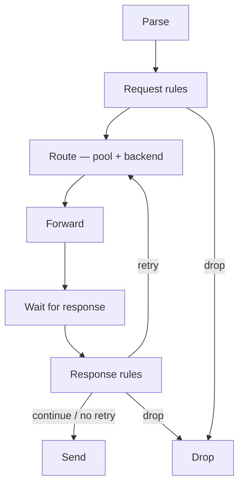

# Policy & routing

How Conduit decides **where** each client query goes upstream, **what** to change on the way out, and **when** to try again. This section covers declarative `rules:`, upstream `pools:` and [backends](/glossary/index.md#backend), and [retry](/glossary/index.md#retry) limits on the [dataplane](/glossary/index.md#dataplane).

Read [Architecture and packet path](/concepts/architecture-and-packet-path.md) first for pipeline phases and hook placement; YAML field lists are described on the topic pages below and in [Reference](/reference/config-schema/rules.md).

## How the pieces fit

| Concern | Config | Topic page |
|---------|--------|------------|
| Client IP allow/deny/tag by CIDR (ingress) | `acls:` + `type: cidr` | [Client ACLs](/policy-routing/client-acls.md) |
| Named CSV / CIDR tables for ACL and Rhai | `data_sources:` | [Data sources](/policy-routing/data-sources.md) |
| Match queries; set pool, tags, egress, or drop | `rules:` | [Rules and actions](/policy-routing/rules-and-actions.md) |
| Scripted policy on matching rules | `rules:` + `type: rhai` | [Rhai for rules](/rhai/rule-rhai.md) ([Rhai](/rhai/index.md)), [Rhai policy](/guides/rhai-policy.md) |
| Group upstream resolvers and load-balance | `pools:` | [Pools and backends](/policy-routing/pools-and-backends.md) |
| Exclude unhealthy backends from selection | `pools[].health` | [Backend health](/policy-routing/backend-health.md) |
| Caps and behavior on repeat attempts | `orchestrator:` | [Retries and transactions](/policy-routing/retries-and-transactions.md), [Reference: orchestrator](/reference/config-schema/orchestrator.md) |
| Default upstream timeout and egress address lists | `forward:` | [Reference: forward](/reference/config-schema/forward.md), [Dual-stack forwarding](/guides/dual-stack-forwarding.md) |

On each [transaction](/glossary/index.md#transaction), policy currently runs at two hooks on the query path:

1. **[Request rules](/concepts/architecture-and-packet-path.md#request-rules)** run **once** after [Parse](/concepts/architecture-and-packet-path.md#parse). [Selectors](/glossary/index.md#selector) test the query; [actions](/glossary/index.md#action) can set [pool](/glossary/index.md#pool), [tags](/glossary/index.md#tags), upstream egress source, or **drop**. No match → default [pool](/glossary/index.md#pool) path at [Route](/concepts/architecture-and-packet-path.md#route).
2. **[Route](/concepts/architecture-and-packet-path.md#route)** picks a [backend](/glossary/index.md#backend) in the selected pool (sticky weighted choice on the first attempt).
3. After an upstream answer or forward timeout, **[Response rules](/concepts/architecture-and-packet-path.md#response-rules)** continue to [Send](/concepts/architecture-and-packet-path.md#send), **drop**, or request a **retry** (`retry` / `retry_now`) — looping back to **Route**, not re-running request rules.
4. **[Send](/concepts/architecture-and-packet-path.md#send)** returns the final answer (or the transaction ends with drop or synthesized **SERVFAIL** when limits or pool exhaustion apply).

[Rules and actions](/policy-routing/rules-and-actions.md) use **`match_mode: first_match`**: on each hook, Conduit walks the rule list top to bottom and stops at the first rule whose selectors all match. Actions on that rule — built-in and optional Rhai for rules — run in **list order**. See [Rhai](/rhai/index.md).

## Read in order

1. [Client ACLs](/policy-routing/client-acls.md) — optional ingress IP policy (`acls:`) before transaction slots
2. [Data sources](/policy-routing/data-sources.md) — `data_sources:` CSV / CIDR tables shared by ACL and Rhai
3. [Rules and actions](/policy-routing/rules-and-actions.md) — `rules:` hooks, selectors, built-in actions, reload behavior
4. [Rhai for rules](/rhai/rule-rhai.md) — scripted policy when built-in actions are not enough
5. [Pools and backends](/policy-routing/pools-and-backends.md) — `pools:` layout, weights, default pool, **SERVFAIL** when routing fails
6. [Backend health](/policy-routing/backend-health.md) — active probes, passive fast-trip, eligibility, and [freeze](/glossary/index.md#freeze)/[drain](/glossary/index.md#drain) controls
7. [Retries and transactions](/policy-routing/retries-and-transactions.md) — response-hook retries, backend exclusion per attempt, `orchestrator` caps

## Prerequisites

- [Minimal configuration](/getting-started/minimal-configuration.md) — smallest runnable file (`listeners`, `pools`)
- [Config file](/control-plane/config-file.md) — where `rules:`, `pools:`, `orchestrator:`, and `forward:` sit in the top-level map

## Config reference

| Block | Reference |
|-------|-----------|
| `acls:` | [Reference: acls](/reference/config-schema/acls.md) |
| `data_sources:` / `data_source_limits:` | [Reference: data sources](/reference/config-schema/data-sources.md), [Data sources](/policy-routing/data-sources.md) |
| `rules:` | [Reference: rules](/reference/config-schema/rules.md) |
| `pools:` | [Reference: pools](/reference/config-schema/pools.md) |
| `pools[].health` | [Reference: health](/reference/config-schema/health.md) |
| `orchestrator:` | [Reference: orchestrator](/reference/config-schema/orchestrator.md), [Retries and transactions — Global limits](/policy-routing/retries-and-transactions.md#global-limits-orchestrator) |
| `forward:` | [Reference: forward](/reference/config-schema/forward.md), [Dual-stack forwarding](/guides/dual-stack-forwarding.md) |

Rule and pool changes load into the configuration [runtime snapshot](/glossary/index.md#runtime-snapshot) on reload or apply for **new** queries; in-flight [transactions](/glossary/index.md#transaction) keep the policy they started with. See [Configuration model](/control-plane/configuration-model.md) and [When changes to rules take effect](/policy-routing/rules-and-actions.md#when-changes-to-rules-take-effect).

## Related

- [Guide: Backend health](/guides/backend-health.md) — enable probes, drain, and resume in a lab
- [Dual-stack forwarding](/guides/dual-stack-forwarding.md) — `forward.sources_*`, pool `sources_*`, per-query `set_source_v4` / `set_source_v6`
- [Rhai](/rhai/index.md) — Rhai for rules
- [Rhai for rules](/rhai/rule-rhai.md) — scripted policy on request and response hooks
- [Built-in metrics](/observability/built-in-metrics.md) — `pool` / `backend` labels, forward errors, and [backend health](/observability/built-in-metrics.md#backend-health) gauges
- [Backend health](/policy-routing/backend-health.md) — probes, eligibility, and `conduitctl health`
