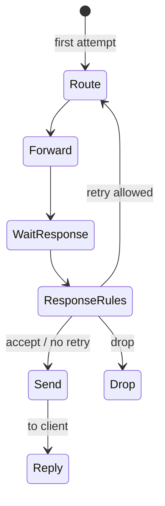

# Retries and transactions

This page explains how Conduit handles **retries** — sending the same client [transaction](/glossary/index.md#transaction) through [Route](/concepts/architecture-and-packet-path.md#route) and [Forward](/concepts/architecture-and-packet-path.md#forward) again after an upstream answer or timeout — and the **global limits** that stop further attempts. For declarative actions, see [Rules and actions](/policy-routing/rules-and-actions.md). For the full query path, see [Architecture and packet path](/concepts/architecture-and-packet-path.md).

## Overview

A [transaction](/glossary/index.md#transaction) is everything Conduit remembers for one client query from [Receive](/concepts/architecture-and-packet-path.md#receive) through [Send](/concepts/architecture-and-packet-path.md#send) or drop. Retries reuse that same transaction: the original question, client address, [tags](/glossary/index.md#tags), and request-side [pool](/glossary/index.md#pool) choice stay in place unless policy changes them on a later hook.

In current releases, **only [Response rules](/concepts/architecture-and-packet-path.md#response-rules)** (built-in actions or [Rhai](/rhai/index.md) on the response hook) can trigger a retry. [Request rules](/concepts/architecture-and-packet-path.md#request-rules) run **once** at the start of the transaction; they do not run again when Conduit re-enters at [Route](/concepts/architecture-and-packet-path.md#route).

When policy requests a retry, Conduit jumps from [Response rules](/concepts/architecture-and-packet-path.md#response-rules) back to [Route](/concepts/architecture-and-packet-path.md#route), picks a [backend](/glossary/index.md#backend) in the target [pool](/glossary/index.md#pool), and forwards again. When limits are reached, every [backend](/glossary/index.md#backend) in the target pool was already tried, or policy accepts the outcome, Conduit continues to [Send](/concepts/architecture-and-packet-path.md#send) and replies to the client.



## Requesting a retry

**Retry intent** comes from a matching response rule or [Rhai](/rhai/index.md) script on the response hook:

| Mechanism | Pool for the next attempt |
|-----------|---------------------------|
| **`retry`** action | Keeps the [pool](/glossary/index.md#pool) already on the [transaction](/glossary/index.md#transaction) (`selected_pool` from [request rules](/policy-routing/rules-and-actions.md) or the default pool) |
| **`retry_pool`** action | Uses the pool name in `value` (one-shot override for that [Route](/concepts/architecture-and-packet-path.md#route) only) |
| **`txn.request_retry()`** in Rhai | Same as **`retry`** — stay in the current pool |
| **`txn.set_retry_pool("name")`** in Rhai | Same as **`retry_pool`** |

[Response rules](/concepts/architecture-and-packet-path.md#response-rules) run after an upstream answer **or** after a forward **timeout** (still with no stored answer). That lets you retry on **SERVFAIL**, **NXDOMAIN**, slow upstreams, and other conditions you express with [selectors](/glossary/index.md#selector) such as `rcode`.

### Declarative examples

Fail over to another pool on **SERVFAIL**:

```yaml
orchestrator:
  max_attempts: 3
  max_txn_duration_ms: 5000

pools:
  - name: primary
    backends:
      - address: "10.0.0.1:53"
  - name: secondary
    backends:
      - address: "10.0.0.2:53"

rules:
  match_mode: first_match
  rules:
    - name: use-primary
      hook: request
      selectors:
        - type: qname_suffix
          value: ".example."
      actions:
        - type: set_pool
          value: primary
    - name: servfail-retry-other-pool
      hook: response
      selectors:
        - type: rcode
          value: SERVFAIL
      actions:
        - type: retry_pool
          value: secondary
```

Retry within the same pool (try another [backend](/glossary/index.md#backend) in that pool):

```yaml
pools:
  - name: primary
    backends:
      - address: "10.0.0.1:53"
      - address: "10.0.0.2:53"
      - address: "10.0.0.3:53"

rules:
  match_mode: first_match
  rules:
    - name: servfail-retry-same-pool
      hook: response
      selectors:
        - type: rcode
          value: SERVFAIL
      actions:
        - type: retry
```

On **SERVFAIL**, Conduit re-enters at [Route](/concepts/architecture-and-packet-path.md#route). With **`retry_pool`**, the next forward uses that pool’s [backends](/glossary/index.md#backend). With **`retry`**, Conduit keeps the pool from the first attempt and selects a different backend there when more than one is configured.

### Rhai

On the response hook:

- **`txn.request_retry()`** — retry in the current pool (same as **`retry`** in YAML).
- **`txn.set_retry_pool("pool-name")`** — retry to a specific pool (same as **`retry_pool`** in YAML).

See [Rhai](/rhai/index.md) (reference pages in progress).

## What happens on each attempt

Each time Conduit enters [Route](/concepts/architecture-and-packet-path.md#route):

1. **Pool selection** — if the transaction has a one-shot retry pool from the last [Response rules](/concepts/architecture-and-packet-path.md#response-rules) pass, Conduit uses that name for this attempt and clears it. Otherwise it keeps the pool already selected (from [request rules](/concepts/architecture-and-packet-path.md#request-rules) or the default pool).
2. **Backend selection** — see [Backend selection on retries](#backend-selection-on-retries).
3. **Attempt counter** — Conduit increments the attempt count for this transaction before [Forward](/concepts/architecture-and-packet-path.md#forward).

[`conduit_queries_by_pool_total`](/observability/built-in-metrics.md#conduit_queries_by_pool_total) increments for **each** attempt that reaches [Route](/concepts/architecture-and-packet-path.md#route) → [Forward](/concepts/architecture-and-packet-path.md#forward), including retries.

[Tags](/glossary/index.md#tags) set on [request rules](/concepts/architecture-and-packet-path.md#request-rules) or earlier [response rules](/concepts/architecture-and-packet-path.md#response-rules) **persist** across retries unless a script clears them. You can branch later rules on tags (for example “already retried”).

### Backend selection on retries

| Attempt | Behavior |
|---------|----------|
| **First** (`attempt_count` 0 before [Route](/concepts/architecture-and-packet-path.md#route)) | Sticky weighted pick among all [backends](/glossary/index.md#backend) in the pool — same as normal [Pools and backends](/policy-routing/pools-and-backends.md) load balancing |
| **Retry** (`attempt_count` > 0) | Weighted pick among [backends](/glossary/index.md#backend) in the **target pool** that were **not** already used for that pool on this [transaction](/glossary/index.md#transaction) |

On a cross-pool retry, only backends tried **in the target pool** are excluded — backends used in other pools do not count.

When every backend in the target pool was already tried, [Route](/concepts/architecture-and-packet-path.md#route) cannot select another backend. Conduit sets **SERVFAIL** and moves to [Send](/concepts/architecture-and-packet-path.md#send) (pool exhausted for this transaction).

A pool with only one [backend](/glossary/index.md#backend) cannot offer an alternate target on retry; the next retry attempt hits pool exhaustion immediately after the first forward fails.

## Global limits (`orchestrator`)

The top-level **`orchestrator:`** block caps how long a transaction may loop and how many [Route](/concepts/architecture-and-packet-path.md#route) attempts are allowed. When omitted, Conduit uses the same defaults as in [Minimal configuration](/getting-started/minimal-configuration.md).

| Field | Default | Meaning |
|-------|---------|---------|
| `max_attempts` | **3** | Maximum [Route](/concepts/architecture-and-packet-path.md#route) → [Forward](/concepts/architecture-and-packet-path.md#forward) cycles for one client query |
| `max_txn_duration_ms` | **5000** | Wall-clock limit for the whole transaction from start to [Send](/concepts/architecture-and-packet-path.md#send) or drop |
| `txn_table_capacity` | **1024** | Capacity for tracking in-flight transactions on the [dataplane](/glossary/index.md#dataplane) (not per-query retry count) |

Conduit checks **`max_txn_duration_ms`** and **`max_attempts`** before each [Route](/concepts/architecture-and-packet-path.md#route). When either limit is exceeded, Conduit sets **SERVFAIL** on the transaction and moves to [Send](/concepts/architecture-and-packet-path.md#send) instead of forwarding again.

A retry stops when any of these occurs:

- **`max_attempts`** reached
- **`max_txn_duration_ms`** exceeded
- **Pool exhausted** — no unused [backend](/glossary/index.md#backend) left in the target pool for this [transaction](/glossary/index.md#transaction)
- Policy accepts the answer (no retry intent on [Response rules](/concepts/architecture-and-packet-path.md#response-rules))

Validation: `max_attempts` must be **≥ 1**.

### What the client sees when limits hit

When retries are exhausted, the pool is exhausted, or the transaction runs too long, the client receives a **synthesized SERVFAIL** (unless an upstream wire was already stored and policy sends the pipeline to [Send](/concepts/architecture-and-packet-path.md#send) without another retry). Synthesized errors echo the question section from the original query. Details: [Send](/concepts/architecture-and-packet-path.md#send) in [Architecture and packet path](/concepts/architecture-and-packet-path.md).

You can adjust response metadata before [Send](/concepts/architecture-and-packet-path.md#send) with the **`set_rcode`** action on [response rules](/policy-routing/rules-and-actions.md) when policy accepts the answer instead of retrying.

## Observability

| Signal | When |
|--------|------|
| [`conduit_retries_total{pool}`](/observability/built-in-metrics.md#conduit_retries_total) | [Response rules](/concepts/architecture-and-packet-path.md#response-rules) send the pipeline back to [Route](/concepts/architecture-and-packet-path.md#route); `pool` is the **target** pool for the next attempt (**full** metrics profile only) |
| [`conduit_queries_by_pool_total{pool}`](/observability/built-in-metrics.md#conduit_queries_by_pool_total) | Each attempt that reaches [Forward](/concepts/architecture-and-packet-path.md#forward), including retries |
| Event export **`retry`** frames | When sinks are configured with retry emission — see [Event export](/observability/event-export.md) |

## Related topics

- [Rules and actions](/policy-routing/rules-and-actions.md) — `retry`, `retry_pool`, `set_rcode`, response [selectors](/glossary/index.md#selector)
- [Pools and backends](/policy-routing/pools-and-backends.md) — pool names, weights, default pool
- [Architecture and packet path](/concepts/architecture-and-packet-path.md) — [Response rules](/concepts/architecture-and-packet-path.md#response-rules), [Send](/concepts/architecture-and-packet-path.md#send), timeouts
- [Rhai](/rhai/index.md) — `retry()` from response scripts
- [Built-in metrics](/observability/built-in-metrics.md) — counters, profiles, and pipeline mapping
